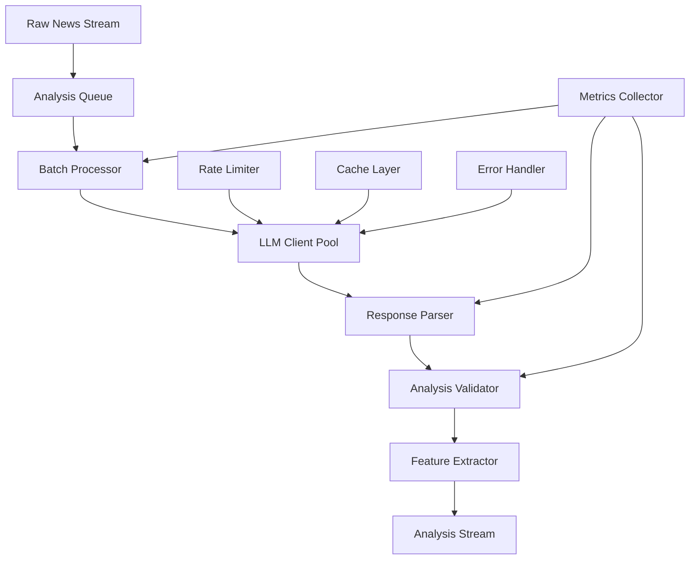

# Анализ Новостей: Детальная Документация

## Обзор Системы Анализа

Система анализа новостей использует современные LLM (Large Language Models) для автоматической оценки важности новостей, категоризации и анализа эмоциональной окраски. Система построена на принципах надежности, масштабируемости и высокой точности анализа.

## Архитектура Анализа



## Основные Компоненты

### 1. LLM Client Architecture (Архитектура LLM Клиента)

Современная архитектура с поддержкой множественных моделей и автоматическим failover.

```python
from abc import ABC, abstractmethod
from typing import Dict, Any, Optional, List, Union
from dataclasses import dataclass
import time
import asyncio
import aiohttp
import json
import logging
from enum import Enum

logger = logging.getLogger(__name__)

class LLMProvider(Enum):
    GEMINI = "gemini"
    GPT = "gpt"
    CLAUDE = "claude"
    LOCAL = "local"

class AnalysisError(Exception):
    """Базовое исключение для ошибок анализа"""
    pass

class RateLimitError(AnalysisError):
    """Превышение rate limit"""
    pass

class ModelUnavailableError(AnalysisError):
    """Модель временно недоступна"""
    pass

@dataclass
class LLMConfig:
    """Конфигурация LLM клиента"""
    provider: LLMProvider
    model_name: str
    api_key: str
    base_url: str = ""
    timeout_sec: float = 30.0
    max_retries: int = 3
    retry_delay_sec: float = 1.0
    temperature: float = 0.2
    max_tokens: int = 512
    rate_limit_rpm: int = 60
    cache_enabled: bool = True
    cache_ttl_sec: int = 3600

@dataclass
class AnalysisRequest:
    """Запрос на анализ новости"""
    uid: str
    title: str
    url: str
    source: str
    symbol: Optional[str] = None
    asset_class: Optional[str] = None
    published_ts_ms: Optional[int] = None

@dataclass
class AnalysisResponse:
    """Ответ анализа новости"""
    uid: str
    risk_score: float  # 0.0 - 1.0
    surprise_score: float  # -1.0 - 1.0
    confidence_score: float  # 0.0 - 1.0
    tags: List[str]
    primary_tag: str
    summary: str
    processing_time_ms: float
    model_used: str
    tokens_used: Optional[int] = None
    raw_response: Optional[Dict[str, Any]] = None

class LLMClient(ABC):
    """Абстрактный базовый класс для LLM клиентов"""

    def __init__(self, config: LLMConfig):
        self.config = config
        self._rate_limiter = RateLimiter(config.rate_limit_rpm)
        self._cache = AnalysisCache() if config.cache_enabled else None
        self._session: Optional[aiohttp.ClientSession] = None

    async def __aenter__(self):
        self._session = aiohttp.ClientSession(
            timeout=aiohttp.ClientTimeout(total=self.config.timeout_sec)
        )
        return self

    async def __aexit__(self, exc_type, exc_val, exc_tb):
        if self._session:
            await self._session.close()

    @abstractmethod
    async def analyze(self, request: AnalysisRequest) -> AnalysisResponse:
        """Анализ одной новости"""
        pass

    @abstractmethod
    async def analyze_batch(self, requests: List[AnalysisRequest]) -> List[AnalysisResponse]:
        """Пакетный анализ новостей"""
        pass

    @abstractmethod
    def get_model_info(self) -> Dict[str, Any]:
        """Информация о модели"""
        pass

    async def _make_request_with_retry(self, request_func, *args, **kwargs) -> Any:
        """Выполнение запроса с повторными попытками"""
        last_exception = None

        for attempt in range(self.config.max_retries + 1):
            try:
                # Проверка rate limit
                await self._rate_limiter.acquire()

                # Выполнение запроса
                result = await request_func(*args, **kwargs)

                # Сброс счетчика ошибок при успехе
                self._rate_limiter.on_success()
                return result

            except RateLimitError:
                # Специальная обработка rate limit
                await asyncio.sleep(self._rate_limiter.get_backoff_time())
                continue

            except (aiohttp.ClientError, asyncio.TimeoutError) as e:
                last_exception = e
                if attempt < self.config.max_retries:
                    delay = self.config.retry_delay_sec * (2 ** attempt)
                    logger.warning(f"Request failed (attempt {attempt + 1}), retrying in {delay}s: {e}")
                    await asyncio.sleep(delay)
                continue

            except Exception as e:
                # Неизвестная ошибка - не повторяем
                raise AnalysisError(f"Unexpected error: {e}") from e

        # Все попытки исчерпаны
        raise AnalysisError(f"Request failed after {self.config.max_retries + 1} attempts") from last_exception

class RateLimiter:
    """Токен-бакет rate limiter"""

    def __init__(self, rpm: float):
        self.capacity = max(1.0, float(rpm))
        self.tokens = self.capacity
        self.fill_rate = self.capacity / 60.0  # tokens per second
        self.last_update = time.monotonic()
        self._lock = asyncio.Lock()
        self.backoff_until = 0.0

    async def acquire(self) -> None:
        """Получение разрешения на запрос"""
        async with self._lock:
            now = time.monotonic()

            # Обновление токенов
            elapsed = now - self.last_update
            self.last_update = now
            self.tokens = min(self.capacity, self.tokens + elapsed * self.fill_rate)

            # Проверка backoff от rate limit
            if now < self.backoff_until:
                raise RateLimitError(f"Rate limited until {self.backoff_until}")

            if self.tokens >= 1.0:
                self.tokens -= 1.0
                return

            # Ожидание пополнения токенов
            wait_time = (1.0 - self.tokens) / self.fill_rate
            await asyncio.sleep(wait_time)
            self.tokens = 0.0

    def on_success(self):
        """Уведомление об успешном запросе"""
        # Можно корректировать rate на основе успеха
        pass

    async def on_rate_limit(self, retry_after: float):
        """Уведомление о rate limit"""
        async with self._lock:
            self.backoff_until = time.monotonic() + retry_after

    def get_backoff_time(self) -> float:
        """Время ожидания до следующей попытки"""
        remaining = max(0.0, self.backoff_until - time.monotonic())
        return remaining

class AnalysisCache:
    """Кеш для анализа новостей"""

    def __init__(self, ttl_sec: int = 3600):
        self.cache: Dict[str, Dict[str, Any]] = {}
        self.ttl_sec = ttl_sec

    def get(self, key: str) -> Optional[Dict[str, Any]]:
        """Получение из кеша"""
        if key in self.cache:
            entry = self.cache[key]
            if time.time() - entry['timestamp'] < self.ttl_sec:
                return entry['data']
            else:
                del self.cache[key]
        return None

    def set(self, key: str, data: Dict[str, Any]):
        """Сохранение в кеш"""
        self.cache[key] = {
            'data': data,
            'timestamp': time.time()
        }

        # Очистка старых записей (простая реализация)
        if len(self.cache) > 10000:
            self._cleanup()

    def _cleanup(self):
        """Очистка устаревших записей"""
        now = time.time()
        expired = [k for k, v in self.cache.items()
                  if now - v['timestamp'] > self.ttl_sec]
        for k in expired:
            del self.cache[k]
```

### 2. Gemini LLM Client (Google Gemini Реализация)

Полнофункциональная реализация клиента для Google Gemini API.

```python
import google.generativeai as genai
from google.generativeai.types import RequestOptions
import json
import re

class GeminiClient(LLMClient):
    """Google Gemini LLM клиент"""

    def __init__(self, config: LLMConfig):
        super().__init__(config)
        self.allowed_tags = [
            "cpi", "ppi", "fomc", "fed_speech", "nfp", "rates",
            "inflation", "risk_off", "risk_on", "earnings",
            "geopolitics", "crypto_reg", "exchange", "hack",
            "etf", "macro", "gdp", "ecb", "boe", "boj"
        ]

        # Инициализация Gemini
        genai.configure(api_key=config.api_key)
        self.model = genai.GenerativeModel(
            model_name=config.model_name,
            generation_config=genai.types.GenerationConfig(
                temperature=config.temperature,
                max_output_tokens=config.max_tokens,
            )
        )

    async def analyze(self, request: AnalysisRequest) -> AnalysisResponse:
        """Анализ одной новости"""
        start_time = time.time()

        # Проверка кеша
        cache_key = f"{request.uid}:{hash(request.title + request.url)}"
        if self._cache:
            cached = self._cache.get(cache_key)
            if cached:
                logger.info(f"Cache hit for {request.uid}")
                return AnalysisResponse(**cached)

        try:
            # Генерация промпта
            prompt = self._build_analysis_prompt(request)

            # Выполнение запроса
            response = await self._make_request_with_retry(
                self._call_gemini_single,
                prompt,
                request
            )

            # Парсинг ответа
            analysis_data = self._parse_gemini_response(response.text)

            # Создание ответа
            result = AnalysisResponse(
                uid=request.uid,
                risk_score=analysis_data['risk'],
                surprise_score=analysis_data['surprise'],
                confidence_score=analysis_data['confidence'],
                tags=analysis_data['tags'],
                primary_tag=analysis_data['primary_tag'],
                summary=analysis_data['summary'],
                processing_time_ms=(time.time() - start_time) * 1000,
                model_used=self.config.model_name,
                tokens_used=getattr(response, 'usage_metadata', {}).get('total_token_count'),
                raw_response=analysis_data
            )

            # Сохранение в кеш
            if self._cache:
                self._cache.set(cache_key, {
                    'uid': result.uid,
                    'risk_score': result.risk_score,
                    'surprise_score': result.surprise_score,
                    'confidence_score': result.confidence_score,
                    'tags': result.tags,
                    'primary_tag': result.primary_tag,
                    'summary': result.summary,
                    'processing_time_ms': result.processing_time_ms,
                    'model_used': result.model_used,
                    'tokens_used': result.tokens_used
                })

            return result

        except Exception as e:
            logger.error(f"Analysis failed for {request.uid}: {e}")
            # Возврат fallback анализа
            return self._create_fallback_response(request, time.time() - start_time)

    async def analyze_batch(self, requests: List[AnalysisRequest]) -> List[AnalysisResponse]:
        """Пакетный анализ новостей"""
        if not requests:
            return []

        # Для Gemini batch processing ограничен, поэтому обрабатываем последовательно
        # В продакшене можно использовать async gather для параллельной обработки
        results = []
        for request in requests:
            try:
                result = await self.analyze(request)
                results.append(result)
            except Exception as e:
                logger.error(f"Batch analysis failed for {request.uid}: {e}")
                results.append(self._create_fallback_response(request, 0))

        return results

    async def _call_gemini_single(self, prompt: str, request: AnalysisRequest):
        """Вызов Gemini API для одного запроса"""
        try:
            response = self.model.generate_content(
                prompt,
                request_options=RequestOptions(timeout=self.config.timeout_sec)
            )
            return response
        except Exception as e:
            if "rate limit" in str(e).lower():
                raise RateLimitError(f"Gemini rate limit: {e}")
            elif "unavailable" in str(e).lower():
                raise ModelUnavailableError(f"Gemini unavailable: {e}")
            else:
                raise AnalysisError(f"Gemini API error: {e}")

    def _build_analysis_prompt(self, request: AnalysisRequest) -> str:
        """Генерация промпта для анализа"""
        prompt_parts = [
            "Return ONLY compact JSON object with keys:",
            "risk (0..1 float), surprise (-1..1 float), confidence (0..1 float),",
            "tags (array of strings from allowed set),",
            "primary_tag (string from same set), summary (<=160 chars).",
            "",
            f"allowed_tags={json.dumps(sorted(self.allowed_tags))}",
            f"source={request.source}",
            f"url={request.url}",
            f"title={request.title}",
        ]

        if request.symbol:
            prompt_parts.append(f"symbol={request.symbol}")
        if request.asset_class:
            prompt_parts.append(f"asset_class={request.asset_class}")

        prompt_parts.extend([
            "",
            "Guidelines:",
            "- risk: 0=irrelevant, 0.3=minor impact, 0.6=moderate impact, 1.0=major market moving",
            "- surprise: -1=highly expected negative, 0=neutral, 1=highly unexpected positive",
            "- confidence: how certain you are in this analysis (0.0-1.0)",
            "- tags: relevant categories from allowed list",
            "- primary_tag: most important single tag",
            "- summary: concise 1-2 sentence summary"
        ])

        return "\n".join(prompt_parts)

    def _parse_gemini_response(self, response_text: str) -> Dict[str, Any]:
        """Парсинг ответа от Gemini"""
        try:
            # Извлечение JSON из ответа
            json_str = self._extract_json_from_text(response_text)
            if not json_str:
                raise ValueError("No JSON found in response")

            data = json.loads(json_str)

            # Валидация и нормализация
            return {
                'risk': self._clamp(data.get('risk', 0.0), 0.0, 1.0),
                'surprise': self._clamp(data.get('surprise', 0.0), -1.0, 1.0),
                'confidence': self._clamp(data.get('confidence', 0.0), 0.0, 1.0),
                'tags': self._validate_tags(data.get('tags', [])),
                'primary_tag': self._validate_primary_tag(data.get('primary_tag', '')),
                'summary': str(data.get('summary', ''))[:200].strip()
            }

        except (json.JSONDecodeError, KeyError, TypeError) as e:
            logger.warning(f"Failed to parse Gemini response: {e}")
            # Возврат безопасных значений по умолчанию
            return self._get_default_analysis()

    def _extract_json_from_text(self, text: str) -> Optional[str]:
        """Извлечение JSON из текста ответа"""
        text = text.strip()

        # Попытка прямого парсинга
        try:
            json.loads(text)
            return text
        except json.JSONDecodeError:
            pass

        # Поиск JSON блока
        json_pattern = r'\{.*\}'
        matches = re.findall(json_pattern, text, re.DOTALL)

        for match in matches:
            try:
                json.loads(match)
                return match
            except json.JSONDecodeError:
                continue

        # Поиск между маркерами
        start_markers = ['```json', '```']
        end_markers = ['```', '\n\n', '\n']

        for start in start_markers:
            start_idx = text.find(start)
            if start_idx >= 0:
                content_start = start_idx + len(start)
                for end in end_markers:
                    end_idx = text.find(end, content_start)
                    if end_idx > content_start:
                        candidate = text[content_start:end_idx].strip()
                        try:
                            json.loads(candidate)
                            return candidate
                        except json.JSONDecodeError:
                            continue

        return None

    def _validate_tags(self, tags: List[str]) -> List[str]:
        """Валидация списка тегов"""
        if not isinstance(tags, list):
            return []

        valid_tags = []
        for tag in tags:
            tag = str(tag).strip().lower()
            if tag in self.allowed_tags:
                valid_tags.append(tag)

        return valid_tags[:5]  # Максимум 5 тегов

    def _validate_primary_tag(self, primary_tag: str) -> str:
        """Валидация основного тега"""
        primary_tag = str(primary_tag).strip().lower()
        if primary_tag in self.allowed_tags:
            return primary_tag

        # Если основной тег не валиден, берем первый из списка
        return ""

    def _clamp(self, value: float, min_val: float, max_val: float) -> float:
        """Ограничение значения в диапазоне"""
        return max(min_val, min(max_val, float(value or 0.0)))

    def _get_default_analysis(self) -> Dict[str, Any]:
        """Значения анализа по умолчанию"""
        return {
            'risk': 0.0,
            'surprise': 0.0,
            'confidence': 0.0,
            'tags': [],
            'primary_tag': '',
            'summary': 'Analysis failed'
        }

    def _create_fallback_response(self, request: AnalysisRequest, processing_time: float) -> AnalysisResponse:
        """Создание fallback ответа при ошибке"""
        return AnalysisResponse(
            uid=request.uid,
            risk_score=0.0,
            surprise_score=0.0,
            confidence_score=0.0,
            tags=[],
            primary_tag="",
            summary=f"Analysis failed for {request.source} news",
            processing_time_ms=processing_time * 1000,
            model_used=f"{self.config.model_name}(fallback)",
            tokens_used=0
        )

    def get_model_info(self) -> Dict[str, Any]:
        """Информация о модели Gemini"""
        return {
            'provider': 'Google',
            'model': self.config.model_name,
            'max_tokens': self.config.max_tokens,
            'temperature': self.config.temperature,
            'rate_limit_rpm': self.config.rate_limit_rpm,
            'supported_features': ['analysis', 'batch_analysis', 'streaming']
        }
```

### 3. News Analysis Worker (Рабочий Процесс Анализа)

Асинхронный worker для обработки потока новостей из Redis.

```python
import asyncio
import redis.asyncio as redis
import json
import logging
from typing import Dict, List, Optional, Any
from dataclasses import dataclass
import time
from contextlib import asynccontextmanager

logger = logging.getLogger(__name__)

@dataclass
class StreamConfig:
    """Конфигурация Redis stream"""
    stream_key: str = "news:raw"
    group_name: str = "news-analyzer"
    consumer_name: str
    block_ms: int = 2000
    count: int = 50
    max_retries: int = 3

@dataclass
class WorkerConfig:
    """Конфигурация worker"""
    redis_url: str
    stream_config: StreamConfig
    llm_config: LLMConfig
    batch_size: int = 10
    max_concurrent_batches: int = 3
    health_check_interval_sec: int = 30
    metrics_enabled: bool = True

class NewsAnalysisWorker:
    """
    Асинхронный worker для анализа новостей из Redis stream
    """

    def __init__(self, config: WorkerConfig):
        self.config = config
        self.redis: Optional[redis.Redis] = None
        self.llm_client: Optional[LLMClient] = None
        self.running = False
        self.metrics = WorkerMetrics() if config.metrics_enabled else None

        # Статистика
        self.stats = {
            'messages_processed': 0,
            'messages_failed': 0,
            'batches_processed': 0,
            'analysis_time_total': 0.0,
            'start_time': time.time()
        }

    async def start(self):
        """Запуск worker"""
        logger.info(f"Starting NewsAnalysisWorker with consumer {self.config.stream_config.consumer_name}")

        # Инициализация подключений
        await self._initialize_connections()

        # Создание группы потребителей, если не существует
        await self._ensure_consumer_group()

        self.running = True

        # Запуск задач
        tasks = [
            asyncio.create_task(self._process_stream()),
            asyncio.create_task(self._health_check_loop()),
            asyncio.create_task(self._metrics_loop())
        ]

        try:
            await asyncio.gather(*tasks)
        except Exception as e:
            logger.error(f"Worker failed: {e}")
            raise
        finally:
            await self._cleanup()

    async def stop(self):
        """Остановка worker"""
        logger.info("Stopping NewsAnalysisWorker")
        self.running = False

    async def _initialize_connections(self):
        """Инициализация подключений"""
        try:
            # Redis
            self.redis = redis.from_url(self.config.redis_url)

            # LLM клиент
            llm_class = self._get_llm_client_class(self.config.llm_config.provider)
            self.llm_client = llm_class(self.config.llm_config)

            # Тест подключений
            await self.redis.ping()
            async with self.llm_client:
                await self.llm_client.analyze(
                    AnalysisRequest(uid="test", title="test", url="test", source="test")
                )

            logger.info("Connections initialized successfully")

        except Exception as e:
            logger.error(f"Failed to initialize connections: {e}")
            raise

    def _get_llm_client_class(self, provider: LLMProvider):
        """Получение класса LLM клиента"""
        classes = {
            LLMProvider.GEMINI: GeminiClient,
            LLMProvider.GPT: GPTClient,
            LLMProvider.CLAUDE: ClaudeClient,
        }
        return classes.get(provider, GeminiClient)

    async def _ensure_consumer_group(self):
        """Создание группы потребителей"""
        try:
            await self.redis.xgroup_create(
                self.config.stream_config.stream_key,
                self.config.stream_config.group_name,
                "0",  # начать с начала
                mkstream=True
            )
            logger.info(f"Created consumer group {self.config.stream_config.group_name}")
        except redis.ResponseError as e:
            if "BUSYGROUP" not in str(e):
                raise
            # Группа уже существует

    async def _process_stream(self):
        """Основной цикл обработки потока"""
        logger.info("Starting stream processing")

        while self.running:
            try:
                # Чтение сообщений из потока
                messages = await self.redis.xreadgroup(
                    groupname=self.config.stream_config.group_name,
                    consumername=self.config.stream_config.consumer_name,
                    streams={self.config.stream_config.stream_key: ">"},
                    block=self.config.stream_config.block_ms,
                    count=self.config.stream_config.count
                )

                if not messages:
                    continue

                # Обработка сообщений пачками
                await self._process_messages_batch(messages[0][1])  # messages[0][1] - список сообщений

            except Exception as e:
                logger.error(f"Error in stream processing: {e}")
                await asyncio.sleep(1)

    async def _process_messages_batch(self, messages: List[Tuple[str, Dict[str, str]]]):
        """Обработка пачки сообщений"""
        if not messages:
            return

        batch_start = time.time()

        try:
            # Парсинг сообщений
            requests = []
            message_ids = []

            for msg_id, fields in messages:
                try:
                    request = self._parse_stream_message(fields)
                    requests.append(request)
                    message_ids.append(msg_id)
                except Exception as e:
                    logger.warning(f"Failed to parse message {msg_id}: {e}")
                    continue

            if not requests:
                return

            # Разделение на мини-пачки для параллельной обработки
            mini_batches = [
                requests[i:i + self.config.batch_size]
                for i in range(0, len(requests), self.config.batch_size)
            ]

            # Ограничение количества одновременных пачек
            semaphore = asyncio.Semaphore(self.config.max_concurrent_batches)

            async def process_mini_batch(batch: List[AnalysisRequest], batch_idx: int):
                async with semaphore:
                    return await self._analyze_mini_batch(batch, batch_idx)

            # Параллельная обработка мини-пачки
            tasks = [
                process_mini_batch(batch, i)
                for i, batch in enumerate(mini_batches)
            ]

            batch_results = await asyncio.gather(*tasks, return_exceptions=True)

            # Обработка результатов
            successful_analyses = 0
            for i, result in enumerate(batch_results):
                if isinstance(result, Exception):
                    logger.error(f"Mini-batch {i} failed: {result}")
                    continue

                successful_analyses += len(result)
                await self._save_analysis_results(result)

            # Подтверждение обработки сообщений
            if message_ids:
                await self.redis.xack(
                    self.config.stream_config.stream_key,
                    self.config.stream_config.group_name,
                    *message_ids
                )

            # Обновление статистики
            batch_time = time.time() - batch_start
            self.stats['batches_processed'] += 1
            self.stats['messages_processed'] += successful_analyses
            self.stats['analysis_time_total'] += batch_time

            if self.metrics:
                self.metrics.record_batch(
                    messages=len(requests),
                    successful=successful_analyses,
                    duration=batch_time
                )

            logger.info(f"Processed batch: {successful_analyses}/{len(requests)} messages in {batch_time:.2f}s")

        except Exception as e:
            logger.error(f"Batch processing failed: {e}")
            self.stats['messages_failed'] += len(messages)

    def _parse_stream_message(self, fields: Dict[str, str]) -> AnalysisRequest:
        """Парсинг сообщения из Redis stream"""
        return AnalysisRequest(
            uid=fields.get('uid', ''),
            title=fields.get('title', ''),
            url=fields.get('url', ''),
            source=fields.get('source', ''),
            symbol=fields.get('symbol'),
            asset_class=fields.get('asset_class'),
            published_ts_ms=int(fields.get('published_ts_ms', 0)) if fields.get('published_ts_ms') else None
        )

    async def _analyze_mini_batch(self, requests: List[AnalysisRequest], batch_idx: int) -> List[AnalysisResponse]:
        """Анализ мини-пачки запросов"""
        if not requests:
            return []

        try:
            async with self.llm_client:
                responses = await self.llm_client.analyze_batch(requests)

            # Валидация результатов
            validated_responses = []
            for i, response in enumerate(responses):
                if response and response.uid == requests[i].uid:
                    validated_responses.append(response)
                else:
                    logger.warning(f"Invalid response for request {requests[i].uid}")
                    # Создание fallback ответа
                    fallback = self._create_fallback_for_request(requests[i])
                    validated_responses.append(fallback)

            return validated_responses

        except Exception as e:
            logger.error(f"Mini-batch {batch_idx} analysis failed: {e}")
            # Возврат fallback ответов для всех запросов
            return [self._create_fallback_for_request(req) for req in requests]

    async def _save_analysis_results(self, responses: List[AnalysisResponse]):
        """Сохранение результатов анализа в Redis"""
        if not responses:
            return

        try:
            # Подготовка данных для сохранения
            analysis_entries = {}
            stream_entries = []

            for response in responses:
                # Детальный анализ
                analysis_key = f"news:analysis:{response.uid}"
                analysis_data = {
                    'uid': response.uid,
                    'ts_ms': int(time.time() * 1000),
                    'symbol': getattr(response, 'symbol', ''),
                    'asset_class': getattr(response, 'asset_class', ''),
                    'risk': response.risk_score,
                    'surprise': response.surprise_score,
                    'tags_mask': self._tags_to_mask(response.tags),
                    'primary_tag': response.primary_tag,
                    'summary': response.summary,
                    'confidence': response.confidence_score,
                    'model_used': response.model_used,
                    'processing_time_ms': response.processing_time_ms,
                }

                analysis_entries[analysis_key] = json.dumps(analysis_data)

                # Компактная версия для stream
                stream_entry = {
                    'uid': response.uid,
                    'ts_ms': str(int(time.time() * 1000)),
                    'symbols': getattr(response, 'symbol', '') or 'GLOBAL',
                    'risk': f"{response.risk_score:.6f}",
                    'surprise': f"{response.surprise_score:.6f}",
                    'tags_mask': str(self._tags_to_mask(response.tags)),
                    'primary_tag_id': str(self._primary_tag_to_id(response.primary_tag)),
                    'confidence': f"{response.confidence_score:.6f}",
                    'news_ref': analysis_key
                }

                stream_entries.append(stream_entry)

            # Сохранение детальных анализов
            if analysis_entries:
                await self.redis.mset(analysis_entries)

                # Установка TTL для детальных анализов
                for key in analysis_entries.keys():
                    await self.redis.expire(key, 259200)  # 3 дня

            # Добавление в analysis stream
            for entry in stream_entries:
                await self.redis.xadd("news:analysis", entry)

        except Exception as e:
            logger.error(f"Failed to save analysis results: {e}")

    def _tags_to_mask(self, tags: List[str]) -> int:
        """Преобразование списка тегов в битовую маску"""
        mask = 0
        tag_bits = {
            "cpi": 0, "ppi": 1, "fomc": 2, "fed_speech": 3, "nfp": 4,
            "rates": 5, "inflation": 6, "risk_off": 7, "risk_on": 8,
            "earnings": 9, "geopolitics": 10, "crypto_reg": 11,
            "exchange": 12, "hack": 13, "etf": 14, "macro": 15
        }

        for tag in tags:
            if tag in tag_bits:
                mask |= (1 << tag_bits[tag])

        return mask

    def _primary_tag_to_id(self, primary_tag: str) -> int:
        """Преобразование основного тега в ID"""
        tag_ids = {
            "cpi": 1, "ppi": 2, "fomc": 3, "nfp": 4, "rates": 5,
            "geopolitics": 6, "hack": 7, "etf": 8, "crypto_reg": 9,
            "exchange": 10, "macro": 11, "inflation": 12,
            "risk_off": 13, "risk_on": 14, "earnings": 15
        }
        return tag_ids.get(primary_tag, 0)

    def _create_fallback_for_request(self, request: AnalysisRequest) -> AnalysisResponse:
        """Создание fallback ответа"""
        return AnalysisResponse(
            uid=request.uid,
            risk_score=0.0,
            surprise_score=0.0,
            confidence_score=0.0,
            tags=[],
            primary_tag="",
            summary=f"Analysis failed for {request.source}",
            processing_time_ms=0.0,
            model_used="fallback"
        )

    async def _health_check_loop(self):
        """Цикл проверки здоровья"""
        while self.running:
            try:
                await self._perform_health_check()
                await asyncio.sleep(self.config.health_check_interval_sec)
            except Exception as e:
                logger.error(f"Health check failed: {e}")
                await asyncio.sleep(5)

    async def _perform_health_check(self):
        """Выполнение проверки здоровья"""
        health_data = {
            'timestamp': int(time.time()),
            'status': 'healthy',
            'consumer': self.config.stream_config.consumer_name,
            'stats': self.stats.copy(),
            'checks': {}
        }

        try:
            # Проверка Redis
            await self.redis.ping()
            health_data['checks']['redis'] = 'ok'
        except Exception as e:
            health_data['checks']['redis'] = f'error: {e}'
            health_data['status'] = 'unhealthy'

        try:
            # Проверка LLM
            async with self.llm_client:
                info = self.llm_client.get_model_info()
                health_data['checks']['llm'] = 'ok'
                health_data['model_info'] = info
        except Exception as e:
            health_data['checks']['llm'] = f'error: {e}'
            health_data['status'] = 'degraded'

        # Сохранение статуса здоровья
        await self.redis.setex(
            f"health:news-analyzer:{self.config.stream_config.consumer_name}",
            300,  # 5 минут TTL
            json.dumps(health_data)
        )

    async def _metrics_loop(self):
        """Цикл сбора метрик"""
        if not self.metrics:
            return

        while self.running:
            try:
                await self.metrics.report_to_prometheus()
                await asyncio.sleep(15)  # Каждые 15 секунд
            except Exception as e:
                logger.error(f"Metrics reporting failed: {e}")
                await asyncio.sleep(5)

    async def _cleanup(self):
        """Очистка ресурсов"""
        logger.info("Cleaning up NewsAnalysisWorker")

        if self.redis:
            await self.redis.aclose()

        if self.llm_client:
            # LLM cleanup if needed
            pass

class WorkerMetrics:
    """Метрики worker"""

    def __init__(self):
        self.messages_processed = 0
        self.messages_failed = 0
        self.analysis_latency = []
        self.last_report = time.time()

    def record_batch(self, messages: int, successful: int, duration: float):
        """Запись метрики пачки"""
        self.messages_processed += successful
        self.messages_failed += (messages - successful)
        self.analysis_latency.append(duration / messages)  # latency per message

        # Ограничение размера истории
        if len(self.analysis_latency) > 1000:
            self.analysis_latency = self.analysis_latency[-1000:]

    async def report_to_prometheus(self):
        """Отправка метрик в Prometheus"""
        # В реальной реализации здесь будет интеграция с prometheus_client
        current_time = time.time()

        if current_time - self.last_report > 60:  # Раз в минуту
            logger.info(f"Worker metrics: processed={self.messages_processed}, "
                       f"failed={self.messages_failed}, "
                       f"avg_latency={sum(self.analysis_latency)/len(self.analysis_latency) if self.analysis_latency else 0:.3f}s")

            self.last_report = current_time
```

### 4. Analysis Quality Assurance (Контроль Качества Анализа)

Система валидации и улучшения качества анализа.

```python
from typing import Dict, List, Any, Optional, Tuple
import statistics
import json
from enum import Enum

class QualityLevel(Enum):
    EXCELLENT = "excellent"
    GOOD = "good"
    FAIR = "fair"
    POOR = "poor"
    UNUSABLE = "unusable"

class AnalysisQualityAssurance:
    """
    Система контроля качества анализа новостей
    """

    def __init__(self, redis_client, llm_client: LLMClient):
        self.redis = redis_client
        self.llm_client = llm_client

        # Пороги качества
        self.quality_thresholds = {
            'risk_confidence': 0.7,
            'surprise_confidence': 0.6,
            'tag_relevance': 0.8,
            'summary_coherence': 0.75
        }

        # Исторические данные для калибровки
        self.historical_scores = []

    async def evaluate_analysis_quality(self, analysis: AnalysisResponse) -> QualityLevel:
        """
        Оценка качества анализа
        """
        scores = await self._calculate_quality_scores(analysis)

        # Композитный score
        composite_score = (
            scores['risk_consistency'] * 0.3 +
            scores['surprise_reasonableness'] * 0.2 +
            scores['tag_relevance'] * 0.25 +
            scores['summary_quality'] * 0.25
        )

        # Определение уровня качества
        if composite_score >= 0.9:
            return QualityLevel.EXCELLENT
        elif composite_score >= 0.75:
            return QualityLevel.GOOD
        elif composite_score >= 0.6:
            return QualityLevel.FAIR
        elif composite_score >= 0.4:
            return QualityLevel.POOR
        else:
            return QualityLevel.UNUSABLE

    async def _calculate_quality_scores(self, analysis: AnalysisResponse) -> Dict[str, float]:
        """
        Расчет индивидуальных scores качества
        """
        scores = {}

        # 1. Risk consistency - сравнение с историческими данными
        scores['risk_consistency'] = await self._evaluate_risk_consistency(analysis)

        # 2. Surprise reasonableness - проверка логичности surprise score
        scores['surprise_reasonableness'] = self._evaluate_surprise_reasonableness(analysis)

        # 3. Tag relevance - релевантность тегов содержанию
        scores['tag_relevance'] = await self._evaluate_tag_relevance(analysis)

        # 4. Summary quality - качество summary
        scores['summary_quality'] = self._evaluate_summary_quality(analysis)

        return scores

    async def _evaluate_risk_consistency(self, analysis: AnalysisResponse) -> float:
        """
        Оценка консистентности risk score с историческими данными
        """
        if not self.historical_scores:
            return 0.5  # Нейтральная оценка без истории

        # Получение похожих анализов из истории
        similar_analyses = await self._find_similar_analyses(analysis)

        if not similar_analyses:
            return 0.5

        # Расчет отклонения от среднего
        historical_risks = [a['risk'] for a in similar_analyses]
        mean_risk = statistics.mean(historical_risks)
        std_risk = statistics.stdev(historical_risks) if len(historical_risks) > 1 else 0.1

        if std_risk == 0:
            return 1.0 if abs(analysis.risk_score - mean_risk) < 0.05 else 0.0

        z_score = abs(analysis.risk_score - mean_risk) / std_risk

        # Нормализация: z_score 0 = 1.0, z_score 2 = 0.5, z_score 4 = 0.0
        consistency = max(0.0, 1.0 - (z_score / 4.0))
        return consistency

    def _evaluate_surprise_reasonableness(self, analysis: AnalysisResponse) -> float:
        """
        Оценка разумности surprise score
        """
        risk = analysis.risk_score
        surprise = abs(analysis.surprise_score)

        # Высокий риск должен коррелировать с surprise
        if risk > 0.7:
            if surprise > 0.5:
                return 1.0
            elif surprise > 0.3:
                return 0.7
            else:
                return 0.3
        elif risk > 0.4:
            if surprise > 0.3:
                return 0.8
            elif surprise > 0.1:
                return 0.9
            else:
                return 0.6
        else:
            # Низкий риск - surprise должен быть небольшим
            if surprise < 0.2:
                return 0.9
            elif surprise < 0.4:
                return 0.6
            else:
                return 0.3

    async def _evaluate_tag_relevance(self, analysis: AnalysisResponse) -> float:
        """
        Оценка релевантности тегов
        """
        if not analysis.tags:
            return 0.0

        # Использование LLM для оценки релевантности
        relevance_prompt = f"""
        Evaluate how relevant these tags are to the news summary.
        Return only a number from 0.0 to 1.0 indicating relevance.

        News Summary: {analysis.summary}
        Tags: {', '.join(analysis.tags)}

        Relevance (0.0-1.0):
        """

        try:
            relevance_request = AnalysisRequest(
                uid=f"relevance_{analysis.uid}",
                title="Tag Relevance Check",
                url="internal://relevance",
                source="quality_check"
            )

            # Модификация промпта для оценки релевантности
            response = await self.llm_client._call_gemini_single(relevance_prompt, relevance_request)
            relevance_score = float(response.text.strip())

            return max(0.0, min(1.0, relevance_score))

        except Exception as e:
            logger.warning(f"Tag relevance evaluation failed: {e}")
            # Fallback: базовая эвристика
            return len(analysis.tags) / 10.0  # 0-1.0 based on tag count

    def _evaluate_summary_quality(self, analysis: AnalysisResponse) -> float:
        """
        Оценка качества summary
        """
        summary = analysis.summary

        if not summary:
            return 0.0

        score = 0.0

        # Длина summary (оптимально 50-150 символов)
        length = len(summary)
        if 50 <= length <= 150:
            score += 0.4
        elif 30 <= length <= 200:
            score += 0.3
        elif length < 20:
            score += 0.1

        # Наличие ключевых элементов
        if any(word in summary.lower() for word in ['fed', 'ecb', 'rate', 'inflation', 'earnings', 'crypto']):
            score += 0.3

        # Читаемость (не все caps, не все цифры)
        if not summary.isupper() and not summary.replace('.', '').replace('%', '').isdigit():
            score += 0.3

        return min(1.0, score)

    async def _find_similar_analyses(self, analysis: AnalysisResponse, limit: int = 20) -> List[Dict[str, Any]]:
        """
        Поиск похожих анализов в истории
        """
        # Простая реализация: поиск по основным тегам
        if not analysis.tags:
            return []

        # Поиск в Redis по тегам
        similar_analyses = []

        try:
            # Получение недавних анализов
            recent_keys = await self.redis.keys("news:analysis:*")
            recent_keys = recent_keys[-limit:]  # Последние N

            for key in recent_keys:
                data = await self.redis.get(key)
                if data:
                    analysis_data = json.loads(data)

                    # Проверка на пересечение тегов
                    existing_tags = analysis_data.get('tags', [])
                    if set(analysis.tags) & set(existing_tags):
                        similar_analyses.append({
                            'risk': analysis_data.get('risk', 0.0),
                            'tags': existing_tags,
                            'similarity': len(set(analysis.tags) & set(existing_tags))
                        })

            # Сортировка по similarity
            similar_analyses.sort(key=lambda x: x['similarity'], reverse=True)
            return similar_analyses[:10]  # Топ 10 самых похожих

        except Exception as e:
            logger.warning(f"Failed to find similar analyses: {e}")
            return []

    async def improve_analysis_quality(self, analysis: AnalysisResponse, quality: QualityLevel) -> Optional[AnalysisResponse]:
        """
        Улучшение анализа низкого качества
        """
        if quality in [QualityLevel.EXCELLENT, QualityLevel.GOOD]:
            return None  # Не нужно улучшать

        if quality == QualityLevel.UNUSABLE:
            # Полная перегенерация
            return await self._regenerate_analysis(analysis)

        # Частичное улучшение
        return await self._refine_analysis(analysis, quality)

    async def _regenerate_analysis(self, original: AnalysisResponse) -> AnalysisResponse:
        """
        Полная перегенерация анализа
        """
        # Использование другого промпта или модели
        regeneration_prompt = f"""
        Previous analysis had very low quality. Please re-analyze this news carefully.

        Title: {original.raw_response.get('title', 'Unknown')}
        URL: {original.raw_response.get('url', 'Unknown')}
        Source: {original.raw_response.get('source', 'Unknown')}

        Provide a high-quality analysis with accurate risk assessment, appropriate tags, and clear summary.
        """

        try:
            # Повторный анализ с улучшенным промптом
            request = AnalysisRequest(
                uid=f"regenerate_{original.uid}",
                title=original.raw_response.get('title', ''),
                url=original.raw_response.get('url', ''),
                source=original.raw_response.get('source', '')
            )

            # Использование LLM для перегенерации
            async with self.llm_client:
                new_analysis = await self.llm_client.analyze(request)

            logger.info(f"Regenerated analysis for {original.uid}: {original.confidence_score:.2f} -> {new_analysis.confidence_score:.2f}")
            return new_analysis

        except Exception as e:
            logger.error(f"Analysis regeneration failed: {e}")
            return original

    async def _refine_analysis(self, original: AnalysisResponse, quality: QualityLevel) -> AnalysisResponse:
        """
        Частичное улучшение анализа
        """
        refinements = []

        if quality == QualityLevel.POOR:
            # Добавление дополнительного анализа для низкого качества
            refinement_prompt = f"""
            The following news analysis seems incomplete or inaccurate. Please review and suggest improvements:

            Original Analysis:
            - Risk: {original.risk_score}
            - Surprise: {original.surprise_score}
            - Tags: {original.tags}
            - Summary: {original.summary}

            News: {original.raw_response.get('title', '')}

            Provide refined values for risk, surprise, tags, and summary.
            """

            try:
                request = AnalysisRequest(
                    uid=f"refine_{original.uid}",
                    title="Analysis Refinement",
                    url="internal://refinement",
                    source="quality_improvement"
                )

                async with self.llm_client:
                    refinement = await self.llm_client.analyze(request)

                # Смешивание оригинального и уточненного анализа
                refined = AnalysisResponse(
                    uid=original.uid,
                    risk_score=(original.risk_score + refinement.risk_score) / 2,
                    surprise_score=(original.surprise_score + refinement.surprise_score) / 2,
                    confidence_score=max(original.confidence_score, refinement.confidence_score),
                    tags=list(set(original.tags + refinement.tags)),  # Объединение тегов
                    primary_tag=refinement.primary_tag or original.primary_tag,
                    summary=refinement.summary if len(refinement.summary) > len(original.summary) else original.summary,
                    processing_time_ms=original.processing_time_ms + refinement.processing_time_ms,
                    model_used=f"{original.model_used}+refined",
                    tokens_used=(original.tokens_used or 0) + (refinement.tokens_used or 0)
                )

                logger.info(f"Refined analysis for {original.uid}: quality improved")
                return refined

            except Exception as e:
                logger.warning(f"Analysis refinement failed: {e}")

        return original

    async def update_historical_scores(self, analysis: AnalysisResponse, quality: QualityLevel):
        """
        Обновление исторических данных для калибровки
        """
        self.historical_scores.append({
            'risk': analysis.risk_score,
            'surprise': analysis.surprise_score,
            'tags': analysis.tags,
            'quality': quality.value,
            'timestamp': time.time()
        })

        # Ограничение размера истории
        if len(self.historical_scores) > 10000:
            self.historical_scores = self.historical_scores[-5000:]
```

## Конфигурация и Запуск

### Environment Variables

```bash
# LLM Configuration
LLM_PROVIDER=gemini
GEMINI_API_KEY=your_api_key
GEMINI_MODEL=gemini-1.5-pro
LLM_TEMPERATURE=0.2
LLM_MAX_TOKENS=512
LLM_TIMEOUT_SEC=30
LLM_MAX_RETRIES=3

# Worker Configuration
REDIS_URL=redis://redis-worker-1:6379/0
STREAM_KEY=news:raw
CONSUMER_GROUP=news-analyzer
CONSUMER_NAME=analyzer-$(hostname)
BATCH_SIZE=10
MAX_CONCURRENT_BATCHES=3

# Quality Assurance
QUALITY_CHECK_ENABLED=true
QUALITY_IMPROVEMENT_ENABLED=true
HISTORICAL_DATA_RETENTION_DAYS=30

# Monitoring
METRICS_ENABLED=true
HEALTH_CHECK_INTERVAL_SEC=30
LOG_LEVEL=INFO
```

### Docker Configuration

```yaml
version: '3.8'
services:
  news-analyzer:
    image: news-analyzer:latest
    environment:
      - LLM_PROVIDER=gemini
      - GEMINI_API_KEY=${GEMINI_API_KEY}
      - REDIS_URL=redis://redis-worker-1:6379/0
      - CONSUMER_NAME=analyzer-1
    healthcheck:
      test: ["CMD", "curl", "-f", "http://localhost:8099/health"]
      interval: 30s
      timeout: 10s
      retries: 3
    deploy:
      replicas: 3
      resources:
        limits:
          cpus: '1.0'
          memory: 2G
        reservations:
          cpus: '0.5'
          memory: 1G
    restart: unless-stopped
```

### Мониторинг Качества

```python
class AnalysisQualityMetrics:
    """Метрики качества анализа"""

    def __init__(self, redis_client):
        self.redis = redis_client
        self.quality_distribution = {}
        self.improvement_stats = {}

    async def record_quality_metrics(self, analysis: AnalysisResponse, quality: QualityLevel):
        """Запись метрик качества"""
        # Распределение качества
        quality_key = f"quality:{quality.value}"
        await self.redis.hincrby("metrics:analysis:quality", quality_key, 1)

        # Средние scores по качеству
        score_key = f"scores:{quality.value}"
        await self.redis.hincrbyfloat(f"metrics:analysis:{score_key}", "risk", analysis.risk_score)
        await self.redis.hincrbyfloat(f"metrics:analysis:{score_key}", "surprise", analysis.surprise_score)
        await self.redis.hincrbyfloat(f"metrics:analysis:{score_key}", "confidence", analysis.confidence_score)

        # Счетчики улучшений
        if hasattr(analysis, 'improved') and analysis.improved:
            await self.redis.hincrby("metrics:analysis:improvements", quality.value, 1)

    async def get_quality_report(self) -> Dict[str, Any]:
        """Генерация отчета по качеству"""
        quality_data = await self.redis.hgetall("metrics:analysis:quality")
        scores_data = {}

        for quality in QualityLevel:
            score_key = f"scores:{quality.value}"
            scores = await self.redis.hgetall(f"metrics:analysis:{score_key}")
            scores_data[quality.value] = scores

        improvements = await self.redis.hgetall("metrics:analysis:improvements")

        return {
            'quality_distribution': quality_data,
            'average_scores_by_quality': scores_data,
            'improvements': improvements,
            'timestamp': time.time()
        }
```

Эта детальная документация по анализу новостей предоставляет полное понимание архитектуры LLM-анализа, реализации клиентов различных провайдеров, асинхронной обработки и контроля качества.
