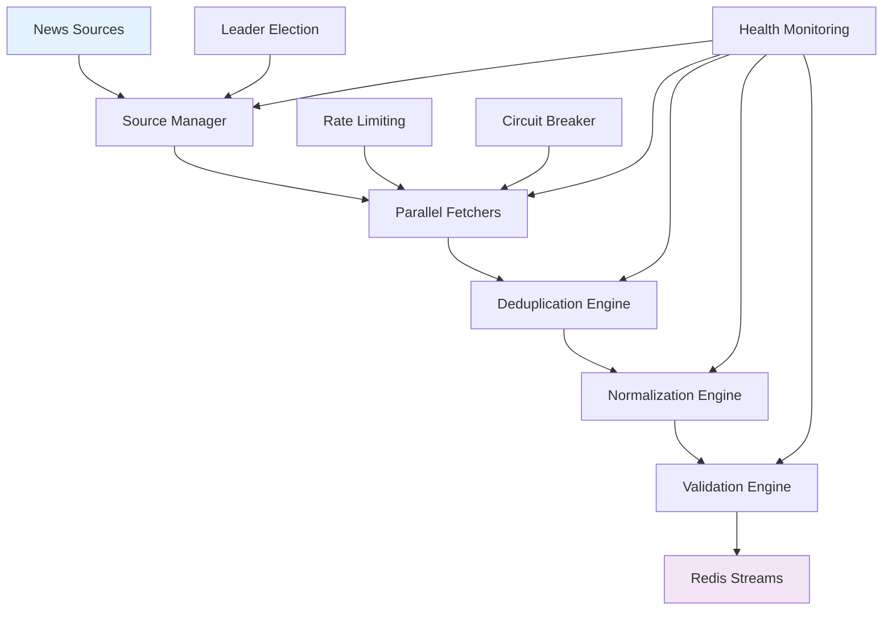

# Сбор Новостей: Детальная Документация

## Обзор Системы Сбора

Система сбора новостей представляет собой высокопроизводительный pipeline, способный обрабатывать тысячи новостей в минуту из различных источников. Система построена на принципах надежности, масштабируемости и отказоустойчивости.

## Архитектура Сбора



## Основные Компоненты

### 1. Source Manager (Менеджер Источников)

Менеджер источников отвечает за координацию всех источников новостей, управление приоритетами и обеспечение отказоустойчивости.

```go
type SourceManager struct {
    sources     map[string]NewsSource
    leaderElect *LeaderElection
    rateLimiter *RateLimiter
    circuitBreaker *CircuitBreaker
    healthMonitor *HealthMonitor
    redis       *redis.Client
    config      *Config
}

func NewSourceManager(redis *redis.Client, config *Config) *SourceManager {
    return &SourceManager{
        sources:       make(map[string]NewsSource),
        leaderElect:   NewLeaderElection(redis, "news:ingestor:leader"),
        rateLimiter:   NewRateLimiter(config.RateLimitRPM),
        circuitBreaker: NewCircuitBreaker(config.CircuitBreakerThreshold),
        healthMonitor: NewHealthMonitor(redis),
        redis:         redis,
        config:        config,
    }
}

func (sm *SourceManager) Start(ctx context.Context) error {
    // Проверка лидерства
    if !sm.leaderElect.IsLeader() {
        return fmt.Errorf("not a leader, standby mode")
    }

    // Запуск health monitoring
    go sm.healthMonitor.Start(ctx)

    // Инициализация источников
    if err := sm.initializeSources(ctx); err != nil {
        return fmt.Errorf("failed to initialize sources: %w", err)
    }

    // Запуск основного цикла сбора
    return sm.runCollectionLoop(ctx)
}

func (sm *SourceManager) runCollectionLoop(ctx context.Context) error {
    ticker := time.NewTicker(sm.config.CollectionInterval)
    defer ticker.Stop()

    for {
        select {
        case <-ctx.Done():
            return ctx.Err()
        case <-ticker.C:
            if err := sm.collectFromAllSources(ctx); err != nil {
                sm.healthMonitor.RecordError("collection_loop", err)
                continue
            }
        }
    }
}

func (sm *SourceManager) collectFromAllSources(ctx context.Context) error {
    var wg sync.WaitGroup
    var mu sync.Mutex
    var errors []error

    semaphore := make(chan struct{}, sm.config.MaxConcurrentSources)

    for sourceName, source := range sm.sources {
        wg.Add(1)
        go func(name string, src NewsSource) {
            defer wg.Done()

            semaphore <- struct{}{} // Acquire
            defer func() { <-semaphore }() // Release

            if err := sm.collectFromSource(ctx, name, src); err != nil {
                mu.Lock()
                errors = append(errors, fmt.Errorf("source %s: %w", name, err))
                mu.Unlock()
            }
        }(sourceName, source)
    }

    wg.Wait()

    if len(errors) > 0 {
        return fmt.Errorf("collection errors: %v", errors)
    }

    return nil
}
```

### 2. News Source Interface (Интерфейс Источников)

Все источники новостей реализуют единый интерфейс для обеспечения консистентности и возможности легкого добавления новых источников.

```go
type NewsSource interface {
    // Name возвращает уникальное имя источника
    Name() string

    // Fetch получает новости из источника
    Fetch(ctx context.Context) ([]NewsRawItem, error)

    // HealthCheck проверяет доступность источника
    HealthCheck(ctx context.Context) error

    // Configure настраивает источник с конфигурацией
    Configure(config map[string]interface{}) error

    // Stats возвращает статистику источника
    Stats() SourceStats
}

type SourceStats struct {
    TotalFetched     int64
    LastFetchTime    time.Time
    AverageLatency   time.Duration
    ErrorCount       int64
    LastError        error
    HealthStatus     HealthStatus
}

type HealthStatus int

const (
    HealthUnknown HealthStatus = iota
    HealthHealthy
    HealthDegraded
    HealthUnhealthy
)
```

### 3. RSS Source Implementation (Реализация RSS Источника)

RSS источник использует библиотеку gofeed для парсинга RSS/Atom фидов с поддержкой различных форматов.

```go
type RSSSource struct {
    name        string
    urls        []string
    httpClient  *http.Client
    parser      *gofeed.Parser
    lastFetch   map[string]time.Time
    fetchStats  map[string]FetchStats
    config      RSSConfig
}

type RSSConfig struct {
    URLs             []string      `json:"urls"`
    Timeout          time.Duration `json:"timeout"`
    MaxRetries       int           `json:"max_retries"`
    RetryDelay       time.Duration `json:"retry_delay"`
    UserAgent        string        `json:"user_agent"`
    FollowRedirects  bool          `json:"follow_redirects"`
    SkipTLSVerify    bool          `json:"skip_tls_verify"`
}

func NewRSSSource(name string, config RSSConfig) *RSSSource {
    transport := &http.Transport{
        TLSClientConfig: &tls.Config{
            InsecureSkipVerify: config.SkipTLSVerify,
        },
    }

    client := &http.Client{
        Timeout:   config.Timeout,
        Transport: transport,
    }

    if !config.FollowRedirects {
        client.CheckRedirect = func(req *http.Request, via []*http.Request) error {
            return http.ErrUseLastResponse
        }
    }

    return &RSSSource{
        name:       name,
        urls:       config.URLs,
        httpClient: client,
        parser:     gofeed.NewParser(),
        lastFetch:  make(map[string]time.Time),
        fetchStats: make(map[string]FetchStats),
        config:     config,
    }
}

func (rs *RSSSource) Fetch(ctx context.Context) ([]NewsRawItem, error) {
    var allNews []NewsRawItem
    var errors []error

    for _, url := range rs.urls {
        news, err := rs.fetchFromURL(ctx, url)
        if err != nil {
            errors = append(errors, fmt.Errorf("URL %s: %w", url, err))
            continue
        }

        allNews = append(allNews, news...)

        // Обновление статистики
        rs.updateStats(url, len(news), time.Since(rs.lastFetch[url]))
    }

    if len(errors) > 0 && len(allNews) == 0 {
        return nil, fmt.Errorf("all URLs failed: %v", errors)
    }

    return allNews, nil
}

func (rs *RSSSource) fetchFromURL(ctx context.Context, url string) ([]NewsRawItem, error) {
    startTime := time.Now()

    // Создание запроса с user agent
    req, err := http.NewRequestWithContext(ctx, "GET", url, nil)
    if err != nil {
        return nil, fmt.Errorf("failed to create request: %w", err)
    }

    if rs.config.UserAgent != "" {
        req.Header.Set("User-Agent", rs.config.UserAgent)
    }

    // Выполнение запроса с повторными попытками
    var resp *http.Response
    for attempt := 0; attempt <= rs.config.MaxRetries; attempt++ {
        resp, err = rs.httpClient.Do(req)
        if err == nil && resp.StatusCode == 200 {
            break
        }

        if attempt < rs.config.MaxRetries {
            select {
            case <-ctx.Done():
                return nil, ctx.Err()
            case <-time.After(rs.config.RetryDelay * time.Duration(attempt+1)):
                continue
            }
        }
    }

    if err != nil {
        return nil, fmt.Errorf("HTTP request failed after %d attempts: %w", rs.config.MaxRetries+1, err)
    }
    defer resp.Body.Close()

    if resp.StatusCode != 200 {
        return nil, fmt.Errorf("HTTP %d: %s", resp.StatusCode, resp.Status)
    }

    // Парсинг RSS фида
    feed, err := rs.parser.Parse(resp.Body)
    if err != nil {
        return nil, fmt.Errorf("failed to parse RSS feed: %w", err)
    }

    // Преобразование в NewsRawItem
    var news []NewsRawItem
    for _, item := range feed.Items {
        newsItem, err := rs.convertToNewsItem(url, item)
        if err != nil {
            // Логируем ошибку но продолжаем
            log.Printf("Failed to convert item %s: %v", item.Title, err)
            continue
        }

        // Проверка на дубликаты по времени
        if rs.isDuplicate(url, newsItem) {
            continue
        }

        news = append(news, newsItem)
    }

    rs.lastFetch[url] = startTime
    return news, nil
}

func (rs *RSSSource) convertToNewsItem(feedURL string, item *gofeed.Item) (NewsRawItem, error) {
    // Парсинг времени публикации
    publishedTime := time.Now()
    if item.PublishedParsed != nil {
        publishedTime = *item.PublishedParsed
    } else if item.Published != "" {
        // Попытка парсинга различных форматов времени
        if t, err := time.Parse(time.RFC1123, item.Published); err == nil {
            publishedTime = t
        } else if t, err := time.Parse(time.RFC1123Z, item.Published); err == nil {
            publishedTime = t
        } else if t, err := time.Parse("2006-01-02T15:04:05Z07:00", item.Published); err == nil {
            publishedTime = t
        }
    }

    // Генерация UID
    uid := rs.generateUID(item.Link, item.Title, publishedTime)

    // Извлечение символа из заголовка
    symbol := rs.extractSymbol(item.Title)

    // Извлечение класса актива
    assetClass := rs.extractAssetClass(item.Title)

    return NewsRawItem{
        UID:        uid,
        Source:     rs.name,
        Title:      strings.TrimSpace(item.Title),
        URL:        item.Link,
        TsMs:       publishedTime.UnixMilli(),
        Symbol:     symbol,
        AssetClass: assetClass,
        RawData:    item, // Сохраняем оригинальный item для отладки
    }, nil
}

func (rs *RSSSource) generateUID(url, title string, published time.Time) string {
    // Создание стабильного UID на основе URL, title и времени
    // Используем SHA256 для детерминированности
    hasher := sha256.New()
    hasher.Write([]byte(url))
    hasher.Write([]byte(title))
    hasher.Write([]byte(fmt.Sprintf("%d", published.Unix())))
    hasher.Write([]byte(rs.config.UIDSalt)) // Соль для дополнительной уникальности

    return hex.EncodeToString(hasher.Sum(nil))
}

func (rs *RSSSource) extractSymbol(title string) string {
    // Простые правила извлечения символов из заголовков
    title = strings.ToUpper(title)

    // Криптовалюты
    cryptoPatterns := []*regexp.Regexp{
        regexp.MustCompile(`\b(BTC|BITCOIN)\b`),
        regexp.MustCompile(`\b(ETH|ETHEREUM)\b`),
        regexp.MustCompile(`\b(BNB|BINANCE)\b`),
        regexp.MustCompile(`\b(ADA|CARDANO)\b`),
        regexp.MustCompile(`\b(SOL|SOLANA)\b`),
    }

    for _, pattern := range cryptoPatterns {
        if matches := pattern.FindStringSubmatch(title); len(matches) > 0 {
            return matches[1]
        }
    }

    // Акции (простые паттерны)
    stockPatterns := []*regexp.Regexp{
        regexp.MustCompile(`\b(AAPL|APPLE)\b`),
        regexp.MustCompile(`\b(GOOGL|GOOGLE)\b`),
        regexp.MustCompile(`\b(MSFT|MICROSOFT)\b`),
        regexp.MustCompile(`\b(TSLA|TESLA)\b`),
    }

    for _, pattern := range stockPatterns {
        if matches := pattern.FindStringSubmatch(title); len(matches) > 0 {
            return matches[1]
        }
    }

    return "" // Не удалось извлечь
}

func (rs *RSSSource) extractAssetClass(title string) string {
    title = strings.ToLower(title)

    // Определение класса актива по ключевым словам
    if strings.Contains(title, "crypto") || strings.Contains(title, "bitcoin") ||
       strings.Contains(title, "ethereum") || strings.Contains(title, "blockchain") {
        return "crypto"
    }

    if strings.Contains(title, "stock") || strings.Contains(title, "shares") ||
       strings.Contains(title, "equity") || strings.Contains(title, "nyse") ||
       strings.Contains(title, "nasdaq") {
        return "equity"
    }

    if strings.Contains(title, "bond") || strings.Contains(title, "treasury") ||
       strings.Contains(title, "yield") {
        return "fixed_income"
    }

    if strings.Contains(title, "forex") || strings.Contains(title, "currency") ||
       strings.Contains(title, "dollar") || strings.Contains(title, "euro") {
        return "forex"
    }

    if strings.Contains(title, "commodity") || strings.Contains(title, "gold") ||
       strings.Contains(title, "oil") || strings.Contains(title, "silver") {
        return "commodity"
    }

    return "" // Неизвестный класс
}

func (rs *RSSSource) isDuplicate(feedURL string, item NewsRawItem) bool {
    // Простая проверка на дубликаты по времени
    // В продакшене должна быть более sophisticated логика
    lastFetch, exists := rs.lastFetch[feedURL]
    if !exists {
        return false
    }

    itemTime := time.UnixMilli(item.TsMs)
    return itemTime.Before(lastFetch)
}

func (rs *RSSSource) updateStats(url string, itemsFetched int, latency time.Duration) {
    stats := rs.fetchStats[url]
    stats.TotalFetched += int64(itemsFetched)
    stats.LastFetchTime = time.Now()
    stats.AverageLatency = time.Duration(
        (int64(stats.AverageLatency)*stats.FetchCount + int64(latency)) / (stats.FetchCount + 1),
    )
    stats.FetchCount++
    rs.fetchStats[url] = stats
}
```

### 4. CryptoPanic API Source (Источник CryptoPanic API)

Специализированный источник для крипто-новостей с поддержкой фильтрации и категоризации.

```go
type CryptoPanicSource struct {
    name       string
    apiKey     string
    baseURL    string
    httpClient *http.Client
    config     CryptoPanicConfig
    stats      SourceStats
}

type CryptoPanicConfig struct {
    APIKey      string        `json:"api_key"`
    BaseURL     string        `json:"base_url"`
    Currencies  []string      `json:"currencies"`
    Filter      string        `json:"filter"`       // "important", "hot", "rising", etc.
    Kind        string        `json:"kind"`         // "news", "media"
    Region      string        `json:"region"`       // "en", "de", "es", etc.
    Timeout     time.Duration `json:"timeout"`
    MaxRetries  int           `json:"max_retries"`
    RateLimit   int           `json:"rate_limit"`   // requests per minute
}

type CryptoPanicResponse struct {
    Results []CryptoPanicPost `json:"results"`
    Next    *string           `json:"next"`
    Count   int               `json:"count"`
}

type CryptoPanicPost struct {
    ID          int                      `json:"id"`
    Title       string                   `json:"title"`
    URL         string                   `json:"url"`
    PublishedAt string                   `json:"published_at"`
    Currencies  []CryptoPanicCurrency    `json:"currencies"`
    Tags        []string                 `json:"tags"`
    Kind        string                   `json:"kind"`
    Domain      string                   `json:"domain"`
    Votes       CryptoPanicVotes         `json:"votes"`
}

type CryptoPanicCurrency struct {
    Code string `json:"code"`
    Title string `json:"title"`
}

type CryptoPanicVotes struct {
    Positive  int `json:"positive"`
    Negative  int `json:"negative"`
    Important int `json:"important"`
    Liked     int `json:"liked"`
}

func NewCryptoPanicSource(config CryptoPanicConfig) *CryptoPanicSource {
    client := &http.Client{
        Timeout: config.Timeout,
        Transport: &http.Transport{
            TLSClientConfig: &tls.Config{
                MinVersion: tls.VersionTLS12,
            },
        },
    }

    return &CryptoPanicSource{
        name:       "cryptopanic",
        apiKey:     config.APIKey,
        baseURL:    config.BaseURL,
        httpClient: client,
        config:     config,
        stats:      SourceStats{},
    }
}

func (cp *CryptoPanicSource) Fetch(ctx context.Context) ([]NewsRawItem, error) {
    startTime := time.Now()
    defer func() {
        cp.stats.LastFetchTime = time.Now()
        cp.stats.AverageLatency = time.Duration(
            (int64(cp.stats.AverageLatency)*cp.stats.TotalFetched + int64(time.Since(startTime))) /
            (cp.stats.TotalFetched + 1),
        )
    }()

    // Проверка API ключа
    if cp.apiKey == "" {
        cp.stats.ErrorCount++
        cp.stats.LastError = fmt.Errorf("API key not configured")
        return nil, cp.stats.LastError
    }

    // Построение URL запроса
    url := cp.buildAPIURL()

    // Выполнение запроса с повторными попытками
    var response *CryptoPanicResponse
    var err error

    for attempt := 0; attempt <= cp.config.MaxRetries; attempt++ {
        response, err = cp.makeAPIRequest(ctx, url)
        if err == nil {
            break
        }

        if attempt < cp.config.MaxRetries {
            backoff := time.Duration(attempt+1) * time.Second
            select {
            case <-ctx.Done():
                return nil, ctx.Err()
            case <-time.After(backoff):
                continue
            }
        }
    }

    if err != nil {
        cp.stats.ErrorCount++
        cp.stats.LastError = err
        return nil, fmt.Errorf("API request failed after %d attempts: %w", cp.config.MaxRetries+1, err)
    }

    // Преобразование в NewsRawItem
    newsItems := make([]NewsRawItem, 0, len(response.Results))

    for _, post := range response.Results {
        item, err := cp.convertToNewsItem(post)
        if err != nil {
            log.Printf("Failed to convert CryptoPanic post %d: %v", post.ID, err)
            continue
        }

        newsItems = append(newsItems, item)
    }

    cp.stats.TotalFetched += int64(len(newsItems))
    return newsItems, nil
}

func (cp *CryptoPanicSource) buildAPIURL() string {
    params := url.Values{}
    params.Set("auth_token", cp.apiKey)

    if len(cp.config.Currencies) > 0 {
        params.Set("currencies", strings.Join(cp.config.Currencies, ","))
    }

    if cp.config.Filter != "" {
        params.Set("filter", cp.config.Filter)
    }

    if cp.config.Kind != "" {
        params.Set("kind", cp.config.Kind)
    }

    if cp.config.Region != "" {
        params.Set("region", cp.config.Region)
    }

    return fmt.Sprintf("%s/api/v1/posts/?%s", cp.baseURL, params.Encode())
}

func (cp *CryptoPanicSource) makeAPIRequest(ctx context.Context, apiURL string) (*CryptoPanicResponse, error) {
    req, err := http.NewRequestWithContext(ctx, "GET", apiURL, nil)
    if err != nil {
        return nil, fmt.Errorf("failed to create request: %w", err)
    }

    req.Header.Set("User-Agent", "NewsPipeline/1.0")
    req.Header.Set("Accept", "application/json")

    resp, err := cp.httpClient.Do(req)
    if err != nil {
        return nil, fmt.Errorf("HTTP request failed: %w", err)
    }
    defer resp.Body.Close()

    if resp.StatusCode != 200 {
        body, _ := io.ReadAll(resp.Body)
        return nil, fmt.Errorf("API returned %d: %s", resp.StatusCode, string(body))
    }

    var apiResponse CryptoPanicResponse
    if err := json.NewDecoder(resp.Body).Decode(&apiResponse); err != nil {
        return nil, fmt.Errorf("failed to decode API response: %w", err)
    }

    return &apiResponse, nil
}

func (cp *CryptoPanicSource) convertToNewsItem(post CryptoPanicPost) (NewsRawItem, error) {
    // Парсинг времени публикации
    publishedTime, err := time.Parse("2006-01-02T15:04:05Z", post.PublishedAt)
    if err != nil {
        return NewsRawItem{}, fmt.Errorf("failed to parse published time: %w", err)
    }

    // Определение основного символа
    symbol := cp.extractPrimarySymbol(post.Currencies)

    // Генерация UID
    uid := cp.generateUID(post.URL, post.Title, publishedTime)

    // Создание полного заголовка с дополнительной информацией
    title := cp.enrichTitle(post)

    return NewsRawItem{
        UID:        uid,
        Source:     cp.name,
        Title:      title,
        URL:        post.URL,
        TsMs:       publishedTime.UnixMilli(),
        Symbol:     symbol,
        AssetClass: "crypto",
        RawData:    post, // Сохраняем оригинальные данные
    }, nil
}

func (cp *CryptoPanicSource) extractPrimarySymbol(currencies []CryptoPanicCurrency) string {
    if len(currencies) == 0 {
        return ""
    }

    // Приоритет по популярности/важности
    priority := map[string]int{
        "BTC": 10, "ETH": 9, "BNB": 8, "ADA": 7, "SOL": 7,
        "DOT": 6, "DOGE": 5, "SHIB": 4, "AVAX": 6, "LTC": 5,
    }

    var bestCurrency string
    var bestPriority int

    for _, currency := range currencies {
        if prio, exists := priority[currency.Code]; exists && prio > bestPriority {
            bestCurrency = currency.Code
            bestPriority = prio
        }
    }

    if bestCurrency != "" {
        return bestCurrency
    }

    // Если нет приоритетных, берем первую
    return currencies[0].Code
}

func (cp *CryptoPanicSource) enrichTitle(post CryptoPanicPost) string {
    title := strings.TrimSpace(post.Title)

    // Добавление информации о важности
    if post.Votes.Important > 10 {
        title += " [HIGH IMPORTANCE]"
    } else if post.Votes.Important > 5 {
        title += " [MEDIUM IMPORTANCE]"
    }

    // Добавление топ тегов
    if len(post.Tags) > 0 {
        topTags := post.Tags[:min(3, len(post.Tags))]
        title += fmt.Sprintf(" [%s]", strings.Join(topTags, ", "))
    }

    // Добавление валют
    if len(post.Currencies) > 0 {
        currencyCodes := make([]string, len(post.Currencies))
        for i, curr := range post.Currencies {
            currencyCodes[i] = curr.Code
        }
        title += fmt.Sprintf(" (%s)", strings.Join(currencyCodes, ", "))
    }

    return title
}

func (cp *CryptoPanicSource) generateUID(url, title string, published time.Time) string {
    hasher := sha256.New()
    hasher.Write([]byte("cryptopanic"))
    hasher.Write([]byte(url))
    hasher.Write([]byte(title))
    hasher.Write([]byte(fmt.Sprintf("%d", published.Unix())))

    return hex.EncodeToString(hasher.Sum(nil))
}
```

### 5. Deduplication Engine (Дедупликация)

Дедупликация предотвращает повторную обработку одинаковых новостей из разных источников.

```go
type DeduplicationEngine struct {
    redis      *redis.Client
    ttlSeconds int
    bucketSize time.Duration
}

func NewDeduplicationEngine(redis *redis.Client, ttlSeconds int) *DeduplicationEngine {
    return &DeduplicationEngine{
        redis:      redis,
        ttlSeconds: ttlSeconds,
        bucketSize: time.Hour, // Группировка по часам
    }
}

func (de *DeduplicationEngine) IsDuplicate(ctx context.Context, item NewsRawItem) (bool, error) {
    // Создание ключа дедупликации
    key := de.generateDedupKey(item)

    // Проверка существования
    exists, err := de.redis.Exists(ctx, key).Result()
    if err != nil {
        return false, fmt.Errorf("failed to check deduplication: %w", err)
    }

    if exists == 1 {
        return true, nil
    }

    // Установка ключа с TTL
    if err := de.redis.Set(ctx, key, "1", time.Duration(de.ttlSeconds)*time.Second).Err(); err != nil {
        return false, fmt.Errorf("failed to set deduplication key: %w", err)
    }

    return false, nil
}

func (de *DeduplicationEngine) generateDedupKey(item NewsRawItem) string {
    // Создание ключа на основе нормализованного заголовка и времени
    normalizedTitle := de.normalizeTitle(item.Title)
    timeBucket := item.TsMs / de.bucketSize.Milliseconds()

    hasher := sha256.New()
    hasher.Write([]byte(normalizedTitle))
    hasher.Write([]byte(fmt.Sprintf("%d", timeBucket)))

    hash := hex.EncodeToString(hasher.Sum(nil))
    return fmt.Sprintf("dedup:%s", hash)
}

func (de *DeduplicationEngine) normalizeTitle(title string) string {
    // Нормализация заголовка для дедупликации
    title = strings.ToLower(title)

    // Удаление пунктуации
    title = regexp.MustCompile(`[^\w\s]`).ReplaceAllString(title, " ")

    // Удаление лишних пробелов
    title = regexp.MustCompile(`\s+`).ReplaceAllString(title, " ")
    title = strings.TrimSpace(title)

    // Удаление стоп-слов
    stopWords := []string{"the", "a", "an", "and", "or", "but", "in", "on", "at", "to", "for", "of", "with", "by"}
    words := strings.Fields(title)
    var filtered []string

    for _, word := range words {
        if !contains(stopWords, word) {
            filtered = append(filtered, word)
        }
    }

    return strings.Join(filtered, " ")
}

func contains(slice []string, item string) bool {
    for _, s := range slice {
        if s == item {
            return true
        }
    }
    return false
}

// Batch дедупликация для повышения производительности
func (de *DeduplicationEngine) FilterDuplicates(ctx context.Context, items []NewsRawItem) ([]NewsRawItem, error) {
    if len(items) == 0 {
        return items, nil
    }

    // Группировка по дедуп ключами
    keyToItems := make(map[string][]NewsRawItem)
    keys := make([]string, 0, len(items))

    for _, item := range items {
        key := de.generateDedupKey(item)
        keyToItems[key] = append(keyToItems[key], item)
        keys = append(keys, key)
    }

    // Batch проверка в Redis
    results := de.redis.MGet(ctx, keys...)
    existing, err := results.Result()
    if err != nil {
        return nil, fmt.Errorf("failed to check duplicates: %w", err)
    }

    // Фильтрация дубликатов
    var unique []NewsRawItem
    for i, key := range keys {
        if existing[i] == nil { // Ключ не существует
            unique = append(unique, keyToItems[key][0]) // Берем первый item из группы

            // Установка дедуп ключей пачкой
            de.redis.Set(ctx, key, "1", time.Duration(de.ttlSeconds)*time.Second)
        }
    }

    return unique, nil
}
```

### 6. Normalization Engine (Нормализация)

Нормализация приводит все новости к единому формату и стандарту.

```go
type NormalizationEngine struct {
    timezone   *time.Location
    language   string
    maxTitleLen int
    maxDescLen int
}

type NormalizedNewsItem struct {
    UID           string            `json:"uid"`
    Source        string            `json:"source"`
    Title         string            `json:"title"`
    Description   string            `json:"description,omitempty"`
    URL           string            `json:"url"`
    PublishedAt   time.Time         `json:"published_at"`
    PublishedTsMs int64             `json:"published_ts_ms"`
    Symbol        string            `json:"symbol,omitempty"`
    AssetClass    string            `json:"asset_class,omitempty"`
    Tags          []string          `json:"tags,omitempty"`
    Language      string            `json:"language"`
    Sentiment     string            `json:"sentiment,omitempty"`
    Metadata      map[string]interface{} `json:"metadata,omitempty"`
}

func NewNormalizationEngine(timezone *time.Location, language string) *NormalizationEngine {
    return &NormalizationEngine{
        timezone:    timezone,
        language:    language,
        maxTitleLen: 500,
        maxDescLen:  2000,
    }
}

func (ne *NormalizationEngine) Normalize(item NewsRawItem) NormalizedNewsItem {
    return NormalizedNewsItem{
        UID:           ne.normalizeUID(item.UID),
        Source:        ne.normalizeSource(item.Source),
        Title:         ne.normalizeTitle(item.Title),
        Description:   ne.normalizeDescription(item.RawData),
        URL:           ne.normalizeURL(item.URL),
        PublishedAt:   ne.normalizeTime(item.TsMs),
        PublishedTsMs: item.TsMs,
        Symbol:        ne.normalizeSymbol(item.Symbol),
        AssetClass:    ne.normalizeAssetClass(item.AssetClass),
        Tags:          ne.extractTags(item),
        Language:      ne.detectLanguage(item),
        Sentiment:     ne.detectSentiment(item.Title),
        Metadata:      ne.extractMetadata(item),
    }
}

func (ne *NormalizationEngine) normalizeUID(uid string) string {
    // Убедимся, что UID имеет правильный формат
    if len(uid) != 64 { // SHA256 hex length
        hasher := sha256.New()
        hasher.Write([]byte(uid))
        uid = hex.EncodeToString(hasher.Sum(nil))
    }
    return strings.ToLower(uid)
}

func (ne *NormalizationEngine) normalizeSource(source string) string {
    // Стандартизация имен источников
    source = strings.ToLower(strings.TrimSpace(source))

    aliases := map[string]string{
        "cryptopanic":  "cryptopanic",
        "cp":          "cryptopanic",
        "fmp":         "financial_modeling_prep",
        "financial modeling prep": "financial_modeling_prep",
        "newsapi":     "newsapi",
        "rss":         "rss",
    }

    if canonical, exists := aliases[source]; exists {
        return canonical
    }

    return source
}

func (ne *NormalizationEngine) normalizeTitle(title string) string {
    title = strings.TrimSpace(title)

    // Ограничение длины
    if len(title) > ne.maxTitleLen {
        title = title[:ne.maxTitleLen-3] + "..."
    }

    // Нормализация Unicode
    title = norm.NFC.String(title)

    // Удаление лишних пробелов
    title = regexp.MustCompile(`\s+`).ReplaceAllString(title, " ")

    return title
}

func (ne *NormalizationEngine) normalizeDescription(rawData interface{}) string {
    if rawData == nil {
        return ""
    }

    var description string

    // Извлечение описания в зависимости от типа источника
    switch data := rawData.(type) {
    case *gofeed.Item:
        if data.Description != "" {
            description = data.Description
        } else if data.Content != "" {
            description = data.Content
        }
    case map[string]interface{}:
        // Для API источников
        if desc, ok := data["description"].(string); ok && desc != "" {
            description = desc
        } else if content, ok := data["content"].(string); ok && content != "" {
            description = content
        } else if text, ok := data["text"].(string); ok && text != "" {
            description = text
        }
    }

    // Очистка HTML тегов
    description = ne.stripHTML(description)

    // Ограничение длины
    if len(description) > ne.maxDescLen {
        description = description[:ne.maxDescLen-3] + "..."
    }

    return strings.TrimSpace(description)
}

func (ne *NormalizationEngine) stripHTML(text string) string {
    // Простая очистка HTML (в продакшене использовать более robust решение)
    text = regexp.MustCompile(`<[^>]*>`).ReplaceAllString(text, "")
    text = html.UnescapeString(text)
    return text
}

func (ne *NormalizationEngine) normalizeTime(tsMs int64) time.Time {
    t := time.UnixMilli(tsMs)

    // Приведение к указанному timezone
    if ne.timezone != nil {
        t = t.In(ne.timezone)
    }

    return t
}

func (ne *NormalizationEngine) normalizeSymbol(symbol string) string {
    if symbol == "" {
        return ""
    }

    symbol = strings.ToUpper(strings.TrimSpace(symbol))

    // Стандартизация символов
    aliases := map[string]string{
        "BITCOIN": "BTC",
        "ETHEREUM": "ETH",
        "BINANCE":  "BNB",
        "CARDANO":  "ADA",
        "SOLANA":   "SOL",
        "APPLE":    "AAPL",
        "GOOGLE":   "GOOGL",
        "MICROSOFT": "MSFT",
        "TESLA":    "TSLA",
    }

    if canonical, exists := aliases[symbol]; exists {
        return canonical
    }

    return symbol
}

func (ne *NormalizationEngine) normalizeAssetClass(assetClass string) string {
    assetClass = strings.ToLower(strings.TrimSpace(assetClass))

    validClasses := map[string]bool{
        "crypto": true, "equity": true, "forex": true,
        "commodity": true, "fixed_income": true,
    }

    if validClasses[assetClass] {
        return assetClass
    }

    // Автоопределение по символу
    return ne.inferAssetClass(assetClass)
}

func (ne *NormalizationEngine) inferAssetClass(symbol string) string {
    if symbol == "" {
        return ""
    }

    // Криптовалюты
    cryptoSymbols := []string{"BTC", "ETH", "BNB", "ADA", "SOL", "DOT", "DOGE", "SHIB", "AVAX", "LTC"}
    for _, s := range cryptoSymbols {
        if symbol == s {
            return "crypto"
        }
    }

    // Акции (NYSE/NASDAQ)
    stockSymbols := []string{"AAPL", "GOOGL", "MSFT", "TSLA", "NVDA", "AMZN", "META", "NFLX"}
    for _, s := range stockSymbols {
        if symbol == s {
            return "equity"
        }
    }

    // Forex
    forexSymbols := []string{"EURUSD", "GBPUSD", "USDJPY", "AUDUSD", "USDCAD", "USDCHF"}
    for _, s := range forexSymbols {
        if strings.Contains(symbol, "USD") || strings.Contains(symbol, "EUR") {
            return "forex"
        }
    }

    return "unknown"
}

func (ne *NormalizationEngine) extractTags(item NewsRawItem) []string {
    var tags []string

    // Извлечение из raw data
    if item.RawData != nil {
        switch data := item.RawData.(type) {
        case map[string]interface{}:
            if tagsData, ok := data["tags"].([]interface{}); ok {
                for _, tag := range tagsData {
                    if tagStr, ok := tag.(string); ok {
                        tags = append(tags, strings.ToLower(tagStr))
                    }
                }
            }
        }
    }

    // Извлечение из заголовка
    titleTags := ne.extractTagsFromText(item.Title)
    tags = append(tags, titleTags...)

    // Удаление дубликатов
    return ne.uniqueTags(tags)
}

func (ne *NormalizationEngine) extractTagsFromText(text string) []string {
    var tags []string
    text = strings.ToLower(text)

    // Финансовые теги
    financialTags := []string{
        "earnings", "dividend", "split", "merger", "acquisition",
        "bankruptcy", "lawsuit", "regulation", "fed", "ecb",
        "cpi", "ppi", "nfp", "gdp", "inflation", "rates",
        "bitcoin", "ethereum", "crypto", "blockchain", "defi",
        "nft", "mining", "halving", "etf", "futures",
    }

    for _, tag := range financialTags {
        if strings.Contains(text, tag) {
            tags = append(tags, tag)
        }
    }

    return tags
}

func (ne *NormalizationEngine) uniqueTags(tags []string) []string {
    seen := make(map[string]bool)
    var unique []string

    for _, tag := range tags {
        tag = strings.TrimSpace(tag)
        if tag != "" && !seen[tag] {
            seen[tag] = true
            unique = append(unique, tag)
        }
    }

    return unique
}

func (ne *NormalizationEngine) detectLanguage(item NewsRawItem) string {
    // Простая детекция языка (в продакшене использовать whatlanggo или similar)
    text := item.Title
    if item.RawData != nil {
        if data, ok := item.RawData.(map[string]interface{}); ok {
            if desc, ok := data["description"].(string); ok {
                text += " " + desc
            }
        }
    }

    // Простые правила
    if strings.Contains(text, "the") || strings.Contains(text, "and") || strings.Contains(text, "is") {
        return "en"
    }

    if strings.Contains(text, "der") || strings.Contains(text, "und") || strings.Contains(text, "ist") {
        return "de"
    }

    if strings.Contains(text, "el") || strings.Contains(text, "la") || strings.Contains(text, "es") {
        return "es"
    }

    return ne.language // default
}

func (ne *NormalizationEngine) detectSentiment(title string) string {
    title = strings.ToLower(title)

    // Простые правила сентимент анализа
    positiveWords := []string{"rise", "up", "gain", "surge", "jump", "bull", "bullish", "rally", "boost"}
    negativeWords := []string{"fall", "down", "drop", "decline", "crash", "bear", "bearish", "plunge", "slump"}

    positiveCount := 0
    negativeCount := 0

    words := strings.Fields(title)
    for _, word := range words {
        for _, pos := range positiveWords {
            if strings.Contains(word, pos) {
                positiveCount++
            }
        }
        for _, neg := range negativeWords {
            if strings.Contains(word, neg) {
                negativeCount++
            }
        }
    }

    if positiveCount > negativeCount {
        return "positive"
    } else if negativeCount > positiveCount {
        return "negative"
    }

    return "neutral"
}

func (ne *NormalizationEngine) extractMetadata(item NewsRawItem) map[string]interface{} {
    metadata := make(map[string]interface{})

    if item.RawData == nil {
        return metadata
    }

    // Извлечение специфичных для источника метаданных
    switch data := item.RawData.(type) {
    case map[string]interface{}:
        // CryptoPanic метаданные
        if votes, ok := data["votes"].(map[string]interface{}); ok {
            metadata["votes"] = votes
        }
        if domain, ok := data["domain"].(string); ok {
            metadata["domain"] = domain
        }
        if kind, ok := data["kind"].(string); ok {
            metadata["content_type"] = kind
        }

    case *gofeed.Item:
        // RSS метаданные
        if data.Author != nil {
            metadata["author"] = data.Author.Name
        }
        if len(data.Categories) > 0 {
            metadata["categories"] = data.Categories
        }
        if data.Image != nil {
            metadata["image_url"] = data.Image.URL
        }
    }

    metadata["source_original"] = item.Source
    metadata["normalized_at"] = time.Now().Format(time.RFC3339)

    return metadata
}
```

### 7. Validation Engine (Валидация)

Валидация обеспечивает качество и корректность собираемых новостей.

```go
type ValidationEngine struct {
    requiredFields []string
    maxTitleLength int
    maxDescLength  int
    futureThreshold time.Duration
    pastThreshold   time.Duration
}

type ValidationResult struct {
    IsValid bool
    Errors  []ValidationError
    Warnings []ValidationWarning
}

type ValidationError struct {
    Field   string
    Code    string
    Message string
}

type ValidationWarning struct {
    Field   string
    Code    string
    Message string
}

func NewValidationEngine() *ValidationEngine {
    return &ValidationEngine{
        requiredFields:  []string{"uid", "source", "title", "url", "published_ts_ms"},
        maxTitleLength:  500,
        maxDescLength:   2000,
        futureThreshold: 24 * time.Hour,     // Новости не могут быть старше 24 часов в будущем
        pastThreshold:   365 * 24 * time.Hour, // Новости не могут быть старше 1 года
    }
}

func (ve *ValidationEngine) Validate(item NormalizedNewsItem) ValidationResult {
    result := ValidationResult{
        IsValid: true,
        Errors:  []ValidationError{},
        Warnings: []ValidationWarning{},
    }

    // Проверка обязательных полей
    result.Errors = append(result.Errors, ve.validateRequiredFields(item)...)

    // Проверка формата полей
    result.Errors = append(result.Errors, ve.validateFieldFormats(item)...)

    // Проверка бизнес-правил
    errors, warnings := ve.validateBusinessRules(item)
    result.Errors = append(result.Errors, errors...)
    result.Warnings = append(result.Warnings, warnings...)

    // Обновление флага валидности
    result.IsValid = len(result.Errors) == 0

    return result
}

func (ve *ValidationEngine) validateRequiredFields(item NormalizedNewsItem) []ValidationError {
    var errors []ValidationError

    // Проверка обязательных полей
    checks := map[string]interface{}{
        "uid":             item.UID,
        "source":          item.Source,
        "title":           item.Title,
        "url":             item.URL,
        "published_ts_ms": item.PublishedTsMs,
    }

    for field, value := range checks {
        if ve.isEmpty(value) {
            errors = append(errors, ValidationError{
                Field:   field,
                Code:    "REQUIRED_FIELD_MISSING",
                Message: fmt.Sprintf("Required field '%s' is empty", field),
            })
        }
    }

    return errors
}

func (ve *ValidationEngine) isEmpty(value interface{}) bool {
    if value == nil {
        return true
    }

    switch v := value.(type) {
    case string:
        return strings.TrimSpace(v) == ""
    case int, int64:
        return v == 0
    default:
        return false
    }
}

func (ve *ValidationEngine) validateFieldFormats(item NormalizedNewsItem) []ValidationError {
    var errors []ValidationError

    // Проверка UID (SHA256 hex)
    if !ve.isValidSHA256(item.UID) {
        errors = append(errors, ValidationError{
            Field:   "uid",
            Code:    "INVALID_UID_FORMAT",
            Message: "UID must be a valid SHA256 hash in hex format",
        })
    }

    // Проверка URL
    if !ve.isValidURL(item.URL) {
        errors = append(errors, ValidationError{
            Field:   "url",
            Code:    "INVALID_URL_FORMAT",
            Message: "URL must be a valid HTTP/HTTPS URL",
        })
    }

    // Проверка времени публикации
    if !ve.isValidTimestamp(item.PublishedTsMs) {
        errors = append(errors, ValidationError{
            Field:   "published_ts_ms",
            Code:    "INVALID_TIMESTAMP",
            Message: "Published timestamp must be a valid Unix millisecond timestamp",
        })
    }

    // Проверка длины заголовка
    if len(item.Title) > ve.maxTitleLength {
        errors = append(errors, ValidationError{
            Field:   "title",
            Code:    "TITLE_TOO_LONG",
            Message: fmt.Sprintf("Title length %d exceeds maximum %d", len(item.Title), ve.maxTitleLength),
        })
    }

    // Проверка длины описания
    if len(item.Description) > ve.maxDescLength {
        errors = append(errors, ValidationError{
            Field:   "description",
            Code:    "DESCRIPTION_TOO_LONG",
            Message: fmt.Sprintf("Description length %d exceeds maximum %d", len(item.Description), ve.maxDescLength),
        })
    }

    return errors
}

func (ve *ValidationEngine) validateBusinessRules(item NormalizedNewsItem) ([]ValidationError, []ValidationWarning) {
    var errors []ValidationError
    var warnings []ValidationWarning

    now := time.Now()

    // Проверка времени публикации
    published := time.UnixMilli(item.PublishedTsMs)

    // Слишком далеко в будущем
    if published.After(now.Add(ve.futureThreshold)) {
        errors = append(errors, ValidationError{
            Field:   "published_ts_ms",
            Code:    "TIMESTAMP_TOO_FUTURE",
            Message: fmt.Sprintf("Published time is more than %v in the future", ve.futureThreshold),
        })
    }

    // Слишком далеко в прошлом
    if published.Before(now.Add(-ve.pastThreshold)) {
        warnings = append(warnings, ValidationWarning{
            Field:   "published_ts_ms",
            Code:    "TIMESTAMP_TOO_OLD",
            Message: fmt.Sprintf("Published time is more than %v in the past", ve.pastThreshold),
        })
    }

    // Проверка символа
    if item.Symbol != "" && !ve.isValidSymbol(item.Symbol) {
        warnings = append(warnings, ValidationWarning{
            Field:   "symbol",
            Code:    "INVALID_SYMBOL_FORMAT",
            Message: fmt.Sprintf("Symbol '%s' does not match expected format", item.Symbol),
        })
    }

    // Проверка asset class
    if item.AssetClass != "" && !ve.isValidAssetClass(item.AssetClass) {
        warnings = append(warnings, ValidationWarning{
            Field:   "asset_class",
            Code:    "INVALID_ASSET_CLASS",
            Message: fmt.Sprintf("Asset class '%s' is not recognized", item.AssetClass),
        })
    }

    // Проверка качества заголовка
    if quality := ve.assessTitleQuality(item.Title); quality < 0.3 {
        warnings = append(warnings, ValidationWarning{
            Field:   "title",
            Code:    "LOW_TITLE_QUALITY",
            Message: fmt.Sprintf("Title quality score %.2f is below threshold", quality),
        })
    }

    // Проверка на спам
    if ve.isLikelySpam(item) {
        errors = append(errors, ValidationError{
            Field:   "title",
            Code:    "LIKELY_SPAM",
            Message: "Content appears to be spam or low quality",
        })
    }

    return errors, warnings
}

func (ve *ValidationEngine) isValidSHA256(s string) bool {
    if len(s) != 64 {
        return false
    }
    matched, _ := regexp.MatchString("^[a-f0-9]{64}$", s)
    return matched
}

func (ve *ValidationEngine) isValidURL(urlStr string) bool {
    u, err := url.Parse(urlStr)
    if err != nil {
        return false
    }

    return u.Scheme == "http" || u.Scheme == "https"
}

func (ve *ValidationEngine) isValidTimestamp(ts int64) bool {
    // Проверка на разумный диапазон (1970-2100)
    minTs := int64(0)          // 1970-01-01
    maxTs := int64(4102444800000) // 2100-01-01

    return ts >= minTs && ts <= maxTs
}

func (ve *ValidationEngine) isValidSymbol(symbol string) bool {
    // Простая валидация формата символа
    matched, _ := regexp.MatchString(`^[A-Z0-9]{1,10}$`, symbol)
    return matched
}

func (ve *ValidationEngine) isValidAssetClass(assetClass string) bool {
    validClasses := []string{"crypto", "equity", "forex", "commodity", "fixed_income"}
    for _, valid := range validClasses {
        if assetClass == valid {
            return true
        }
    }
    return false
}

func (ve *ValidationEngine) assessTitleQuality(title string) float64 {
    if len(title) < 10 {
        return 0.0
    }

    score := 0.0

    // Длина заголовка (оптимально 30-80 символов)
    length := len(title)
    if length >= 30 && length <= 80 {
        score += 0.3
    } else if length >= 20 && length <= 100 {
        score += 0.2
    } else {
        score += 0.1
    }

    // Наличие ключевых слов
    titleLower := strings.ToLower(title)
    keywords := []string{"price", "market", "trading", "bitcoin", "ethereum", "fed", "earnings", "report"}

    keywordCount := 0
    for _, keyword := range keywords {
        if strings.Contains(titleLower, keyword) {
            keywordCount++
        }
    }

    if keywordCount > 0 {
        score += 0.3 * math.Min(float64(keywordCount)/3.0, 1.0)
    }

    // Читаемость (не все caps, не все цифры)
    if regexp.MustCompile(`[a-z]`).MatchString(title) {
        score += 0.2
    }

    if !regexp.MustCompile(`^[A-Z\s]+$`).MatchString(title) {
        score += 0.2
    }

    return math.Min(score, 1.0)
}

func (ve *ValidationEngine) isLikelySpam(item NormalizedNewsItem) bool {
    title := strings.ToLower(item.Title)

    // Слишком много caps
    if regexp.MustCompile(`[A-Z]`).ReplaceAllString(title, "") == "" {
        return true
    }

    // Спам слова
    spamWords := []string{
        "free money", "make money fast", "guaranteed returns",
        "100% profit", "secret strategy", "millionaire",
        "buy now", "limited time", "urgent", "breaking news" // слишком много breaking news
    }

    spamCount := 0
    for _, spam := range spamWords {
        if strings.Contains(title, spam) {
            spamCount++
        }
    }

    return spamCount >= 2
}

// Batch validation для производительности
func (ve *ValidationEngine) ValidateBatch(items []NormalizedNewsItem) []ValidationResult {
    results := make([]ValidationResult, len(items))

    for i, item := range items {
        results[i] = ve.Validate(item)
    }

    return results
}

// Статистика валидации
func (ve *ValidationEngine) GetValidationStats(results []ValidationResult) map[string]interface{} {
    total := len(results)
    valid := 0
    errors := 0
    warnings := 0

    errorCounts := make(map[string]int)
    warningCounts := make(map[string]int)

    for _, result := range results {
        if result.IsValid {
            valid++
        }

        errors += len(result.Errors)
        warnings += len(result.Warnings)

        for _, err := range result.Errors {
            errorCounts[err.Code]++
        }

        for _, warn := range result.Warnings {
            warningCounts[warn.Code]++
        }
    }

    return map[string]interface{}{
        "total_items":    total,
        "valid_items":    valid,
        "invalid_items":  total - valid,
        "total_errors":   errors,
        "total_warnings": warnings,
        "error_codes":    errorCounts,
        "warning_codes":  warningCounts,
        "validity_rate":  float64(valid) / float64(total),
    }
}
```

## Конфигурация и Запуск

### Environment Variables

```bash
# Основные настройки
REDIS_URL=redis://redis-worker-1:6379/0
LOG_LEVEL=INFO
COLLECTION_INTERVAL_SEC=60

# Источники новостей
CRYPTOPANIC_AUTH_TOKEN=your_token
FMP_API_KEY=your_key
NEWSAPI_KEY=your_key

# Таймауты и лимиты
HTTP_TIMEOUT_SEC=10
MAX_CONCURRENT_SOURCES=5
RATE_LIMIT_RPM=60

# Качество и валидация
MIN_TITLE_LENGTH=10
MAX_TITLE_LENGTH=500
DEDUPLICATION_TTL_SEC=3600

# Лидер-элекшен
LEADER_KEY_TTL_SEC=30
LEADER_CHECK_INTERVAL_SEC=10
```

### Docker Compose

```yaml
version: '3.8'
services:
  news-ingestor-go:
    image: news-ingestor:latest
    environment:
      - REDIS_URL=redis://redis-worker-1:6379/0
      - CRYPTOPANIC_AUTH_TOKEN=${CRYPTOPANIC_AUTH_TOKEN}
      - FMP_API_KEY=${FMP_API_KEY}
      - LOG_LEVEL=INFO
    healthcheck:
      test: ["CMD", "curl", "-f", "http://localhost:8097/health"]
      interval: 30s
      timeout: 10s
      retries: 3
    deploy:
      resources:
        limits:
          cpus: '0.5'
          memory: 256M
        reservations:
          cpus: '0.25'
          memory: 128M
```

### Мониторинг Сбора

```go
type CollectionMetrics struct {
    SourcesFetched    prometheus.Counter
    ItemsCollected    prometheus.Counter
    DeduplicationHits prometheus.Counter
    ValidationErrors  prometheus.Counter
    ProcessingLatency prometheus.Histogram
}

func (cm *CollectionMetrics) RecordCollection(source string, items int, duration time.Duration, errors int) {
    cm.SourcesFetched.WithLabelValues(source).Inc()
    cm.ItemsCollected.WithLabelValues(source).Add(float64(items))
    cm.ProcessingLatency.WithLabelValues(source).Observe(duration.Seconds())

    if errors > 0 {
        cm.ValidationErrors.WithLabelValues(source).Add(float64(errors))
    }
}
```

Эта детальная документация по сбору новостей предоставляет полное понимание архитектуры, реализации и лучших практик для высокопроизводительного ingestion pipeline.
