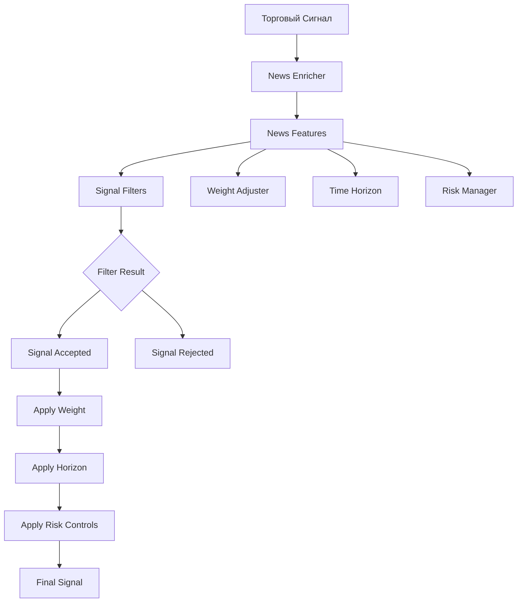

# Использование Новостей в Торговых Сигналах

## Обзор Интеграции

Система предоставляет мощный механизм интеграции новостных данных в процесс принятия торговых решений. Новости используются для фильтрации сигналов, взвешивания, временных ограничений и управления рисками в реальном времени.

## Архитектура Интеграции



## Основные Компоненты

### 1. NewsFeatures Data Structure (Структура Данных)

Основная структура данных, содержащая агрегированную информацию о новостном фоне.

```python
from dataclasses import dataclass
from typing import Optional, List
import time

@dataclass(frozen=True)
class NewsFeatures:
    """
    Компактное представление новостных данных для использования в сигналах.

    Все поля оптимизированы для высокой производительности в tick loop.
    """

    # Основные метрики риска
    news_risk: float = 0.0              # 0..1: Агрегированный новостный риск (EMA)
    surprise_score: float = 0.0         # -1..1: Неожиданность событий (EMA)
    news_grade_id: int = 0               # 0..4: Уровень важности (0=none, 4=critical)

    # Категоризация
    tags_mask: int = 0                   # Битовая маска активных тегов
    primary_tag_id: int = 0              # ID основного тега новости

    # Календарные события
    event_tminus_sec: int = -1           # Секунд до следующего важного события (<0 = нет)
    event_grade_id: int = 0              # Важность предстоящего события

    # Метаданные
    confidence: float = 0.0              # Уверенность анализа (0..1)
    horizon_sec: int = 0                 # Рекомендованный временной горизонт
    ref: str = ""                        # Ссылка на детальный анализ
    asof_ts_ms: int = 0                  # Время последнего обновления

    @property
    def has_high_risk_news(self) -> bool:
        """Проверка на наличие новостей высокого риска"""
        return self.news_grade_id >= 3

    @property
    def has_critical_news(self) -> bool:
        """Проверка на наличие критических новостей"""
        return self.news_grade_id >= 4

    @property
    def has_macro_news(self) -> bool:
        """Проверка на макроэкономические новости"""
        return (self.tags_mask & TAG_MASK_MACRO) != 0

    @property
    def has_risk_on(self) -> bool:
        """Проверка на risk-on режим"""
        return (self.tags_mask & TAG_MASK_RISK_ON) != 0

    @property
    def has_risk_off(self) -> bool:
        """Проверка на risk-off режим"""
        return (self.tags_mask & TAG_MASK_RISK_OFF) != 0

    @property
    def event_imminent(self) -> bool:
        """Проверка на приближающееся важное событие"""
        return self.event_tminus_sec > 0 and self.event_tminus_sec <= 3600  # < 1 час

    @property
    def data_fresh(self) -> bool:
        """Проверка свежести данных"""
        if self.asof_ts_ms == 0:
            return False
        age_sec = (time.time() * 1000 - self.asof_ts_ms) / 1000
        return age_sec < 300  # < 5 минут

    @property
    def confidence_high(self) -> bool:
        """Проверка высокой уверенности анализа"""
        return self.confidence >= 0.8

# Константы для битовых масок
TAG_MASK_MACRO = (
    (1 << 0) |  # cpi
    (1 << 1) |  # ppi
    (1 << 2) |  # fomc
    (1 << 3) |  # fed_speech
    (1 << 4) |  # nfp
    (1 << 5) |  # rates
    (1 << 6) |  # inflation
    (1 << 15)   # macro
)

TAG_MASK_CRYPTO_SHOCK = (
    (1 << 11) | # crypto_reg
    (1 << 12) | # exchange
    (1 << 13)   # hack
)

TAG_MASK_RISK_ON = (1 << 8)   # risk_on
TAG_MASK_RISK_OFF = (1 << 7)  # risk_off

TAG_MASK_EQUITIES = (
    (1 << 9) |  # earnings
    (1 << 14)   # etf
)

TAG_MASK_GEO = (1 << 10)  # geopolitics
```

### 2. NewsEnricher (Обогатитель Сигналов)

Основной компонент для добавления новостного контекста к торговым сигналам.

```python
import redis
import json
import time
import logging
from typing import Optional, Dict, Any
from contextlib import contextmanager

logger = logging.getLogger(__name__)

class NewsEnricher:
    """
    Синхронный обогатитель сигналов новостными данными.

    Оптимизирован для минимальной latency в tick loop:
    - 1 Redis RTT для основных данных
    - In-memory кеширование для burst режимов
    - Fail-open архитектура
    """

    def __init__(self, redis_url: str, cache_ttl_ms: int = 1500):
        self.redis = redis.from_url(redis_url)
        self.cache_ttl_ms = cache_ttl_ms
        self._cache: Dict[str, tuple] = {}  # symbol -> (timestamp_ms, features)

    def attach(self, signal_ctx, asset_class: str = "") -> None:
        """
        Добавляет ctx.news к торговому сигналу.

        Args:
            signal_ctx: Контекст торгового сигнала (любая структура с .symbol)
            asset_class: Класс актива (crypto, equity, forex, commodity)
        """
        try:
            symbol = self._extract_symbol(signal_ctx, asset_class)
            news_features = self._get_news_features(symbol)

            if news_features and news_features.data_fresh:
                signal_ctx.news = news_features
                self._record_enrichment_metrics(signal_ctx, "success")
            else:
                signal_ctx.news = None
                self._record_enrichment_metrics(signal_ctx, "no_data")

        except Exception as e:
            logger.warning(f"News enrichment failed for {getattr(signal_ctx, 'signal_id', 'unknown')}: {e}")
            signal_ctx.news = None
            self._record_enrichment_metrics(signal_ctx, "error")

    def _extract_symbol(self, signal_ctx, asset_class: str) -> str:
        """Извлечение символа из контекста сигнала"""
        # Прямое поле symbol
        if hasattr(signal_ctx, 'symbol') and signal_ctx.symbol:
            return signal_ctx.symbol.upper()

        # Для разных типов сигналов
        if hasattr(signal_ctx, 'instrument'):
            return signal_ctx.instrument.upper()

        if hasattr(signal_ctx, 'ticker'):
            return signal_ctx.ticker.upper()

        # Для мульти-символьных сигналов
        if hasattr(signal_ctx, 'symbols') and signal_ctx.symbols:
            return signal_ctx.symbols[0].upper()

        # Fallback для глобальных сигналов
        if asset_class == "crypto":
            return "BTCUSDT"
        elif asset_class == "equity":
            return "SPY"
        elif asset_class == "forex":
            return "EURUSD"
        else:
            return "GLOBAL"

    def _get_news_features(self, symbol: str) -> Optional[NewsFeatures]:
        """Получение новостных фич для символа"""
        # Проверка кеша
        if symbol in self._cache:
            cache_ts, features = self._cache[symbol]
            if time.time() * 1000 - cache_ts < self.cache_ttl_ms:
                return features
            else:
                del self._cache[symbol]

        # Загрузка из Redis
        features = self._load_from_redis(symbol)
        if features:
            self._cache[symbol] = (int(time.time() * 1000), features)

        return features

    def _load_from_redis(self, symbol: str) -> Optional[NewsFeatures]:
        """Загрузка данных из Redis"""
        try:
            key = f"news:agg:{symbol}"
            data = self.redis.hgetall(key)

            if not data:
                # Попытка загрузить GLOBAL данные
                if symbol != "GLOBAL":
                    return self._load_from_redis("GLOBAL")
                return None

            return self._parse_redis_data(data)

        except Exception as e:
            logger.error(f"Redis load failed for {symbol}: {e}")
            return None

    def _parse_redis_data(self, data: Dict[str, str]) -> NewsFeatures:
        """Парсинг данных из Redis"""
        try:
            return NewsFeatures(
                news_risk=float(data.get("risk_ema", "0.0")),
                surprise_score=float(data.get("surprise_ema", "0.0")),
                news_grade_id=int(data.get("grade_id", "0")),
                tags_mask=int(data.get("tags_mask", "0")),
                primary_tag_id=int(data.get("primary_tag_id", "0")),
                event_tminus_sec=int(data.get("event_tminus_sec", "-1")),
                event_grade_id=int(data.get("event_grade_id", "0")),
                confidence=float(data.get("confidence", "0.0")),
                horizon_sec=int(data.get("horizon_sec", "3600")),
                ref=data.get("last_ref", ""),
                asof_ts_ms=int(data.get("last_ts_ms", "0"))
            )
        except (ValueError, KeyError) as e:
            logger.warning(f"Failed to parse news data: {e}")
            return None

    def _record_enrichment_metrics(self, signal_ctx, status: str):
        """Запись метрик обогащения"""
        try:
            signal_id = getattr(signal_ctx, 'signal_id', 'unknown')
            symbol = getattr(signal_ctx, 'symbol', 'unknown')

            # Использование pipeline для batch операций
            pipe = self.redis.pipeline()
            pipe.hincrby("metrics:news:enrichment:status", status, 1)
            pipe.hincrby(f"metrics:news:enrichment:symbol:{symbol}", status, 1)
            pipe.execute()

        except Exception as e:
            logger.debug(f"Metrics recording failed: {e}")

    def get_cache_stats(self) -> Dict[str, Any]:
        """Статистика кеширования"""
        return {
            'cache_size': len(self._cache),
            'cache_symbols': list(self._cache.keys()),
            'cache_ttl_ms': self.cache_ttl_ms
        }

    def clear_cache(self, symbol: Optional[str] = None):
        """Очистка кеша"""
        if symbol:
            self._cache.pop(symbol, None)
        else:
            self._cache.clear()

class AsyncNewsEnricher(NewsEnricher):
    """
    Асинхронная версия enricher для высокопроизводительных приложений
    """

    def __init__(self, redis_url: str, cache_ttl_ms: int = 1500):
        super().__init__(redis_url, cache_ttl_ms)
        # Использование async Redis клиента
        import redis.asyncio as redis_async
        self.redis = redis_async.from_url(redis_url)

    async def attach_async(self, signal_ctx, asset_class: str = "") -> None:
        """Асинхронное обогащение"""
        # Аналогичная логика но с async/await
        pass
```

### 3. Signal Filtering (Фильтрация Сигналов)

Система фильтров для принятия решений о допустимости сигналов на основе новостного контекста.

```python
from enum import Enum
from typing import Callable, List, Optional, Dict, Any
import random

class FilterAction(Enum):
    ALLOW = "allow"
    BLOCK = "block"
    MODIFY = "modify"

class FilterResult:
    """Результат применения фильтра"""

    def __init__(self, action: FilterAction, reason: str = "", modifications: Optional[Dict[str, Any]] = None):
        self.action = action
        self.reason = reason
        self.modifications = modifications or {}

@dataclass
class SignalContext:
    """Пример структуры контекста сигнала"""
    signal_id: str
    symbol: str
    direction: str  # "long", "short"
    confidence: float
    weight: float
    timestamp_ms: int
    news: Optional[NewsFeatures] = None

class NewsBasedFilter:
    """
    Фильтр сигналов на основе новостного анализа
    """

    def __init__(self, config: Optional[Dict[str, Any]] = None):
        self.config = config or self._default_config()
        self._filters: List[Callable[[SignalContext], Optional[FilterResult]]] = [
            self._critical_news_filter,
            self._macro_event_filter,
            self._risk_regime_filter,
            self._calendar_event_filter,
            self._quality_filter
        ]

    def _default_config(self) -> Dict[str, Any]:
        """Конфигурация по умолчанию"""
        return {
            'block_critical_news': True,
            'block_high_risk_macro': True,
            'block_before_events': True,
            'event_block_window_sec': 3600,  # 1 час
            'min_confidence_threshold': 0.0,
            'risk_on_multiplier': 1.2,
            'risk_off_multiplier': 0.7,
            'stochastic_filter_prob': 0.0  # Для A/B тестирования
        }

    def apply(self, signal_ctx: SignalContext) -> FilterResult:
        """
        Применение всех фильтров к сигналу

        Returns:
            FilterResult с действием и модификациями
        """
        if not signal_ctx.news:
            return FilterResult(FilterAction.ALLOW, "no_news_data")

        # Применение всех фильтров
        for filter_func in self._filters:
            result = filter_func(signal_ctx)
            if result:
                self._record_filter_metrics(signal_ctx, result)
                return result

        # Stochastic фильтр для тестирования
        if self.config['stochastic_filter_prob'] > 0:
            if random.random() < self.config['stochastic_filter_prob']:
                return FilterResult(FilterAction.BLOCK, "stochastic_filter")

        return FilterResult(FilterAction.ALLOW, "all_filters_passed")

    def _critical_news_filter(self, ctx: SignalContext) -> Optional[FilterResult]:
        """Блокировка во время критических новостей"""
        if not self.config['block_critical_news']:
            return None

        if ctx.news.has_critical_news:
            return FilterResult(
                FilterAction.BLOCK,
                f"critical_news_grade_{ctx.news.news_grade_id}",
                {'block_reason': 'critical_news'}
            )

        return None

    def _macro_event_filter(self, ctx: SignalContext) -> Optional[FilterResult]:
        """Фильтр макроэкономических событий"""
        if not self.config['block_high_risk_macro']:
            return None

        # Блокировка во время high-grade macro новостей
        if ctx.news.has_macro_news and ctx.news.news_risk > 0.7:
            return FilterResult(
                FilterAction.BLOCK,
                f"high_risk_macro_{ctx.news.primary_tag_id}",
                {'block_reason': 'macro_risk'}
            )

        return None

    def _risk_regime_filter(self, ctx: SignalContext) -> Optional[FilterResult]:
        """Фильтр на основе risk-on/risk-off режимов"""
        modifications = {}

        if ctx.news.has_risk_on:
            # Увеличение веса для соответствующих направлений
            if ctx.direction == "long":
                modifications['weight_multiplier'] = self.config['risk_on_multiplier']
                modifications['reason'] = 'risk_on_long_boost'
            else:
                modifications['weight_multiplier'] = self.config['risk_off_multiplier']
                modifications['reason'] = 'risk_on_short_penalty'

        elif ctx.news.has_risk_off:
            # Уменьшение веса против тренда
            if ctx.direction == "short":
                modifications['weight_multiplier'] = self.config['risk_on_multiplier']
                modifications['reason'] = 'risk_off_short_boost'
            else:
                modifications['weight_multiplier'] = self.config['risk_off_multiplier']
                modifications['reason'] = 'risk_off_long_penalty'

        if modifications:
            return FilterResult(FilterAction.MODIFY, "risk_regime_adjustment", modifications)

        return None

    def _calendar_event_filter(self, ctx: SignalContext) -> Optional[FilterResult]:
        """Фильтр предстоящих календарных событий"""
        if not self.config['block_before_events']:
            return None

        if ctx.news.event_imminent and ctx.news.event_grade_id >= 2:
            # Блокировка перед важными событиями
            return FilterResult(
                FilterAction.BLOCK,
                f"upcoming_event_{ctx.news.event_grade_id}_{ctx.news.event_tminus_sec}s",
                {'block_reason': 'calendar_event', 'event_tminus': ctx.news.event_tminus_sec}
            )

        return None

    def _quality_filter(self, ctx: SignalContext) -> Optional[FilterResult]:
        """Фильтр на основе качества анализа"""
        if ctx.news.confidence < self.config['min_confidence_threshold']:
            return FilterResult(
                FilterAction.BLOCK,
                f"low_confidence_{ctx.news.confidence:.2f}",
                {'block_reason': 'low_analysis_confidence'}
            )

        return None

    def _record_filter_metrics(self, ctx: SignalContext, result: FilterResult):
        """Запись метрик фильтрации"""
        try:
            # В реальной реализации - отправка в Prometheus/StatsD
            logger.info(f"Signal {ctx.signal_id} filtered: {result.action.value} - {result.reason}")
        except Exception:
            pass

class CryptoNewsFilter(NewsBasedFilter):
    """
    Специализированный фильтр для крипто-сигналов
    """

    def __init__(self, config: Optional[Dict[str, Any]] = None):
        super().__init__(config)
        # Добавление крипто-специфичных фильтров
        self._filters.extend([
            self._crypto_shock_filter,
            self._exchange_outage_filter
        ])

    def _crypto_shock_filter(self, ctx: SignalContext) -> Optional[FilterResult]:
        """Фильтр крипто-шоков (регулирование, хаки, отключения)"""
        if (ctx.news.tags_mask & TAG_MASK_CRYPTO_SHOCK) != 0:
            risk_level = "high" if ctx.news.news_risk > 0.8 else "medium"
            return FilterResult(
                FilterAction.BLOCK,
                f"crypto_shock_{risk_level}_{ctx.news.primary_tag_id}",
                {'block_reason': 'crypto_shock', 'shock_type': ctx.news.primary_tag_id}
            )
        return None

    def _exchange_outage_filter(self, ctx: SignalContext) -> Optional[FilterResult]:
        """Фильтр отключений бирж"""
        if (ctx.news.tags_mask & (1 << 12)) != 0:  # exchange_outage tag
            return FilterResult(
                FilterAction.BLOCK,
                "exchange_outage",
                {'block_reason': 'exchange_down', 'recovery_time': 'unknown'}
            )
        return None

class ForexNewsFilter(NewsBasedFilter):
    """
    Специализированный фильтр для forex сигналов
    """

    def __init__(self, config: Optional[Dict[str, Any]] = None):
        super().__init__(config)
        self._filters.extend([
            self._central_bank_filter,
            self._economic_data_filter
        ])

    def _central_bank_filter(self, ctx: SignalContext) -> Optional[FilterResult]:
        """Фильтр заявлений центральных банков"""
        fomc_tag = (1 << 2)  # fomc
        ecb_tag = (1 << 16)  # ecb (расширенная маска)

        if (ctx.news.tags_mask & (fomc_tag | ecb_tag)) != 0:
            return FilterResult(
                FilterAction.MODIFY,
                "central_bank_statement",
                {
                    'weight_multiplier': 1.5,
                    'horizon_extension_sec': 7200,  # +2 часа
                    'reason': 'central_bank_attention'
                }
            )
        return None

    def _economic_data_filter(self, ctx: SignalContext) -> Optional[FilterResult]:
        """Фильтр экономических данных"""
        economic_tags = (1 << 0) | (1 << 1) | (1 << 4)  # cpi, ppi, nfp

        if (ctx.news.tags_mask & economic_tags) != 0 and ctx.news.news_risk > 0.6:
            return FilterResult(
                FilterAction.MODIFY,
                "economic_data_release",
                {
                    'weight_multiplier': 0.7,
                    'max_hold_time_sec': 1800,  # Макс 30 мин
                    'reason': 'economic_volatility'
                }
            )
        return None
```

### 4. Weight Adjustment (Корректировка Веса)

Динамическая корректировка веса сигналов на основе новостного контекста.

```python
import math
from typing import Dict, Any, Optional

class NewsBasedWeightAdjuster:
    """
    Корректировка веса сигналов на основе новостного анализа
    """

    def __init__(self, config: Optional[Dict[str, Any]] = None):
        self.config = config or self._default_config()

    def _default_config(self) -> Dict[str, Any]:
        return {
            'base_weight': 1.0,
            'max_weight': 2.0,
            'min_weight': 0.1,
            'risk_penalty_factor': 0.7,  # Множитель за риск
            'surprise_boost_factor': 1.3,  # Увеличение за surprise
            'confidence_multiplier': True,  # Учитывать confidence
            'grade_based_adjustment': True,  # Корректировка по grade
            'tag_specific_adjustments': {},  # Специфические корректировки по тегам
            'event_aware_adjustment': True,  # Учет календарных событий
        }

    def adjust_weight(self, signal_ctx, base_weight: Optional[float] = None) -> float:
        """
        Корректировка веса сигнала

        Args:
            signal_ctx: Контекст сигнала с news полем
            base_weight: Базовый вес (по умолчанию из config)

        Returns:
            Скорректированный вес сигнала
        """
        if base_weight is None:
            base_weight = self.config['base_weight']

        if not signal_ctx.news:
            return base_weight

        adjusted_weight = base_weight
        adjustments = []

        # 1. Корректировка по grade
        if self.config['grade_based_adjustment']:
            grade_adjustment = self._adjust_by_grade(signal_ctx.news)
            adjusted_weight *= grade_adjustment
            adjustments.append(f"grade_{signal_ctx.news.news_grade_id}:{grade_adjustment:.2f}")

        # 2. Корректировка по риску
        risk_adjustment = self._adjust_by_risk(signal_ctx.news)
        adjusted_weight *= risk_adjustment
        adjustments.append(f"risk_{signal_ctx.news.news_risk:.2f}:{risk_adjustment:.2f}")

        # 3. Корректировка по surprise
        surprise_adjustment = self._adjust_by_surprise(signal_ctx.news)
        adjusted_weight *= surprise_adjustment
        adjustments.append(f"surprise_{signal_ctx.news.surprise_score:.2f}:{surprise_adjustment:.2f}")

        # 4. Корректировка по confidence
        if self.config['confidence_multiplier']:
            confidence_adjustment = self._adjust_by_confidence(signal_ctx.news)
            adjusted_weight *= confidence_adjustment
            adjustments.append(f"confidence_{signal_ctx.news.confidence:.2f}:{confidence_adjustment:.2f}")

        # 5. Специфические корректировки по тегам
        tag_adjustment = self._adjust_by_tags(signal_ctx.news)
        if tag_adjustment != 1.0:
            adjusted_weight *= tag_adjustment
            adjustments.append(f"tags:{tag_adjustment:.2f}")

        # 6. Корректировка по календарным событиям
        if self.config['event_aware_adjustment']:
            event_adjustment = self._adjust_by_events(signal_ctx.news)
            if event_adjustment != 1.0:
                adjusted_weight *= event_adjustment
                adjustments.append(f"event:{event_adjustment:.2f}")

        # Применение ограничений
        final_weight = self._clamp_weight(adjusted_weight)

        # Логирование значительных изменений
        if abs(final_weight - base_weight) > 0.3:
            logger.info(f"Weight adjustment for {signal_ctx.signal_id}: "
                       f"{base_weight:.2f} -> {final_weight:.2f} "
                       f"({', '.join(adjustments)})")

        return final_weight

    def _adjust_by_grade(self, news: NewsFeatures) -> float:
        """Корректировка по уровню важности новостей"""
        grade_multipliers = {
            0: 1.0,   # No news - neutral
            1: 0.9,   # Low importance - slight reduction
            2: 0.7,   # Medium importance - moderate reduction
            3: 0.5,   # High importance - significant reduction
            4: 0.3,   # Critical - heavy reduction
        }

        return grade_multipliers.get(news.news_grade_id, 1.0)

    def _adjust_by_risk(self, news: NewsFeatures) -> float:
        """Корректировка по уровню новостного риска"""
        if news.news_risk <= 0.2:
            return 1.1  # Low risk - slight boost
        elif news.news_risk <= 0.4:
            return 1.0  # Moderate risk - neutral
        elif news.news_risk <= 0.6:
            return 0.9  # Medium risk - slight reduction
        elif news.news_risk <= 0.8:
            return 0.7  # High risk - moderate reduction
        else:
            return self.config['risk_penalty_factor']  # Very high risk - heavy penalty

    def _adjust_by_surprise(self, news: NewsFeatures) -> float:
        """Корректировка по фактору неожиданности"""
        surprise = abs(news.surprise_score)

        if surprise <= 0.2:
            return 1.0  # Expected - neutral
        elif surprise <= 0.5:
            return 1.1  # Somewhat surprising - slight boost
        elif surprise <= 0.8:
            return self.config['surprise_boost_factor']  # Very surprising - boost
        else:
            return 1.4  # Extremely surprising - significant boost

    def _adjust_by_confidence(self, news: NewsFeatures) -> float:
        """Корректировка по уверенности анализа"""
        # Линейная интерполяция: 0.0 -> 0.5, 1.0 -> 1.0
        return 0.5 + 0.5 * news.confidence

    def _adjust_by_tags(self, news: NewsFeatures) -> float:
        """Специфические корректировки по тегам"""
        adjustment = 1.0

        # Проверка специфических тегов
        for tag_name, multiplier in self.config['tag_specific_adjustments'].items():
            tag_bit = self._get_tag_bit(tag_name)
            if tag_bit and (news.tags_mask & tag_bit) != 0:
                adjustment *= multiplier

        return adjustment

    def _adjust_by_events(self, news: NewsFeatures) -> float:
        """Корректировка по предстоящим событиям"""
        if not news.event_imminent:
            return 1.0

        # Снижение веса перед важными событиями
        if news.event_grade_id >= 3:
            return 0.6  # Critical event
        elif news.event_grade_id >= 2:
            return 0.8  # Important event
        else:
            return 0.9  # Minor event

    def _clamp_weight(self, weight: float) -> float:
        """Ограничение веса в допустимых пределах"""
        return max(self.config['min_weight'], min(self.config['max_weight'], weight))

    def _get_tag_bit(self, tag_name: str) -> Optional[int]:
        """Получение битовой маски для тега"""
        tag_bits = {
            'fomc': 1 << 2,
            'earnings': 1 << 9,
            'geopolitics': 1 << 10,
            'crypto_reg': 1 << 11,
            'risk_on': 1 << 8,
            'risk_off': 1 << 7,
        }
        return tag_bits.get(tag_name)

class AdaptiveWeightAdjuster(NewsBasedWeightAdjuster):
    """
    Адаптивный adjuster, который учится на исторических данных
    """

    def __init__(self, config: Optional[Dict[str, Any]] = None, redis_client=None):
        super().__init__(config)
        self.redis = redis_client
        self._load_adaptive_params()

    def _load_adaptive_params(self):
        """Загрузка адаптивных параметров из Redis"""
        if not self.redis:
            return

        try:
            params = self.redis.hgetall("news:weight:adaptive")
            if params:
                # Обновление конфигурации на основе исторических данных
                self.config.update({
                    'risk_penalty_factor': float(params.get('optimal_risk_penalty', self.config['risk_penalty_factor'])),
                    'surprise_boost_factor': float(params.get('optimal_surprise_boost', self.config['surprise_boost_factor'])),
                })
        except Exception as e:
            logger.warning(f"Failed to load adaptive parameters: {e}")

    def record_outcome(self, signal_ctx, final_weight: float, pnl: float):
        """Запись исхода для обучения"""
        if not self.redis:
            return

        try:
            # Сохранение пары (условия, исход) для future learning
            outcome_key = f"news:weight:outcomes:{int(time.time())}"
            outcome_data = {
                'symbol': signal_ctx.symbol,
                'news_risk': signal_ctx.news.news_risk if signal_ctx.news else 0,
                'news_grade': signal_ctx.news.news_grade_id if signal_ctx.news else 0,
                'final_weight': final_weight,
                'pnl': pnl,
                'direction': signal_ctx.direction
            }

            self.redis.setex(outcome_key, 86400 * 30, json.dumps(outcome_data))  # 30 дней

        except Exception as e:
            logger.warning(f"Failed to record outcome: {e}")
```

### 5. Time Horizon Management (Управление Временными Горизонтами)

Определение оптимального времени удержания позиции на основе новостного контекста.

```python
from typing import Optional, Dict, Any

class NewsBasedHorizonManager:
    """
    Управление временными горизонтами на основе новостного анализа
    """

    def __init__(self, config: Optional[Dict[str, Any]] = None):
        self.config = config or self._default_config()

    def _default_config(self) -> Dict[str, Any]:
        return {
            'default_horizon_sec': 3600,  # 1 час
            'max_horizon_sec': 86400,     # 24 часа
            'min_horizon_sec': 300,       # 5 минут
            'grade_horizon_multipliers': {
                0: 1.0,   # No news
                1: 0.8,   # Low importance
                2: 0.6,   # Medium importance
                3: 0.4,   # High importance
                4: 0.2,   # Critical
            },
            'risk_horizon_factors': {
                'low': 1.2,     # < 0.3
                'medium': 1.0,  # 0.3-0.7
                'high': 0.7,    # > 0.7
            },
            'tag_horizon_overrides': {
                'fomc': 14400,      # 4 часа
                'earnings': 7200,   # 2 часа
                'geopolitics': 28800,  # 8 часов
                'cpi': 10800,       # 3 часа
                'nfp': 10800,       # 3 часа
            },
            'event_horizon_rules': {
                'pre_event_extension': 2.0,  # Увеличение горизонта перед событиями
                'post_event_reduction': 0.5, # Уменьшение после событий
            }
        }

    def calculate_horizon(self, signal_ctx, base_horizon: Optional[int] = None) -> int:
        """
        Расчет оптимального временного горизонта

        Args:
            signal_ctx: Контекст сигнала
            base_horizon: Базовый горизонт (секунды)

        Returns:
            Рекомендованный горизонт в секундах
        """
        if base_horizon is None:
            base_horizon = self.config['default_horizon_sec']

        if not signal_ctx.news:
            return self._clamp_horizon(base_horizon)

        horizon = base_horizon

        # 1. Корректировка по grade новостей
        grade_multiplier = self.config['grade_horizon_multipliers'].get(
            signal_ctx.news.news_grade_id, 1.0
        )
        horizon = int(horizon * grade_multiplier)

        # 2. Корректировка по уровню риска
        risk_factor = self._get_risk_factor(signal_ctx.news.news_risk)
        horizon = int(horizon * risk_factor)

        # 3. Override по специфическим тегам
        tag_override = self._get_tag_override(signal_ctx.news.tags_mask)
        if tag_override:
            horizon = tag_override

        # 4. Корректировка по календарным событиям
        event_adjustment = self._calculate_event_adjustment(signal_ctx.news)
        horizon = int(horizon * event_adjustment)

        # 5. Корректировка по confidence
        confidence_factor = 0.8 + 0.4 * signal_ctx.news.confidence  # 0.8 - 1.2
        horizon = int(horizon * confidence_factor)

        return self._clamp_horizon(horizon)

    def _get_risk_factor(self, risk: float) -> float:
        """Получение фактора корректировки по риску"""
        if risk < 0.3:
            return self.config['risk_horizon_factors']['low']
        elif risk < 0.7:
            return self.config['risk_horizon_factors']['medium']
        else:
            return self.config['risk_horizon_factors']['high']

    def _get_tag_override(self, tags_mask: int) -> Optional[int]:
        """Получение override горизонта по тегам"""
        # Проверка в порядке приоритета
        tag_checks = [
            ('fomc', 1 << 2),
            ('geopolitics', 1 << 10),
            ('cpi', 1 << 0),
            ('nfp', 1 << 4),
            ('earnings', 1 << 9),
        ]

        for tag_name, tag_bit in tag_checks:
            if (tags_mask & tag_bit) != 0:
                return self.config['tag_horizon_overrides'].get(tag_name)

        return None

    def _calculate_event_adjustment(self, news: NewsFeatures) -> float:
        """Расчет корректировки по календарным событиям"""
        if not news.event_imminent:
            return 1.0

        # Увеличение горизонта перед событиями
        if news.event_tminus_sec <= 3600:  # < 1 час
            return self.config['event_horizon_rules']['pre_event_extension']

        return 1.0

    def _clamp_horizon(self, horizon: int) -> int:
        """Ограничение горизонта в допустимых пределах"""
        return max(self.config['min_horizon_sec'], min(self.config['max_horizon_sec'], horizon))

    def get_horizon_explanation(self, signal_ctx, calculated_horizon: int) -> str:
        """Пояснение расчета горизонта"""
        if not signal_ctx.news:
            return f"Default horizon: {calculated_horizon}s (no news data)"

        explanations = []

        if signal_ctx.news.news_grade_id > 0:
            explanations.append(f"grade {signal_ctx.news.news_grade_id} adjustment")

        if signal_ctx.news.news_risk > 0.5:
            explanations.append(f"high risk {signal_ctx.news.news_risk:.2f}")

        if signal_ctx.news.event_imminent:
            explanations.append(f"event in {signal_ctx.news.event_tminus_sec}s")

        if signal_ctx.news.confidence < 0.7:
            explanations.append(f"low confidence {signal_ctx.news.confidence:.2f}")

        if explanations:
            return f"Horizon {calculated_horizon}s: {', '.join(explanations)}"
        else:
            return f"Horizon {calculated_horizon}s: neutral conditions"

class DynamicHorizonManager(NewsBasedHorizonManager):
    """
    Динамический менеджер горизонтов с адаптацией к рыночным условиям
    """

    def __init__(self, config: Optional[Dict[str, Any]] = None, market_regime_detector=None):
        super().__init__(config)
        self.market_regime = market_regime_detector

    def calculate_horizon(self, signal_ctx, base_horizon: Optional[int] = None) -> int:
        """Расчет горизонта с учетом рыночного режима"""
        horizon = super().calculate_horizon(signal_ctx, base_horizon)

        # Корректировка по волатильности рынка
        if self.market_regime:
            volatility = self.market_regime.get_current_volatility(signal_ctx.symbol)
            if volatility > 0.8:  # High volatility
                horizon = int(horizon * 0.7)
            elif volatility < 0.3:  # Low volatility
                horizon = int(horizon * 1.3)

        return self._clamp_horizon(horizon)
```

### 6. Risk Management Integration (Интеграция с Управлением Рисками)

Расширенное управление рисками с учетом новостного фактора.

```python
class NewsAwareRiskManager:
    """
    Менеджер рисков с учетом новостного контекста
    """

    def __init__(self, base_risk_manager, news_enricher: NewsEnricher):
        self.base_manager = base_risk_manager
        self.news_enricher = news_enricher

    def calculate_position_size(self, signal_ctx, capital: float, risk_percent: float) -> float:
        """
        Расчет размера позиции с учетом новостей
        """
        # Базовый расчет
        base_size = self.base_manager.calculate_position_size(signal_ctx, capital, risk_percent)

        if not signal_ctx.news:
            return base_size

        # Корректировка по новостному риску
        news_multiplier = self._get_news_size_multiplier(signal_ctx.news)

        adjusted_size = base_size * news_multiplier

        # Дополнительные ограничения
        adjusted_size = self._apply_news_based_limits(adjusted_size, signal_ctx.news, capital)

        logger.info(f"Position size for {signal_ctx.signal_id}: "
                   f"{base_size:.2f} -> {adjusted_size:.2f} (news multiplier: {news_multiplier:.2f})")

        return adjusted_size

    def _get_news_size_multiplier(self, news: NewsFeatures) -> float:
        """Расчет множителя размера позиции по новостям"""
        multiplier = 1.0

        # Корректировка по grade
        grade_multipliers = {
            0: 1.0,   # No news
            1: 0.9,   # Low
            2: 0.7,   # Medium
            3: 0.5,   # High
            4: 0.3,   # Critical
        }

        multiplier *= grade_multipliers.get(news.news_grade_id, 1.0)

        # Корректировка по риску
        if news.news_risk > 0.7:
            multiplier *= 0.6
        elif news.news_risk > 0.4:
            multiplier *= 0.8

        # Корректировка по surprise
        if abs(news.surprise_score) > 0.6:
            multiplier *= 0.8  # Снижение при высокой неожиданности

        return max(0.1, multiplier)  # Минимум 10% от базового размера

    def _apply_news_based_limits(self, size: float, news: NewsFeatures, capital: float) -> float:
        """Применение дополнительных ограничений"""
        # Ограничение во время критических новостей
        if news.has_critical_news:
            max_size = capital * 0.01  # Максимум 1% капитала
            size = min(size, max_size)

        # Ограничение перед важными событиями
        if news.event_imminent and news.event_grade_id >= 3:
            max_size = capital * 0.005  # Максимум 0.5% капитала
            size = min(size, max_size)

        return size

    def adjust_stop_loss(self, signal_ctx, entry_price: float, direction: str) -> float:
        """
        Корректировка стоп-лосса с учетом новостей
        """
        # Базовый стоп
        base_stop = self.base_manager.calculate_stop_loss(signal_ctx, entry_price, direction)

        if not signal_ctx.news:
            return base_stop

        # Корректировка по волатильности новостей
        volatility_multiplier = 1.0 + (signal_ctx.news.news_risk * 0.5)
        adjusted_stop = base_stop * volatility_multiplier

        # Максимальное расширение стопа
        max_multiplier = 2.0
        adjusted_stop = min(adjusted_stop, base_stop * max_multiplier)

        return adjusted_stop

    def should_exit_position(self, signal_ctx, current_pnl: float, hold_time_sec: int) -> bool:
        """
        Решение о выходе из позиции на основе новостей
        """
        # Базовое решение
        base_decision = self.base_manager.should_exit(signal_ctx, current_pnl, hold_time_sec)

        if base_decision:
            return True

        if not signal_ctx.news:
            return False

        # Выход при появлении критических новостей
        if signal_ctx.news.has_critical_news:
            logger.info(f"Emergency exit for {signal_ctx.signal_id}: critical news")
            return True

        # Выход перед важными событиями
        if signal_ctx.news.event_imminent and signal_ctx.news.event_grade_id >= 3:
            if signal_ctx.news.event_tminus_sec <= 1800:  # 30 минут
                logger.info(f"Pre-event exit for {signal_ctx.signal_id}: event in {signal_ctx.news.event_tminus_sec}s")
                return True

        return False
```

## Примеры Использования

### Полная Интеграция в Торговую Стратегию

```python
class NewsAwareTradingStrategy:
    """
    Полная торговая стратегия с интеграцией новостей
    """

    def __init__(self):
        self.news_enricher = NewsEnricher(redis_url="redis://localhost:6379")
        self.filter = CryptoNewsFilter()
        self.weight_adjuster = NewsBasedWeightAdjuster()
        self.horizon_manager = NewsBasedHorizonManager()
        self.risk_manager = NewsAwareRiskManager(BaseRiskManager(), self.news_enricher)

    def evaluate_signal(self, raw_signal) -> Optional[TradeDecision]:
        """
        Полная оценка сигнала с учетом новостей
        """
        # 1. Обогащение новостными данными
        self.news_enricher.attach(raw_signal, asset_class="crypto")

        # 2. Применение фильтров
        filter_result = self.filter.apply(raw_signal)

        if filter_result.action == FilterAction.BLOCK:
            logger.info(f"Signal {raw_signal.signal_id} blocked: {filter_result.reason}")
            return None

        # 3. Корректировка веса
        adjusted_weight = self.weight_adjuster.adjust_weight(raw_signal)

        # 4. Расчет горизонта
        horizon = self.horizon_manager.calculate_horizon(raw_signal)

        # 5. Расчет размера позиции
        position_size = self.risk_manager.calculate_position_size(
            raw_signal, capital=10000, risk_percent=1.0
        )

        # 6. Формирование решения
        return TradeDecision(
            signal_id=raw_signal.signal_id,
            symbol=raw_signal.symbol,
            direction=raw_signal.direction,
            weight=adjusted_weight,
            position_size=position_size,
            horizon_sec=horizon,
            stop_loss=self.risk_manager.adjust_stop_loss(raw_signal, raw_signal.price, raw_signal.direction),
            reasoning=self._build_reasoning(raw_signal, filter_result, adjusted_weight, horizon)
        )

    def _build_reasoning(self, signal, filter_result, weight, horizon) -> str:
        """Формирование объяснения решения"""
        reasons = []

        if signal.news:
            reasons.append(f"News grade: {signal.news.news_grade_id}")
            reasons.append(f"News risk: {signal.news.news_risk:.2f}")

            if filter_result.modifications:
                reasons.append(f"Modifications: {filter_result.modifications}")

            reasons.append(f"Final weight: {weight:.2f}")
            reasons.append(f"Horizon: {horizon}s")

        return " | ".join(reasons)

@dataclass
class TradeDecision:
    """Решение о торговле"""
    signal_id: str
    symbol: str
    direction: str
    weight: float
    position_size: float
    horizon_sec: int
    stop_loss: float
    reasoning: str
```

### A/B Тестирование Новостной Интеграции

```python
class NewsIntegrationExperiment:
    """
    A/B тестирование эффективности новостной интеграции
    """

    def __init__(self):
        self.control_strategy = BasicTradingStrategy()
        self.news_aware_strategy = NewsAwareTradingStrategy()
        self.results = defaultdict(list)

    def assign_group(self, signal_id: str) -> str:
        """Присвоение группы для A/B теста"""
        # Детерминированное распределение
        hash_val = hash(signal_id) % 100
        return "control" if hash_val < 50 else "news_aware"

    def process_signal(self, raw_signal) -> Optional[TradeDecision]:
        """Обработка сигнала в соответствующей группе"""
        group = self.assign_group(raw_signal.signal_id)

        if group == "control":
            return self.control_strategy.evaluate_signal(raw_signal)
        else:
            return self.news_aware_strategy.evaluate_signal(raw_signal)

    def record_result(self, signal_id: str, decision: TradeDecision, actual_pnl: float):
        """Запись результатов торговли"""
        group = self.assign_group(signal_id)

        self.results[group].append({
            'pnl': actual_pnl,
            'weight': decision.weight,
            'horizon': decision.horizon_sec,
            'symbol': decision.symbol
        })

    def analyze_results(self) -> Dict[str, Any]:
        """Анализ результатов A/B теста"""
        analysis = {}

        for group in ['control', 'news_aware']:
            if not self.results[group]:
                continue

            pnls = [r['pnl'] for r in self.results[group]]

            analysis[group] = {
                'total_trades': len(pnls),
                'total_pnl': sum(pnls),
                'avg_pnl': statistics.mean(pnls),
                'win_rate': sum(1 for p in pnls if p > 0) / len(pnls),
                'sharpe_ratio': self._calculate_sharpe(pnls),
                'avg_weight': statistics.mean([r['weight'] for r in self.results[group]]),
                'avg_horizon': statistics.mean([r['horizon'] for r in self.results[group]])
            }

        # Сравнение групп
        if 'control' in analysis and 'news_aware' in analysis:
            ctrl_pnl = analysis['control']['total_pnl']
            news_pnl = analysis['news_aware']['total_pnl']

            analysis['comparison'] = {
                'pnl_improvement': (news_pnl - ctrl_pnl) / abs(ctrl_pnl) if ctrl_pnl != 0 else 0,
                'win_rate_improvement': analysis['news_aware']['win_rate'] - analysis['control']['win_rate'],
                'sharpe_improvement': analysis['news_aware']['sharpe_ratio'] - analysis['control']['sharpe_ratio']
            }

        return analysis

    def _calculate_sharpe(self, pnls: List[float]) -> float:
        """Расчет Sharpe ratio"""
        if len(pnls) < 2:
            return 0.0

        avg_pnl = statistics.mean(pnls)
        std_pnl = statistics.stdev(pnls)

        if std_pnl == 0:
            return float('inf') if avg_pnl > 0 else float('-inf')

        return (avg_pnl / std_pnl) * math.sqrt(252)  # Annualized
```

Эта детальная документация по использованию новостей в торговых сигналах предоставляет полное понимание всех аспектов интеграции новостного анализа в процесс принятия торговых решений.
