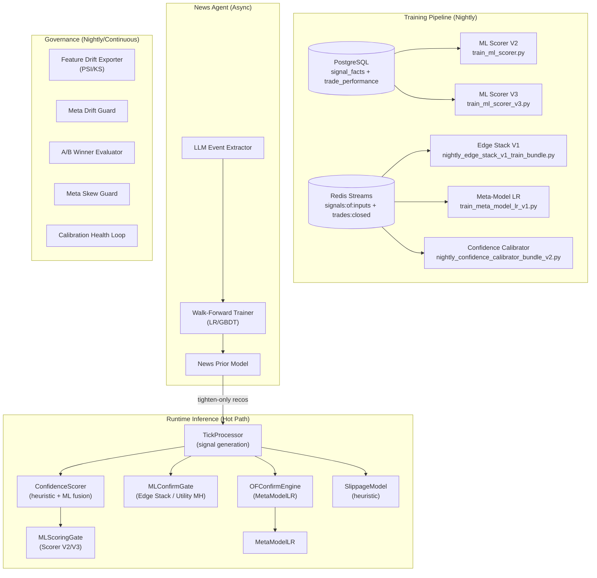
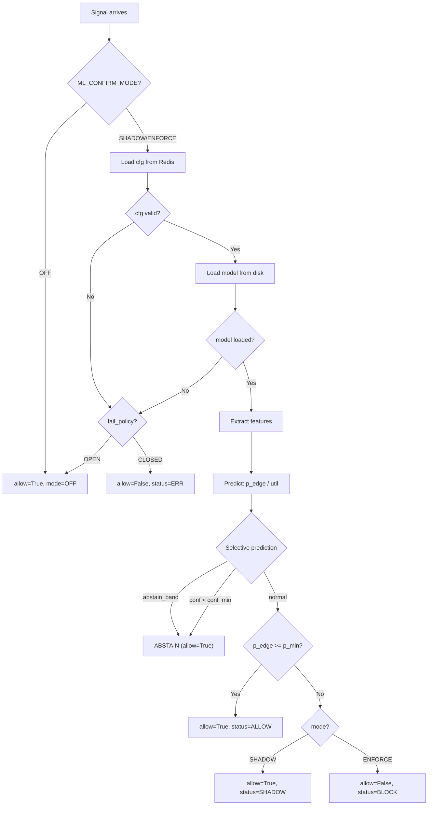
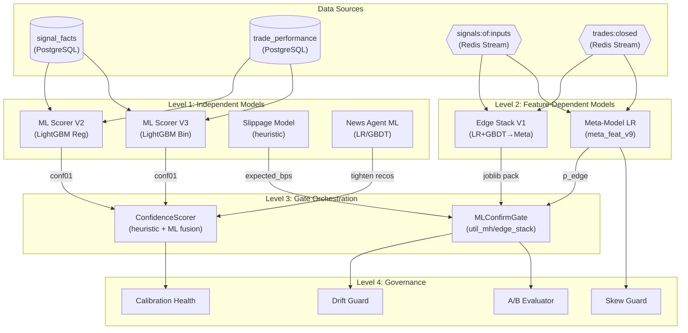

# 🧠 Trade Scanner — Полная карта ML-моделей

> **Scope**: все ML-модели, их обучение, промоция, inference, калибрация, дрифт и governance.
> **Обновлено**: 2026-03-31

---

## Оглавление

1. [Обзор ML-экосистемы](#1-обзор-ml-экосистемы)
2. [Model 1: ML Scorer V2 (Regression)](#2-model-1-ml-scorer-v2-regression)
3. [Model 2: ML Scorer V3 (Binary Classification)](#3-model-2-ml-scorer-v3-binary-classification)
4. [Model 3: Edge Stack V1 (Stacking Ensemble)](#4-model-3-edge-stack-v1-stacking-ensemble)
5. [Model 4: Meta-Model LR (Logistic Regression)](#5-model-4-meta-model-lr-logistic-regression)
6. [Model 5: ML Confirm Gate (Utility-Based)](#6-model-5-ml-confirm-gate-utility-based)
7. [Model 6: Confidence Calibration System](#7-model-6-confidence-calibration-system)
8. [Model 7: News Agent ML Pipeline](#8-model-7-news-agent-ml-pipeline)
9. [Model 8: Slippage Model (Heuristic)](#9-model-8-slippage-model-heuristic)
10. [Feature Schema Lineage](#10-feature-schema-lineage)
11. [Drift Detection & Governance](#11-drift-detection--governance)
12. [Docker Timer Services Map](#12-docker-timer-services-map)
13. [Redis Key Map](#13-redis-key-map)
14. [Inter-Model Dependency Graph](#14-inter-model-dependency-graph)
15. [ENV Variable Reference](#15-env-variable-reference)

---

## 1. Обзор ML-экосистемы



### Сводная таблица моделей

| # | Модель | Алгоритм | Таргет | Фичи | Обучение | Runtime Path | Mode |
|---|--------|----------|--------|-------|----------|-------------|------|
| 1 | **ML Scorer V2** | LightGBM Regression | R-multiple (continuous) | 23 (19 numeric + 4 derived) | Nightly timer | `MLScoringGate.score()` | Optional fusion |
| 2 | **ML Scorer V3** | LightGBM Binary | P(R≥0.3) binary | 23 (same as V2) | Nightly timer | `MLScoringGate.score()` | Challenger |
| 3 | **Edge Stack V1** | LR + GBDT stack + Meta | P(edge > y_min_r) | v2→v13_of (до 242 фич) | Nightly bundle | `MLConfirmGate.check()` | SHADOW/ENFORCE |
| 4 | **Meta-Model LR** | Logistic Regression | y_util_pos_60000 | meta_feat_v1→v9 | Nightly timer | `OFConfirmEngine.apply()` | SHADOW/ENFORCE |
| 5 | **ML Confirm Gate** | FastLinearUtilMH / EdgeStack | Utility (multi-horizon) | Edge Stack features | Loaded from cfg | `MLConfirmGate.check()` | OFF/SHADOW/ENFORCE |
| 6 | **Confidence Cal** | Isotonic Regression | Calibrated P(win) | conf_score raw → calibrated | Nightly V1/V2 | `ConfidenceScorer` | Always-on |
| 7 | **News Agent ML** | LR / GBDT walk-forward | P(price_move > threshold) | LLM-extracted events | Daily walk-forward | `stream:trade_recos_news` | Tighten-only |
| 8 | **Slippage Model** | Deterministic heuristic | Expected slippage (bps) | spread, churn, pressure, ATR | N/A (no training) | `expected_slippage_bps()` | Always-on |

---

## 2. Model 1: ML Scorer V2 (Regression)

### Описание
LightGBM regression модель для предсказания R-multiple (реализованный edge в R) из microstructure фич signal_facts.

### Архитектура

| Параметр | Значение |
|----------|---------|
| **Файл обучения** | [train_ml_scorer.py](file:///home/alex/front/trade/scanner_infra/python-worker/scripts/train_ml_scorer.py) |
| **Файл inference** | [ml_scoring_gate.py](file:///home/alex/front/trade/scanner_infra/python-worker/services/ml_scoring_gate.py) |
| **Алгоритм** | LightGBM Regression (`objective="regression"`, `metric="mae"`) |
| **Таргет** | `pnl_r` (R-multiple) — winsorized ±3σ (median/MAD) |
| **Калибрация** | Isotonic Regression: predicted_R → P(R>0) → conf01 [0.05, 0.98] |
| **Количество фич** | 23 (19 numeric + 4 derived) |
| **CV** | Purged + Embargo Time-Series Split (5 folds, purge=5min, embargo=2min) |
| **Guard rails** | MAE_oof < 50.0, min_samples ≥ 2000 |
| **Артефакт** | `scorer_v2.joblib` (dict-pack) |
| **kind** | `ml_scorer_v2` |

### Feature Vector (23 фичи)

**19 Numeric features** (из `signal_facts`):
```
conf_score, atr_14, delta_spike_z, obi_avg_20, weak_progress_ratio,
l3_spread_bps, l3_microprice_shift_bps_20, l3_microprice_velocity_bps,
l3_obi_5, l3_obi_20, l3_obi_50, l3_obi_persistence_score,
l3_cancel_to_trade_bid_5s, l3_cancel_to_trade_ask_5s,
l3_cancel_to_trade_bid_20s, l3_cancel_to_trade_ask_20s,
l3_queue_pressure_bid, l3_queue_pressure_ask, l3_market_depth_imbalance
```

**4 Derived features**:
```
direction_long       = 1 if LONG else 0
cancel_to_trade_max  = max(bid_5s, ask_5s, bid_20s, ask_20s)
obi_spread           = obi_5 - obi_50
queue_imbalance      = pressure_bid - pressure_ask
```

### LightGBM Hyperparams
```python
{
    "objective": "regression",
    "metric": "mae",
    "learning_rate": 0.05,
    "num_leaves": 31,
    "feature_fraction": 0.8,
    "bagging_fraction": 0.8,
    "bagging_freq": 5,
    "reg_lambda": 0.1,
    "seed": 42,
    "n_jobs": -1,
    "num_boost_round": 1000,  # OOF
    "early_stopping": 50,
    "final_model_rounds": 800,
}
```

### Training Pipeline
```
PostgreSQL (signal_facts JOIN trade_performance)
  ↓ fetch_training_data(lookback=60 days)
  ↓ Build feature rows (19 num + 4 derived)
  ↓ Winsorize target (±3σ MAD)
  ↓ Fit Robust Scaler (median/MAD per feature)
  ↓ Purged+Embargo CV (5 folds)
  ↓ Train final LightGBM (800 rounds)
  ↓ Fit Isotonic Calibrator (OOF preds → P(R>0))
  ↓ Save .candidate.joblib
  ↓ Telegram approval flow (buttons: Approve/Reject)
  ↓ On approve → promote to scorer_v2.joblib
```

### Promotion Flow
```
Candidate created → Redis key ml_scorer:pending:{run_id}
  ↓ Telegram notification (HTML report + inline buttons)
  ↓ Reminder every 30min (REMINDER_SEC=1800)
  ↓ On approve → atomic copy candidate → production
  ↓ On reject → discard candidate
  ↓ TTL: 24h (auto-expire if no response)
```

### OOF Metrics (Tracked)
- `mae_oof` — Mean Absolute Error
- `r2_oof` — R-squared
- `spearman_oof` — Spearman rank correlation
- `top5_hit_rate` — Precision at top 5% predictions

### Runtime Inference
```python
class MLScoringGate:
    # Lazy load from ML_SCORER_V2_MODEL_PATH
    # Refresh every ML_SCORER_V2_REFRESH_MS (60s)
    # Fail-open: returns (None, {}) if model unavailable
    
    def score(*, kind, side, ctx) -> (conf01, parts):
        features = extract(ctx)   # 23 features
        scaled = robust_scale(features)
        predicted_r = model.predict(scaled)
        conf01 = calibrator.predict(predicted_r)  # or sigmoid fallback
        return conf01, {ml_predicted_r, ml_conf01, ml_model_age_ms}
```

---

## 3. Model 2: ML Scorer V3 (Binary Classification)

### Описание
Challenger модель — бинарная классификация вместо регрессии. Цель: снижение overfit к шуму R-multiple.

### Архитектура

| Параметр | Значение |
|----------|---------|
| **Файл обучения** | [train_ml_scorer_v3.py](file:///home/alex/front/trade/scanner_infra/python-worker/scripts/train_ml_scorer_v3.py) |
| **Алгоритм** | LightGBM Binary (`objective="binary"`, `metric="binary_logloss"`) |
| **Таргет** | `1.0 if pnl_r >= 0.3 else 0.0` (Hit TP label) |
| **Балансировка** | `RandomUnderSampler` (50/50) из `imbalanced-learn` |
| **Калибрация** | Isotonic Regression (predicted_prob → P(R>0) → conf01) |
| **Guard rails** | ROC-AUC_oof ≥ 0.50 |
| **Артефакт** | `scorer_v3.candidate.joblib` |
| **kind** | `ml_scorer_v3` |

### Отличия от V2
| Аспект | V2 (Regression) | V3 (Binary) |
|--------|-----------------|--------------|
| Objective | regression | binary |
| Target | R-multiple (continuous) | P(R≥0.3) (0/1) |
| Winsorize | ±3σ MAD | Disabled |
| Balancing | None | RandomUnderSampler |
| num_leaves | 31 | **15** (aggressive regularization) |
| Guard rail | MAE < 50 | ROC-AUC ≥ 0.50 |
| Metrics | MAE, R², Spearman | ROC-AUC, LogLoss, Brier |

### LightGBM Hyperparams (V3)
```python
{
    "objective": "binary",
    "metric": "binary_logloss",
    "learning_rate": 0.05,
    "num_leaves": 15,  # ← more conservative than V2
    "feature_fraction": 0.8,
    "bagging_fraction": 0.8,
    "bagging_freq": 5,
    "reg_lambda": 0.1,
}
```

---

## 4. Model 3: Edge Stack V1 (Stacking Ensemble)

### Описание
Главная модель ML Confirm Gate. Двухуровневый стек: базовые модели (LR + GBDT) → мета-модель (LR). Обучается ежесуточно из Redis streams.

### Архитектура

| Параметр | Значение |
|----------|---------|
| **Файл обучения (bundle)** | [nightly_edge_stack_v1_train_bundle.py](file:///home/alex/front/trade/scanner_infra/python-worker/ml_analysis/tools/nightly_edge_stack_v1_train_bundle.py) |
| **Тренер OOF** | `ml_analysis.tools.train_edge_stack_v1_oof` |
| **Dataset builder** | `ml_analysis.tools.build_edge_stack_dataset_from_redis` |
| **Алгоритм** | 2-Level Stacking: `LogisticRegression(C=0.01)` + `HistGradientBoostingClassifier(max_depth=3, lr=0.05, max_iter=400)` → Meta `LogisticRegression` |
| **Таргет** | Binary: `1 if R ≥ y_min_r (0.10) else 0` |
| **Фичи** | Feature Registry versioned: v2→v13_of (от 25 до 242 фич) |
| **CV** | Purged + Embargo (5 folds, purge=300s, embargo=300s) |
| **Калибрация** | Isotonic Regression (optional, `--calibrate 1`) |
| **Guard rails** | `brier_max=0.30`, `ece_max=0.08`, `min_joined=2000`, `pos_rate ∈ [0.05, 0.60]` |

### Training Bundle Pipeline (7 шагов)

```
Step 1: Build Dataset
  ├─ Source: Redis streams (signals:of:inputs + trades:closed)
  ├─ Join: SID matching (crypto-of:{SYMBOL}:{ts_ms})
  ├─ Window: 72h (EDGE_STACK_WINDOW_HOURS)
  ├─ Feature schema: --feature_schema_ver (v3/v9_of/v10_of/v12_of/v13_of)
  └─ Output: edge_train.jsonl + edge_dataset_report.json

Step 2: Validate Dataset
  ├─ min_joined ≥ 2000
  ├─ pos_rate ∈ [0.05, 0.60]
  └─ feature_cols_hash match

Step 3: Train OOF Model
  ├─ Base models: LR (C=0.01) + GBDT (depth=3, lr=0.05, iter=400)
  ├─ Meta model: LR on OOF base predictions
  ├─ Weight: --weight_by_rmult=1 (R-weighted samples)
  └─ Output: edge_stack_v1.joblib (dict-pack)

Step 4: Validate Train Report
  ├─ Brier ≤ 0.30
  └─ ECE ≤ 0.08

Step 5: Promote Candidate (always)
  └─ Copy → champions/edge_stack_v1_candidate.joblib

Step 6: Promote Champion (conditional)
  ├─ Only if EDGE_STACK_AUTO_PROMOTE=1 AND all validations pass
  ├─ Backup previous champion → _prev.joblib
  └─ Copy → champions/edge_stack_v1_champion.joblib

Step 7: Write Redis Metrics
  └─ metrics:edge_stack_train:last (hash)
```

### Active Training Configurations

| Container | Feature Schema | Redis CFG Key | Notes |
|-----------|---------------|---------------|-------|
| `scanner-ml-nightly-edge-stack-train-bundle` | v12_of (214 keys) | `cfg:ml_confirm` | Primary production |
| `scanner-ml-nightly-edge-stack-train-bundle-v13` | v13_of (242 keys) | `cfg:ml_confirm:edge_stack_v1:candidate_v13` | Isolated candidate |

### Artifacts Directory Structure
```
/var/lib/trade/ml_models/edge_stack_v1/
├── runs/
│   └── YYYYMMDD_HHMMSS/
│       ├── edge_train.jsonl
│       ├── edge_dataset_report.json
│       ├── edge_quarantine.jsonl
│       ├── feature_cols.json
│       ├── edge_stack_v1.joblib
│       └── train_report.json
├── champions/
│   ├── edge_stack_v1_candidate.joblib
│   ├── edge_stack_v1_champion.joblib
│   └── edge_stack_v1_champion_prev.joblib
├── versions/
│   └── edge_stack_v1_train_YYYYMMDD_HHMMSS.json
└── edge_stack_v1_train_bundle_latest.json
```

---

## 5. Model 4: Meta-Model LR (Logistic Regression)

### Описание
Lightweight Logistic Regression для meta-scoring внутри OFConfirmEngine. Работает с meta_features (v1→v9).

### Архитектура

| Параметр | Значение |
|----------|---------|
| **Определение** | [meta_model_lr.py](file:///home/alex/front/trade/scanner_infra/core/meta_model_lr.py) |
| **Schema Registry** | [meta_schema_registry.py](file:///home/alex/front/trade/scanner_infra/python-worker/core/meta_schema_registry.py) |
| **Training timer** | `scanner-train-meta-model-lr-v1-timer` / `scanner-train-meta-model-lr-v9-timer` |
| **Алгоритм** | Logistic Regression (sklearn) |
| **Таргет** | `y_util_pos_60000` (utility positive at 60s horizon) |
| **Артефакт** | `meta_model_v7_champion.json` / `meta_model_lr_v8.json` |

### Meta-Feature Schema Evolution

| Version | Columns | Key additions |
|---------|---------|--------------|
| `meta_feat_v1` | ~20 | Core microstructure |
| `meta_feat_v5` | ~40 | Score, scenario, regime |
| `meta_feat_v7` | ~60 | A5 flags, Hawkes, VPIN |
| `meta_feat_v8` | ~80 | Extended OBI, flow |
| `meta_feat_v9` | ~110 | **LiqMap scalars** (30 new cols): age, levels, near_total_usd, imbalance, peaks, gate metrics |

### v9 New Features (LiqMap)
```
liqmap_{5m,1h}_age_ms, levels_n, total_usd, near_total_usd,
near_long_usd, near_short_usd, near_imb, dist_up_bps, dist_dn_bps,
peak_up1_usd, peak_dn1_usd, peak_up1_share, peak_dn1_share,
peaks_up, peaks_dn
+ liqmap_gate_shadow_veto, veto, rr, risk_bps, reward_bps,
  adverse_peak_usd, favorable_peak_usd
```

### Runtime (OFConfirmEngine)
```python
class OFConfirmEngine:
    def apply(evidence, indicators):
        feat_dict, missing = build_meta_features_v9(evidence, indicators)
        vector = [feat_dict[col] for col in META_FEAT_V9_COLS]
        p_edge = meta_model.predict_proba(vector)
        # Compare vs threshold, veto if below
```

### Champion/Challenger Infrastructure

| Timer | Schedule | Output |
|-------|----------|--------|
| `scanner-meta-ab-winner-evaluator-v1` | 30min | Compares champion vs challenger on live data |
| `scanner-meta-ab-winner-evaluator-v2` | 6h | Extended A/B with permutation tests |
| `scanner-meta-ab-evaluator-v1-timer` | 30min | Reads `trades:closed`, computes arm stats |
| `scanner-meta-drift-guard-v1-timer` | 30min | Detects drift, auto-freeze/unfreeze |
| `scanner-meta-skew-guard-nightly-timer` | Nightly | Skew analysis, freeze proposal |

---

## 6. Model 5: ML Confirm Gate (Utility-Based)

### Описание
Основной runtime gate для signal confirmation. Поддерживает несколько model kinds: `edge_stack_v1`, `util_mh_v1`, `meta_lr`. Загружает конфиг из Redis, модель с диска.

### Архитектура

| Параметр | Значение |
|----------|---------|
| **Файл** | [ml_confirm_gate.py](file:///home/alex/front/trade/scanner_infra/python-worker/services/ml_confirm_gate.py) (3007 строк) |
| **Modes** | `OFF` / `SHADOW` / `ENFORCE` |
| **Fail policy** | `OPEN` (allow) / `CLOSED` (block) |
| **Config source** | Redis keys: `cfg:ml_confirm:champion`, `cfg:ml_confirm:challenger`, `cfg:ml_confirm` (hash) |
| **Model loading** | Process-level cache with mtime/size checks |
| **Calibration** | Platt Logit Calibrator (optional, `ML_CALIBRATION_ENABLE=1`) |

### Supported Model Kinds

| Kind | Model Class | Source |
|------|------------|--------|
| `edge_stack_v1` | dict-pack (joblib) | Edge Stack V1 training |
| `util_mh_v1` | `FastLinearUtilMHModel` | Utility multi-horizon |
| `meta_lr` | `MetaModelLR` | Meta-Model LR training |
| `edge_stack_mh_v1` | `EdgeStackMHModelV1` | Multi-horizon Edge Stack |

### Decision Flow



### MLConfirmDecision Fields
```python
@dataclass
class MLConfirmDecision:
    mode: str        # OFF|SHADOW|ENFORCE|ERR
    kind: str        # util_mh_v1|edge_stack_v1|...
    allow: bool      # final decision
    p_edge: float    # predicted probability
    p_min: float     # threshold
    best_h_ms: int   # best horizon (ms)
    score: float     # score = util - unc_k * uncertainty
    floor: float     # util floor for bucket
    bucket: str      # trend/range/other
    status: str      # ALLOW|BLOCK|ABSTAIN_*|SHADOW|OFF|ERR
    
    # calibration
    p_edge_raw: float   # pre-calibration
    p_edge_cal: float   # post-calibration
    calib_type: str     # platt_logit|none
    
    # golden replay
    # Inputs captured to stream:ml_confirm:inputs (sample rate)
```

### Golden Replay Capture
- `ML_REPLAY_CAPTURE_ENABLE=1` → captures raw inputs to Redis stream
- `ML_REPLAY_INPUTS_STREAM=stream:ml_confirm:inputs`
- Sample rate: `ML_REPLAY_INPUTS_SAMPLE=0.01` (1%)
- Max length: `ML_REPLAY_INPUTS_MAXLEN=200000`
- Used for deterministic regression testing

### Gate Calibrators (Nightly)

| Timer | Container | Purpose |
|-------|-----------|---------|
| `scanner-ml-confirm-gate-calibrator-timer` | line 6064 | Calibrates ML confirm thresholds |
| `scanner-ml-scorer-calibrator-timer` | line 6130 | Calibrates ML scorer V2 thresholds |
| `scanner-taker-flow-gate-calibrator-timer` | line 5952 | Taker flow gate |
| `scanner-liqmap-gate-calibrator-timer` | line 6012 | LiqMap gate |
| `scanner-liq-pressure-gate-calibrator-timer` | line 6195 | Liquidity pressure |
| `scanner-research-guard-calibrator-timer` | line 6256 | Research guard |

---

## 7. Model 6: Confidence Calibration System

### Описание
Подсистема калибрации probability output → calibrated confidence. Работает в двух уровнях: (1) внутри Scorer V2/V3 (isotonic), (2) standalone nightly calibrators.

### Компоненты

| Component | File/Timer | Алгоритм |
|-----------|-----------|----------|
| **Isotonic (in V2/V3)** | Встроена в joblib pack | `IsotonicRegression(y_min=0.05, y_max=0.98)` |
| **Platt Logit (in MLConfirmGate)** | `services/ml_calibration.py` | `PlattLogitCalibrator` — logistic sigmoid fit |
| **Nightly Calibrator V1** | `scanner-confidence-calibrator-nightly-timer` | Auto-method selection |
| **Nightly Calibrator V2** | `scanner-auto-train-conf-calibration-v2-timer` | Extended calibration bundle |
| **Live Health Loop** | `scanner-conf-cal-health-loop` | Continuous calibration drift check |

### Confidence Calibration Artifacts
```
/app/calibration/
├── confidence_calibration.json        ← V1 output
├── confidence_calibration.state.json  ← V1 state
├── confidence_calibration_v2.json     ← V2 output
```

### Calibration Monitoring Services

| Container | Port | Purpose |
|-----------|------|---------|
| `scanner-conf-cal-health-loop` | — | Continuous calibration check |
| `scanner-conf-cal-live-exporter` | 9832+ | Prometheus metrics |
| `scanner-conf-cal-extended-exporter` | — | Extended calibration metrics |
| `scanner-conf-cal-rollback-watcher` | — | Auto-rollback on calibration regression |

### Reliability Metrics (from KI)
- **ECE** (Expected Calibration Error) — average gap between predicted and actual
- **MCE** (Maximum Calibration Error) — worst-case bin gap
- **Brier Score** — MSE of probability predictions
- Re-calibration triggered when ECE > threshold or Brier degrades

---

## 8. Model 7: News Agent ML Pipeline

### Описание
LLM-driven event extraction → walk-forward ML training → tighten-only risk recommendations.

### Архитектура (from KI)

```
Unstructured News Feed
  ↓ LLM Event Extractor (deterministic reasoning)
  ↓ Structured events (symbol, type, severity, confidence)
  ↓ Ground truth label ingestion (from trade outcomes)
  ↓ Walk-forward training loop:
      ├── LR (Logistic Regression)
      └── GBDT (Gradient Boosted)
  ↓ Champion/Challenger registry
  ↓ Publish tighten-only recommendations
  ↓ Redis: stream:trade_recos_news → NewsTightenRecoDTO
  ↓ Trade core: applies as risk tightening only
```

### Key Integration Points
- **Redis cache**: `trade:cache:news_reco_map` — current active recommendations
- **PubSub**: `binance:kline` — market data trigger for model refresh
- **Output**: `NewsTightenRecoDTO` — symbol-specific risk tightening
- **Safety**: tighten-only (never loosens risk)

### Schema Isolation
- News features are **NOT** mixed with orderflow features
- Separate training dataset and model registry
- Fail-open: news model failure does not block signal generation

---

## 9. Model 8: Slippage Model (Heuristic)

### Описание
Детерминистская линейная модель ожидаемого slippage. НЕ является ML-моделью (нет обучения), но включена для полноты, т.к. используется в signal gate pipeline.

### Формула

```python
expected = (w_spr × spread_bps × vol_mult + w_churn × 10 × churn_n + w_press × 10 × press_n) × low_rate_mult

where:
  w_spr   = 0.60  (spread weight)
  w_churn = 0.25  (churn weight)
  w_press = 0.15  (pressure weight)
  vol_mult ∈ [1.0, 1.5]  (low ATR penalty)
  low_rate_mult ≥ 1.0  (low book update rate penalty)
```

### Thresholds
| Threshold | Default | Action |
|-----------|---------|--------|
| `slippage_shadow_only_bps` | 12.0 | Shadow-only (allow, but flag) |
| `slippage_max_bps` | 18.0 | Block (reason=SLIPPAGE_TOO_HIGH) |

---

## 10. Feature Schema Lineage

### Edge Stack Feature Registry

```mermaid
graph LR
    V2["v2<br/>25 features<br/>15 num + 9 bool + dir"] --> V3["v3<br/>29 features<br/>+4 online extras"]
    V3 --> V4["v4_of<br/>~69 features<br/>+microstructure"]
    V4 --> V5["v5_of<br/>~80 features<br/>+extensions"]
    V5 --> V6["v6_of<br/>~90 features<br/>+flow/adverse"]
    V6 --> V7["v7_of<br/>~100 features<br/>+A5/Hawkes/VPIN"]
    V7 --> V9["v9_of<br/>128 features<br/>pinned snapshot"]
    V9 --> V10["v10_of<br/>165 features<br/>+6 groups"]
    V10 --> V11["v11_of<br/>193 features<br/>+regime/interactions"]
    V11 --> V12["v12_of<br/>214 features<br/>+microstructure v2"]
    V12 --> V13["v13_of<br/>242 features<br/>+vol/entropy/macro"]
```



### v12_of Groups (21 new keys)
| Group | Count | Features |
|-------|-------|----------|
| MA | 4 | Trade-by-trade microstructure |
| MB | 4 | Order book velocity dynamics |
| MC | 3 | Temporal/seasonality fine-grained |
| MD | 3 | Cross-asset/macro extensions |
| ME | 3 | Self-referential/meta-signal |
| MX | 4 | Medium-priority derived/interaction |

### v13_of Groups (28 new keys)
| Group | Count | Features |
|-------|-------|----------|
| NA | 4 | Advanced Volatility (OHLC-based) |
| NB | 4 | Academic Liquidity Metrics |
| NC | 4 | Order Flow Toxicity |
| ND | 5 | Cross-Asset/Macro Extended |
| NE | 3 | Entropy/Information Theory |
| NF | 3 | Mean Reversion/Stationarity |
| NX | 5 | Advanced Interaction Features |

### Feature Registry Source Files
| Schema | Source Module |
|--------|-------------|
| v2-v3 | [feature_registry.py](file:///home/alex/front/trade/scanner_infra/python-worker/core/feature_registry.py) inline |
| v4_of | `core.ml_feature_schema_v4_of` |
| v5_of | `core.ml_feature_schema_v5_of` |
| v6_of | `core.ml_feature_schema_v6_of` |
| v7_of | `core.ml_feature_schema_v7_of` |
| v9_of | `core.ml_feature_schema_v9_of` |
| v10_of | `core.ml_feature_schema_v10_of` |
| v11_of | `core.ml_feature_schema_v11_of` |
| v12_of | [ml_feature_schema_v12_of.py](file:///home/alex/front/trade/scanner_infra/python-worker/core/ml_feature_schema_v12_of.py) |
| v13_of | [ml_feature_schema_v13_of.py](file:///home/alex/front/trade/scanner_infra/python-worker/core/ml_feature_schema_v13_of.py) |

### Stable / Denylist Variants
- `v5_of_stable` = v5_of minus `feature_denylist_v1.json`
- `v6_of_stable` = v6_of minus denylist
- `v7_of_stable` = v7_of via `MLFeatureSchemaV7OFStable`

### Hash Integrity
- `feature_cols_hash` = SHA-256[:16] of `"\n".join(feature_cols)`
- `schema_hash` = SHA-256 of JSON-serialized `feature_names`
- Checked at: dataset build → train → serve (hash-pin validation)

---

## 11. Drift Detection & Governance

### Distribution Drift
| Metric | Formula | Threshold |
|--------|---------|-----------|
| **PSI** (Population Stability Index) | Σ (p_i - q_i) × ln(p_i/q_i) | PSI > 0.10 → alert |
| **KS** (Kolmogorov-Smirnov) | max\|F_train(x) - F_live(x)\| | KS > 0.15 → alert |

### Drift Monitoring Services

| Container | Function |
|-----------|----------|
| `scanner-feature-drift-exporter` | Real-time PSI/KS per Tier-1 feature → Prometheus |
| `scanner-feature-drift-batch-exporter` | Batch (nightly) drift report → `metrics:feature_drift_batch:last` |
| `scanner-meta-drift-guard-v1-timer` | Meta-model drift: auto-freeze/unfreeze |
| `scanner-confidence-drift-monitor-timer` | Confidence score distribution drift |

### Nightly Governance Loop
```
Nightly Feature Selection Bundle (scanner-ml-nightly-feature-selection-bundle)
  ├── XGBoost feature importance (GPU if available)
  ├── PSI/KS per feature
  ├── Denylist proposal generation
  ├── Shadow-disable drifted features
  └── Output: feature_denylist_v1.json updates
```

### Meta Skew Guard
```
scanner-meta-skew-guard-nightly-timer
  ├── Reads training NDJSON
  ├── Computes per-feature skew vs reference
  ├── Outputs freeze proposals
  └── ENV: META_FREEZE_FILE
```

### Model Registry

| Component | File |
|-----------|------|
| Registry logic | [model_registry.py](file:///home/alex/front/trade/scanner_infra/python-worker/common/model_registry.py) |
| Atomic write/promote | `atomic_copy()`, `atomic_write_json()` |
| Version tracking | `versions/edge_stack_v1_train_YYYYMMDD.json` |

---

## 12. Docker Timer Services Map

### Training Timers

| Container | Schedule | Model | Schema |
|-----------|----------|-------|--------|
| `scanner-ml-nightly-edge-stack-train-bundle` | Nightly ~04:30 UTC | Edge Stack V1 | v12_of |
| `scanner-ml-nightly-edge-stack-train-bundle-v13` | Nightly (gated by V13_TRAIN_ENABLED) | Edge Stack V1 | v13_of |
| `scanner-ml-nightly-feature-selection-bundle` | Nightly | Feature selection | XGBoost |
| `scanner-train-meta-model-lr-v1-timer` | Daily ~05:30 UTC | Meta-Model LR v7 | meta_feat_v8 |
| `scanner-train-meta-model-lr-v9-timer` | Daily | Meta-Model LR v9 | meta_feat_v9 |
| `scanner-confirm-train-v7-builder-timer` | Daily | Training dataset builder | meta_feat_v7 |
| `scanner-auto-train-conf-calibration-timer` | Nightly | Confidence calibrator V1 | — |
| `scanner-auto-train-conf-calibration-v2-timer` | Nightly | Confidence calibrator V2 | — |
| `scanner-confidence-calibrator-nightly-timer` | Nightly | Standalone calibrator | — |
| `scanner-of-nightly-calibrate-timer` | Nightly | OF calibration (legacy) | — |
| `scanner-conf-score-tuning-nightly-timer` | Nightly | Conf score weight tuning | — |

### Evaluation Timers

| Container | Schedule | Function |
|-----------|----------|----------|
| `scanner-meta-ab-winner-evaluator-v1` | 30min | Champion vs Challenger A/B |
| `scanner-meta-ab-winner-evaluator-v2` | 6h | Extended A/B with permutation |
| `scanner-meta-ab-evaluator-v1-timer` | 30min | Arm stats from trades:closed |
| `scanner-ml-golden-replay-timer` | Nightly | Golden replay regression test |
| `scanner-trade-ml-sre-monitor-timer` | Continuous | ML SRE health monitoring |

### Drift & Governance Timers

| Container | Schedule | Function |
|-----------|----------|----------|
| `scanner-meta-drift-guard-v1-timer` | 30min | Feature drift → freeze/unfreeze |
| `scanner-meta-skew-guard-nightly-timer` | Nightly | Skew analysis & freeze proposal |
| `scanner-feature-drift-exporter` | Continuous | PSI/KS → Prometheus |
| `scanner-feature-drift-batch-exporter` | Batch | Nightly drift report |
| `scanner-confidence-drift-monitor-timer` | 30min | Confidence score drift |
| `scanner-risk-drift-autosilence-timer` | Continuous | Risk drift alerts |

### Calibration Health

| Container | Function |
|-----------|----------|
| `scanner-conf-cal-health-loop` | Continuous calibration check |
| `scanner-conf-cal-live-exporter` | Live calibration Prometheus metrics |
| `scanner-conf-cal-extended-exporter` | Extended calibration metrics |
| `scanner-conf-cal-rollback-watcher` | Auto-rollback on degradation |
| `scanner-conf-score-guard-exporter` | Conf score guard metrics |
| `scanner-conf-score-guard-apply-timer` | Apply conf score guard rules |
| `scanner-conf-score-guard-autopromo-timer` | Auto-promote conf score guard |

### Gate Calibrators

| Container | Gate |
|-----------|------|
| `scanner-taker-flow-gate-calibrator-timer` | Taker flow |
| `scanner-liqmap-gate-calibrator-timer` | LiqMap |
| `scanner-ml-confirm-gate-calibrator-timer` | ML Confirm |
| `scanner-ml-scorer-calibrator-timer` | ML Scorer |
| `scanner-liq-pressure-gate-calibrator-timer` | Liquidity pressure |
| `scanner-research-guard-calibrator-timer` | Research guard |
| `scanner-trail-post-analyzer-calibrator-timer` | Trailing stop |
| `scanner-policy-calibration-suggester-timer` | Policy calibration |

---

## 13. Redis Key Map

### Configuration Keys

| Key | Type | Contents |
|-----|------|----------|
| `cfg:ml_confirm` | HASH | `model_path`, `model_ver`, `challenger_model_path`, `challenger_ver` |
| `cfg:ml_confirm:champion` | STRING (JSON) | Champion model config |
| `cfg:ml_confirm:challenger` | STRING (JSON) | Challenger model config |
| `cfg:ml_confirm:edge_stack_v1:champion` | STRING (JSON) | Edge Stack champion |
| `cfg:ml_confirm:edge_stack_v1:candidate` | STRING (JSON) | Edge Stack candidate |
| `cfg:ml_confirm:edge_stack_v1:candidate_v13` | STRING (JSON) | v13 isolated candidate |
| `ml_scorer:pending:{run_id}` | STRING (JSON) | Pending approval for scorer |

### Metrics Keys

| Key | Type | Contents |
|-----|------|----------|
| `metrics:edge_stack_train:last` | HASH | Last training run metrics |
| `metrics:edge_stack_train_v13:last` | HASH | v13 training metrics |
| `metrics:feature_drift_batch:last` | HASH | Batch drift report |
| `metrics:ml_confirm` | STREAM | Per-decision metrics |

### Decision Cache

| Key Pattern | TTL | Contents |
|------------|-----|----------|
| `ml:dec:{sid}` | 7 days | ML decision for outcome join |

### Streams

| Stream | Producer | Consumer |
|--------|----------|----------|
| `signals:of:inputs` | Tick processor | Edge Stack dataset builder |
| `trades:closed` | Execution subsystem | Training, A/B eval |
| `stream:ml_confirm:inputs` | ML Confirm Gate (replay capture) | Golden replay timer |
| `metrics:ml_confirm` | ML Confirm Gate | SRE monitoring |
| `notify:telegram` | All training scripts | Telegram notifier |
| `stream:trade_recos_news` | News Agent | Trading core |

---

## 14. Inter-Model Dependency Graph



### Dependency Rules
1. **Scorer V2/V3** — independent of Edge Stack (different data source: PostgreSQL vs Redis)
2. **Edge Stack V1** — depends on Feature Registry schema; shared hash-pin with dataset builder → trainer
3. **Meta-Model LR** — depends on `meta_features_v{1..9}` builders; v9 depends on LiqMap data
4. **ML Confirm Gate** — loads any of: edge_stack_v1 / util_mh_v1 / meta_lr from Redis cfg
5. **Confidence Calibration** — downstream of Scorer V2/V3; calibrates their output

---

## 15. ENV Variable Reference

### ML Scorer V2/V3

| ENV | Default | Description |
|-----|---------|-------------|
| `ML_SCORER_V2_MODEL_PATH` | `/var/lib/trade/ml_models/scorer_v2/scorer_v2.joblib` | Model file path |
| `ML_SCORER_V2_REFRESH_MS` | `60000` | Model reload interval |
| `ML_SCORING_ENABLE` | `0` | Enable ML scoring fusion |
| `ML_SCORER_APPROVAL_REQUIRED` | `1` | Telegram approval flow |
| `ML_SCORER_PENDING_TTL_SEC` | `86400` | Pending approval expiry |
| `ML_SCORER_REMINDER_SEC` | `1800` | Reminder interval |

### ML Confirm Gate

| ENV | Default | Description |
|-----|---------|-------------|
| `ML_CONFIRM_MODE` | `OFF` | OFF/SHADOW/ENFORCE |
| `ML_CONFIRM_FAIL_POLICY` | `OPEN` | OPEN/CLOSED on error |
| `ML_CFG_CHAMPION_KEY` | `cfg:ml_confirm:champion` | Redis champion config |
| `ML_CFG_CHALLENGER_KEY` | `cfg:ml_confirm:challenger` | Redis challenger config |
| `ML_CFG_HASH_KEY` | `cfg:ml_confirm` | Redis hash config |
| `ML_MODEL_CACHE_TTL_MS` | `60000` | Model cache refresh |
| `ML_CALIBRATION_ENABLE` | `1` | Enable Platt calibration |
| `ML_CONFIRM_ABSTAIN_BAND` | `0.0` | Abstain if \|p_edge-p_min\| ≤ band |
| `ML_CONFIRM_CONF_MIN` | `0.0` | Abstain if conf < min |
| `ML_CONFIRM_ABSTAIN_ON_MISSING` | `0` | Abstain on missing features |
| `ML_CONFIRM_P_MIN_HARD_FLOOR` | `0.0` | Hard floor for p_min |

### Golden Replay

| ENV | Default | Description |
|-----|---------|-------------|
| `ML_REPLAY_CAPTURE_ENABLE` | `0` | Capture inputs for replay |
| `ML_REPLAY_INPUTS_STREAM` | `stream:ml_confirm:inputs` | Capture stream |
| `ML_REPLAY_INPUTS_SAMPLE` | `0.01` | Capture sample rate |
| `ML_REPLAY_INPUTS_MAXLEN` | `200000` | Stream max length |

### Edge Stack Training

| ENV | Default | Description |
|-----|---------|-------------|
| `EDGE_STACK_V1_DIR` | `/var/lib/trade/ml_models/edge_stack_v1` | Output directory |
| `EDGE_STACK_AUTO_PROMOTE` | `0` | Auto-promote champion |
| `EDGE_STACK_WINDOW_HOURS` | `72` | Training data window |
| `EDGE_STACK_MIN_JOINED` | `2000` | Min joined samples |
| `EDGE_STACK_POS_RATE_MIN` | `0.05` | Min positive rate |
| `EDGE_STACK_POS_RATE_MAX` | `0.60` | Max positive rate |
| `EDGE_STACK_PROMOTE_BRIER_MAX` | `0.30` | Max brier for promotion |
| `EDGE_STACK_PROMOTE_ECE_MAX` | `0.08` | Max ECE for promotion |
| `ML_FEATURE_SCHEMA_VER` | `v3` | Feature schema version |
| `ML_STRICT_FEATURE_COLS` | `0` | Strict hash-pin validation |
| `V13_TRAIN_ENABLED` | `0` | Enable v13 training |

### Meta-Model LR

| ENV | Default | Description |
|-----|---------|-------------|
| `META_MODEL_PATH` | `/var/lib/trade/models/meta_model_v7_champion.json` | Champion model path |
| `META_MODEL_CHAMPION_PATH` | Same | Champion model |
| `META_MODEL_CHALLENGER_PATH` | `.../meta_model_v7_challenger.json` | Challenger model |

### Confidence Calibration

| ENV | Default | Description |
|-----|---------|-------------|
| `CONF_CAL_PATH` | `/app/calibration/confidence_calibration.json` | Calibration file |
| `CONF_CAL_STATE_PATH` | `.../confidence_calibration.state.json` | State file |
| `CONF_CAL_V2_OUT` | `.../confidence_calibration_v2.json` | V2 calibration output |
| `CONF_CAL_LATEST_PATH` | `/app/calibration/confidence_calibration.json` | Latest calibration |
| `CONF_CAL_REPORTS_DIR` | `/var/lib/trade/of_reports/out/confidence_cal` | Reports directory |

---

> [!IMPORTANT]
> **Fail-Open Architecture**: Все ML-компоненты спроектированы fail-open. Отказ любой ML-модели НЕ блокирует торговый pipeline. В случае ошибки модели → сигнал проходит (rule-based fallback).

> [!WARNING]
> **Feature Schema Drift**: Изменение feature_registry (v12_of → v13_of) требует синхронного обновления: schema module → dataset builder → trainer → serve path. Hash-pin validation предотвращает silent drift, но при добавлении новых схем нужно обновлять: `feature_registry.py`, `schema_choices_v1.py`, `docker-compose-timers.yml`.
