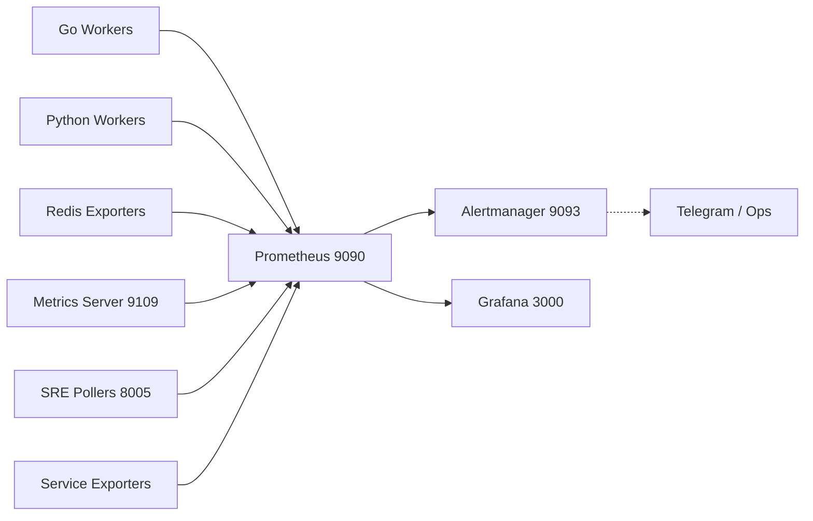

# Карта Prometheus & Grafana: Показатели, Дашборды и Пути данных

Данный документ представляет детальную карту текущей архитектуры мониторинга проекта Trade Network, описывая источники данных, пайплайны метрик, правила алертинга Prometheus и визуализацию в Grafana.

---

## 1. Пути данных (Data Telemetry Pathways)

### Схема сбора:
1. **Сервисы** инструментированы с помощью библиотек `prometheus/client_golang` и `prometheus_client` для Python.
2. **Exporters** (Экспортеры) выставляют метрики на выделенных HTTP портах (обычно `/metrics` или `/probe`).
3. **Prometheus Core** (`trade-prometheus:9090` / `scanner-prometheus:19090`) собирает (scrape) метрики каждые 15с-30с.
4. **Prometheus Rules** регулярно ре-эвалюируют собранные данные, сверяясь с порогами. При нарушении формируют алерты.
5. **Alertmanager** роутит алерты в мессенджеры.
6. **Grafana** подключается к Prometheus для построения дашбордов.

---

## 2. Экспортеры (Scrape Targets)

Сервисы, отдающие метрики в Prometheus:

### Core Data & State
| Target / Service Name | Порт | Scrape | Описание |
|-----------------------|------|--------|----------|
| `go-workers` | `2112-2121` | 10s | Метрики Go воркеров для всех таймфреймов (1m, 5m ... 1month, 1y). |
| `python-worker` | `8000` | 15s | Основной пайплайн обработки сигналов. |
| `redis-workers` | `9121` | 15s | Экспортеры Redis-нод (worker-1, worker-2, worker-1b, 2b). |
| `metrics-exporter-redis` | `9109` | 15s | Универсальный сервер метрик, читающий стейт из Redis-ключей. |
| `decision_snapshot_writer` | `9825` | 15s | Запись снапшотов решений из Redis Stream в Timescale. |

### AI / ML & Edge Tradeoff
| Target / Service Name | Порт | Scrape | Описание |
|-----------------------|------|--------|----------|
| `regime-quantiles` | `8001` | 30s | Метрики джобов расчета квантилей рыночных режимов. |
| `edge_stack_train_p59`| `9813` | 15s | Тренировка моделей Edge Stack (читает `metrics:edge_stack_train:last`). |
| `edge_stack_shadow_p60`| `8012` | 30s | Теневая оценка (shadow eval) Edge Stack. |
| `decision_coverage_p66` | `9816` | 15s | Tradeoff KPI: полнота решений (Coverage) vs качество. |
| `signal_quality_regime_p66` | `9819` | 15s | Качество сигналов в разрезе рыночных режимов. |
| `policy_mode_p66` | `9818` | 15s | KPI применения политик. |
| `signal_quality_exporter_v3` | `9140` | 15s | Метрики эффективности политик. |

### Validation, Gate & Smoke
| Target / Service Name | Порт | Scrape | Описание |
|-----------------------|------|--------|----------|
| `of-confirm-service` | `8003` | 15s | Сервис подтверждения потока ордеров (OF Confirm). |
| `execution-gate-service`| `8004` | 15s | Гейтконтроль исполнения трейдов (Execution Gate). |
| `ml-confirm-sre-poller` | `8005` | 15s | ML Confirm SRE мониторинг. |
| `of_gate_contract_smoke`| `9148` | 30s | OF gate contract smoke-check (доля ошибок контрактов, schema share). |
| `enforce_bucket_state_p77`| `9142` | 15s | Enforce bucket state, age promo/residuals. |
| `feature_registry_contract_p94`| `9822` | 15s | Экспортер контрактов Feature Registry (`metrics:feature_registry_contract:last`). |
| `of_gate_dlq_exporter_p82` | `9154` | 15s | Экспортер Dead-Letter Queue (DLQ) для OF Gate. |
| `of_inputs_dlq_db_p99` | `9157` | 30s | OFInputs DLQ DB rollup exporter. |
| `blackbox_http` / `public` | `9115` | - | Экспортеры Blackbox для проверки доступности (HTTP 2xx). |

---

## 3. Дашборды (Grafana)

Дашборды находятся в директории `monitoring/grafana/dashboards/`:

1. **Мониторинг инфраструктуры / безопасности:**
   - `monitoring_smoke.json` — Общий smoke_check состояния системы.
   - `web_uptime.json` — Аптайм HTTP сервисов через Blackbox-exporter.
   - `edge_stack_overview.json` — Обзор работы Edge пайплайна (тренировка, скоринг).
   - `chatops_security.json` — Безопасность и ChatOps (логины, доступы, команды).

2. **Orderflow DLQ и Gateways:**
   - `of_gate_dlq_p82.json` — Ошибки контрактов OF, не проходящие парсинг или валидацию в gate.
   - `of_inputs_dlq_p96.json` — Детальный дашборд DLQ Orderflow inputs.

3. **Trade Execution (Исполнение / Управление рисками):**
   - `trade_execution_p5.json` — Баг/Gate трекинги P5.
   - `trade_execution_p7_panels.json` & `trade_execution_p8_annotations.json` — Панели ручного/авто ремонта и аннотации трекшена.
   - `trade_execution_p9_canary.json` — Канареечный мониторинг фичей.
   - `trade_execution_p33_autonomy.json` — Автономность исполнения (auto-ack, uptime без ручного).
   - `trade_execution_p45_risk_quality.json` — Качество риск-метрик.
   - `trade_execution_p47_risk_drift.json` — Дрейф рисков (Risk Drift).
   - `trade_execution_p48_unified.json` — Единый дашборд (Unified Execution).
   - `trade_execution_p49_risk_drift_drilldown.json` — Дрилл-даун (глубокий анализ) дрифта риск-метрик.
   - `policy_effectiveness_p71.json` — Эффективность торговых политик и ML шлюзов контроля рисков.
   - `tradeoff_p66.json` — Анализ компромиссов: Покрытие (Coverage) против Качества сигналов (Quality).

---

## 4. Метрики (Prometheus Key Metrics Example)

В коде повсеместно используются как Gauges (измерители стейта), так и Counters (счетчики событий) Prometheus.

### Примеры ключевых метрик (Gauges / Counters):
- **DLQ & Stream Quality**: 
  - `of_gate_dlq_len` (G)
  - `of_inputs_dlq_age_sec` (G)
  - `of_inputs_dlq_replay_last_run_age_sec` (G)
  - `of_gate_dlq_exporter_errors_total` (C)
- **Trade Execution / Signal Costs:** 
  - `trade_adverse_rd_mean_bps` (G) - Слиппадж / Adverse Rate.
  - `trade_adverse_rd_bad_share` (G) / `trade_adverse_rd_veto` (G)
  - `inline_exec_rollup_updates_total` (C)
  - `inline_exec_edge_tighten_total` (C), `inline_exec_edge_veto_total` (C)
- **Monitoring & Reliability:**
  - `conf_cal_live_exporter_read_errors_total` (C) / `conf_cal_live_rollback_events_total` (C)

---

## 5. Правила Алертинга (Prometheus Rules)

Прометеус содержит десятки правил алертинга. Файлы правил импортируются из `websocket_alerts.yml`, `regime_alerts.yml`, `prometheus/` и `/etc/prometheus/rules/orderflow_services/`.

Критические категории алертов:
* **DQ (Data Quality) и Потоки:** `alerts_meta_dq.yml`, `tick_quality_alerts.yml`, `tick_ingest_latency_alerts.yml`, `bybit_dq/*.yml`.
* **Gate / Policy Enforcement:** `prometheus_alerts_of_gate_ok_rate_v1.yml`, `prometheus_alerts_enforce_bucket_state_exporter_p90.yml`.
* **Execution & Slippage:** `prometheus_alerts_slippage_calibrator_health_v1.yml`, `prometheus_rules_execution_p34.yml`.
* **ML / Edge Model Tracking:** `prometheus_alerts_edge_stack_train_p59.yml`, `prometheus_alerts_edge_stack_shadow_p60.yml`.
* **Contract/Feature Drift:** `prometheus_alerts_feature_registry_p94.yml`, `prometheus_alerts_contract_v4.yml`.
* **Archiver & Writers:** `prometheus_alerts_decision_snapshot_writer_v1.yml`, `prometheus_alerts_of_inputs_dlq_db_p99.yml`.

---
**Готово к прод-анализу:** Данный маппинг подтверждает наличие мощной структуры MLOps & Ops мониторинга, включающей DLQ трекинг, shadow-эвалюацию моделей (P60), трекинг качества сигналов (P66/P71) и глубокий контроль исполнения сделок (P45-P49).
