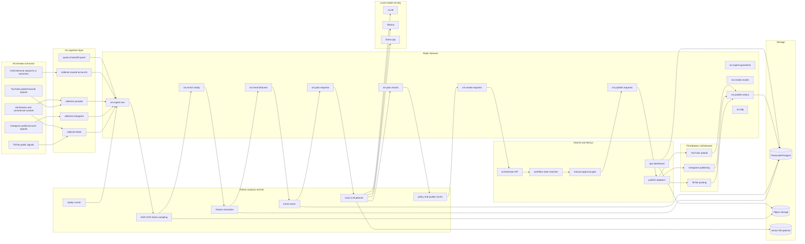
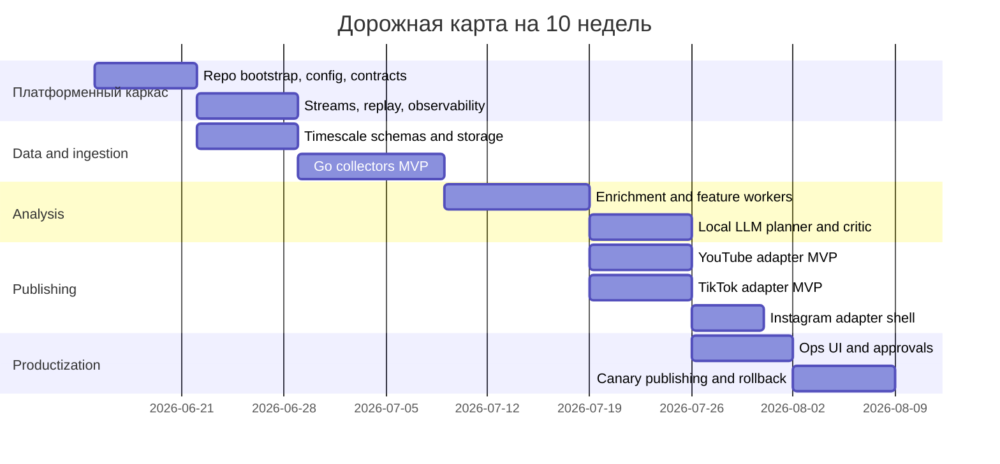

# План переноса scanner_infra в production-grade AI-систему продвижения для TikTok, Instagram и YouTube

## Executive summary

Короткий вывод такой: **переносить нужно не “как есть” конкретный scanner_infra-бизнес-код, а его платформенный каркас** — шаблоны ingestion, event bus, typed contracts, replay, observability, CI/CD, SRE-паттерны, схемы хранения и подход к безопасному rollout. Для вашего нового проекта это даст самый быстрый путь к работающей системе, где локальные 7–14B-модели анализируют тренды, помогают планировать контент и управляют decision loop, а публикация и монетизация остаются под строгими policy-gates, reason-codes и replayability. Эта стратегия особенно уместна, потому что публично верифицировать ваш **точный** репозиторий `scanner_infra` мне не удалось: публичный GitHub-поиск по `scanner_infra` показывает другие репозитории и не подтверждает ваш owner/repo; значит, ниже я даю **архитектурный и migration-level план**, опираясь на ваш ранее описанный trade-стек и верифицированные внешние ограничения платформ. citeturn2view0

Есть еще один важный системный вывод. Для social/trend-stack лучше всего подходит тот же event-driven каркас, что и в trade, потому что обе задачи — это **потоки событий с коротким окном принятия решений**, где критичны детерминизм времени, идемпотентность, backpressure, replay и observability. Redis Streams официально дает append-only event log c consumer groups, разными режимами чтения, trimming и pending entries list; Timescale/Tiger Data дает time-partitioned hypertables, continuous aggregates, retention jobs и иерархические агрегации; а vLLM/llama.cpp/Ollama покрывают три режима локального inference: production online serving, quantized edge/CPU serving и быстрый developer UX. citeturn30view0turn30view1turn31view0turn32view2turn32view0turn46view0turn46view1turn45view0turn28view2turn28view3

Фактические ограничения платформ сразу подсказывают правильный roadmap. TikTok Content Posting API позволяет direct post и upload draft, работает для desktop/cloud/web apps, но direct post требует `video.publish`, предварительный query creator info и для выхода из private-only режима нужен audit; статус публикации лучше вести через polling + webhook-события. TikTok Research Tools ограничены qualifying researchers и публично-полезными некоммерческими сценариями, а Commercial Content API сейчас полезен как вторичный источник ad intelligence, но с сильными ограничениями по coverage. YouTube, наоборот, дает очень понятный upload pipeline, собственный thumbnail endpoint и metadata-flow, но его search budget нужно проектировать аккуратно: в текущих документах у `search.list` отдельный дефолтный бюджет 100 запросов в день, `videos.insert` — 1 unit в своей bucket, а `thumbnails.set` стоит примерно 50 единиц. Это означает: **первую production-версию стоит запускать как YouTube + TikTok first, Instagram second**, причем Instagram adapter — только после повторной верификации Meta docs и фактических publishing constraints. citeturn13view0turn15view2turn15view3turn15view5turn41view3turn42view0turn44view2turn10view0turn43view0

Факты, на которых держится архитектурное решение, довольно сильные. Исследования по TikTok и Instagram показывают, что тренд-анализ нельзя строить только на captions и обычной metadata: сильный прирост дает именно **multimodal enrichment** — transcript, OCR, image description, frame-level cues, intent modeling. В GET-Tok датасет TikTok специально дообогащался транскриптами, OCR и image descriptions; для Instagram multimodal modeling улучшал определение intent по сравнению с image-only baseline; а для YouTube академические работы отдельно подчеркивают, что официальный API не дает полного и нейтрального обзора creator ecosystem. Практический вывод: ваша система должна хранить **raw event + enriched modalities + model decisions + publish outcomes**, а не только “текст + просмотры”. citeturn0academia2turn19academia5turn0academia1

## Что верифицировано и где есть ограничения

### Что подтверждено

В этой сессии мне **не удалось верифицировать точный owner/repo** для `scanner_infra`. Публичный GitHub search по `scanner_infra` вернул набор других репозиториев, а не ваш точный проект; это сильный сигнал, что нужный repo либо приватный, либо называется не буквально так, либо находится не в публичной индексации. Поэтому делать вид, будто я прочитал конкретные файлы, было бы неверно. Ниже я честно строю план как **repo-port blueprint**, а не как file-by-file code review. citeturn2view0

Есть и второе ограничение: в этой сессии Meta developer docs открывались нестабильно, включая ошибки fetch/429. Поэтому именно по Instagram API я отмечаю несколько параметров как **partially unspecified / inferred**, и не советую принимать production-решения по Instagram publishing flow без финальной ручной верификации в Meta docs перед кодированием adapter-а. citeturn18view0turn18view1turn20view1

### Кандидаты из публичного GitHub-поиска

| Статус | Что найдено публично | Вывод |
|---|---|---|
| Не совпадает | несколько других `scanner*infra*` репозиториев в публичной выдаче | это не подтверждает ваш repo |
| Exact owner/repo | **unspecified** | нужно было бы либо точное имя, либо приватный доступ |
| Доступ из текущей сессии | GitHub connector отсутствует | приватный org/repo я отсюда не открываю |
| Итог | file-level inventory недоступен | продолжаем на уровне architecture mapping |

### Что из этого следует для плана

Следовательно, правильная методика — не пытаться “портировать неизвестные файлы вслепую”, а **сравнить типовые слои scanner_infra-каркаса** с вашим целевым social-stack и перенести именно те слои, которые инвариантны к домену:

- event envelope и schema versioning  
- Redis Streams helpers и consumer-group semantics  
- config/env/secret bootstrap  
- migrations и DB lifecycle  
- observability, dashboards, alerts, SLO  
- replay / golden tests / quarantine / reason-codes  
- CI/CD, deploy templates, rollback scripts  

Это почти наверняка даст 70–80% нужного “скелета”, даже если торговая бизнес-логика не переносится 1:1.

## Целевая архитектура для нового social-проекта

Ваш новый проект должен сохранить trade-ядро: **Go → Redis Streams → Python → NestJS → Next.js → Timescale**, но заменить торговые источники и сигналы на social-specific ingestion, enrichment, planning, rendering и publish adapters. Внешние ограничения платформ и исследования по multimodal trend analysis как раз поддерживают такую архитектуру: raw social events должны идти в event bus; поверх них должны работать enrichment workers; локальные LLM нужны не как “магический центр всего”, а как контролируемый аналитический слой с typed output и reason-codes. citeturn30view0turn30view1turn31view0turn32view2turn46view0turn46view2turn46view3turn0academia2turn19academia5turn0academia1



### Контракты и stream design

Здесь я бы перенес из scanner_infra следующий принцип как обязательный: **единый event envelope** вместо “голых JSON-ов”. Минимальный envelope для social-stack:

```json
{
  "event_id": "uuidv7",
  "event_type": "trend.raw_collected",
  "schema_version": 1,
  "platform": "tiktok",
  "source_entity_id": "video_or_post_or_channel_id",
  "trace_id": "uuid",
  "correlation_id": "uuid",
  "produced_at_ms": 1760000000000,
  "source_created_at_ms": 1759999999000,
  "ingest_lag_ms": 1000,
  "dedupe_key": "platform:entity:window",
  "replay_key": "platform:window:cursor",
  "reason_code": "collector_poll_success",
  "payload": {}
}
```

Ключевая идея: **event_id не заменяет dedupe_key**. Для ingest — dedupe по платформенному entity/window; для render — dedupe по asset hash; для publish — dedupe по `(platform, account, asset_version_id, schedule_slot)`.

Рекомендуемые stream names:

| Stream | Что хранит | Consumer group |
|---|---|---|
| `sm.ingest.raw` | сырые сигналы платформ | `cg-enrich` |
| `sm.ingest.quarantine` | битые/сомнительные входы | `cg-dq` |
| `sm.enrich.ready` | transcript/OCR/frame-metadata ready | `cg-features` |
| `sm.trend.features` | нормализованные social-features | `cg-rank` |
| `sm.plan.requests` | задачи планирования контента | `cg-llm-plan` |
| `sm.plan.results` | structured ideas/scripts/hooks | `cg-policy` |
| `sm.render.requests` | задания генерации/монтажа | `cg-render` |
| `sm.render.results` | готовые assets и checksums | `cg-approval` |
| `sm.publish.requests` | запросы на upload/post | `cg-publish` |
| `sm.publish.status` | статусы платформ | `cg-analytics` |
| `sm.dlq` | безусловные ошибки обработки | `cg-replay` |

Redis Streams здесь правильный выбор, потому что они поддерживают append-only semantics, consumer groups, trimming и работу с pending entries, что как раз нужно для replay, retry и failover. citeturn30view0turn30view1

### Локальные LLM и serving strategy

Для production я бы **развел три режима**.

**vLLM** — основной production-serving для shared GPU-нод. Официальная документация прямо подчеркивает OpenAI-compatible server, structured outputs, tool calling, observability, Prometheus/Grafana и работу с большим числом архитектур. Для planner/scorer в backend это лучший default. citeturn46view0turn46view1turn46view2turn46view3

**llama.cpp** — дешевый и очень полезный режим для quantized GGUF-моделей на CPU/edge/малых GPU. Документация и README показывают plain C/C++ implementation без зависимостей, широкий набор квантований, GGUF и локальный OpenAI-compatible HTTP server. Это отлично подходит для офлайн replay, CI-golden runs и low-cost worker-нод. citeturn28view2turn28view3

**Ollama** — лучший DX для локальной разработки и быстрого prototyping. Официальные docs подчеркивают structured outputs, tool calling, vision и официальные Python/JS библиотеки. Но как основной production control plane я бы ставил его только если вам важнее developer speed, чем тонкая эксплуатационная управляемость. citeturn45view0

Практическое решение для вас:

- `planner-llm` и `critic-llm` — через vLLM  
- `local-dev` и `golden-tests` — через Ollama/llama.cpp  
- `vision-light` для thumbnail/frame reasoning — через отдельный компактный VLM, но только после MVP  
- **не использовать LLM как source of truth для трендов**; source of truth — raw signals + engineered features + outcome data

## Карта переноса каркаса из scanner_infra

### Таблица переноса

Ниже — **inferred inventory mapping**. Это не file-by-file inventory из repo, а карта того, что почти наверняка имеет смысл переносить из `scanner_infra` как из зрелого infra-каркаса в ваш social-system.

| Компонент scanner_infra | Целевой компонент social-system | Стратегия | Effort | Основные риски |
|---|---|---|---|---|
| Go-collector skeleton | платформенные collectors TikTok/IG/YT/owned accounts | adapt | M | platform quotas, auth flow, нестабильные HTML/public sources |
| Redis Streams helpers | общий event bus и consumer groups | 1:1 | S | неверная ack/retry семантика, рост PEL |
| Event envelope/DTO contracts | social event schemas | adapt | M | schema drift, слабая versioning discipline |
| Quarantine/bad-data pipeline | social data quality quarantine | 1:1 | S | silent corruption при OCR/ASR failures |
| Replay tooling | replay ingestion, re-score, re-publish dry-run | 1:1 | M | nondeterminism из-за LLM/clock/env |
| Reason-code framework | explainability для scoring/planning/publishing | 1:1 | S | “black-box” решения без трассировки |
| Python worker framework | enrichment, ranking, planning, policy scoring | adapt | M | model latency, GPU contention |
| Observability package | metrics/logging/tracing for all services | 1:1 | S | high-cardinality labels |
| SRE dashboards/alerts | freshness/DQ/publish SLO dashboards | adapt | M | шумные алерты без actionability |
| CI templates | multi-stage CI for Go/Python/Node + policy checks | adapt | M | сложность workflow и flaky jobs |
| Docker/K8s manifests | deploy skeleton for collectors/workers/api/ui | adapt | M | resource sizing for ASR/LLM/render |
| Secret/bootstrap config | env layering, secret injection, runtime config | 1:1 | S | leakage of API tokens, config drift |
| Timescale migrations | social hypertables, CAGGs, retention jobs | adapt | M | wrong chunk interval, expensive queries |
| Next.js ops shell | moderation/publish console | adapt | M | UI couples too tightly to workflow internals |
| NestJS orchestration skeleton | state machine, API, webhook intake, WS | 1:1 | S | state explosion around publish lifecycle |
| Test harness/golden suite | deterministic content-plan snapshots | adapt | M | LLM outputs drift without pinned prompts/models |
| Asset pipeline stubs | render/transcode/thumbnail packaging | rewrite | L | ffmpeg complexity, storage cost |
| Platform publish adapters | TikTok/IG/YT upload modules | rewrite | L | auth, policy audits, rate limits |
| Object storage integration | video assets, thumbnails, transcripts, OCR | add | M | lifecycle cost, orphaned assets |
| Vector search layer | creative memory / reference retrieval | add | M | premature complexity if added too early |

### Что переносить первым

Самая частая ошибка в таких переходах — начинать с platform-specific adapter-ов. Это почти всегда приводит к brittle системе. Первая волна переноса должна быть такой:

1. **config/bootstrap layer**  
2. **contracts + codegen**  
3. **streaming helpers**  
4. **logging/metrics/tracing**  
5. **db migrations + retention + cagg patterns**  
6. **replay framework**  
7. **CI/CD skeleton**  
8. **service templates**  
9. только после этого — platform adapters и assets pipeline

Это особенно важно, потому что вам нужна не просто “система, которая постит”, а система, которая **объясняет, что, почему и на каких сырых сигналах она решила публиковать**.

### Подробный план extraction и refactor

#### Config, ENV и secrets

Из scanner_infra нужно вытащить единый модуль конфигурации и переделать его под social-domain.

Что должно появиться:

- строгая типизация ENV  
- fail-fast startup  
- конфиг по слоям: `base -> env -> secret -> runtime override`  
- явное разделение:
  - `infra config`
  - `platform auth config`
  - `llm config`
  - `content policy config`
  - `publish gating config`

Минимальный набор ENV-групп:

- `REDIS_URL`, `REDIS_STREAM_MAXLEN_*`
- `PG_DSN`, `TIMESCALE_CHUNK_INTERVAL_*`
- `S3_ENDPOINT`, `S3_BUCKET_RAW`, `S3_BUCKET_ASSETS`
- `QDRANT_URL` или `VECTOR_DB_DISABLED=true`
- `VLLM_BASE_URL`, `OLLAMA_BASE_URL`, `LLAMA_CPP_BASE_URL`
- `TIKTOK_CLIENT_KEY`, `TIKTOK_CLIENT_SECRET`
- `YOUTUBE_CLIENT_ID`, `YOUTUBE_CLIENT_SECRET`
- `INSTAGRAM_*` — **partially unspecified until Meta re-check**
- `AUTO_PUBLISH_ENABLED=false`
- `AUTO_PUBLISH_ALLOWED_PLATFORMS=tiktok_draft,youtube_private`
- `DISCLOSURE_DEFAULT_MODE=affiliate_or_paid_partnership`

Для GitHub Actions лучше опираться на environments, reusable workflows, secrets, `GITHUB_TOKEN`, OIDC и push protection / secret scanning, а не на ручную передачу долгоживущих ключей. GitHub Docs прямо подчеркивают reusable workflows, secrets, `GITHUB_TOKEN`, OIDC и отдельные секрет-security возможности. Дополнительно есть свежая академическая работа, показывающая, что слишком сложные GitHub Actions workflow связаны с более высокой failure rate и стоимостью поддержки; значит, workflow нужно делать **короткими и модульными**, а не “монолитным супер-пайплайном”. citeturn37view0turn38view0turn39view0turn39view1turn39view2turn35academia2

#### DTO, contracts и code generation

Переносите contract discipline буквально.

Схемы должны существовать как source-of-truth, например:

- `schema/social/trend_raw.v1.json`
- `schema/social/trend_featured.v1.json`
- `schema/social/content_plan.v1.json`
- `schema/social/render_job.v1.json`
- `schema/social/publish_request.v1.json`
- `schema/social/publish_status.v1.json`

Дальше — генерация:

- Go structs
- Python pydantic models
- TypeScript DTO
- SQL migration comments / JSONB contracts
- golden fixtures

Что меняется относительно trade:

- вместо market/instrument/symbol появляются `platform/account/topic/entity`
- вместо candle period — `collection_window`
- вместо signal confidence — `trend_score`, `hook_score`, `brand_fit_score`, `policy_risk_score`
- вместо order lifecycle — `publish lifecycle`

#### Go ingestion layer

Вместо market data collectors здесь будут:

- `collector-tiktok`
- `collector-youtube`
- `collector-instagram`
- `collector-owned-accounts`
- `collector-ad-intel`

Лучший практический паттерн: **каждый collector пишет только raw normalized envelope** и никогда сам не “решает”, что тренд. Trend labeling — downstream responsibility.

Для каждого collector-а:

- cursor persistence
- quota/backoff module
- duplicate suppression
- stale detector
- partial failure metrics
- quarantine routing

Для TikTok и YouTube особенно важен quota-aware polling. TikTok display/server endpoints имеют minute-based throttling; YouTube API budget имеет выраженные per-method ограничения, включая `search.list` и thumbnail operations. Это значит, что ingestion должен работать **как budget allocator**, а не как naïve cron scraper. citeturn16view0turn16view2turn10view0turn43view0

#### Python workers

Я бы разделил Python-слой на пять независимых worker-ов:

- `worker-enrich`
- `worker-feature`
- `worker-trend-rank`
- `worker-content-plan`
- `worker-policy-critic`

`worker-enrich` берет raw content и делает transcript/OCR/frame descriptors. Это оправдано не “модой на AI”, а исследованиями: TikTok и Instagram требуют multimodal modeling для качества анализа. citeturn0academia2turn19academia5

`worker-content-plan` работает только через **structured output schema** и выдает:

- hook variants
- shot list
- CTA variants
- title/caption candidates
- platform adaptations
- disclosure template needed / not needed
- reject reasons

`worker-policy-critic` никогда не должен быть “мягким советником”. Это production gate с финальным verdict:

- `allow`
- `allow_with_manual_review`
- `reject`

и обязательными `reason_codes[]`.

#### NestJS orchestration

Из trade-каркаса сюда отлично переносится роль orchestration/API слоя.

Новый NestJS backend должен стать:

- workflow state machine
- webhook intake
- manual approval API
- publish adapter facade
- scheduling API
- WS layer для ops UI

Ключевые state types:

- `DISCOVERED`
- `ENRICHED`
- `FEATURED`
- `PLANNED`
- `RENDERED`
- `READY_FOR_REVIEW`
- `APPROVED`
- `PUBLISHING`
- `PUBLISHED`
- `FAILED`
- `QUARANTINED`

Самая частая архитектурная ошибка здесь — смешать state machine и platform SDK logic. Делать надо наоборот:

- NestJS управляет состоянием и policy  
- adapter service делает platform-specific I/O  
- результат adapter-а приходит обратно как отдельный event

#### Timescale и storage layer

Timescale здесь нужен не “вообще как база”, а как **операционный time-series backbone**.

Рекомендуемые таблицы:

- `trend_events_raw`
- `trend_features`
- `content_plan_versions`
- `asset_versions`
- `publish_attempts`
- `publish_status_events`
- `platform_quota_usage`
- `outcome_metrics`
- `dq_incidents`
- `compliance_audit_log`

Почему это правильно:

- hypertables автоматически режут time-series по chunk-ам и ускоряют запросы через chunk skipping  
- continuous aggregates инкрементально и фоново поддерживают отчетные сводки  
- retention policies автоматически дропают старые chunks дешевле, чем удалять миллионы строк вручную citeturn31view0turn32view2turn32view0

Практический lifecycle я рекомендую такой:

- raw events: 30–90 дней hot  
- enriched/transcripts/frame features: 30–60 дней hot/warm, затем архив в object storage  
- publish/outcome aggregates: 1–2 года  
- asset binaries: object storage lifecycle по версионности  
- audit logs: длиннее всего, отдельно

Object storage обязателен. В БД не должны жить:

- оригинальные видео
- thumbnails
- frame dumps
- render outputs
- ASR JSON
- OCR artifacts

Vector DB добавляйте только для **creative memory / retrieval of references**, а не как источник бизнес-правды. У Qdrant есть документация по API, async API, snapshots, migration и time-based sharding, но на MVP это может подождать до недели 4–6. citeturn28view4

## Платформенные особенности, безопасность и комплаенс

### TikTok

С TikTok нужно строить workflow вокруг официального Content Posting API, а не reverse-engineered posting. Официально доступны Direct Post API и Upload API; direct post требует `video.publish`, предварительный `creator_info.query`, а до завершения аудита контент клиента может быть ограничен private visibility. Для статусов публикации доступны явные publish statuses и webhook events. Это идеально ложится в event-driven state machine. citeturn13view0turn15view2turn15view3turn15view5

Очень важное ограничение: TikTok Research Tools ориентированы на qualifying researchers, public-interest mission и некоммерческие сценарии. Для коммерческой trend intelligence на них нельзя опираться как на основу бизнеса. А вот Commercial Content API полезен как **вторичный legal source** по ads/commercial content, но coverage сейчас ограничен и стартует с EU data. Значит, в вашем design baseline для трендов должен быть таким:

- first-party owned-account analytics  
- общедоступные public signals  
- коммерческий ad-intel как дополнительный input  
- outcome loop от ваших собственных постов  
- manual curation layer на раннем этапе citeturn41view3turn42view0

### Instagram

По Instagram в этой сессии у меня нет такого же уровня верификации, как по TikTok и YouTube, потому что Meta developer docs возвращали ошибки/429. Поэтому production-safe решение здесь такое:

- держать Instagram adapter **за interface boundary**  
- не hardcode-ить exact quotas и publish semantics до ручной re-check  
- в MVP делать режим `draft/manual` и ограниченный rollout  
- не включать Instagram в auto-publish до прохождения end-to-end policy verification citeturn18view0turn18view1turn20view1

При этом стратегически Instagram нужен, и именно здесь особенно важен multimodal подход: image+caption intent analysis дает измеримый прирост относительно image-only baseline. Поэтому архитектурно Instagram не отдельный поток, а еще один источник в общей multimodal системе. citeturn19academia5

### YouTube

YouTube требует другой mindset. Это не просто “еще одна короткая вертикальная платформа”, а собственная система upload, metadata, thumbnails и outcome analytics. Официальные docs подтверждают:

- upload flow с title/description/keywords/category/privacy status  
- отдельный thumbnail upload endpoint  
- `thumbnails.set` принимает JPEG/PNG до 2MB  
- upload example explicitly recommends exponential backoff  
- `videos.insert` и `search.list` имеют отдельные quota semantics, и на текущий момент search budget по умолчанию довольно мал citeturn44view2turn43view0turn10view0

Практический вывод:

- для YouTube нужен **отдельный metadata optimizer**
- thumbnail generation — first-class pipeline
- upload retries и resumability обязательны
- на MVP начинайте с `private` или `unlisted` публикации для golden channels
- search API нельзя тратить как бесконечный discovery-source; нужен seed-based подход

### Disclosure, affiliate и law-aware monetization

Поскольку вы планируете продвигать товары, disclosure — не косметика, а обязательный инженерный слой. FTC прямо пишет, что material connection между брендом и инфлюенсером должна раскрываться clearly and conspicuously; встроенного platform tool может быть недостаточно; за достаточность disclosure ответственность несут бренд и автор, а не платформа. FTC также прямо приводит практики вроде `Ad`/`#ad`, disclosure affiliate-комиссий и disclosure даже при бесплатных образцах/подарках. citeturn54view0turn54view1turn54view2turn53view0

Значит, в системе нужен отдельный compliance layer:

- `disclosure_required: bool`
- `disclosure_type: paid | affiliate | gifted | employer`
- `disclosure_text_platform_variant`
- `disclosure_position_rule`
- `evidence_of_disclosure_attached`

Если этого нет в системе, вы почти гарантированно получите “успешную автоматизацию”, которая юридически и репутационно уязвима.

### Минимальная стратегия auto-publish gating

Auto-publish включать только поэтапно:

| Stage | Что разрешено |
|---|---|
| Stage A | только draft/render, без публикации |
| Stage B | TikTok draft + YouTube private/unlisted |
| Stage C | ручное approve перед любым public post |
| Stage D | авто-публикация только на low-risk channel и low-risk SKU |
| Stage E | расширение после 30–60 дней успешных SLO |

Публикация разрешается только если одновременно выполнены условия:

- `policy_risk_score <= threshold`
- `brand_fit_score >= threshold`
- `asset_integrity_check == pass`
- `rights_source == verified`
- `disclosure_ready == true`
- `quota_budget_available == true`
- `golden_preview_diff <= tolerance`
- `manual_override != blocked`

## Дорожная карта, контроль качества и SRE



### Этапы с deliverables и rollback

| Фаза | Недели | Deliverables | Acceptance criteria | Rollback |
|---|---|---|---|---|
| Foundation | 1–2 | repo skeleton, typed config, schemas, streams, tracing, CI | все сервисы стартуют локально и в staging; contract tests green | revert templates only, no external side effects |
| Data backbone | 2–3 | Timescale hypertables, retention, object storage, raw collectors | raw ingest freshness в пределах SLO, DQ quarantine работает | stop collectors, keep DB schema |
| Enrichment | 3–5 | ASR/OCR/frame extraction, feature workers | >95% events получают structured enrichment либо quarantine reason | disable enrich group, raw ingest stays alive |
| Planning | 5–6 | local LLM planner/critic, golden tests | deterministic pass rate на golden set, JSON-only outputs | switch planner to mock/static templates |
| Publish MVP | 6–8 | YouTube + TikTok adapters, publish status tracking | upload в private/draft, idempotent retries, publish audit trail complete | disable `sm.publish.requests` consumers |
| Human-in-loop ops | 8–9 | approval UI, policy views, disclosure checks | reviewer может approve/reject/replay любой item | freeze public publishing, keep drafts |
| Canary autopublish | 9–10 | gated auto-publish for one channel/SKU cohort | error budget, policy errors, quota errors within limits | one flag flips system back to manual-only |

### Роли и staffing

Минимально жизнеспособная команда на этот план:

| Роль | Нагрузка | Основная зона |
|---|---|---|
| Platform/Backend engineer | full-time | Go collectors, Redis, NestJS orchestration, contracts |
| Python/ML engineer | full-time | enrichment, scoring, local LLM pipelines, golden tests |
| Fullstack engineer | 0.5–1.0 | Next.js ops UI, review flows, dashboards |
| DevOps/SRE | 0.5 | CI/CD, deploy, observability, secrets, rollback |
| Content ops / reviewer | 0.25–0.5 | approval loop, disclosure QA, brand safety |

Если делать одному сильному mid-level разработчику, реалистичнее **растянуть на 12+ недель** и урезать первую версию до:

- YouTube first  
- TikTok second  
- Instagram shell only  
- auto-publish off  

### Тестовая матрица

Тестировать нужно не только код, но и decision system.

| Слой | Тест |
|---|---|
| Contracts | backward compatibility и schema version tests |
| Streams | ack/retry/idempotency/reclaim/PEL recovery |
| Time | epoch ms, TZ handling, monotonicity, stale/gap/duplicate detectors |
| Enrichment | corrupted media, empty transcript, OCR noise, partial frames |
| LLM | structured output validation, determinism window, golden prompts |
| Publish | dry-run, duplicate publish prevention, quota exceeded, auth expired |
| Compliance | missing disclosure, gifted/affiliate/paid variants, blocked words |
| Replay | exact state rebuild from raw events |
| Rollback | disable publish consumers and revert to manual gating in one change |

### SLO и метрики

В production я бы мониторил не “красивые ML-метрики”, а только action-signals.

| Область | Метрика | Цель |
|---|---|---|
| Freshness | ingest freshness p95 | < 5 мин для fast sources |
| Reliability | event processing success rate | > 99.5% |
| Queue health | pending/lag by stream group | без устойчивого роста |
| Data quality | duplicate rate / malformed rate | < 1%, с алертом по скачкам |
| LLM | structured output valid rate | > 99% |
| Publish | publish success rate | > 98% для approved items |
| Safety | policy false-negative incidents | 0 tolerance |
| Cost | GPU min/token or plan cost/item | стабильный budget ceiling |
| Replay | reproducible replay pass rate | > 95% on golden set |
| User ops | review queue waiting time | < 30 мин в business hours |

Page должны срабатывать только по actionable conditions:

- ingest stopped  
- PEL runaway  
- publish failure spike  
- quota exhausted earlier than budget model expected  
- compliance blocker on publish path  
- object storage failure  
- DB retention job failed repeatedly

### Приоритетный checklist перед стартом разработки

Самый правильный порядок действий такой:

- создать новый social repo с выделенными пакетами `contracts`, `streaming`, `config`, `obs`, `replay`
- перенести из scanner_infra все infra-first паттерны, не трогая доменную логику трейдинга
- зафиксировать event envelope и schema versioning до первой строчки platform-adapter кода
- поднять staging со Streams + Timescale + object storage + one LLM server
- сделать один collector и один replay workflow end-to-end
- сделать golden dataset из 50–100 trend cases руками
- внедрить policy/disclosure critic **до** render/publish automation
- first public rollout проводить только после периода private/draft-only

## Open questions и ограничения

Три ограничения остаются открытыми.

Во-первых, **точный repo `scanner_infra` не был публично верифицирован**, поэтому компонентная карта выше — architecture-level, а не repo-level inventory. Это честное ограничение, а не пробел в логике. citeturn2view0

Во-вторых, **Instagram official developer docs в этой сессии были нестабильны**, поэтому exact publish flow, quotas и часть operational details по Instagram я пометил как partially unspecified/inferred и сознательно не превращал в “фальшивую точность”. citeturn18view0turn18view1turn20view1

В-третьих, ваши предыдущие deep-research файлы из этой беседы в текущей сессии были недоступны повторно, поэтому этот отчет синтезирован на основе уже известного trade-контекста, ваших архитектурных требований и верифицированных внешних источников. Это не мешает создать сильный план, но означает, что при появлении прямого доступа к `scanner_infra` следующий шаг должен быть очень конкретным: **сделать фактический repo inventory и заменить inferred mapping на file-level migration backlog**.