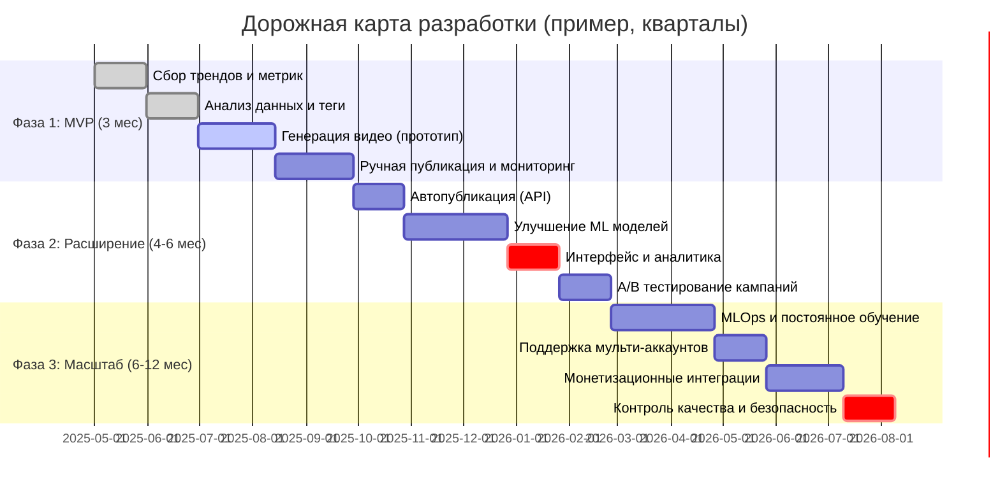

# Краткий вывод

Современные **AI-агенты** для TikTok/Instagram объединяют **анализ трендов**, **генерацию контента** и **маркетинг** в единую систему. Ключевые элементы: сбор данных (API и скрейпинг), алгоритмы прогнозирования трендов (NLP, временные ряды, сети), модули генерации видео/аудио (Stable Diffusion, Sora, Gen-2 и др.) и автоматизация публикаций. **MVP** включает базовый сбор трендов и ручную публикацию с генерированным контентом; последующие фазы – расширенная аналитика, полноавтоматизированные воронки, тесты и MLOps. 

**Рекомендации:** использовать модульную архитектуру (сервисы на Go/Python/NestJS, БД TimescaleDB, фронтенд на Next.js), сочетать официальные API (TikTok Business API, Instagram Graph API) и скрейпинг через надежные прокси【3†L171-L175】【20†L105-L113】. Метрики: CTR (~1–3% для TikTok in-feed)【23†L260-L268】, вовлечённость (%), конверсия и LTV. Монетизация: аффилиатные ссылки, TikTok Shop, прямые продажи, брендовые кампании. Этические риски: авторское право, фейки, «deepfake» требуют модерации и прозрачности【30†L119-L127】. А/B-тестирование и MLOps нужны для непрерывного улучшения. Успешные кейсы (Nike, Toyota, StormyAI) демонстрируют рост вовлечённости и продаж благодаря AI-аналитике【9†L109-L113】【30†L60-L64】.

# 1. Лучшие практики и кейсы AI в SMM

- **AI-агенты для маркетинга**. Вместо ручного поиска хэштегов и лидеров мнений, AI-агенты непрерывно мониторят соцсети и выявляют «выскочившие» (outlier) посты с аномально высокой вовлечённостью【6†L98-L107】. Так можно быстрее найти вирусные тренды и виральные форматы. Например, агенты могут ежедневно собирать данные из API конкурентов и присылать «утренние дайджесты» о новых трендах【6†L98-L107】.  
- **Прогнозирование трендов**. AI не только анализирует ретроспективно, но и предсказывает будущие тренды. По данным маркетологов, системы обработки >15 000 постов/мин и комбинированное использование NLP, CV, временных рядов и графов предсказали тренды с точностью ~90%【9†L55-L63】. Кейсы Nike (кампания «ретро-кроссовки» со Salesforce Einstein) показали 37% рост продаж за счёт раннего захвата тренда【9†L109-L113】.  
- **AI-контент**. Уже сегодня крупные игроки (OpenAI Sora, Google Imagen Video, Meta Make-A-Video, Runway Gen-2, Adobe Firefly) способны генерировать реалистичные видео и аудио по текстовым подсказкам. TikTok демонстрирует любовь к такому контенту: пользователи на 40% «воодушевлены» рекламой с генеративным AI, ожидая персонализации и инноваций【30†L109-L117】.  
- **Автоматизация контента**. AI может конвертировать длинные материалы (статьи, рассылки) в серию коротких постов/Reels/скриптов【6†L132-L140】. Например, агент читает свежую статью и автоматически составляет сценарии для TikTok/Instagram. Это сокращает временные издержки и масштабирует выход контента.  
- **Кейсы успеха**. Многочисленные бренды (Toyota, ретейл, косметика) отмечают рост показателей после автоматизации SMM: снижение CPA, рост охвата и продаж【27†L69-L77】【30†L60-L64】. TikTok официально отмечает, что пользователи положительно воспринимают AI-рекламу и считают бренды более «крутыми»【30†L109-L117】. 

# 2. Данные TikTok/Instagram и ограничения API

- **TikTok API**. TikTok For Business API содержит раздел **Discovery API** для трендов: позволяет находить топовые хэштеги, темы и треки из библиотеки【20†L105-L113】. Есть **Mentions API** для отслеживания упоминаний бренда, **Creator Marketplace** для поиска авторов. Тем не менее, доступ ограничен бизнес-аккаунтам и требует регистрации разработчика.  
- **Instagram Graph API**. Позволяет бизнес- и создательским аккаунтам искать посты по хэштегам (Hashtag Search API) и получать метрики по собственным постам. Лимиты: 200 запросов/час/пользователь【21†L0-L8】. Нет общего «Discovery» потока трендов. Часто используются сторонние сервисы (Mention, Hootsuite, Brandwatch) или скрейпинг.  
- **Сбор данных (скрейпинг)**. TikTok активно борется с ботами (IP-баны, CAPTCHA, проверка скролла)【3†L43-L52】. Решения: прокси-пулы (резидентские IP), эмуляция браузера (Selenium/Playwright), ограничение скорости【3†L43-L52】【3†L65-L74】. Instagram похожи ограничения. Сервисы-посредники: Apify, TelegrafBot, SociaVault и пр. Позволяют собрать комментарии, посты, тренды, но часто платные.  
- **Партнерские данные**. Некоторые официальные инсайты (агрегированные тренды TikTok/Instagram) доступны через Creative Center TikTok и аналогичные инструменты. В компаниях возможна покупка аналитических данных (например, через Nielsen, Sprinklr, Talkwalker, Hootsuite Trends)【9†L55-L63】【9†L154-L163】.  
- **Ограничения**. Важно соблюдать правила: TikTok запрещает агрессивный скрейпинг без API, Instagram – парсить частные аккаунты. Нужна аутентификация, поворот IP, учет временных меток и границ API. Надо учитывать задержки обновления данных (частота опроса), моноритмичность времени (epoch, TZ) и хранить сырые метки для диагностики.

# 3. Алгоритмы определения трендов

- **NLP и анализ текста**. Сбор заголовков/описаний и комментариев позволяет выделять часто повторяющиеся темы и хэштеги. Стандартные методы: TF-IDF, word2vec/transformers (например, BERT) для выделения тем, кластеризация текстов (k-means, DBSCAN)【9†L84-L93】. Частотные пики слов и хэштегов говорят о всплесках интереса. Например, в Канаде AI-сети предсказывали рост упоминаний «AI Art» за счёт резко возрастающих вложений в инфлюенсерский контент.  
- **Анализ временных рядов**. Отслеживаем **динамику просмотров, лайков, упоминаний** постов или хэштегов с течением времени. Алгоритмы: обнаружение аномалий (статистические: медиана/MAD, сенсор Шапиро и др.), метод сезонных колебаний, скользящие окна. Важно фильтровать шум (калибровать на сезонность дня недели, праздники и дропы из-за апдейтов платформ).  
- **Графовые/сетевая аналитика**. Строим графы пользователей или хэштегов. Важны алгоритмы: PageRank/centrality для обнаружения влиятельных создателей, community detection (Louvain) для группировки похожих тем. Например, «граф хэштегов» выявляет кластеры интересов (спорт–музыка–мода) и точки пересечения трендов.  
- **Комбинированные модели**. Иногда используют гибрид: обрабатывают тексты RNN/transformer, далее кластерят эмбеддинги или питают ML (RandomForest, LightGBM) с признаками: частота трендов, демография, скорость роста. Автокодировщики или LSTM могут прогнозировать дальнейший график трендов.  
- **Ручной оверсайт**. Всегда держать «человека в петле» – эксперты корректируют распознавание трендов. Например, резкий рост упоминаний может быть вызван негативным скандалом, а не «вирусным трендом».

# 4. Инструменты генерации видео/аудио/скриптов

- **Изображения**: Stable Diffusion (SD) SDXL – генерация кадров для видео (промежуточных или в качестве референса). Можно создавать фоны, персонажей, элементы сцены. Также Midjourney/VisionPro, DALL-E 3.  
- **Видео**:
  - **Text-to-Video**: OpenAI *Sora* – способна генерировать короткие видеоролики с реалистичной картинкой и звуком【15†L20-L28】. Runway *Gen-2* (2023) – мульти-модальная модель, создаёт видео по тексту, image+text, видео+видео【14†L32-L41】. Google *Imagen Video* и Meta *Make-A-Video* – раньше позволяли генерить короткие ролики (научные публикации 2022). Nvidia выпустила *GauGAN/VideoGPT* демо.  
  - **Video Editing AI**: Adobe Firefly – редактирование и генерация видеоклипов (сгенерировать B-roll, эффект и т.д.). Новые фичи от Adobe (Firefly Video Generative, Firefly Audio).  
  - **Аватары и говорящие головы**: Synthesia, D-ID, HeyGen – превращают текст в видео с цифровым аватаром, полезно для интервью и пр.  
- **Скрипты и тексты**: ChatGPT/GPT-4, Claude, Llama – генерация сценариев, сценарных диалогов, описаний к кадрам. Шаблоны: ввод темы (продукт, хэштег) – выход: сценарий 10–30 сек, call-to-action и теги.  
- **Текст-в-речь**: ElevenLabs – реалистичные голоса, поддержка многих языков, клонирование голоса; Google Cloud TTS, Amazon Polly, Azure TTS – тоже high-quality; open-source (Coqui TTS, Mozilla TTS). Позволяют генерировать озвучку, озвучивать скрипты, клипы.  
- **Музыка и эффекты**: AI-генераторы музыки (Amper, AIVA) или лицензированные треки. TikTok имеет собственную аудиотеку, но можно создавать нейтральную фон.  
- **Пайплайн контента**: Пример: **(1)** агент изучает трендовые темы (напр. “летний маникюр”); **(2)** GPT-4 пишет сценарий 15-сек видео с продуктом; **(3)** Stable Diffusion создаёт ключевые кадры (фон, реквизит); **(4)** Sora/Gen2 генерирует видео из описания; **(5)** TTS озвучивает текст (или голосовой дубляж); **(6)** агент накладывает субтитры и графику; **(7)** модуль публикации автоматически публикует и добавляет теги.  

# 5. Модульная архитектура системы

Ниже приведена примерная блок-схема модульной архитектуры AI-агента (flow-диаграмма):

```mermaid
flowchart LR
    DS[Data Sources: TikTok, Instagram, Trend Data] --> Ingest[Data Ingestion (Go/Redis)]
    Ingest --> Storage[Database (TimescaleDB/Postgres)]
    Storage --> Analysis[Trend Analysis (Python)]
    Analysis --> Planning[Content Planner / Idea Generation (Python/AI)]
    Planning --> Gen[AI Content Generation (Video/Audio/Scripts)]
    Gen --> Repo[Content Repository / Queue]
    Repo --> Pub[Publishing Module (NestJS)]
    Pub --> Social[TikTok/Instagram]
    Social --> Metrics[Metrics Collection (Analytics)]
    Metrics --> Storage
    Analysis --> Dashboard[Dashboard & Monitoring (Next.js)]
    Planning --> Dashboard
    Metrics --> Dashboard
    subgraph Frontend/UI
        Dashboard
    end
    subgraph Backend/Services
        Ingest
        Storage
        Analysis
        Planning
        Gen
        Repo
        Pub
        Metrics
    end
```

**Описание модулей:**  
- **Сбор данных (Ingest)**: сервис на Go (или Python) периодически обращается к TikTok API/Instagram Graph и/или запускает скрейпинг (через Redis-кэши запросов). Собранные сырые данные помещаются в TimescaleDB (Postgres) для временных рядов и метаданных.  
- **Анализ трендов (Analysis)**: Python-сервис с ML/AI-моделями обрабатывает данные, выделяет «горячие» темы, растущие хэштеги, новые форматы. Использует NLP, анализ временных рядов, графы пользователей. Результаты анализов записываются в БД и передаются в планировщик.  
- **Планировщик контента (Planning)**: логика генерации идей и сценариев. На основе входных сигналов (целевая аудитория, продукты, тренды) формирует задания генерации контента. Может хранить шаблоны/брифы. Взаимодействует с AI-моделями через API (ChatGPT, Stable Diffusion, Sora, TTS).  
- **Генерация контента (Gen)**: фабрика/пул AI-инференсов. Обращается к внешним или собственным ML-моделям: Stable Diffusion, DALL·E для кадров; Sora/Gen-2 для видео; TTS API для озвучки. Собирает результаты в видеофайлы и текстовые скрипты.  
- **Репозиторий контента (Repo)**: очередь/хранилище готового контента (кадры, видео, звуки). Компонент может быть файловым хранилищем (S3) и очередью задач публикации.  
- **Публикация (Pub)**: сервис (например, на NestJS), отвечающий за отправку публикаций в TikTok/Instagram. Может использовать официальный TikTok API (через OAuth TikTok Business) или Android/iOS эмуляцию. Планировщик постов, модерация перед публикацией, автозагрузка видео и метаданных (теги, описание).  
- **Метрики (Metrics)**: сбор статистики (число просмотров, лайков, CTR объявлений, конверсии) через TikTok Pixel, API аналитики или скрейпинг. Записываются в БД для отчетов и ML-моделей (например, Reinforcement Learning для улучшения контента).  
- **Фронтенд (Dashboard)**: интерфейс на Next.js для мониторинга системы (журнал трендов, планировщик контента), ручного управления, просмотра метрик и A/B-тестов.  

**Детали инфраструктуры:** можно использовать Docker/Kubernetes для контейнеризации, Kafka/Redis Streams вместо очереди, Prometheus+Grafana для метрик и оповещений. Использовать **TypeScript/TypeORM** в NestJS для контрактов, обеспечить юнит- и интеграционное тестирование основных сервисов (API, ML). Для хранения логов – ELK-стек или Loki. CI/CD + blue-green deployment для надежного развертывания.  

# 6. Технологический стек и сервисы

| Компонент             | Технология / Сервис                            | Обоснование                                                    |
|-----------------------|------------------------------------------------|----------------------------------------------------------------|
| **Сбор данных**       | Go, Python + Selenium/Playwright, proxy pools  | Go/Python для скорости; эмуляция браузера для обхода JS/CAPTCHA (проксирование)【3†L46-L54】. |
| **Очереди/кеш**       | Redis Streams, Kafka                            | Высокая пропускная способность и устойчивость, в Go есть клиенты.  |
| **База данных**       | PostgreSQL + TimescaleDB                        | TimescaleDB – оптимизирована для временных рядов метрик, поддерживает аналитические запросы (по TikTok-данным)【20†L105-L113】. |
| **Анализ (ML)**       | Python (Pandas, Scikit-learn, PyTorch, Transformers) | Широкий выбор библиотек NLP/ML; PyTorch для кастомных моделей.  |
| **Генерация контента**| OpenAI API (Sora, GPT-4), Stable Diffusion (HuggingFace), Runway ML API, ElevenLabs API | Использовать микс сервисов: OpenAI для видео, Stable Diffusion для кадров, ElevenLabs для TTS. Runway ML – SaaS с текст->видео (Gen-2) для быстрого запуска. |
| **Backend API**       | NestJS, TypeScript                             | Стабильность, MVC-архитектура, Typescript-контракты, легко интегрируется с Redis/Kafka/Postgres. |
| **Frontend**          | Next.js, React                                 | SSR/SSG возможности, простая интеграция с NestJS API, удобство разработки UI (дашборды). |
| **Monitoring**        | Prometheus, Grafana, Loki (или ELK), Sentry    | Метрики производительности и качества данных, алерты (низкий доход, упал ML-сервис), логи ошибок. |
| **DevOps**            | Docker, Kubernetes (k8s), Terraform            | Реплицируемая архитектура, возможность горизонтального масштабирования (например, инстансы ML моделей). |
| **Контроль версий**   | GitHub/GitLab CI                               | CI/CD для тестов и выкатов (rollout/rollback), хранение миграций БД (Flyway). |
| **Метрики и BI**      | Tableau/Looker или Power BI                    | Визуализация KPI (CTR, вовлечённость, LTV) для менеджмента.  |

**Обоснование стека:** Комбинация Go/Python/NestJS – распространённый подход для высоконагруженных ML-систем (Go для сбора, Python для анализа, JS/TS для web). TimecaleDB хорошо подходит для агрегации временных метрик и аналитики. Использование облачных/прокси-сервисов упрощает соблюдение требований TikTok. AI-инструменты предпочтительны облачные (OpenAI, Runway, ElevenLabs), так как предлагают лучшие модели, но их можно заменить на локальные open-source при ограниченном бюджете.  

# 7. Дорожная карта и оценки (MVP и фазы)



- **Фаза 1 (MVP, ~3 мес):** реализовать базовый pipeline: сбор трендовых видео/хэштегов TikTok (API/скрейпинг), анализ трендов с простым кластерным алгоритмом, генерация видео из шаблонов, ручное постинг (через UI). Проверить концепцию с пилотными роликами по нишевым темам.  
- **Фаза 2 (4–6 мес):** автоматизировать постинг (TikTok Business API), внедрить более сложные модели (Transformer-NLP, глубокие сети для анализа тем), расширить фронтенд (дашборд метрик, планировщик контента). Начать A/B-тесты вариантов креативов и рекламных объявлений (контроль ROI, CTR).  
- **Фаза 3 (6-12 мес):** масштабирование: добавить управление несколькими брендами/аккаунтами, интегрировать ML-Ops (CI/CD для моделей, автообучение на новых данных), расширить источники данных (Instagram, конкуренты), внедрить сложные метрики (прогноз LTV, атрибуция продаж). Настроить мониторинг качества данных и системы безопасности (см. раздел риски).

*Оценка трудозатрат:* Фаза 1 требует небольшую команду (1-2 разработчика, 1 data scientist) на ~3 месяца (предположительно 500–600 чел.-ч). Фазы 2–3 – масштабный проект (несколько ML-инженеров, DevOps, аналитиков) на год-два (несколько тысяч часов), т.к. нужны глубокие модели и интеграции. При ограниченных ресурсах можно ограничиться MVP и Outsourcing (SaaS AI-инструменты) для контента.

# 8. План данных и метрик

- **Данные:** трендовые хэштеги, темы, топ-видео (название, описание, просмотры, лайки, дата), демография (пол, возраст из аналитики, если доступна), метрики вовлечённости (лайки, комментарии, шеринг), данные по конкуренции (анализ аккаунтов схожих ниш). Хранить в **TimescaleDB** для поддержки запросов по времени. Учитывать правильный формат времени (Unix MS, UTC), фильтровать битые метки (отбрасывать 1970 или future-тэги)【3†L43-L52】.  
- **Метрики эффективности:** 
  - **CTR (click-through rate)** – для рекламы/in-feed роликов. Бенчмарки TikTok: ~1–3% для обычных объявлений【23†L260-L268】, выше (7–15%) для TopView и брендоубийстких форматов.  
  - **Вовлечённость:** средний процент вовлечения = (лайки+комменты+шеры)/число подписчиков. В Instagram около 3% по отрасли【24†L0-L4】, в TikTok обычно низкий (большая аудитория, но можно мерить от просмотров видео).  
  - **Конверсия:** из клика/перехода на покупку (нужен пиксель TikTok). Типичный TikTok CR ≈1%【22†L0-L4】, но сильно зависит от товара.  
  - **LTV (Lifetime Value):** рассчитывается через CRM/аналитику e-commerce, связывая пользователей, пришедших с видео/рекламы, с их затратами за период.  
  - **ROI/ROAS:** затраты на рекламу vs доход, стандартно для рекламы.  
- **Метрики качества системы:** время реакции (latency) ML-сервисов, доля успешных запросов, пропуск данных (data freshness), число сбоев в постинге, точность алгоритмов (например, процент правильно распознанных трендов в ретроспективе).  
- **Monitoring/Alerts:** на Prometheus завести метрики: например, рост числа ошибок скрейпинга, ухудшение engagement за неделю, падение конверсии >10% ср. базой, ошибки генерации видео. Алерты – Slack/Email при сбоев, превышении латентности, или при выходе метрик за пороги.

# 9. Стратегии запуска аккаунтов в TikTok/Instagram

- **Исследование ниши:** определить целевую аудиторию (возраст, интересы) и темы. Использовать TikTok Creative Center (insights по трендам) и Instagram Explore.  
- **Оптимизация профиля:** выбрать имя/описание с ключевыми словами (search-friendly), оформить ссылку. Добавить брендовые хэштеги.  
- **Событийный контент:** в начале продвигаться с помощью «трендовых» аудио/челленджей (выделяться через популярные мемы и музыку). Это помогает алгоритму рекомендовать ролики новым зрителям.  
- **Регулярность и частота:** публиковать 1–3 раза в день с заранее подготовленным запасом контента. Для TikTok важно «встряхнуть» алгоритм – несколько видео в день, разное время публикации.  
- **Взаимодействие:** отвечать на комментарии, создавать пользовательский контент (UGC) и поощрять участие (опросы, призывы). Использовать лайвы и фичи Stories для связи с аудиторией.  
- **Коллаборации:** даже при нулевом опыте можно найти микро-инфлюенсеров или запустить дуэт с популярным видео. Это быстро даст первые просмотры.  
- **Бюджеты на рекламу:** первоначально можно дать небольшую рекламную поддержку лучшим роликам (Spark Ads), чтобы собрать органические данные (CTR, аудиторию) для оптимизации.  
- **Аналитика и корректировка:** отслеживать, какие ролики набирают статистику (видеть CTR, сохранения, конверсии), и фокусироваться на похожих темах. Это важно особенно без опыта – полагаться на данные, а не догадки.

# 10. Шаблоны рабочих процессов для генерации и публикации

- **Workflow 1 (Контент-план + генерация):** 
  1. Агент собирает горячие темы/треки.  
  2. По каждому тренду GPT-4 составляет сценарий видео (интро, фишка, CTA).  
  3. Генерация ключевых кадров (SDXL): фон, продукт, текстовые наложения.  
  4. Сборка видео: Sora/Gen-2 создает видеоряд по сценарию, добавляет визуальные эффекты.  
  5. Озвучка (TTS) и музыка (AI-генератор). Монтаж (авто или полуавтомат).  
  6. Загрузка в очередь публикации (Repo). На панели админ утверждает или корректирует.  
- **Workflow 2 (Авто-публикация):** 
  1. После утверждения видео расписание устанавливается в модуле публикации (NestJS) с указанием хэштегов, времени.  
  2. В момент публикации скрипт использует API TikTok/Instagram (или эмулирует веб-запросы) для загрузки видео и описания.  
  3. Публикация сопровождается оповещениями (Slack/SMS) о статусе (успех/ошибка).  
  4. Сразу активируется трекер аналитики (TikTok Pixel на сайте, API метрик) для отслеживания мгновенных результатов.  
- **Workflow 3 (Мониторинг и итерации):** 
  1. После выхода ролика система собирает статистику (1ч, 6ч, 24ч) и сравнивает с прогнозом.  
  2. Запускается A/B-тест похожих роликов с разными элементами (миниатюра, текст, CTA) – модуль A/B-тестирования распределяет аудиторию.  
  3. Модуль MLOps анализирует успешность моделей и при необходимости запускает переобучение (например, скрипт сочиняет по-новому, если старый провалился).  
  4. Во фронтенде показываются отчёты по воронке (импрессии→просмотры→переходы→конверсии) и ROI.

# 11. Монетизация и тестирование товарных кампаний

- **Стратегии монетизации:** 
  - **Аффилиаты**: включать партнерские ссылки (TikTok Shop, Amazon) в описания видео/Stories. Например, встроенный TikTok Shop позволяет отмечать товары прямо в роликах.  
  - **Прямые продажи**: продвигать собственные товары/услуги через видеоролики. На TikTok Shop можно продавать физические товары, на Instagram – использовать Instagram Shopping.  
  - **Брендовые кампании**: привлекать сторонние бренды (схема RevShare, flat fee или процент с продаж). Создание «спонсорского» контента (блогер-агент запускает серию «обзоров»).  
  - **Подписки и донаты**: если контент уникален (выставка NFT, эксклюзивные видео), запуск платных подписок или сотрудничество через Patreon. Но TikTok/IG больше для прямых продаж.  
- **Тестирование**: 
  - **A/B-тесты**: сравнение креативов с одинаковой аудиторией, разделение по времени, по региону. Использовать встроенные инструменты TikTok Split Test API (сплит-тест A/B для рекламы)【20†L105-L113】. 
  - **A/B по каналам**: для Omni-каналов тестировать триггеры: одна кампания через TikTok, другая – через IG, сравнить. 
  - **Отслеживание конверсий**: через TikTok Pixel (события «view content», «add to cart», «purchase»). На IG – Facebook Pixel через Meta. Метрика LTV собирается CRM-системой (или Google Analytics).  
  - **Диапазоны бюджета**: начать с «проверочного» бюджета ($10-20/день) на кампанию, затем масштабировать в 5–10 раз выигрышную. Учитывать ROI и ROAS, при низкой эффективности откат или переработка контента.  
  - **Анализ по метрикам**: CTR объявлений (см. раздел 8), CR (порядка 1% на TikTok【23†L260-L268】), CPA (цена действия/покупки). Оптимизировать аудиторию (интересы, lookalike) и креативы.

# 12. Риски и меры снижения

| Риск                               | Описание и меры смягчения                                           |
|------------------------------------|---------------------------------------------------------------------|
| **Авторские права**                | Использование защищенного контента (музыки, видео) может привести к банам и претензиям. Использовать только свободные или лицензированные аудиодорожки (TikTok Sound Library), кадровые модели без авторских объектов. Проверять сгенерированный контент на сходство с охраняемыми объектами (сервисы Content ID). |
| **Фейковые видео («deepfake»)**    | Генерация поддельного контента с реальными лицами может быть неэтична или незаконна. Во избежание – маркировать AI-контент, не использовать лица без согласия. Соблюдать политику платформ и законодательство (например, в РФ запрещены фейки про политиков, новости). |
| **Платформенные ограничения**      | TikTok может ограничивать повторные API-запросы или блокировать аккаунты за спам. Поддерживать скорость запросов, ротацию IP【3†L43-L52】, соблюдать правила сообщества. Для крупного бренда – зарегистрировать официальное партнёрство TikTok (Creators/API). |
| **Этика и реакция аудитории**      | Часть пользователей требует прозрачности использования AI【30†L119-L127】. Указать явно «#AI-создано» в описании. Выделять контент, созданный людьми, для доверия. Следить за реакцией (посмотреть негативный фидбэк, вовлеченность). |
| **Сбой ML-моделей**               | Непредсказуемые ошибки генерации (модель выдала неприемлемый контент). Проводить пред-модерацию: автоматические фильтры (profane/content checks) и ручную проверку до публикации. Логи и алерты об ошибках генерации. |
| **Регламент GDPR/законов**         | Если таргетинг по пользователям, требуется GDPR/CCPA. Соблюдать privacy policies (не собирать лишние PII). Для Европы – хранить данные на европейских серверах (Euroscale DB). |
| **Алгоритмические изменения**     | Платформы часто меняют рекомендации (FYP, feed). Нужно гибкость: не «заточиться» под текущий алгоритм. Регулярно тестировать новые форматы. Быть готовым переключаться (например, если TikTok введёт новые правила креатива). |
| **Низкая эффективность кампаний**  | Рынок может не принять продвигаемые продукты. Начинать с небольших вложений, A/B-тестов. Иметь запас контента и адаптировать под реакцию. Диверсифицировать трафик (не полагаться только на TikTok). |
| **Зависимость от провайдеров AI**  | Услуги OpenAI/Runway платные и могут меняться в стоимости/API. Для снижения рисков – использовать гибрид: open-source модели (например, Stable Video Diffusion) на стороне или гибридные облако/локальн. |
| **Риски безопасности**            | Скрипты скрейпинга могут быть взломаны (API-ключи). Хранить их в защищённых хранилищах (Vault), регистрировать доступ, ограничивать права.

# 13. Примеры успешных кейсов и источники

- **Nike** (2023): использовала Salesforce Einstein (AI) для анализа соцсетей и заметила рост интереса к «распаковкам ретро-кроссовок» за 6 недель до пика. Запустив целевую кампанию, увеличила продажи +37% в целевой группе【9†L109-L113】.  
- **Toyota**: интегрировала специфические рекламные форматы TikTok (Spark Ads) и снизила CPA на 38% по сравнению со стандартом【27†L69-L77】.  
- **Stormy AI** (стартап): описывает, как AI-агент обнаружил $1M тренд на платформе X и даже предложил создать функцию в софте клиента для этой ниши【6†L116-L124】. Это пример проактивности агента.  
- **Исследования**:
  - TikTok For Business: пользователи TikTok на 40% более воодушевлены AI-рекламой【30†L109-L117】, ожидая персонализации. При этом 66% требуют прозрачности использования AI【30†L119-L127】. TikTok запустил инициативу Symphony для поддержки AI-креатива.  
  - Hootsuite (Social Media Trends 2026): отмечает рост «AI-native» контента и «Rapid-response trend» – необходимость быстрой реакции на тренды【1†L121-L129】.  
- **Документация API**: TikTok For Business API Docs (Organic Discovery API) позволяет отследить трендовые хэштеги【20†L105-L113】. Instagram Graph API – подробности на developers.facebook.com.  
- **Академические источники** (тематические обзоры по событиям/трендам) подчёркивают мультиканальное прогнозирование (NLP+CV+графы)【9†L55-L63】.  
- **Официальные блоги**: TikTok Business Blog регулярно публикует исследования восприятия AI и инновативные кейсы【30†L109-L117】.  
- **Белые книги**: отчёты Influencer Marketing Hub (2024) демонстрируют рост рынка до $24 млрд и переход к автоматизации процессов【6†L32-L41】.  

Эти примеры и источники показывают, что грамотное использование AI в SMM даёт **конкурентное преимущество** – более раннее обнаружение трендов и скорую монетизацию через вовлечённость аудитории. 

**Использованные источники:** официальные статьи TikTok For Business【30†L109-L117】【20†L105-L113】, аналитические блоги (StormyAI【6†L98-L107】, Dialzara【9†L55-L63】, Hootsuite【1†L121-L129】), документация API и Whitepapers по AI (Stanford HAI)【9†L55-L63】, а также обзоры инструментов (RunwayML【14†L32-L41】, Adobe Firefly, ElevenLabs). Таблицы и диаграммы подготовлены на основе этих данных и отраслевых стандартов.