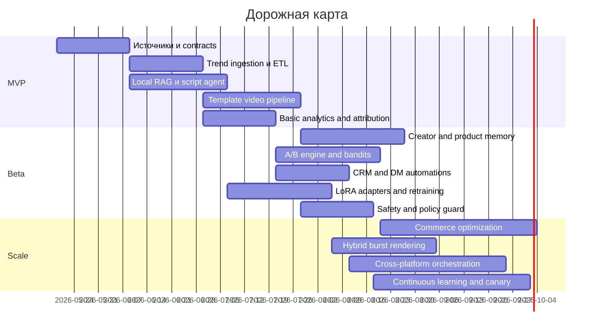

# Создание мощного агента для анализа трендов TikTok и Instagram, генерации видео с помощью ИИ и продвижения товаров через соцсети

## Executive summary

Ваш лучший путь — не пытаться собрать “одного всемогущего агента”, а построить **управляемую multi-agent систему** с четкими контурами данных, рейтингом доверия к источникам, human-in-the-loop на ранних этапах и постепенной автоматизацией. Это особенно важно, потому что у вас уже есть сильная инженерная база в стиле `Go → Redis → Python → NestJS → Next.js → Postgres/Timescale`, а также культура quality gates, replayability, rollout/rollback и observability; такой фундамент идеально подходит для контент-агента, если заменить торговый “сигнал” на “контент-гипотезу” и “commerce outcome”. fileciteturn3file1 fileciteturn3file2 fileciteturn3file8

Главный стратегический вывод такой: **TikTok должен быть вашим первичным движком исследования спроса и social commerce**, а **Instagram — вторым слоем доверия, ремаркетинга, DM/CRM и подписочной монетизации**. Причина проста: TikTok официально дает вам Creative Center с трендовыми хэштегами, песнями, креаторами, видео и Top Products, а TikTok Shop дает closed-loop commerce, Creator Affiliate и Shop Ads, что резко улучшает атрибуцию и масштабирование победивших organic/affiliate-креативов. Instagram очень важен, но его коммерческий контур сейчас чаще ведет к website checkout, так что это скорее канал доверия, прогрева и удержания, чем самый “короткий” путь к продаже. citeturn5search4turn20search8turn25view0turn25view1turn26view1turn8search1turn11search8

Для локальных моделей класса **14B** — я интерпретирую ваш пример `b14` как класс локальных 14B-моделей, прежде всего вроде **Qwen2.5:14b / Qwen2.5-14B** — вывод тоже довольно однозначный: **полностью локальный стек возможен для ingestion, нормализации, классификации, кластеризации, RAG, сценариев, captioning, TTS/ASR и части видео-пайплайна, но не должен быть единственным “судьёй” тренда и креатива**. 14B-модель хороша для структурированного JSON, многоязычных summary и orchestration, но short-video тренды — мультимодальны и контекстны; значит, текстовой LLM нужно помогать ASR/OCR/frame/audio features, retrieval-памятью и, в гибридной схеме, точечной эскалацией на облако для сложных multimodal и creative-critique задач. citeturn14view0turn14view4turn15view1turn14view3turn14view2turn13search0turn13search1turn13search2turn4search0turn4search12

Самая практичная ставка на первые месяцы — не “генерировать всё видео целиком с нуля”, а построить **полуавтоматический контент-конвейер**: тренд-детектор на официальных источниках, кластеризация тем, генерация сценариев и вариаций hooks, TTS/субтитры/капшены, сборка роликов из product shots, UGC, stock/B-roll и только точечное использование локальной генерации видео там, где это реально помогает. TikTok сам рекомендует TikTok-first, вертикальный 9:16, звук, людей в кадре, DIY/not overly polished эстетику, hooks в первые секунды и работу через тренды и creator partnerships; это означает, что “идеальная синтетика” не является целью. Цель — **быстрый цикл гипотеза → контент → публикация → измерение → ретренировка**. citeturn25view4turn25view5turn30search0turn30search18turn26view1

Моя итоговая рекомендация: **строить гибридный стек**. Локально оставить аналитический control plane, retrieval, 14B-LLM routing, ASR/TTS, граф модулей, Timescale/Qdrant/Redis, шаблонную сборку видео и часть lightweight-generation. В облако или managed burst выносить только те задачи, где локально цена ошибки слишком высока: крупные multimodal ревью, occasional high-end video renders, крупные A/B batches, редкие сложные брендовые кампании. Это даст лучший баланс между стоимостью, приватностью, скоростью и качеством. citeturn23view0turn23view1turn23view4turn24search0turn24search2turn4search17turn4search1

## Что взять из проекта trade

Ваше конкурентное преимущество — не в том, что вы уже продвигали в TikTok или Instagram, а в том, что у вас уже есть **редкая для контентных команд инженерная культура**: явные контракты, контроль времени и качества данных, Redis Streams, idempotency, replayability, stop conditions, degraded modes, canary/rollback, observability и измеримый definition of done. В `trade`-документации прямо зафиксирован целевой конвейер `Go -> Redis -> Python -> NestJS -> Next.js -> Postgres/Timescale`, а также требования к replay, data quality, compatibility, latency budgets и rollout discipline. В `news_agent` уже реализован шаблон независимого async-сервиса с Redis Streams, нормализацией, LLM reasoning, ML feedback loop и advisory-only output — это почти готовая организационная матрица для будущего social-content agent. fileciteturn3file1 fileciteturn3file2 fileciteturn3file4 fileciteturn3file5 fileciteturn3file8

Практически это означает следующее. Вместо `signal_engine` у вас будет `trend_engine`; вместо `news_reasoner` — `trend_reasoner` и `creative_reasoner`; вместо `trade_reco` — `publish_reco` и `commerce_reco`; вместо `signals_news` — стримы `trend_candidates`, `content_briefs`, `publication_jobs`, `creative_results`, `commerce_events`. Важно сохранить те же принципы: **fail-open**, **at-least-once**, **deterministic metadata**, **recommendation-only by default**, а также строгую разметку времени и bad-data path `detect -> sanitize -> quarantine -> metrics`. Если в трейдинге вы боретесь с out-of-order ticks и stale market data, то в соцсетях вы будете бороться с out-of-order analytics, duplicated posts, delayed platform stats, re-used media, несовпадающими идентификаторами кампаний и “грязным” trend ingestion. Архитектурно это очень похожие проблемы. fileciteturn3file8 fileciteturn3file4

Фактически я бы перенес из `trade` без изменений три дисциплины. Первая — **control plane прежде LLM**: сначала единый реестр сущностей, метрик и событий, потом интеллектуальный анализ. В ваших предыдущих trade-материалах сама мысль “сначала model registry и snapshot plane, потом LLM layer” уже зафиксирована; здесь ровно та же логика: сначала content/trend registry, затем creative agent. Вторая — **baseline -> change -> re-measure**: любой новый hook family, voice style, CTA policy, price framing или видео-шаблон должен идти через сравнимый replay/A-B loop, а не через интуицию. Третья — **guarded recommendation plane**: агент сначала предлагает, а не публикует сам; автоматизацию вы включаете только по template-safe сегментам. fileciteturn3file11 fileciteturn3file12 fileciteturn3file13

Ваше отсутствие опыта в organic social — это не недостаток, а ограничение начального режима. В отличие от Google Search Ads, где вы ловите уже сформированный intent, short-form social сначала формирует интерес, затем вовлечение, затем доверие, и только после этого переводит часть аудитории в commerce funnel. Поэтому первый этап должен быть не “массовое авто-создание роликов”, а **модульная система исследовательской скорости**, которая быстро накапливает ваш собственный outcome-labeled корпус: какие hooks, creators, voiceovers, captions, products, lengths и CTAs реально работают у вас, а не “в среднем по рынку”. Эту внутреннюю базу данных и будет обслуживать локальный LLM+RAG. citeturn25view4turn25view5turn26view1turn13search2

## Что реально работает на платформах

На TikTok платформа сама подталкивает к одному стилю: **native, fast, creator-like, trend-aware, people-led**. Официальные TikTok best practices для performance creatives говорят про TikTok-first подход, вертикальный 9:16, звук, safe zone, реальных людей в кадре, DIY/not overly polished эстетику, hooks в первые 3–6 секунд, captions/text overlays и ясный CTA. TikTok также официально советует опираться на тренды как на storytelling templates, а для поиска трендов использовать Creative Center, где есть trending hashtags, songs, creators и videos; отдельно есть Top Products как ориентир по растущим товарам. Это значит, что ваш агент должен оптимизировать не “киношное качество”, а **скорость native-адаптации под культурный шаблон платформы**. citeturn25view4turn25view5turn5search4turn20search8

TikTok также дает сильнейший на сегодняшний день commerce contour для товарного продвижения: TikTok Shop, Creator Affiliate, Shop Ads, TikTok One / Creator Marketplace и closed-loop purchase signals. В официальных кейсах Love & Pebble и MySmile выигрыш пришел не из-за “идеального таргетинга”, а из-за комбинации **organic + affiliate + paid**, где сначала creator/affiliate content показывает organic strength, а затем победителей усиливают платно. Love & Pebble получила 3.2x ROAS и сильное улучшение CPA, а MySmile — более $1M GMV за 3 месяца и 3x ROAS, при этом обе истории подчеркивают силу on-platform attribution и creator-led content. Для вас это прямой сигнал: **не стройте систему только как ad-tech; стройте её как creator commerce engine**. citeturn25view0turn25view1

Instagram, напротив, сейчас выглядит как платформа, где важны **creation + relationship + distribution + monetization overlays**, а не только короткий impulse purchase. Meta в 2024 запустила в professional dashboard отдельный in-app hub “Best Practices” c guidance по creation, engagement, reach, monetization и guidelines, плюс personalized tips; это очень полезно для новичка в платформе. Одновременно Instagram продолжает развивать creator workflows, messaging, branded content, creator marketplace и subscriptions, а Meta отдельно подчеркивает поддержку оригинального контента. Но для commerce есть важная разница: как минимум по официальной help-документации, с сентября 2025 Shops на Facebook и Instagram используют **website checkout**, что обычно увеличивает трение по сравнению с нативным TikTok Shop checkout. citeturn26view1turn8search1turn9search24turn11search8

Отсюда следует не банальный, но практичный вывод. Если ваша цель — **быстро нащупать товар, hook и creator-fit**, начинайте с TikTok как primary discovery and commerce machine. Если цель — **достраивать доверие, собирать DM intent, делать ремаркетинг, подписки, брендовые последовательности и long-tail удержание**, Instagram нужен обязательно. Системно это означает, что trend engine должен быть кросс-платформенным, а publication policy — **не симметричной**: TikTok получает больше tactical variation и commerce testing, Instagram — больше trust formatting, social proof и community conversion. citeturn25view0turn25view1turn26view1turn28search0turn28search17

Есть и еще один важный сдвиг: платформа increasingly reward originality и penalize low-value cloning. Meta прямо пишет, что усиливает защиту оригинального контента и персонализированные best practices для reach/monetization/guidelines. Для вас это означает, что агент должен не бездумно ремиксить “чужой вирусняк”, а уметь преобразовывать тренды в **собственные format families**: тот же narrative skeleton, но с новой полезностью, новой подачей, новым визуальным семейством, и с обязательной системой dedupe/near-dup, чтобы не скатиться в algorithmic spam. citeturn26view1turn9search24

## Данные, доступ, комплаенс и этика

Официальные данные есть, но они фрагментированы, а значит ваш ingestion должен быть **source-tiered**. На стороне TikTok у вас есть: Creative Center и Top Products для trend discovery; API for Business и Events API для рекламных, кампанийных и server-to-server conversion signals; Content Posting API для controlled publishing; TikTok One / Creator Marketplace и TikTok Shop affiliate/partner APIs для creator and commerce workflows. Но Research Tools — важное ограничение — доступны qualifying researchers, в основном academic/not-for-profit профилям в США, Европе и Бразилии, и имеют суточные лимиты на запросы и объем выдачи. То есть **TikTok Research API не может быть вашей основной коммерческой основой тренд-аналитики**. Для бизнеса основной безопасный путь — собственные аккаунты, собственные кампании, Creative Center, creator partnerships, commerce APIs и marketing partners. citeturn10search17turn3search6turn3search22turn5search4turn20search8turn29search1turn30search18turn30search0turn30search7

На стороне Instagram/Meta картина богаче для официальной интеграции, но тоже не бесконечна. Instagram API / Graph API для professional accounts позволяют publishing, reading content and insights, messaging, webhooks, а также бизнес-функции вроде Business Discovery, Hashtag Search/Public Content Access, Creator Marketplace API и Conversions API. Это значит, что для Instagram вы можете построить гораздо более официальный CRM + creator sync + attribution loop, чем многие делают вручную. Но это не равно “доступ ко всему публичному Instagram”; нужен approval flow, профессиональные аккаунты и соблюдение policy-boundaries. citeturn0search4turn18search7turn18search19turn28search0turn28search15turn28search17turn29search0

Для комплаенса нельзя недооценивать два слоя. Первый — **commercial disclosure**: TikTok требует включать Commercial Content Disclosure при продвижении бренда, товара или сервиса; Instagram branded content требует branded content tool и тэг партнера. Второй — **AI transparency**: TikTok развивает labeling для AI-generated content и требует соблюдения disclosure rules, в том числе для контента, созданного сторонними AI-инструментами; Meta с 2024 помечает AI-generated imagery, а для ad images, созданных или существенно отредактированных Meta generative AI, использует AI info labels. Если ваш агент активно генерирует synthetic visuals, disclosure logic должна быть частью publish pipeline, а не “последним чекбоксом руками”. citeturn9search11turn10search0turn10search11turn9search2turn9search13turn10search10turn10search25

Отдельно о scraping. Meta официально запрещает automated data collection без express written permission, и прямо указывает, что data scraping противоречит ее terms. Для Instagram это не абстрактный риск: data scraping — основание для ограничений. Поэтому архитектурно правильная позиция — **official-first, consent-first, partner-allowed, manual-review-supported**. Скрейпинг можно рассматривать только как юридически проверенный, технически изолированный и last-resort research layer, а не как основы продакшн-системы. Иначе вы строите бизнес на fragile and policy-hostile foundation. citeturn21search0turn21search9turn21search19turn21search22

Ниже — безопасная и практически полезная иерархия источников данных.

| Уровень | Источник | Что дает | Ограничение |
|---|---|---|---|
| Высокий | TikTok Creative Center, Top Products, TikTok One, TikTok Shop, Events API | Тренды, creator data, commerce signals, conversion loop | Не все данные доступны через один API; нужна сборка из нескольких контуров |
| Высокий | Instagram API, Messaging API, Webhooks, Business Discovery, Hashtag Search/PCA, Creator Marketplace, Conversions API | Публикация, CRM, creator discovery, performance links | Требуются professional accounts, approvals и policy compliance |
| Высокий | Ваши собственные аккаунты, магазины, ad accounts, CRM, product catalog | Самые ценные first-party outcome labels | Нужна строгая нормализация и attribution discipline |
| Средний | TikTok/Meta Marketing Partners | Более полные operational integrations | Партнерская зависимость и стоимость |
| Низкий | Несанкционированный scraping | Иногда дает coverage | Terms risk, legal risk, fragility, account risk |

Этическая рамка должна быть простой: **не обучать модели на приватных сообщениях без явного согласия, не копировать чужой креатив как есть, не клонировать голоса без права, не маскировать рекламу под органику без disclosure, не строить автоматизацию, которую вы сами не сможете объяснить при policy review**. На старте лучше потерять немного скорости, чем получить ограничения аккаунта или токсичную data debt. citeturn8search1turn9search7turn21search0turn9search11turn9search2

## Архитектура системы

Технологически ваш будущий social-content agent почти идеально ложится на trade-образец: Go или Python connectors на входе, Redis Streams как шина событий и очередей с consumer groups, Python для analysis/model policy/media workers, NestJS как aggregation/API/control-plane, Next.js как operator UI, Postgres/Timescale для исторических time-series метрик и outcome tables, Qdrant для semantic memory, а локальный inference-serving — через vLLM, llama.cpp или Ollama. Для media-части практичный open-source стек — faster-whisper для ASR, Kokoro/Piper/XTTS-v2 для TTS, ComfyUI как orchestration-слой для visual graphs, HunyuanVideo-1.5 и Wan2.1 как локально-бурстовые видео-модели, при обязательной проверке лицензий перед коммерческим использованием. fileciteturn3file1 fileciteturn3file8 citeturn14view3turn14view2turn24search0turn23view2turn23view3turn23view5turn23view4turn23view0turn23view1turn16search14

```mermaid
flowchart LR
    subgraph Sources
        TCC[TikTok Creative Center]
        TTB[TikTok Business and Shop APIs]
        TTO[TikTok One and Creator signals]
        IGA[Instagram API and Insights]
        IGM[Instagram Messaging and Webhooks]
        CRM[Shop CRM and site analytics]
        CAT[Product catalog and pricing]
    end

    subgraph Ingestion
        GI[Go and Python connectors]
        NORM[Normalizer and deduper]
        ENR[Entity and media enricher]
    end

    subgraph Bus
        RS[Redis Streams and Consumer Groups]
    end

    subgraph Intelligence
        TD[Trend detector]
        CL[Topic clustering and creative memory]
        LLM[Local 14B LLM plus RAG]
        SAFE[Policy and scoring guard]
    end

    subgraph Content
        SCR[Script and hook generator]
        TTS[TTS and ASR]
        VID[Template assembler and video generation]
        QA[Human review and auto-checks]
    end

    subgraph Delivery
        PUB[Publisher and scheduler]
        AB[A/B engine and bandits]
        CRM2[DM and CRM automations]
    end

    subgraph Storage
        PG[(Postgres and Timescale)]
        VDB[(Qdrant)]
        OBJ[(MinIO or S3 media store)]
    end

    subgraph UI
        API[NestJS control plane and API]
        FE[Next.js operator console]
    end

    TCC --> GI
    TTB --> GI
    TTO --> GI
    IGA --> GI
    IGM --> GI
    CRM --> GI
    CAT --> GI

    GI --> NORM --> ENR --> RS
    RS --> TD --> CL --> LLM --> SAFE
    SAFE --> SCR --> TTS --> VID --> QA --> PUB
    PUB --> AB
    PUB --> CRM2

    TD --> PG
    CL --> VDB
    SCR --> PG
    VID --> OBJ
    PUB --> PG
    AB --> PG
    CRM2 --> PG

    PG --> API
    VDB --> API
    OBJ --> API
    API --> FE
```



### Контур данных и модулей

| Модуль | Рекомендуемый стек | Вход → выход | Ресурсный контур | Метрики успеха | Главные риски и снижение риска |
|---|---|---|---|---|---|
| Ingestion | Go для polling/webhook adapters, Python для edge integrations | API/webhooks/exports → normalized events | 2–4 vCPU, 4–8 GB RAM | freshness lag, success rate, duplicate rate | rate limits, schema drift → typed contracts, retries, DLQ |
| ETL и нормализация | Python async workers, Pydantic, ffmpeg, perceptual hash | raw post/media/comment/shop event → canonical DTO | 4–8 vCPU, 8–16 GB RAM | parse success, dedupe precision, entity coverage | broken media, duplicated clips → quarantine + metrics |
| Trend detector | robust stats, EWMA/z-score, burst/change-point, per-cluster velocity | canonical events → trend candidates | 4–8 vCPU, 16 GB RAM | precision@review, novelty yield, trend lead time | confusing noise with trend → multi-signal scoring |
| Topic clustering | embeddings + Qdrant + graph clustering | text/audio/OCR/frame signals → topic clusters | 8–16 GB RAM + Qdrant | cluster purity, merge/split error, retrieval hit rate | semantic drift → periodic offline relabeling |
| Creative memory | Postgres/Timescale + vector memory | past scripts/results → retrieved exemplars | 8–32 GB storage | retrieval usefulness, prompt acceptance | polluted memory → score-weighted inserts only |
| Script and hook generation | local 14B instruct model + RAG + rule prompts | trend brief + product brief → scripts/variants | 1x 24 GB GPU or CPU slower | approval rate, edit distance to publish, time-to-brief | generic copy → brand adapters + retrieval |
| ASR/TTS | faster-whisper, Kokoro or Piper, XTTS-v2 for explicit-consent cloning | video/audio/text → transcript/voice tracks | CPU-friendly or small GPU | WER proxy, voice latency, accept rate | voice-rights risk → consent registry, allowlist |
| Visual assembly | ffmpeg, Remotion/CapCut templates, ComfyUI, HunyuanVideo-1.5, Wan2.1 | script + assets → draft video | template path: CPU+GPU light; gen-video: 4090-class or cloud burst | publishable draft rate, generation time, re-render rate | overuse of synthetic visuals → template-first policy |
| Publishing and scheduler | official TikTok/Instagram publishing APIs where available | approved draft → scheduled/published asset | 2–4 vCPU | publish success, policy failure rate | API limits/moderation delay → retry and state machine |
| A/B and bandits | experiment service + Timescale + simple Thompson/UCB | variants → ranked winners | 2–4 vCPU | winner confidence, time-to-winner, regret | too many weak tests → experiment budget caps |
| Analytics and attribution | Meta CAPI, TikTok Events API, UTM, catalog joins | view/click/cart/order → outcome tables | 4–8 vCPU | conversion match rate, dedup ratio, CAC/ROAS quality | attribution gaps → server-side events + IDs |
| CRM и monetization | Instagram Messaging API, email/SMS, TikTok Shop/affiliate joins | engaged user → DM/email/shop action | 2–4 vCPU | response rate, qualified lead rate, repeat purchase | spam/compliance risk → message window controls |
| Safety and governance | policy rules, content checks, manual review queue | draft or publish plan → allow/deny/escalate | 2–4 vCPU | strike rate, false blocks, escalation precision | silent policy drift → update cadence + review |
| MLOps | DVC or object-versioning, CI/CD, canary/shadow, replay | model/data change → promoted or rejected model | depends on training | offline win rate, shadow delta, rollback time | hidden regressions → replay + canary + rollback |

Это не просто “контент машина”. Это **контентный control plane**. Его ядро — таблицы и стримы, а не сами модели. Я бы ввел как минимум такие сущности: `creator_registry`, `trend_observations`, `topic_clusters`, `content_briefs`, `script_variants`, `asset_versions`, `publication_jobs`, `creative_results`, `commerce_events`, `policy_flags`, `model_runs`, `experiment_exposures`, `experiment_outcomes`. Временные поля — только явно: `source_ts_ms`, `ingest_ts_ms`, `publish_ts_ms`, `stats_window_end_ts_ms`, `matured_ts_ms`. Для media — object store, для time series — Timescale hypertables и continuous aggregates, для retrieval — vector DB. Это полностью соответствует вашей существующей дисциплине time-series-first и contract-first. fileciteturn3file5 fileciteturn3file17

Факты здесь такие. Short-video performance действительно зависит от multimodal content и contextual signals, а не только от текста или хэштегов; recent research по popularity prediction прямо показывает необходимость content+context modeling, а работа по short-video recommendation подчеркивает многоисточниковую мультимодальность. Поэтому ingestion должен собирать не только caption/hashtags, но и ASR, OCR, frame semantics, music/sound signatures, creator graph, posting cadence, product tags и commerce outcomes. Если оставить только текст, b14-модель будет видеть слишком малую часть сигнала. citeturn4search12turn4search0turn4search16

## Локальные LLM b14

Под `b14` разумно понимать класс локальных **14B-моделей**, прежде всего вроде **Qwen2.5-14B / qwen2.5:14b**. Для такой модели картина очень практичная: Qwen2.5 поддерживает long context до примерно 128K токенов, умеет structured outputs/JSON и многоязычный inference; в Ollama квантованный `qwen2.5:14b` весит около **9.0 GB** в Q4_K_M, что делает его вполне реальным кандидатом для локального reasoning-сервиса на одной нормальной рабочей станции. vLLM дает PagedAttention, continuous batching, prefix caching, structured outputs и богатую поддержку quantization, а llama.cpp — quantized CPU/GPU inference, OpenAI-compatible serving, monitoring endpoints и schema-constrained JSON. Это означает, что **локальный 14B отлично подходит как аналитический и orchestration brain**. citeturn14view0turn14view4turn15view1turn14view3turn14view2

Но ограничения тоже жесткие. Если брать именно текстовую 14B-модель, она не видит весь short-video объект: pacing, montage rhythm, visual novelty, composition, voice timbre, meme morphology, music cues и creator authenticity — это не текст. Исследования short-video recommendation и popularity prediction показывают, что short-video performance по природе мультимодален и существенно зависит от context modeling, а не только от текстового промптинга или captions. Отсюда ключевое правило: **не просите локальную 14B-модель “самой догадаться”, что видео будет вирусным; дайте ей извлеченные multimodal features и retrieval памяти о прошлых победителях/проигравших паттернах**. citeturn4search0turn4search12turn13search2

Стратегия памяти должна быть гибридной, а не “кидать в контекст всё подряд”. RAG исторически и практически лучше подходит для knowledge-intensive generation, чем попытка держать все знания внутри параметров модели. Для вашего случая retrieval-store должен хранить не общие интернет-факты, а **внутреннюю рабочую память**: тренд-кластеры, прошлые скрипты, outcome labels, сильные hooks, плохие hooks, creator-specific notes, product objections, policy rewrites, tone rules, series memory и persona memory. Локальная 14B тогда становится не encyclopedia, а **reasoning layer над вашей собственной доказательной базой**. citeturn13search2turn24search2turn24search14

Fine-tuning делать можно, но аккуратно. LoRA и QLoRA сделали parameter-efficient adaptation практичной даже для больших моделей; если 65B можно дообучать на одном 48GB GPU в QLoRA-схеме, то 14B-класс тем более реалистичен для domain adapters. Однако вам не нужен один “волшебный finetune на всё”. Вам нужны маленькие роли: `trend_analyst_adapter`, `brand_tone_adapter`, `compliance_rewriter_adapter`, `hook_generator_adapter`, `comment_responder_adapter`. Вес модели должен меняться медленно; быстро должна меняться retrieval-память. Это снижает риск catastrophic drift и keeps rollback simple. citeturn13search1turn13search0

Для инференс-оптимизации применимы три режима. **Локальный dev/runtime** — Ollama или llama.cpp. **Многопоточное serving в проде** — vLLM. **Edge и fallback** — CPU/GPU quantized serving с короткими контекстами и строгими JSON-схемами. Если у вас одна 24GB GPU-карта, используйте ее для: trend classification, clustering assist, script generation, compliance rewrite, DM scaffolding. Если у вас 4090-класс GPU, вы можете добавить lightweight local video bursts, особенно с HunyuanVideo-1.5 step-distilled режимами. Но даже тогда логичнее строить систему так, чтобы дорогое видео генерировалось только после того, как идея и hook уже недешево доказали смысл на более дешевых шаблонных тестах. citeturn23view0turn14view3turn14view2

### Сравнение локальной, гибридной и облачной конфигурации

Сравнение ниже — это архитектурная оценка, основанная на возможностях локальных 14B-моделей Qwen2.5, open-source serving stack, open-source media models HunyuanVideo-1.5/Wan2.1 и исследованиях, где frontier proprietary video systems все еще служат главным ориентиром для качества. citeturn14view0turn14view3turn23view0turn23view1turn4search17turn4search1

| Вариант | Сильные стороны | Слабые стороны | Где использовать | Вердикт |
|---|---|---|---|---|
| Полностью локальная на b14 | Максимум приватности, низкая переменная стоимость, полный контроль над данными и latency | Худшее multimodal judgement, слабее frontier creative critique, сложнее масштабировать video generation, больше DevOps-нагрузка | ingestion, normalization, trend clustering, RAG, script drafting, ASR/TTS, template assembly | Хороша как research/control plane, слаба как единственный production brain |
| Гибридная | Лучший cost/quality/privacy balance, локально идет основной пайплайн, облако включается по confidence rules | Нужен routing, secrets governance, observability на двух контурах | локально — почти все; облако — сложные multimodal reviews, premium renders, heavy batch analysis | Лучший вариант для вас |
| Полностью облачная | Быстрый старт, лучшая доступная multimodal and rendering quality, меньше локальной ops боли | Vendor lock-in, переменные расходы, слабее data sovereignty, risk of silent cost explosion | агентства, high-volume teams без сильной infra-команды | Имеет смысл позже, не как стартовая архитектура |

Мой вывод здесь жесткий: **используйте local-first hybrid**, а не pure local и не pure cloud. Локально должен жить ваш moat — data plane, scoring, retrieval, experiment memory, governance, KPI logic, internal prompts и тональность бренда. В облако должно уходить только то, что дает кратный выигрыш по качеству и не разрушает экономику. Для middle-разработчика без опыта соцсетей этот баланс даст больше шансов дойти до работающей системы, а не утонуть либо в инфраструктуре, либо в счетах. citeturn14view0turn25view0turn25view1

## Дорожная карта, команда и бюджет

Ниже — реалистичный путь, если строить систему не как “исследовательский pet project”, а как продакшн-контур с шансом на монетизацию.



### MVP

**Цель.** За 8–12 недель собрать систему, которая умеет безопасно: ingest официальные данные, строить trend briefs, генерировать десятки сценариев и вариантов hooks, собирать полуавтоматические ролики, публиковать и измерять результаты. На этом этапе **не нужен полностью автономный publish agent**; нужен быстрый исследовательский двигатель. Основанием для такого MVP служат уже доступные official surfaces: TikTok Creative Center/Top Products, TikTok API for Business/Events API, Instagram professional workflows, messaging/webhooks и outcome tracking через server-side events. citeturn5search4turn20search8turn29search1turn28search0turn28search15turn29search0

**Команда.** Минимум 2.5–3.5 человека: full-stack/data engineer; ML/media engineer; part-time growth operator/creative strategist. Если вы часть ролей закрываете сами, на старте можно сжать до 2 инженерных единиц плюс внешний performance/UGC-оператор на fractional basis. Это критично: без человека, который руками оценивает native quality креативов, вы рискуете построить технично красивую, но платформенно слепую систему.  

**Бюджет.** Чисто build-budget для MVP при open-source/local-first логике — ориентировочно **$15k–$60k**, если вы делаете большую часть сами и используете локальные модели плюс дешевый burst-cloud. Если добавить реальные creator seeding, sample sending, paid testing и часть managed tooling, разумный диапазон — **$30k–$120k** на первые 3 месяца. Это не “истина рынка”, а инженерно-операционная оценка с учетом media spend, storage, GPU и оператора.

### Beta

На beta-этапе задача уже другая: не просто делать ролики, а строить **winner engine**. Это означает: content registry, creator registry, outcome-labeled memory, experiment service, better attribution, first LoRA adapters, policy review automation и CRM layer. К этому моменту агент должен уметь распознавать не только “тема растет”, но и “какой тип подачи в этой теме конвертирует конкретно ваш SKU и вашу аудиторию”. Важное условие — server-side events и deduped attribution; и TikTok Events API, и Meta Conversions API официально нужны именно для надежного соединения маркетинговых данных web/app/offline/CRM с платформой. citeturn29search1turn29search0

**Команда.** 4–6 человек: product/tech lead, data/platform engineer, ML/media engineer, growth operator, creator/community operator, part-time designer/editor.  
**Бюджет.** Примерно **$75k–$250k** на 3–4 месяца, если вы реально запускаете creator sourcing, gifting/sampling, paid amplification и experiment cadence.  

### Масштабирование

На scale-этапе логика меняется с “делаем много вариантов” на “умеем держать качественную систему контента и коммерции без хаоса”. Здесь нужны: creator ops, cohort-LTV loops, merchandising сигналы, automated catalog linking, heavier hybrid rendering, better routing, stronger policy guardrails и качественный MLOps. На этом этапе уже имеет смысл сильно формализовать `content family registry`, `win conditions`, `fatigue signals`, `creative debt`, `production SLAs` и `shut-off rules`. TikTok Marketing Partners и Meta Business/Creator ecosystems тут становятся не заменой системы, а усилителем distribution and campaign execution. citeturn18search0turn30search11turn12search8turn28search17

### Сбор и разметка данных

Ваша data advantage должна строиться не на количестве сырого интернета, а на качестве **outcome-linked labels**. Каждая единица контента должна иметь: `idea_id`, `trend_cluster_id`, `platform`, `persona`, `hook_family`, `script_family`, `visual_family`, `creator_id`, `product_id`, `cta_type`, `disclosure_type`, `publish_ts_ms`, `first_view_window`, `matured_outcome_window`, `cost`, `orders`, `revenue`, `returns`, `gross_margin_proxy`, `policy_flags`, `human_rating`. Mature windows рекомендую минимум такие: быстрый — 2 часа, основной — 24 часа, commerce — 7 дней, retention — 30 дней. Эта схема намного полезнее, чем “просто собирать лайки и views”. Outcome integration через server-side events и shop/CRM joins здесь решающая. citeturn29search1turn29search0turn25view0turn25view1

Разметку делайте в четыре слоя. Автоматические soft-labels из платформенных метрик; weak supervision по commerce events; ручная ревизия топовых и провальных образцов; hard negatives для борьбы с ложными паттернами. Обязательно маркируйте случаи вроде “высокий watch, низкие продажи”, “много комментариев, но нерелевантное обсуждение”, “viral but policy-risky”, “good CPA but low margin”, “high LTV cohort”. Как и в трейдинге, вам нужны не только positive labels, но и **качественные отрицательные примеры**, чтобы агент не переобучился на шум.  

### CI/CD для моделей и непрерывное обучение

Здесь я бы прямо перенес trade-дисциплину. Каждый dataset snapshot версионируется; каждый adapter/model имеет registry entry; перед promotion идет offline eval; затем shadow; затем canary; затем gradual ramp; затем full enablement. В ваших trade-материалах этот rollout ladder уже закреплен как preferred pattern, и для content agent это даже важнее, потому что ошибки видны аудитории напрямую. Fine-tuned adapters обновляются по расписанию, а retrieval-память — почти непрерывно, но только по score-gated inserts. fileciteturn3file5 fileciteturn3file10

Мониторинг деградации должен охватывать не только модель. Нужны минимум такие группы метрик: source freshness lag; API/webhook error rates; dedupe drift; cluster churn; script approval rate; average human edit distance; publish success rate; moderation/policy flag rate; attribution match rate; experiment regret; CAC/ROAS/MER; assisted revenue; retention and refund signals. Из SRE-логики trade вам особенно полезно сохранить разделение alerts на page/ticket/dashboard-only и page only on action signals. fileciteturn3file19

### Безопасность и приватность

OAuth tokens и shop credentials — только в secret manager; least-privilege scopes; per-platform key isolation; signed URLs для media; encrypted asset manifests; explicit consent registry для voice cloning; policy audit log на каждый publish decision; manual override на уровне campaign, creator и product. Не храните персональные идентификаторы больше, чем нужно для attribution и CRM workflow. Если используете Instagram Messaging API, помните, что messaging automation живет в официальных окнах и правилах платформы; не превращайте CRM-агента в spam-bot. citeturn28search0turn28search15turn28search25turn21search19turn21search0

## Практические пайплайны, промпты и KPI

### Практические пайплайны

**Пайплайн для faceless product explainer на 30–45 секунд.** Агент забирает растущий trend cluster из TikTok Creative Center/Top Products и собственных performance signals; выделяет narrative angle; делает 5–10 hook variations; выбирает 1–2 voice variants через локальный TTS; собирает видео из product shots, macro close-ups, captions, stock/B-roll и легких motion templates; делает compliance rewrite; отправляет на manual approve; публикует 3 варианта на TikTok и 2 на Instagram; через 24 часа фиксирует winner. Этот пайплайн оптимален, потому что TikTok официально поощряет vertical native format, people/product-first storytelling, hooks и not overly polished feel, а кейсы TikTok Shop показывают, что organic/affiliate winners потом имеет смысл амплифицировать Shop Ads. citeturn25view4turn25view5turn25view0turn25view1

**Пайплайн для creator-assisted UGC loop на 30–60 секунд.** Вы не генерируете весь ролик сами; агент ищет creator/product/trend fit через TikTok One / Creator Marketplace и Instagram Creator Marketplace, формирует creator brief, собирает входящие UGC assets, автоматизирует transcript/OCR/entity extraction, находит общие паттерны удачных creator cuts и затем из лучших organic роликов делает paid amplification candidates. Это обычно сильнее полностью synthetic pipeline, потому что platform-native trust и commerce fit рождаются именно на границе creator authenticity и systematized amplification. citeturn30search0turn30search18turn28search17turn25view0turn25view1

**Пайплайн для expert/account authority format на 45–60 секунд.** Вход — evergreen problem cluster плюс возражения покупателей из comments/DM/CRM. Агент пишет короткий script с pattern `Hook -> Problem -> Proof -> Demo -> CTA`, озвучивает его через approved voice profile, накладывает subtitles, вставляет comments-as-social-proof и делит выпуск на TikTok discovery version и Instagram trust version. Это особенно важно для вас как человека из search мира: такой формат переводит вас из pure arbitrage mindset в **owned media + authority flywheel**, что позже улучшает и paid performance. citeturn26view1turn28search0turn28search15turn29search0

### Шаблоны промптов

Ниже — рабочие шаблоны. Они рассчитаны на локальную 14B-модель с retrieval context и строгим JSON-выходом.

#### Промпт для trend analyst

```text
Система:
Ты trend analyst для short-form commerce.
Работаешь только по данным из retrieval и входному JSON.
Не выдумываешь факты вне контекста.
Выход только в JSON по схеме.

Задача:
1. Оцени, является ли кластер растущим трендом, краткосрочным шумом или evergreen-темой.
2. Выдели angle, который органично подходит для продукта.
3. Назови 3 риска: saturation, policy-risk, commerce-mismatch.
4. Предложи 5 hook families и 3 CTA-подхода.

Вход:
- trend_cluster
- top_creators
- top_posts_summary
- product_brief
- audience_brief
- past_internal_winners
- past_internal_failures

JSON schema:
{
  "decision": "trend|noise|evergreen",
  "confidence": 0.0,
  "why": [],
  "best_angle": "",
  "hook_families": [],
  "cta_candidates": [],
  "risks": [],
  "evidence_refs": []
}
```

#### Промпт для script generator

```text
Система:
Ты script generator для TikTok и Instagram Reels.
Пиши нативно, коротко, без корпоративного языка.
Сохраняй стиль бренда из retrieval.
Выводи 4 варианта.

Требования:
- длина 30-45 секунд
- hook в первые 2 строки
- один продукт = одна главная мысль
- нативный CTA
- укажи on-screen text
- укажи shot list
- укажи B-roll / creator / product close-up
- не нарушай disclosure/policy rules

JSON schema:
{
  "variants": [
    {
      "hook": "",
      "script_voiceover": "",
      "on_screen_text": [],
      "shot_list": [],
      "cta": "",
      "risk_notes": []
    }
  ]
}
```

#### Промпт для compliance rewriter

```text
Система:
Ты compliance and platform-fit reviewer.
Твоя задача — не переписать смысл, а убрать policy risk,
ложные обещания, медицинские/финансовые перегибы,
неясные disclosures и неоригинальные формулировки.

Вход:
- script_variant
- platform
- product_category
- disclosure_required
- ai_generated_flags

Выход:
{
  "status": "allow|revise|deny",
  "reasons": [],
  "required_disclosures": [],
  "edits": {
    "before": "",
    "after": ""
  }
}
```

### KPI на первые месяцы

Это **не рыночные бенчмарки “для всех”**, а рекомендуемые operational targets для вашего первого полугодия.

| Плоскость | Первый горизонт | Последующий горизонт |
|---|---|---|
| Контент-производство | сократить time-to-brief до < 15 минут и time-to-draft до < 45 минут | довести time-to-draft победившего шаблона до < 10 минут |
| Эксперименты | минимум 15–25 новых hooks в неделю и 5–10 новых post-ready variants | 30–60 hooks в неделю, структурированный creative family registry |
| Качество идей | human approval rate сценариев > 50% | > 70% на retrieval-backed niches |
| Публикация | publish success > 98%, policy fail < 2% | policy fail < 1%, auto-publish только для whitelist templates |
| Аналитика | match rate между publish IDs и outcome events > 90% | > 95% |
| Коммерция | хотя бы 1–2 proof-of-conversion clusters на продукт в месяц | стабильный winner loop по 3–5 cluster families |
| Экономика | считать contribution-margin aware CAC, а не только view metrics | к концу полугодия стремиться к LTV/CAC > 1.5 для repeatable SKU |
| Удержание | ввести repeat purchase и assisted revenue как обязательные поля | строить cohort memory и retention playbooks |
| Надежность | freshness lag, duplicate rate, experiment log completeness под SLO | canary-only promotion для любых model/policy changes |

Для торгово мыслящего инженера важен один сдвиг: в short-form social **CTR и вовлеченность — это не финал**, а ранние сигналы. Meta определяет CTR как процент impressions, получивших link click; TikTok Ads тоже использует CTR как долю impressions с кликом; CLV/LTV — это совокупная ценность клиента за время отношений с брендом. Поэтому ваша основная operating system должна связывать attention metrics с commerce metrics и затем с retention metrics, а не застревать на уровне vanity engagement. citeturn19search1turn19search8turn19search2turn19search11

### Практические шаги реализации

На первом месяце я бы сделал только следующее: production-grade source contracts; ingestion в Redis Streams; canonical DTOs; trend observation tables в Timescale; vector memory; локальный 14B reasoning service; prompt templates; template-based video assembler; human review UI; outcome joins через TikTok Events API и Meta Conversions API; базовую DM/webhook интеграцию для Instagram. Только после появления собственного labeled corpus и стабильного attribution join имеет смысл тратить серьезное время на LoRA/adapters или на дорогую video generation. Это полностью соответствует вашей existing engineering culture: сначала truth-source, потом intelligence layer. fileciteturn3file11 fileciteturn3file12 citeturn29search1turn29search0turn28search0turn28search15

### Открытые вопросы и ограничения

В исследовании мне удалось опереться на ваши доступные trade-материалы и артефакты `news_agent`, но я не нашёл отдельного предыдущего глубокого исследования именно по social commerce/short-video агенту среди доступных файлов. Кроме того, часть Meta developer страниц в ходе исследования отвечала rate-limit/429, поэтому для некоторых деталей Instagram API я опирался на официальные search snippets, официальные newsroom/help pages и developer overviews, а не на полнотекстовые страницы документации. Это не меняет ключевых выводов, но для финального implementation checklist я бы еще раз руками сверил доступные permissions, app review scope и региональную доступность конкретных endpoints в вашем бизнес-аккаунте. fileciteturn3file6 citeturn26view1turn28search0turn28search17turn29search0