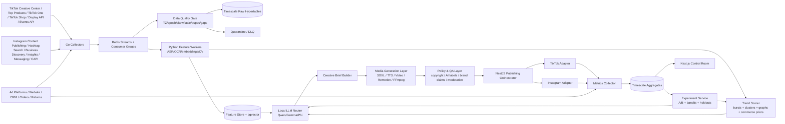
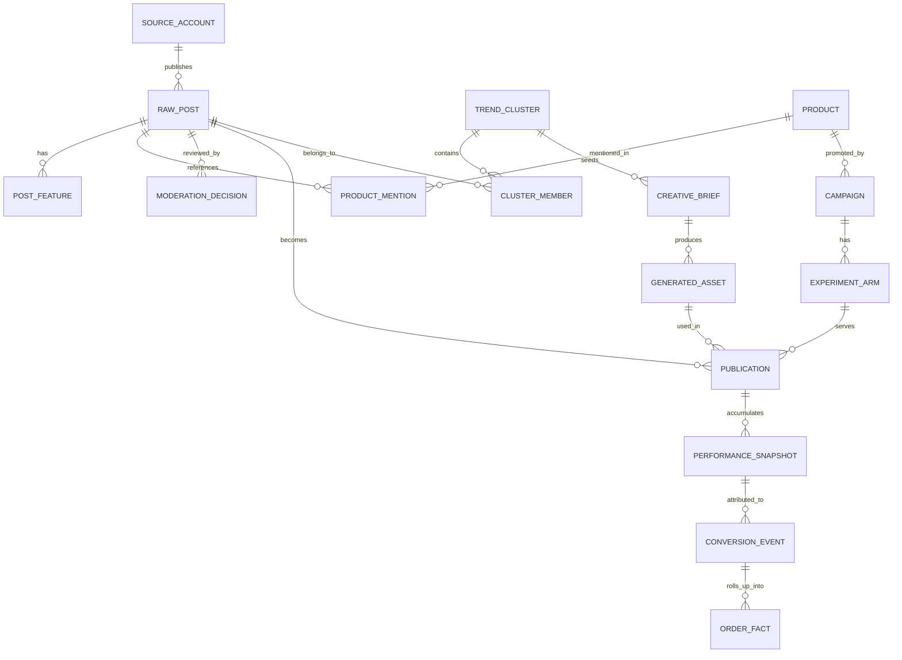
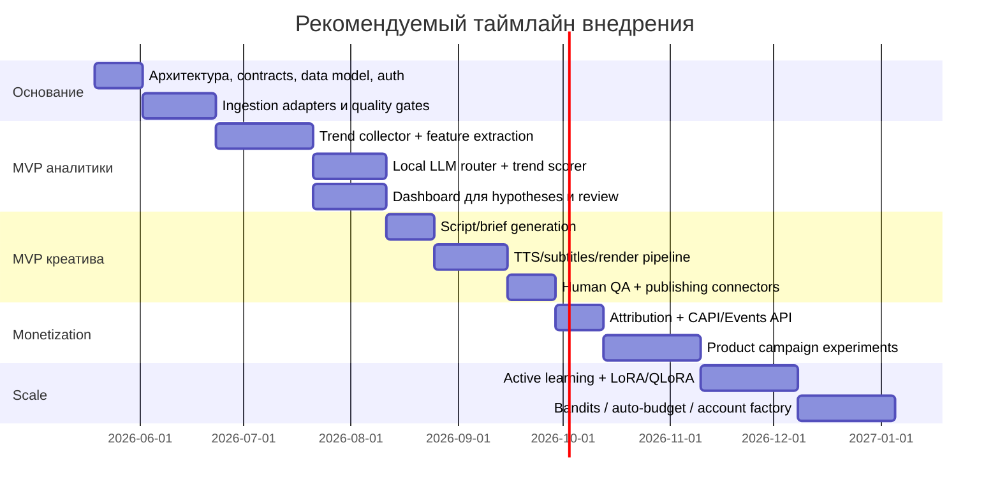

# AI-агент для трендов TikTok и Instagram с локальными лёгкими LLM

## Executive summary

Главный вывод такой: **для продакшн-системы в 2026 году лучше строить не “полностью автономного генератора контента”, а гибридного AI-агента**, где локальные модели класса **8B–14B** берут на себя дешёвый и приватный анализ трендов, маршрутизацию пайплайна, суммаризацию, ранжирование гипотез, генерацию черновиков и контроль структуры, а тяжёлые облачные модели подключаются только там, где реально нужны дорогие мультимодальные возможности — прежде всего для high-end видео, сложного дубляжа и “hero content”. Это особенно важно, потому что TikTok и Instagram дают **неравномерный и ограниченный официальный доступ к данным**: TikTok Research Tools доступны только квалифицированным исследователям в ограниченных юрисдикциях, а Instagram API покрывает в основном собственные профессиональные аккаунты, публикацию, инсайты, хэштеги, бизнес-профили и messaging, но не даёт полноценного коммерческого “firehose” для общего тренд-майнинга. citeturn32view0turn32view1turn30search1turn30search5turn30search6

Для вашей задачи лучший базовый паттерн — **event-driven control plane**: сбор сигналов → нормализация → мультимодальное обогащение → локальный LLM-ранжировщик → генерация креатива → публикация → измерение → активное дообучение. Из предыдущего исследования имеет смысл сохранить backbone **Go ingestion → Redis Streams → Python analysis → NestJS orchestration/API → Next.js UI → Postgres/Timescale**, но добавить **локальный LLM-control plane** и отдельный слой policy/compliance. Такой дизайн хорошо совпадает с требованиями TikTok к audited posting, с рекомендациями по совместному использованию TikTok Pixel + Events API, а также с серверной атрибуцией через Meta Conversions API и deduplication. citeturn24view0turn24view1turn24view3turn33search0turn33search4

С точки зрения **локальных моделей**, “золотая середина” для анализа трендов и управления пайплайном сейчас — это **Qwen2.5 14B** и **Gemma 3 12B**. Qwen2.5 14B даёт 14.7B параметров, 128K контекст, сильную работу со структурированными данными и JSON, а в Q4_K_M-варианте в Ollama занимает около 9.0 GB. Gemma 3 12B даёт мультимодальность, 128K контекст, поддержку 140+ языков и компактный локальный запуск; официальный QAT int4 снижает требуемую VRAM для загрузки 12B примерно до 6.6 GB только на веса. Для более слабых машин хорошим floor-маршрутизатором выступает **Phi-4-mini 3.8B**, а если у вас есть одиночная RTX 4090 или аналог, верхним локальным потолком становится **Mistral Small 3.1 24B**. citeturn27view0turn15view3turn27view1turn29view0turn27view3turn15view0turn27view4

По генерации медиа важный реализм следующий: **локальная генерация текста, озвучки, субтитров, ключкадров и простых роликов уже практична; локальная генерация действительно сильного короткого видео — всё ещё компромисс по качеству и скорости**. Для кадров и стори-бордов остаётся актуальным **SDXL**, для локального пайплайна — **ComfyUI**, для программной сборки видео — **Remotion + FFmpeg**, для ASR — **faster-whisper**, для быстрой TTS — **Piper**, для локального voice cloning — **XTTSv2**. Из локальных video-generation вариантов реальными кандидатами стали **Wan2.1 1.3B** и **HunyuanVideo-1.5**, но для стабильно “коммерческого” качества шортсов всё ещё часто выигрывают облачные **Sora, Runway Gen-4, Veo, Adobe Firefly**. citeturn28view15turn28view12turn28view13turn28view9turn28view10turn28view11turn28view7turn28view6turn28view0turn28view2turn28view4turn28view5

Для старта без опыта в TikTok/Instagram самая безопасная бизнес-стратегия — **не пытаться сразу “фармачить охваты”, а выстроить 3 вещи одновременно**: нативный формат контента, надёжную атрибуцию и итерационный каталог гипотез. TikTok официально рекомендует вертикальный 9:16, звук, UGC/DIY-стиль, сильный hook в первые секунды, 3–5 креативов на ad group и постоянное тестирование; Meta параллельно продвигает in-app best practices для creation, engagement, reach, monetization и guidelines. Поэтому MVP должен быть не “полный автопостинг 100 роликов в день”, а **аналитический агент + редакторский copilot + дисциплинированная система экспериментов**. citeturn34view0turn25view4

Наконец, важнейшее ограничение — **комплаенс и право**. TikTok требует маркировать реалистичный AI-generated content, запрещает часть deepfake-сценариев, автоматически применяет AI-метки и использует C2PA Content Credentials; Meta также маркирует AI-контент на своих платформах и требует использовать branded content tools для оплачиваемого бренд-контента. Instagram прямо запрещает несанкционированный scraping, а Meta в целом запрещает automated data collection без явного письменного разрешения. Значит, production-ready система должна считать scraping **высокорисковым режимом для исследования**, а не базовым каналом данных. citeturn25view0turn25view1turn35search0turn35search4turn17search21turn20search0turn20search1turn20search6

| Параметр плана | Статус |
|---|---|
| География продаж и публикации | **не указано**; ниже даны варианты для global/EU/US-ориентированного сценария |
| Ниша товара | **не указано**; архитектура рассчитана на beauty / gadgets / home / digital goods / creator products |
| Наличие своего магазина | **не указано**; ниже предусмотрены TikTok Shop, Instagram Shop/website checkout и direct-to-site |
| Локальное железо | **не указано**; поэтому приведены рекомендации по тиру: CPU-only / 8–12 GB / 16 GB / 24 GB VRAM |
| Команда | предполагаю **1 middle dev + part-time designer/editor + part-time ops/analyst**, если иное не указано |

## Платформенные ограничения и источники данных

Ключевая проектная реальность в том, что **официальный коммерчески безопасный data stack для TikTok и Instagram придётся собирать из нескольких “неидеальных” источников**. У TikTok есть Research Tools, Query Videos, Shop data, Display API, Content Posting API, Events API, Creative Center, TikTok One/Creator Marketplace и TikTok Shop affiliate APIs. Но Research Tools доступны только квалифицированным исследователям и не должны рассматриваться как гарантированная основа для обычного коммерческого SaaS/агентского продукта; для бизнеса практичнее опираться на Creative Center, TikTok Shop / affiliate-данные, first-party ads/shop signals и санкционированные posting/measurement API. citeturn32view0turn32view1turn32view2turn24view0turn24view3turn24view5turn24view6turn24view8turn24view9

У Instagram доступ более “операционный”, чем “исследовательский”: API покрывает публикацию контента, Business Discovery, Hashtag Search, Insights, Messaging для professional accounts и коммерческие инструменты вроде Conversions API и Partnership Ads. Однако из просмотренных официальных источников не следует наличие общего публичного трендового API, сопоставимого по широте с настоящим social listening firehose; поэтому для тренд-аналитики Instagram придётся строить **гибрид: свои аккаунты + whitelist competitors + hashtag windows + creator/brand partnerships + paid measurement**. Это не плохо — это просто означает, что агент должен уметь работать не с “полной картиной мира”, а с **управляемым набором сигналов высокой ценности**. citeturn30search0turn30search5turn30search6turn30search8turn30search9turn17search0turn33search0turn30search28

| Платформа | Источник | Что реально даёт | Ключевое ограничение | Практический вывод |
|---|---|---|---|---|
| TikTok | Research Tools / Research API | Доступ к public data аккаунтов, контента и shop data; доступны поля по роликам: description, counts, hashtags, music_id, effect_ids, voice_to_text и др. citeturn32view0turn32view1turn32view2 | Только qualifying researchers в ограниченных регионах и организациях; это **не универсальный коммерческий доступ**. citeturn32view0 | Считать опцией для research-lab или партнёрской схемы, но не зависеть от него в core-архитектуре. |
| TikTok | Content Posting API | Прямая публикация видео и фото, управление privacy/comment/duet/stitch, upload через URL или файл. citeturn24view0turn24view1 | Неаудированные клиенты: private-only, до 5 пользователей за 24 часа; после аудита можно снимать ограничения. Есть лимит 6 init-запросов в минуту на user access token. citeturn24view0turn24view1 | Для MVP автопостинг в TikTok лучше проектировать как **manual-assisted / audit-ready**, а не сразу full public automation. |
| TikTok | Display API | Отображение профиля и видео авторизованного пользователя через scopes `user.info.basic`, `video.list`. citeturn32view3 | Не решает broad market intelligence. | Полезно для связки “мой аккаунт / кабинет клиента”, но не для общего тренд-скрейпа. |
| TikTok | Events API | S2S передача web/app/offline/CRM событий; TikTok рекомендует использовать Events API вместе с Pixel и deduplication. citeturn24view3 | Нужен качественный event schema и legal review. citeturn22search6turn24view3 | Обязательный компонент measurement-слоя, если вы покупаете трафик или оптимизируете commerce. |
| TikTok | Creative Center | Публичные тренды по hashtags / songs / creators / videos; high-performing ads; инструменты Symphony; Trend Discovery по регионам. citeturn24view5turn23search3 | Это не низкоуровневый raw API. | Лучший production-safe источник “каких трендов касаться сейчас”. |
| TikTok | Top Products + Commercial Music Library | Top Products показывает viral/trending products и audience insights; Commercial Music Library даёт pre-cleared music for organic and ad creation. citeturn24view6turn24view7 | Зависимость от доступности регионов и категорий. | Использовать как безопасный слой commerce trend discovery и copyright-safe sound selection. |
| TikTok | TikTok One / Creator Marketplace / affiliate APIs | Официальная площадка creator collaboration; APIs умеют creator discovery, workflow orchestration, affiliate campaigns, creator/product search и promo links. citeturn24view8turn24view9turn19search2 | Не все возможности одинаково доступны вне партнёрских сценариев и экосистемы TikTok One. | Очень сильный канал для creator-led commerce и масштабирования UGC. |
| Instagram | Content Publishing API | Публикация single image, video, reels, carousel от имени professional accounts. citeturn30search8turn30search0 | Ограничение 100 API-published posts на 24-часовое скользящее окно. citeturn30search0 | Для старта лимит практически не является bottleneck; ограничение важнее в массовой сетке аккаунтов. |
| Instagram | Business Discovery | Basic metadata и metrics по другим professional accounts. citeturn30search5 | Только professional accounts; не заменяет social listening платного уровня. | Отлично подходит для whitelisted competitor tracking и creator scouting. |
| Instagram | Hashtag Search | Поиск хэштегов и связанных media. citeturn30search2turn30search6 | До 30 уникальных hashtags за rolling 7 days. citeturn30search2turn30search6 | Хэштеги надо выбирать алгоритмически и экономно, а не стрелять “из шланга”. |
| Instagram | Insights + Messaging API | Insights для собственных профилей/контента; Messaging API для Instagram professional accounts at scale. citeturn30search9turn17search0turn17search4 | Insights — только first-party; Messaging требует правильную account setup. | Отлично для CRM, lead nurture и warm DMs после контента/рекламы. |
| Instagram | Conversions API + Partnership Ads | Meta рекомендует CAPI вместе с Pixel и redundant event setup; Partnership Ads позволяют масштабировать creator content от имени creator/partner handle. citeturn33search0turn33search2turn30search28 | Нужны deduplication и аккуратный consent/data governance. citeturn33search4 | Must-have для измерения реальных продаж и масштабирования creator-контента. |
| Instagram | Shops / branded content / subscriptions | Shops теперь в official help snippets ориентированы на website checkout; branded content требует branded content tool; subscriptions дают recurring creator revenue. citeturn18search0turn18search2turn17search21turn17search17turn17search3 | Часть возможностей зависит от страны и статуса аккаунта; детали в просмотренных источниках не полностью указаны. | Для продавца без медиабренда чаще всего лучше строить website-checkout + partnership/branded content + retention через DMs/email. |

С точки зрения методов сбора данных, production-safe архитектура должна различать **четыре класса**: sanctioned APIs, public structured surfaces, partner data и risky scraping. На Meta риск особенно прямой: automated data collection без письменного разрешения запрещён, а Instagram прямо указывает, что scraping нарушает Terms of Use и может приводить к ограничению аккаунта. Для TikTok в изученных developer-источниках основной акцент идёт на sanctioned products, audit, privacy и copyright mechanisms; поэтому для практики это тоже нужно трактовать как **“official-first” платформу**, а не как площадку для бесконтрольного парсинга. citeturn20search0turn20search1turn20search6turn24view2

| Метод | Ценность | Юридический и платформенный риск | Рекомендация |
|---|---|---|---|
| Официальные API | Максимально управляемые, стабильные и совместимые с продакшеном. citeturn24view0turn24view3turn30search0turn33search0 | Низкий, если соблюдены scopes, consent и terms. | **База системы**. |
| Public trend surfaces | Creative Center, Top Products, music library и аналогичные sanctioned pages дают сильный сигнал без тяжёлого compliance burden. citeturn24view5turn24view6turn24view7 | Низкий–средний; зависит от частоты и способа извлечения. | **Слой дешёвого trend discovery**. |
| Partner / affiliate / creator marketplace data | Самые ценные commerce signals для monetization-агента. citeturn24view8turn24view9turn30search28 | Средний; зависит от партнёрского доступа. | **Высокий приоритет**, если есть путь к партнёрскому доступу. |
| First-party ad/shop data | Лучший источник правды о конверсии, CTR, CPA, LTV и saturation. citeturn24view3turn33search0turn33search4 | Низкий. | **Источник истины для обучения и ранжирования**. |
| Скрейпинг публичных поверхностей | Может расширить coverage в лабораторном режиме. | Высокий; на Meta прямо конфликтует с terms, на практике несёт риск ограничений, отказа в доступе и правовых споров. citeturn20search0turn20search1turn20search6 | **Не использовать как основу продакшена**; только после legal review и в изолированном research sandbox. |

## Архитектура агента

Правильная архитектура здесь — **не “один LLM, который всё делает”, а ансамбль специализированных сервисов**, где LLM включается только на тех шагах, где нужно обобщение, выбор гипотезы, структурированный reason-code или генерация текста. Всё остальное — сбор данных, ASR, OCR, эмбеддинги, дедупликация, контроль времени, публикация, атрибуция, бюджетирование — должно быть максимально детерминированным и воспроизводимым. Это особенно важно, потому что TikTok/Instagram накладывают отдельные требования на posting, privacy, branded content, AI labeling и conversion measurement. citeturn24view0turn24view1turn25view0turn17search21turn33search0



В этой схеме **Go** отвечает за ingestion и time-deterministic adapters; **Redis Streams** — за надёжную очередь с replayability и consumer groups; **Python** — за heavy analytics и feature extraction; **NestJS** — за control plane, approval workflows, auth, publishing orchestration, webhooks и policy routing; **Next.js** — за human-in-the-loop интерфейс; **Timescale/Postgres** — за историю, агрегаты и метрики. Такой расклад хорошо подходит под ваш профиль middle-разработчика, потому что позволяет держать критичный real-time/data-quality слой детерминированным, а “творческий” слой — заменяемым и эволюционирующим. Это уже не просто media generator, а **операционная система контента**.

Главная инженерная идея: **локальный LLM не должен быть “внутри firehose”**. Сначала он получает уже сжатые, нормализованные и обогащённые фичи: ASR-транскрипт, OCR-надписи, caption, хэштеги, audio fingerprint, first-frame embedding, shop/product signal, конкурирующие публикации, ранние velocity-метрики и policy flags. Такой паттерн соответствует и исследовательской литературе по short-video popularity/recommendation, где качество даёт именно мультимодальная и retrieval-based обработка, а не чисто текстовый анализ. В 2025 работах по short-form video recommendation и popularity prediction retrieval-based multimodal системы и memory-bank подходы показывали преимущество над классическим supervised baseline, особенно при cold-start и ограниченных онлайн-сигналах. citeturn8search2turn8search5turn8search13turn8search17



Минимально необходимый модульный состав я бы зафиксировал так. **Ingestion layer** собирает sanctioned data и собственные события. **Feature layer** строит ASR/OCR/embedding-представления. **Trend engine** считает burst scores, community overlap, creator/product entropy и saturation. **Local LLM agent** превращает фичи в reason-coded hypotheses: “эта тема растёт из-за X, риски Y, товарный угол Z”. **Creative assembly** генерирует бриф, сценарий, озвучку, субтитры, кадры и монтажные инструкции. **Policy layer** валидирует музыку, AI-labeling, copyright, brand claims, minors/private figures и branded content tags. **Publishing layer** адаптирует под TikTok/Instagram и учитывает platform-specific constraints. **Measurement layer** закрывает атрибуцию через Pixel + Events API / CAPI. **Active learning layer** собирает human feedback и conversion feedback для новых LoRA/adapters и ranking models. citeturn24view3turn25view0turn35search12turn33search0

| Модуль | Что делает | Почему это важно |
|---|---|---|
| Collector adapters | Сбор official/public/partner/first-party сигналов | Разводит источники по trust-level и воспроизводимости |
| Data quality gate | Проверка epoch ms/sec, TZ, monotonicity, stale, duplicates, gaps | Без этого trend scores быстро становятся мусором |
| Multimodal feature workers | ASR, OCR, embeddings, frame/audio fingerprints | Снижают нагрузку на LLM и улучшают recall |
| Trend engine | Burst detection, clustering, graph diffusion, commerce prior | Выдаёт “что растёт” и “почему это важно для товара” |
| Local LLM control plane | Суммаризация, hypotheses, JSON routing, script outlines | Дёшево, приватно, быстро, controllable |
| Creative generation | Кадры, voiceover, subtitles, composite, short video | Превращает инсайт в publishable asset |
| Policy gate | AI labels, music rights, moderation, claims, creator rights | Снимает главный продовый риск |
| Publishing & measurement | API posting, retries, webhooks, attribution, dedup | Позволяет из “контента” сделать управляемый performance-channel |

## Локальные LLM и инструменты генерации

Если цель — **анализ трендов и управление пайплайном на локальных лёгких моделях**, то оптимальная стратегия — использовать **локальный LLM только как reasoning/control слой**, а не как универсальный мультимодальный монолит. Для русскоязычного и мульти-язычного short-form контента лучше всего подходят модели с длинным контекстом, приемлемой мультиязычностью, хорошим JSON/function calling и компактным Q4 footprint. По изученным official model cards и Ollama-артефактам strongest practical sweet spot сейчас дают **Qwen2.5 14B**, **Gemma 3 12B** и, как лёгкий роутер/классификатор, **Phi-4-mini 3.8B**; для более сильного single-GPU режима — **Mistral Small 3.1 24B**. citeturn27view0turn15view3turn27view1turn29view0turn27view3turn15view0turn27view4

| Модель | Официальные свойства | Локальный footprint | Где особенно полезна | Ограничения |
|---|---|---|---|---|
| **Phi-4-mini 3.8B** | 128K context; lightweight; ориентирована на memory/compute constrained и latency-bound use cases; усилена для reasoning и function calling. citeturn27view3turn14view4 | `phi4-mini:latest` в Ollama — около **2.5 GB** в Q4-варианте. citeturn15view0 | Router, intent classification, HTML/text cleanup, moderation pre-check, дешёвая A/B-naming генерация | Не лучший выбор как главный creative brain; большой risk потери качества на сложной мультиязычной аналитике |
| **Llama 3.1 8B** | 8B, 128K context, multilingual text and code, GQA, custom Llama 3.1 Community License. citeturn27view2 | Q4-модель в Ollama — около **4.9 GB**. citeturn29view1 | Универсальный baseline, локальные агенты на ограниченном железе | Лицензия не Apache; vision нет в этой конфигурации |
| **Gemma 3 12B** | Multimodal text+image, 128K context, 140+ languages, small-size deployment; есть QAT-варианты. citeturn27view1turn15view2 | `gemma3:12b` в Ollama — **8.1 GB** Q4_K_M; QAT int4 для 12B официально снижает VRAM загрузки весов примерно до **6.6 GB**, но runtime требует доп. VRAM на KV cache. citeturn15view2turn29view0turn29view2 | Тренд-анализ с кадрами/thumbnail/frame triage, мультиязычный brief generator | Terms of Use Google, а не Apache; для длинных батчей всё равно нужен контроль KV cache |
| **Qwen2.5 14B** | 14.7B params, 128K context, сильная работа с long text, tables, structured outputs, 29+ languages; Apache 2.0 для 14B. citeturn27view0turn15view3 | `qwen2.5:14b` в Ollama — **9.0 GB** Q4_K_M. citeturn15view3 | **Лучший default** для trend synthesis, clustering summaries, JSON reason-codes, сценарные черновики | Vision нет; для очень длинных контекстов и высокой concurrency нужен аккуратный VRAM budget |
| **Phi-4 14B** | 14B params, ориентирована на memory/compute constrained, reasoning and logic; context 16K. citeturn14view2 | `phi4:14b` в Ollama — **9.1 GB**. citeturn15view1 | Матричные decision rubric, scoring, классификационные пайплайны | 16K context уже заметно теснее для соцсигналов; в просмотренных строках licence detail не указана |
| **Mistral Small 3.1 24B** | 24B, 128K context, vision, JSON/function calling, Apache 2.0; локально помещается на одной RTX 4090 после quantization. citeturn27view4 | `mistral-small:24b` в Ollama — около **14 GB** в Q4_K_M. citeturn14view3 | “Потолок качества” для single-GPU local setup; final brief judge; multilingual creative QA | Уже не “лёгкая” модель; для бюджетного железа избыточна |
| **Ministral 8B** | Edge-model 8B, 128K, но в docs указана deprecation date 12/2/2025. citeturn27view5 | не указано | Сейчас не рекомендую как новую базу | Deprecated в просмотренной документации |

Практически это означает следующее. Если у вас **одна машина с 16 GB VRAM**, я бы выбрал **Qwen2.5 14B** как основной orchestrator и **Gemma 3 12B** как мультимодальный помощник или вторую модель по требованию. Если у вас **8–12 GB VRAM**, начинать проще с **Gemma 3 12B QAT** или **Llama 3.1 8B / Phi-4-mini**, а сложные случаи отдавать в облако. Если у вас только **CPU / 32–64 GB RAM**, модель уровня **Phi-4-mini** ещё можно использовать как batch-router, но полноценный interactive copilot для команды будет лучше делать либо на 8B q4 с терпением, либо через гибридный fallback. Эти выводы частично являются инженерной оценкой на основе официального размера весов, длин контекста и замечания Google о том, что кроме загрузки весов ещё нужен KV cache. citeturn15view0turn15view2turn15view3turn15view1turn29view0

Для продакшен-инференса выбор стека должен зависеть не от “моды”, а от режима использования. **Ollama** — лучший developer UX и быстрый старт; **llama.cpp/GGUF** — лучший low-overhead/CPU/Mac/edge runtime; **vLLM** — лучший выбор для NVIDIA production serving, batching и prefix caching; **TGI** — очень хороший choice, если вы хотите production-ready telemetry, Prometheus и distributed tracing; **mistral-inference** имеет смысл, если вы стандартизируетесь на Mistral family. citeturn27view8turn27view9turn27view6turn27view7turn27view10turn6search0

| Инференс-стек | Что умеет | Когда брать |
|---|---|---|
| **Ollama** | Structured outputs по JSON Schema; простой локальный API/CLI; быстрый старт dev и desktop workflows. citeturn27view8turn5search10 | MVP, workstation, desktop copilot, быстрые внутренние сервисы |
| **llama.cpp / GGUF** | Лёгкий OpenAI-compatible HTTP server; малый overhead; хорош для CPU, Apple Silicon и edge-style deployment. citeturn27view9 | Локальные агенты, Mac mini/Studio, CPU fallback, встраивание в deterministic service mesh |
| **vLLM** | High-throughput serving, continuous batching, PagedAttention, prefix caching, широкий набор quantization schemes. citeturn27view6turn27view7 | Production GPU serving, shared team inference, long repeated prompts |
| **TGI** | Continuous batching, tensor parallelism, SSE streaming, Prometheus/OpenTelemetry, quantization support. citeturn27view10turn27view11 | Production-инфраструктура, много GPU, строгая observability |
| **mistral-inference** | Official inference library for Mistral models. citeturn6search0 | Если опираетесь именно на Mistral family и хотите официальный рантайм |

На стороне оптимизации модели базовый production toolkit должен включать **quantization + adapter tuning + selective pruning**, но в правильном порядке. LoRA снижает число trainable parameters и memory cost fine-tuning; QLoRA позволяет дообучать квантованные модели с очень сильной экономией памяти; AWQ уменьшает весовой footprint для edge deployment; SparseGPT даёт one-shot pruning больших моделей. В реальности для вашего кейса я бы делал так: **Q4/AWQ для инференса**, **QLoRA для task-specific adaptation**, **pruning — только после того, как появится стабильный набор задач и acceptance metrics**. citeturn7search0turn7search1turn7search3turn7search2

Видео, озвучка и сборка должны быть тоже многослойными. Для локального пайплайна выгодно разделить задачу на **storyboard / keyframes / voiceover / captions / final composite**. Это резко снижает цену и позволяет использовать локальные инструменты там, где они уже конкурентны, не пытаясь заставить один video model делать всё сразу. citeturn28view15turn28view13turn28view9turn28view10turn28view11

| Слой генерации | Локальные варианты | Облачные варианты | Практический комментарий |
|---|---|---|---|
| Кадры / storyboard | **SDXL**; ComfyUI даёт модульный node-based backend/API. citeturn28view15turn28view12 | Firefly / другие hosted image models. citeturn28view5 | Для short-form это часто лучший баланс цены и controllability |
| Программная сборка видео | **Remotion** для composition в React; **FFmpeg** для фильтров, burn-in captions и финального encode. citeturn28view13turn10search1turn10search5 | — | Это должен быть ваш deterministic “last-mile renderer” |
| ASR | **faster-whisper** на CTranslate2, до 4x быстрее openai/whisper и с меньшей памятью; помогает 8-bit quantization. citeturn28view9 | OpenAI speech-to-text как fallback/quality tier. citeturn12search10 | Обязателен для trend mining по speech-driven short video |
| Быстрая локальная TTS | **Piper** — fast local neural TTS, MIT. citeturn28view10 | OpenAI TTS, Google Cloud TTS. citeturn29view5turn12search1 | Хорошо для MVP voiceover без cloning |
| Локальный voice cloning | **XTTSv2**: 16 языков, streaming <200ms, fine-tuning recipes. citeturn28view11 | ElevenLabs IVC / Google Chirp 3 Instant Custom Voice. citeturn29view4turn29view3 | Для production критичны consent logs и legal rights |
| Локальное видео низкого/среднего веса | **Wan2.1 1.3B**; 720p возможно, но для стабильности рекомендуют 480p. **HunyuanVideo-1.5** — 8.3B, consumer-grade GPU oriented. citeturn28view7turn28view6 | — | Реально полезно для быстрых concept clips и B-roll, но не всегда для “главного” ролика |
| Облачное high-end видео | — | **Sora**: до 1 минуты по базовому описанию модели, Sora product — до 1080p/20 sec/vertical-square-widescreen; **Runway Gen-4**: reference-driven 5/10 sec video; **Veo 3.1**: text-to-audio+video, image-to-video, physics; **Adobe Firefly** — multiple top models + commercial-safe позиционирование Firefly. citeturn28view0turn28view1turn28view2turn28view3turn28view4turn28view5 | Использовать только когда ROI выше стоимости и latency |

В итоге я бы зафиксировал такой policy: **локально** — trend mining, clustering, script/rubric generation, metadata extraction, QA, subtitles, ASR, TTS, storyboard, простые ролики. **В облаке** — premium hero-video, сложные humans, быстрое мультиязычное переозвучивание, high-stakes final polish. Это не компромисс “потому что хочется”, а оптимальный cost/latency/risk design.

## Дорожная карта, данные и MLOps

Ниже — реалистичная дорожная карта для ситуации, когда вы middle-разработчик, у вас есть сильный engineering bias, но нет прикладного опыта TikTok/Instagram. Главная ошибка в таком случае — строить сразу “идеальный автогенератор контента”. Правильно наоборот: **сначала measurement и trend truth, потом semi-automation, потом scaling**. TikTok сам рекомендует continuous testing и чередование креативов, а исследовательские работы по short-video prediction показывают, что retrieval/multimodal & memory-heavy системам нужны хорошие feedback loops и первые конверсионные сигналы, иначе они переобучаются на vanity metrics. citeturn34view0turn8search2turn8search5



| Фаза | Результат | Трудозатраты | Приоритет |
|---|---|---:|---|
| Foundation | Data contracts, auth, event schema, Redis Streams, Timescale hypertables, S3/asset storage, observability | 2–3 недели | Критический |
| Trend MVP | Сбор official/public signals, ASR/OCR/feature extraction, trend scorer, competitor watchlists | 4–6 недель | Критический |
| Creative MVP | Генерация brief/script/subtitles/TTS, шаблонные ролики, human approval UI | 4–5 недель | Критический |
| Publishing MVP | TikTok/Instagram adapters, retries, audit-ready posting flow, metadata templates | 2–3 недели | Высокий |
| Measurement MVP | Pixel + Events API / CAPI, deduplication, funnel dashboard, cohort storage | 2–3 недели | Критический |
| Commerce experiments | Первая продуктовая воронка, 3–5 creative families, affiliate tests, landing tests | 4–6 недель | Высокий |
| Learning loop | Acceptance labels, prompt versioning, LoRA/QLoRA, rerankers, bandits | 4–8 недель | Высокий после первых продаж |

Все оценки выше — **плановая инженерная оценка**, а не внешний факт. Если работать одному без дизайнера и без видео-редактора, таймлайн почти наверняка вырастет на 30–60%.

Данные нужно проектировать как минимум в трёх слоях: **raw**, **features**, **business truth**. В raw-слое хранятся сырые snapshots постов, signals, продуктовые каталоги, order events и moderation decisions. В feature-слое — ASR, OCR, visual/audio embeddings, cluster IDs, burst stats, creator priors. В business truth — публикации, spend, clicks, add-to-cart, purchases, gross margin, returns, subscription status, affiliate payouts. Без такого разделения вы быстро потеряете возможность нормально проводить backfill, replay и причинно-следственный анализ.

| Слой данных | Основные сущности | Freshness/SLA | Ключевые проверки |
|---|---|---|---|
| Raw social | post_snapshot, hashtag_snapshot, creator_snapshot, shop_snapshot, ad_snapshot | 5–30 мин для трендов; 1–24 ч для кабинетных метрик | duplicate rate, missing fields, stale lag, timestamp skew |
| Multimodal features | transcript, ocr_text, frame_embed, audio_embed, language, sentiment, graph edges | 5–60 мин | ASR coverage, OCR confidence, embedding completeness |
| Trend layer | trend_observation, cluster, novelty_score, saturation_score, commerce_affinity | 15–60 мин | cluster stability, burst false-positive rate |
| Creative ops | brief_version, prompt_version, asset_version, moderation_decision, publish_job | near-real-time | publish success rate, QA rejection rate |
| Business truth | click, session, add_to_cart, checkout, purchase, refund, payout | near-real-time to 24 ч | event dedup, attribution drift, EMQ/match-rate |
| Experimentation | arm_assignment, holdout, outcome_window, guardrail_metrics | daily | sample ratio mismatch, sequential bias |

Trend engine я бы делал не как одну магическую модель, а как **score fusion** из детерминированных статистик, retrieval и LLM reasoning. Базовая формула может выглядеть так:

```text
trend_score =
  0.22 * burst_zscore
+ 0.16 * engagement_quality
+ 0.14 * creator_diversity
+ 0.14 * cross_platform_lift
+ 0.18 * commerce_affinity
+ 0.08 * novelty
- 0.08 * saturation
- 0.10 * policy_risk
```

Где `burst_zscore` считается по временным рядам, `creator_diversity` и `cross_platform_lift` — по графовым и кластерным сигналам, `commerce_affinity` — по first-party orders/clicks/affiliate stats, а `policy_risk` — по rules + classifier + LLM rubric. Такой дизайн хорошо согласуется с недавними работами, где short-video popularity prediction улучшается за счёт мультимодальных фич, metadata capture и retrieval over similar content, а temporal/graph representations помогают удерживать динамику и сообщества. citeturn8search1turn8search5turn8search11turn8search13turn8search17

MLOps здесь должен быть **гораздо ближе к marketing ops**, чем к классическому “выкатили модель и забыли”. Вам нужны versioned prompts, dataset snapshots, offline evaluation set, канареечные rollout-и и human acceptance labels. Дообучение локальных LLM имеет смысл не на “всех текстах подряд”, а на очень узком gold set: принятые брифы, удачные hooks, approved scripts, причины отказов, false positives тренд-детектора и outcome labels по публикациям. LoRA/QLoRA как раз удобны для такого слоя domain adaptation, когда вы хотите тонко довести модель под ваш стиль решений, не превращая проект в отдельную ML-инфраструктурную компанию. citeturn7search0turn7search1

| Контур расходов | Что включает | Оценка бюджета |
|---|---|---:|
| Локальный MVP | 1 рабочая станция, 1 NVMe-сервер/мини-сервер, object storage, домен, CI/CD | **не указано**; планируйте как CAPEX low-mid |
| Гибридный MVP | Локальный LLM + облачное видео/TTS по потребности + базовая реклама на тесты | **не указано**; обычно это уже заметно дороже pure-local, но даёт реальный time-to-market |
| Scale tier | Выделенный GPU host, observability, очереди, multi-account runs, moderation, bandits, paid traffic | **не указано**; закладывайте отдельную строку на медиа spend, а не смешивайте её с infra |

Я умышленно помечаю это как **не указано**, потому что актуальные цены на железо, hosted GPU и конкретные API-планы быстро меняются; здесь правильнее строить модель бюджета от требуемого throughput и медиа spend, а не от “средней цены из интернета”.

## Запуск аккаунтов и контент-пайплайны

С нулевым опытом в TikTok/Instagram лучше запускать не “бренд сразу”, а **управляемую экспериментальную матрицу**. Вам нужен один основной аккаунт на платформу и, максимум, один auxiliary format-account, который тестирует другой формат подачи, а не другую нишу. TikTok официально подчёркивает важность native-first creative: вертикаль 9:16, звук, люди в кадре, DIY/UGC-аэстетика, hook и постоянное тестирование; Meta со своей стороны продвигает in-app best practices по creation, engagement, reach и monetization. Следовательно, ваша первая цель — не частота публикаций сама по себе, а **скорость обучения на единицу опубликованного ролика**. citeturn34view0turn25view4

Практически это означает, что первые 6–8 недель нужно строить вокруг **трёх content pillars**. Первый pillar — **problem/solution demo**, где товар решает понятную боль. Второй — **trend-native entertainment**, где вы цепляетесь за формат, звук, мем или визуальную механику, но не теряете товарный угол. Третий — **trust/social proof**, где роль играют creator voice, UGC, before/after, объяснение эксперта, разбор кейса, отзыв, FAQ. TikTok Creator Marketplace research прямо показывает ценность естественного hook, работы в “своём голосе”, стратегического использования трендов и правильного сообщества; force-scripted content и искусственная интеграция бренда работают хуже. citeturn34view1

| Направление старта | Как делать | Почему это работает |
|---|---|---|
| Product-native demo | Показывать товар в первые секунды, но через проблему, а не через “купите это” | Это проще всего связать с продажей и атрибуцией |
| Trend-native format | Подхватывать механику тренда, но объяснять товарный угол через него | TikTok рекомендует lean into trends, а creator-research показывает пользу стратегического использования трендов. citeturn34view0turn34view1 |
| Creator-led content | Давать эксперту/создателю говорить своим языком, не писать ему “рекламный диктант” | Authentic creator voice и knowledgeability повышают вовлечённость и вероятность покупки. citeturn34view1 |
| Trust assets | FAQ, UGC proof, unboxing, side-by-side, before/after, myths | Это стабилизирует conversion intent, когда тренд остынет |
| Safe AI-assisted content | AI — для voiceover, keyframes, B-roll, subtitles, remix, но с маркировкой при необходимости | Снижает cost per creative, не превращая контент в deepfake-risk. citeturn25view0turn35search0 |

Ниже — шаблоны пайплайнов, с которых я бы начал. Важно, что **до первых 100–150 публикаций финальное одобрение должен делать человек**, а локальный LLM должен объяснять своё решение reason-codes: почему выбрал этот hook, этот product angle, этот sound, эту CTA.

| Workflow | Входы | Локальные шаги | Облачные шаги | Human gate |
|---|---|---|---|---|
| **Trend-reactive short** | Трендовый hashtag/song/video pattern + товарный угол | cluster summary → brief → hook options → subtitles/TTS → montage instructions | при желании cloud B-roll | Обязателен |
| **Evergreen product demo** | SKU, benefits, objections, reviews | script → shot list → voiceover → captions → render | не нужен | Обязателен |
| **Creator-style UGC** | reference creator style + product facts + compliance notes | style brief → draft script → CTA variants → local TTS mock | final human/creator record или cloud polish | Обязателен |
| **Affiliate test asset** | product card + commission angle + creator profile | benefit map → talking points → thumbnail/frame ideas | при необходимости video polish | Обязателен |
| **Explainer / FAQ** | customer FAQ, returns, comparison data | retrieval + local LLM answer draft + Remotion template | не нужен | Желателен |
| **Live/DM follow-up** | live topics / pinned Q&A / DM intents | summary → reply macros → offer map | не нужен | На этапе запуска — обязателен |

Операционно я бы ввёл жёсткий weekly ritual. В понедельник — shortlist трендов и товарных углов. Во вторник — 10–15 creative hypotheses. В среду–четверг — batch production и публикация. В пятницу — readout: удержание первых секунд, completion rate, profile CTR, shop/site CTR, add-to-cart, purchase rate, creative fatigue, moderation incidents. В субботу — prompt and rubric revision. Такой ритм помогает избежать ловушки, когда вы бесконечно “улучшаете агента”, но не узнаёте рынок.

TikTok особенно располагает к creator-led и commerce-led формату: Creative Center и Top Products дают верхнеуровневые сигналы, Commercial Music Library снижает copyright risk, а TikTok One и affiliate APIs позволяют связать контент с creator search и commerce primitives. Для Instagram, наоборот, я бы делал упор на **Reels + Business Discovery + Messaging + site checkout + Partnership Ads**, а не на попытку силой сделать из него вторую копию TikTok. citeturn24view5turn24view6turn24view7turn24view8turn24view9turn17search0turn30search5turn30search28turn18search0

## Монетизация, кейсы и риски

Монетизацию лучше строить как **лестницу**, а не как один канал. Самый быстрый путь к learnings обычно даёт **affiliate / creator-led commerce**, потому что он быстрее показывает, какие сообщения и creators двигают клики и продажи. Второй слой — **direct sales через shop или website checkout**. Третий — **partnership/branded campaigns**, когда вы уже понимаете, какой стиль и какие creator archetypes работают. Четвёртый — **recurring revenue**: subscriptions, закрытые клубы, creator community, membership perks, email/SMS retention. TikTok Shop affiliate APIs и TikTok One прямо поддерживают creator/product search и affiliate workflows; Meta даёт branded content, partnership ads, subscriptions и commerce/website-checkout сценарии. citeturn24view8turn24view9turn17search3turn17search21turn30search28turn18search0

| Стратегия монетизации | Где сильнее | Что нужно в данных | Когда запускать |
|---|---|---|---|
| Affiliate commerce | TikTok | creator-product fit, commission rate, attributed sales, CAC by creator | Самая первая monetization wave |
| Direct product sales | TikTok Shop / Instagram shop-site / DTC site | clickstream, add-to-cart, purchase, margin, refunds | Сразу после настройки атрибуции |
| Spark / Partnership / creator ads | TikTok Spark / Meta Partnership Ads | контент с доказанным organic lift, whitelisted creators, event dedup | После первых winning creatives |
| Branded campaigns | Обе платформы | reach, brand lift proxies, creator fit, content rights | После появления кейсов и social proof |
| Subscriptions / community | Instagram и собственные каналы | retention, content cadence, whales / loyal cohort | Когда есть устойчивая creator persona |
| Digital products / templates / консультации | Обе платформы + site/email | lead quality, DM conversion, repeat purchase | Параллельно товаровому контенту, если есть expertise |

Ниже — несколько официальных кейсов, которые хорошо показывают, как именно сходятся trend-native content, creators и commerce. Во всех просмотренных case studies TikTok ключевым рычагом были **creator/affiliate content + native shopping format + strong measurement**.

| Кейс | Что делали | Результат | Почему важно |
|---|---|---|---|
| **Love & Pebble** | После запуска TikTok Shop бренд активировал Creator Affiliate Program, затем использовал affiliate videos как Video Shopping Ads. citeturn26view0 | **3.2x ROAS**, 240+ conversions, 250k impressions; combined organic+affiliate+paid дали **1194% рост продаж** и **409% снижение CPA** vs BAU. citeturn26view0 | Отличный пример closed-loop commerce и переиспользования creator content в paid |
| **Grande Cosmetics** | Video Shopping Ads, Spark Ads, affiliate partnerships, lookalike/custom audiences, product demos и trend/community content. citeturn26view1 | **10x ROAS**, **85% снижение CPA**, **217% рост CTR**, большой рост orders. citeturn26view1 | Показывает, что сильный organic-style creative потом можно масштабировать в рекламу |
| **The Beauty Story** | Catalog Ads + TikTok Creator Marketplace + LIVE Shopping Ads; fast-paced videos, hook, clear CTA. citeturn26view2 | До **12.5x ROAS** на Catalog Ads и **6.6x ROAS** на LSA. citeturn26view2 | Показывает силу creator-sourced content и commerce orchestration |
| **TikTok creator best-practice study** | TikTok проанализировал 300+ top Creator Marketplace videos. citeturn34view1 | Высоко вовлекающие creator campaigns чаще “ditch the script”, находят natural hook, используют trends strategically и попадают в нужную community. citeturn34view1 | Это прямая инструкция, как строить human+AI creative pipeline |

Риски здесь не побочные — они центральные. Ими нужно управлять не “политикой на бумаге”, а независимым runtime-контуром.

| Риск | Что может пойти не так | Как смягчать | Источники |
|---|---|---|---|
| Нелегитимный сбор данных | Ограничения аккаунтов, потеря доступа, правовые претензии | Official-first data strategy; scraping only in legal-reviewed sandbox; не строить core business на несанкционированном автоматизированном сборе | citeturn20search0turn20search1turn20search6 |
| Нарушение правил AI-generated content | Снятие публикаций, trust damage, модерация | Автоопределение synthetic signals; mandatory AI-label recommendation; C2PA/provenance metadata; отдельный policy engine | citeturn25view0turn25view1turn35search0turn35search4 |
| Deepfakes / likeness abuse | Высокий reputational/legal risk | Запрет на private/adult likeness без consent; minors hard-block; consent vault для voice/face; human approval | citeturn25view0 |
| Музыкальные и copyright-претензии | Blocked content, takedowns | Для TikTok — CML / pre-cleared music; не удалять watermark/copyright mechanisms без consent; хранить provenance и rights ledger | citeturn24view7turn24view2turn24view1 |
| Брендовый и оплаченный контент без тэгов | Policy violation, потеря аккаунта/кампаний | Instagram branded content tool; partnership ads; отдельный compliance checklist per post | citeturn17search21turn17search17turn30search28 |
| Неоригинальный / спамовый контент | Падение distribution, monetization penalties | Делать platform-native masters без чужих platform watermarks; creator-style originality; anti-dup score | citeturn24view1turn35search3turn35search11 |
| Галлюцинации LLM и ложные claims о товаре | Refunds, complaints, ad disapproval | LLM only drafts; retrieval over approved claims; legal/brand rules; prohibited-claims classifier | citeturn8search0turn33search0 |
| Voice cloning без раскрытия и consent | Юридический и этический риск | Explicit disclosure; signed consent; audit trail; ограничение reuse scope | citeturn29view5turn29view4turn29view3 |
| Вычислительные ограничения локальных моделей | Высокая latency, queue build-up, деградация UX | Router model + task-specialized workers; prefix caching; batch windows; cloud fallback only on flagged jobs | citeturn27view6turn27view7turn27view8turn27view9 |
| Дрейф сигналов и ложные тренды | Публикация в “мертвые” или шумовые темы | Trend score fusion, holdout evaluation, novelty/saturation penalties, human review on emerging clusters | citeturn8search2turn8search5turn8search11 |

Если свести всё к одной практической рекомендации, то расширенный план выглядит так. **Собирайте трендовые сигналы только из безопасных источников, считайте локальный 8B–14B слой “мозгом оркестрации”, а не универсальным генератором, и привязывайте каждую creative-гипотезу к измеримой бизнес-цели.** Тогда локальные модели действительно дадут вам выигрыш в приватности, стоимости и controllability, а не превратятся в очередной эксперимент ради эксперимента. Для вашего профиля разработчика это наилучшая траектория: сначала надёжная система сигналов и экспериментов, потом semi-auto content factory, и только потом — широкая автоматизация публикации и масштабирование на сетку товаров и аккаунтов.