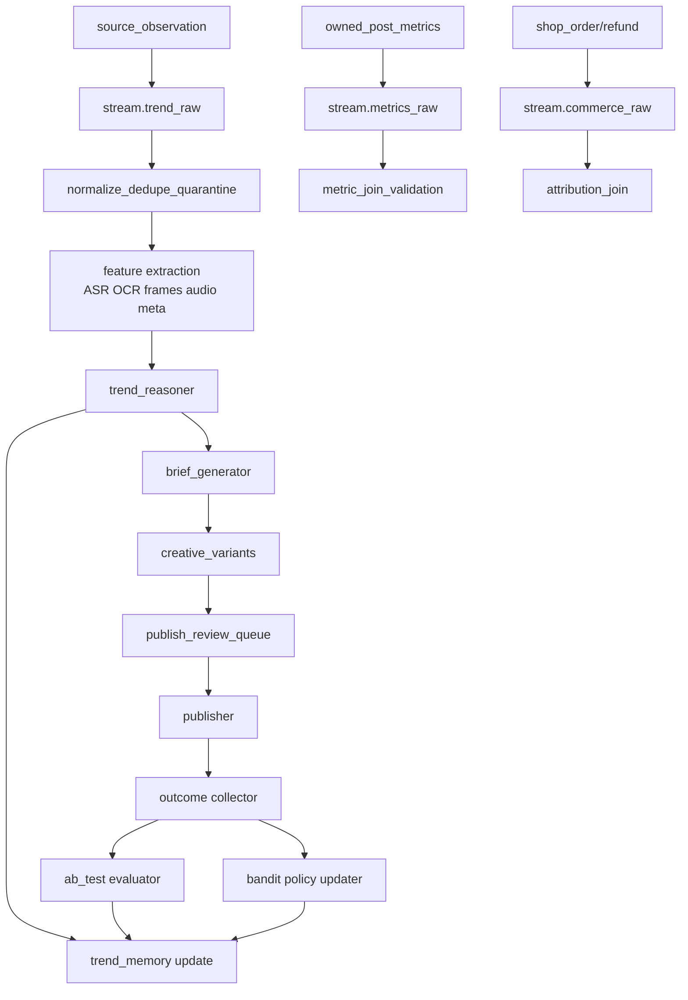

# Архитектура мощного AI-агента для TikTok и Instagram

## Executive summary

Ваш лучший путь — не строить “волшебного универсального агента”, который сам находит тренды, сам пишет сценарии, сам рендерит ролики и сам публикует их без контроля, а собрать **модульную decision system**: сначала надежный data plane для наблюдения за трендами и результатами, затем reasoning plane на локальных LLM, затем creative plane для сценариев и вариаций, и только после этого — controlled publishing и commerce loop. Это особенно важно потому, что short-video среда по природе **мультимодальна**: на успех влияют не только текст и хэштеги, но и монтаж, ритм, мимика, тембр, музыка, визуальный паттерн, повторяемость формата и алгоритмическая обратная связь. Исследования по TikTok/short-video показывают, что multimodal fusion и retrieval-память работают заметно лучше, чем текстовый анализ “в вакууме”, а алгоритм TikTok быстро усиливает интерес-специфичный контент, уже в первые сотни просмотров, одновременно уменьшая разнообразие ленты. citeturn23academia9turn24academia1turn24academia3turn24academia2turn53academia4

Под ваши вводные — middle-разработчик, сильнее в engineering than in creator ops, исторически из Google Search Ads — **оптимальная стартовая стратегия** выглядит так: сохранить ваш инженерный backbone в стиле trade-проекта, использовать локальную 14B-модель как аналитический “мозг” и orchestration layer, но не как единственный judge для трендов; добавить дешёвые и быстрые специализированные модели для ASR/OCR/VL/TTS; строить **template-first video factory**; запускать A/B сначала на дешёвых креативах и шаблонах; дорогое text-to-video подключать only after идея уже доказала signal. По документации Qwen2.5-14B эта модель хорошо подходит для long-context, multilingual reasoning и structured JSON, а vLLM/llama.cpp/Ollama дают зрелый локальный serving-стек с prefix caching, continuous batching, structured outputs и OpenAI-compatible endpoints. citeturn34view4turn34view0turn34view1turn34view2turn34view3turn33view5

По TikTok есть важная развилка: официальные developer APIs реально полезны для **posting, status tracking и first-party data exchange**, но Research Tools официально предназначены для независимых/академических non-profit исследователей; creators, advertisers и commercial users для них не подходят. Кроме того, Research API имеет суточные квоты и лаг обновления данных: новые видео могут появляться до 48 часов, а некоторые метрики — обновляться до 10 дней. Значит, коммерческий trend engine нельзя проектировать на предположении, что Research API станет вашим основным firehose-источником. Вместо этого нужен гибрид: TikTok Creative Center, permissioned account data, собственные campaign outcomes, product telemetry и ограниченный, ToS-safe public observation layer. citeturn43view1turn43view3turn43view4turn43view5turn19view4turn46view0turn46view4

Для Instagram главный вывод ещё жёстче: вам не нужен проект, завязанный на “полный внешний observability доступ” к платформе. Meta закрыла CrowdTangle и прямо указывала, что коммерческие организации не являются основными получателями её replacement data tools; одновременно Instagram усиливает приоритизацию **оригинального** контента и снижает охват для accounts, которые системно публикуют unoriginal posts. Поэтому Instagram-контур нужно строить как **owned-media + permissioned publishing/messaging/insights + your own attribution layer**, а не как реплику TikTok public-trend firehose. citeturn26news4turn29news5

По вашему отдельному запросу на анализ `scanner_infra`: **мне не удалось верифицировать и прочитать общедоступный GitHub-репозиторий `scanner_infra` по этому имени**, поэтому я не буду имитировать code review конкретных файлов. Ниже я честно разделяю то, что подтверждается источниками и вашим текущим trade-контуром, и то, что является переносимой архитектурной оценкой “по классам артефактов”, если `scanner_infra` — это ваш типовой infra/scanner ingestion-репозиторий.

## Что на самом деле стоит строить

### Ключевая ставка

Объединяя оба предыдущих исследования и текущее исследование, я бы сформулировал целевую систему так:

**не “генератор роликов”, а “операционная система short-video growth”**.

Её задача — не просто делать контент, а проходить полный цикл:

наблюдение → нормализация → кластеризация трендов → генерация гипотез → создание креативов → безопасная публикация → получение outcome-данных → causal/A-B оценка → обновление памяти и политик.

Именно этот цикл, а не качество одного промпта, становится конкурентным преимуществом. Это хорошо ложится на вашу текущую инженерную культуру: DTO/контракты, replayability, deterministic metadata, Redis Streams, observability, staged rollout и guarded automation.

### Факты, предположения и риски

| Категория | Содержание | Статус |
|---|---|---|
| Факт | TikTok Content Posting API официально поддерживает direct posting видео и фото, требует `video.publish`, Query Creator Info и Get Post Status; неаудированные клиенты публикуют только в private mode. citeturn43view1turn43view3turn43view4turn43view5 | Высокая уверенность |
| Факт | TikTok Research Tools официально предназначены для independent/academic non-profit researchers; creators/advertisers/commercial users не подходят; есть квоты и задержки обновления данных. citeturn46view0turn46view4 | Высокая уверенность |
| Факт | Creative Center показывает trending hashtags/songs/creators/videos, но TikTok уже ограничивал часть search-функций Creative Center, поэтому нельзя проектировать систему с жесткой зависимостью от его полной воспроизводимости. citeturn19view4turn12news1 | Высокая уверенность |
| Факт | Qwen2.5-14B-Instruct даёт 128K context, multilingual support, strong JSON/structured outputs, Apache 2.0; quantized `qwen2.5:14b` в Ollama составляет около 9 GB в Q4_K_M. citeturn34view4turn33view5 | Высокая уверенность |
| Факт | Для production-serving vLLM даёт PagedAttention, continuous batching, prefix caching, structured outputs, monitoring dashboards и multi-LoRA; llama.cpp даёт лёгкий локальный/edge deployment и OpenAI-compatible server. citeturn34view0turn34view1turn34view2turn34view3 | Высокая уверенность |
| Факт | Short-video analytics плохо сводится к text-only: исследования показывают выигрыш multimodal fusion, retrieval memory и multi-modal popularity modeling. citeturn23academia9turn24academia1turn24academia3turn24academia2 | Высокая уверенность |
| Предположение | Под “B14-подобными” вы имеете в виду класс локальных 14B-моделей наподобие Qwen2.5-14B-Instruct. citeturn34view4 | Умеренная уверенность |
| Риск | По `scanner_infra` нет подтверждённого публичного repo-read; оценка переноса ниже дана по классам модулей, а не по конкретным файлам. | Ограничение |
| Риск | Часть Meta developer pages во время исследования недоступна/rate-limited, поэтому по Instagram я опираюсь на подтверждённые публичные источники и platform signals, а не на полноценный docs deep-dive. citeturn26news4turn29news5 | Ограничение |

### Главный продуктовый разворот для вас

Ваш прошлый опыт в Google Search Ads — это **intent capture**: спрос уже существует, вы его ловите. В TikTok/Instagram short-video вам нужно освоить **intent creation** и **demand shaping**: сначала захват внимания, потом микро-доверие, потом конверсия. Это требует другой метрической логики:

не только CTR/CVR, а ещё
- hold rate по первым 1–3 секундам,
- completion rate,
- rewatch rate,
- saves/shares,
- profile visit rate,
- DM start rate,
- affiliate click-to-order,
- post-to-order lag,
- creative fatigue,
- cluster decay.

Именно поэтому вам нельзя начинать с “сильной генерации видео”; нужно начинать с **measurement system**, иначе вы будете оптимизировать шум.

## Целевая архитектура

Ниже — архитектура, которая практически идеально продолжает ваш existing engineering contour, но адаптирована под short-video growth.

```mermaid
flowchart LR
    A[Источники сигналов\nTikTok Creative Center\nTikTok Posting API\nInstagram owned data\nShop/catalog\nAds results\nManual analyst inputs] --> B[Ingestion Layer\nGo/Python connectors\nrate-limiters\nOAuth/webhooks]
    B --> C[Redis Streams\ntrend_raw\ncontent_raw\ncommerce_events\npublish_jobs]
    C --> D[Normalization & ETL\ncanonical DTO\ndedupe\nquarantine\ntime normalization]
    D --> E1[Timescale/Postgres\nmetrics\nexperiments\noutcomes\nentity registry]
    D --> E2[Object Storage\nvideos/audio/frames/OCR/ASR]
    D --> E3[Qdrant\ntrend memory\nhooks\nscripts\ncreative embeddings]
    E2 --> F1[ASR/OCR/VL workers\nfaster-whisper\nOCR/VL feature extractors]
    E3 --> F2[Reasoning Layer\nQwen2.5-14B\nQwen2.5-VL-7B\npolicy/routing]
    E1 --> F2
    F1 --> F2
    F2 --> G[Creative Layer\nhook generator\nscript generator\nCTA generator\ncompliance rewrite]
    G --> H[Media Layer\ntemplate assembler\nvoice/TTS\ncaptioning\noptional T2V/I2V]
    H --> I[Review UI\nNestJS API\nNext.js operator console]
    I --> J[Publishing Layer\nTikTok direct post\nInstagram publishing/messaging\nscheduler]
    J --> K[Outcome Join\nviews/likes/saves/comments\nclicks/orders/DMs/refunds]
    K --> E1
    K --> E3
```

Этот стек опирается на mature open-source primitives, которые уже совпадают с вашими engineering preferences. Redis Streams официально позиционируются как append-only log с consumer groups и trimming strategies — именно то, что вам нужно для replayable event processing. Timescale hypertables дают time-partitioning, chunk skipping и масштабируемое time-series хранение; continuous aggregates инкрементально пересчитывают materialized views; retention policies позволяют удалять сырьё и оставлять downsampled historical summaries. Qdrant — AI-native vector/semantic search engine, причём у него есть даже lightweight/offline edge-profile, что полезно для локального operator tooling. citeturn41view0turn41view1turn40view0turn41view5turn41view6turn42view0turn39view0turn39view2

### Почему эта архитектура лучше стандартного “один агент + один генератор”

Потому что она разделяет **объективный слой** и **субъективный слой**.

Объективный слой — это данные и outcome truth:
- какие hooks были,
- какие шаблоны использовались,
- где был продукт,
- какой был voice/tone,
- какие были публичные реакции,
- какой был downstream commerce result.

Субъективный слой — это reasoning и creative synthesis:
- почему этот trend cluster потенциально растёт,
- какой angle подойдёт вашему товару,
- какой CTA вероятнее сработает,
- что делать с fatigue и saturation.

LLM должен жить **над** truth layer, а не вместо неё.

### Рекомендуемый event model

Я бы фиксировал минимальный canonical envelope такой формы:

- `event_id`
- `event_type`
- `source`
- `source_entity_id`
- `occurred_at_ms`
- `ingested_at_ms`
- `trace_id`
- `schema_version`
- `payload`
- `quality_flags`
- `dedupe_key`
- `replay_key`

А на доменном уровне — отдельные сущности:

- `creator`
- `post`
- `audio_asset`
- `trend_cluster`
- `hook_family`
- `creative_variant`
- `product_offer`
- `landing_variant`
- `publication_job`
- `commerce_outcome`

Это позволит сделать то, что обычно не умеют “контентные” команды: **replay experiment history**, а значит реально учиться.

### Потоки данных

Ключевой operational principle: **все expensive steps должны запускаться только после дешёвого evidence gate**.  
Сначала trend observation. Потом brief. Потом cheap variations. Потом limited publish. Потом outcome. Потом escalation.

## Модели и AI-контур

### Главный тезис по локальным лёгким LLM

Если упростить до одного предложения, то оно звучит так:

**локальная 14B-модель должна быть вашим orchestration brain, но не вашим единственным sensory system**.

Qwen2.5-14B-Instruct хорошо подходит для:
- структурированных JSON-выводов,
- извлечения инсайтов из mixed metadata,
- multilingual summary,
- policy rewriting,
- hook/script ideation,
- experiment analysis,
- internal operator copilots. citeturn34view4turn32view0

Но short-video тренды — это не только текст. Поэтому рядом с 14B вам нужны:
- ASR,
- OCR,
- video/keyframe understanding,
- audio pattern features,
- retrieval memory,
- downstream outcome labels.

### Какой inference stack выбрать

| Слой | Когда использовать | Сильные стороны | Ограничения | Источник |
|---|---|---|---|---|
| **Ollama** | Local dev, быстрый prototyping, персональная workstation | Очень быстрый вход; есть quantized `qwen2.5:14b`; у модели в Ollama Q4_K_M около 9.0 GB | Не лучший выбор как main prod-server при многопользовательской нагрузке | citeturn33view5 |
| **llama.cpp** | Edge/fallback, CPU/GPU hybrid, маленькие локальные сервисы | Минимальный setup, сильная quantization, OpenAI-compatible server, работает на широком спектре железа | Менее удобен как главный high-throughput orchestration cluster | citeturn34view3 |
| **vLLM** | Основной production-serving локальных LLM/VLM | PagedAttention, continuous batching, prefix caching, structured outputs, monitoring dashboards, OpenAI API, multi-LoRA | Требует более аккуратной GPU-операционки | citeturn34view0turn34view1turn34view2 |

Мой выбор для вас:  
**dev = Ollama**, **edge/fallback = llama.cpp**, **prod = vLLM**.

### Рекомендуемый модельный набор

| Модель / инструмент | Роль в системе | Почему подходит | Где применять | Источник |
|---|---|---|---|---|
| **Qwen2.5-14B-Instruct** | Главный local reasoning model | 14.7B params, 128K context, JSON-friendly, multilingual, Apache 2.0 | trend_reasoner, script_generator, compliance_rewriter, experiment_analyst | citeturn34view4 |
| **Qwen2.5-VL-7B-Instruct** | Редкий мультимодальный critic/annotator | Понимает изображения, charts, layouts, умеет long-video understanding и stable JSON | image/video understanding, frame critique, OCR-adjacent reasoning | citeturn35view0 |
| **faster-whisper + Whisper large-v3 family** | ASR | faster-whisper reimplements Whisper via CTranslate2, быстрее и экономнее по памяти; Whisper large-v3 — multilingual 1.55B | transcript extraction, spoken hooks, voice sentiment proxies | citeturn38view1turn36view7 |
| **XTTS-v2** | Высококачественный multilingual TTS/voice clone | 17 languages, voice cloning от ~6 sec, 24kHz | narrator variants, dubbing prototypes, creator-like voice tests | citeturn38view4turn38view5 |
| **Piper** | Ультралёгкий local TTS fallback | Fast local TTS, MIT, но repo archived и development moved | always-on local speech fallback | citeturn37view0 |
| **Wan2.1 T2V-1.3B** | Лёгкий локальный video burst | 8.19GB VRAM, consumer-grade GPU, 5 sec 480p на RTX 4090 ~4 min, Apache 2.0 | late-stage idea-to-video bursts, not default workflow | citeturn36view3turn36view4turn36view5 |
| **HunyuanVideo-1.5** | Более тяжёлый локальный render path | Репозиторий включает model defs, pretrained weights и inference code; 1.5 released Nov 2025 | high-value hero renders, not early MVP | citeturn36view1 |

### Почему 14B нельзя превращать в единственный “анализатор трендов”

Потому что papers по Instagram/TikTok и short-video popularity prediction снова и снова показывают одну и ту же реальность: лучше работает не “умная текстовая модель”, а **совмещение модальностей + metadata + memory bank + retrieval from winners/losers**. В одном направлении это видно на Instagram intent analysis, где комбинация image+text выигрывает у image-only; в другом — на современной short-video popularity modeling, где объединяются video/audio/text/metadata и retrieval of similar items. citeturn23academia9turn24academia1turn24academia3

Отсюда практическое правило для вашего продукта:

- Qwen2.5-14B делает reasoning.
- Qwen2.5-VL-7B делает selective visual critique.
- ASR/OCR/VL workers производят признаковую базу.
- Qdrant хранит память о прошлых победителях/провалах.
- Timescale хранит outcomes и experiment history.

### Как строить local-LLM infrastructure

Минимально жизнеспособный контур я бы делал так:

- `llm-router` — маршрутизатор задач;
- `reasoner-14b` — Qwen2.5-14B на vLLM;
- `vl-critic-7b` — Qwen2.5-VL-7B на vLLM или отдельном узле;
- `asr-worker` — faster-whisper;
- `tts-worker` — XTTS-v2 / Piper fallback;
- `embed-worker` — embeddings для Qdrant;
- `policy-engine` — deterministic rules + schema validators;
- `json-schema guard` — hard fail, если ответ невалиден.

Для вас это важнее fine-tuning. Retrieval memory должна обновляться быстрее модели. LoRA имеет смысл только после появления собственного качественного корпуса.

## Источники данных, API, аналитика, A/B и монетизация

### TikTok

То, что TikTok **разрешает** и то, что TikTok **удобно даёт**, — не одно и то же.

С одной стороны, official developer surface вполне годится для controlled publishing: Content Posting API позволяет постить видео и фото напрямую, требует зарегистрированное приложение, direct-post configuration, одобрение `video.publish`, verified domain/URL prefix для части сценариев, Query Creator Info перед постингом и Post Status после постинга. Неаудированные клиенты ограничены private visibility mode, пока не пройдут audit. citeturn43view1turn43view3turn43view4turn43view5

С другой стороны, official research surface **не рассчитан на коммерческого growth-оператора**. Research Tools доступны independent/academic researchers на non-profit basis; creators, advertisers и commercial users официально не подходят. Daily quota по FAQ — 1000 requests/day и до 100,000 records/day across APIs, плюс data freshness не real-time. citeturn46view0turn46view4

Практический вывод: ваш TikTok data plane должен состоять из четырёх источников:
- **Creative Center / trend discovery surface** для макро-сигналов по hashtags/songs/creators/videos;  
- **your own posting & account data** через permissioned API paths;  
- **commerce/event data** через TikTok Events API и ваши own backend signals;  
- **internal annotations** оператора и продукта. TikTok Events API официально предназначен для server-side sharing marketing data across web, app, offline/CRM channels и рекомендует сочетание с Pixel для website connections. citeturn19view4turn19view3

### Instagram

Для Instagram я бы исходил из более консервативного правила: treat the platform as **owned distribution + permissioned analytics**, а не как большой публичный trend data lake. Meta закрыла CrowdTangle и говорила, что коммерческие пользователи не являются основной целевой группой replacement research access. Одновременно Instagram усиливает reward for originality и penalizes системный repost/unoriginal behavior. Это означает, что ваша Instagram-стратегия должна быть centered around your own media, own insights, creator collaborations и attribution joins, а не around large-scale public scraping assumptions. citeturn26news4turn29news5

Есть и два важных platform-risk сигнала. Во-первых, Instagram DMs с 8 мая 2026 больше не имеют E2EE по умолчанию/вообще в Instagram, что меняет privacy profile для commerce support, lead handling и customer care. Во-вторых, Meta Spark закрыт для third-party creators с января 2025, значит не стоит строить roadmap вокруг кастомных Instagram AR-effects как стратегической опоры вашего commerce funnel. citeturn23news0turn23news2

### Как реально строить trend analysis pipeline

Я бы делал не “тренды” как список хэштегов, а как **многослойные trend clusters**:

- `topic cluster`
- `audio cluster`
- `hook family`
- `visual motif`
- `editing pattern`
- `emotion pattern`
- `CTA pattern`
- `product-angle pattern`

Технически это значит:
- captions/titles/hashtags → text embeddings;
- audio transcript → ASR + embedding;
- on-screen text → OCR + embedding;
- keyframes → visual tags / VL summaries;
- post metadata → duration, cadence, posting hour, geo/region, account type;
- commerce metadata → clicks, cart starts, orders, refunds.

Такой дизайн напрямую следует из современных мультимодальных исследований и из практики enriched datasets вроде GET-Tok, где TikTok-видео обогащались transcript/OCR/description/stance, потому что исходная платформа не всегда даёт эти модальности готовыми. citeturn12academia4turn23academia9turn24academia1turn24academia3

### A/B testing и bandits

Начинать нужно с **простых рандомизированных controlled experiments**, а не с bandits. Современный обзор online controlled experiments напоминает, что масштабные OCE требуют дисциплины в статистике, культуре экспериментов и особого внимания к качеству телеметрии. Отдельные работы показывают, что telemetry loss может сдвигать выводы и делать экспериментную систему нетрастовой. Поэтому first rule: сначала trustworthy measurement, потом adaptive allocation. citeturn55academia0turn55academia3

Практически я бы строил схему так:
- сначала A/A тесты на пайплайн и метрики;
- потом A/B тесты на hooks, CTA, caption families, voice styles, thumbnails, landing variants;
- затем multivariate tests на template families;
- и только после стабильной causal measurement базы — contextual bandits для allocation across creative families. Для marketing-контекста bandit-подходы разумны именно как layer above experimentation, а не вместо него. citeturn54academia0

### Монетизация

Для вашего use case я бы закладывал сразу несколько revenue rails, чтобы система не зависела от одной механики:

- **affiliate / creator commerce**;
- **direct product sales** через landing/store;
- **paid UGC-style creative production** как B2B side-output системы;
- **lead capture + DM conversion**;
- **series-based account monetization** через repeatable creator formats;
- **hero product launches** с high-frequency creative testing.

Критично не смешивать organic content economics и paid media economics в одной метрике. Вам нужны минимум:
- `organic assisted revenue`
- `paid attributed revenue`
- `MER`
- `ROAS`
- `creative payback period`
- `time-to-fatigue`
- `gross margin after creator/media cost`

Иначе система начнёт оптимизировать vanity metrics.

## Что переносить из trade и как оценивать scanner_infra

### Честная оговорка по scanner_infra

Публичный `scanner_infra`-репозиторий под этим именем мне не удалось подтвердить и прочитать, поэтому ниже — **не фальшивый code review**, а высокоуверенная оценка **переносимых классов артефактов**, если `scanner_infra` является вашим типовым repo для collection/ETL/orchestration/infra.

### Что переносить почти наверняка

| Класс артефакта | Переносить | Зачем в TikTok/Instagram-проекте | Что изменить |
|---|---|---|---|
| Source connectors / collectors | Да | Сама задача остаётся scanner-задачей: собирать сигналы, соблюдая quotas/retries/rate limits | Добавить OAuth scopes, verified domains, webhook verification, platform-specific backoff |
| Event envelope / DTO contracts | Да | Это база для replayability, debuggability и schema evolution | Ввести сущности `trend_cluster`, `audio_asset`, `creative_variant`, `commerce_outcome` |
| Redis Streams + consumer groups | Да | Лучший транспорт для at-least-once event processing и replay | Разделить raw/normalized/featured/decision/publish streams; строгая idempotency | 
| ETL normalization / quarantine / bad-data path | Да | В соцсетях много дубликатов, поздних метрик, reused media, broken joins | Добавить media hashing, repost detection, OCR/ASR canonicalization |
| Scheduler / orchestrator | Да | Нужно регулярно пересчитывать тренды, memory refresh, fatigue scans, experiment closes | Перейти от fixed cron к SLA-aware orchestration |
| Observability stack | Да | Здесь ещё важнее видеть freshness/data loss/silent failures | Добавить freshness lag, dedupe drift, publish failure rate, attribution mismatch |
| Secret management / environment promotion | Да | OAuth tokens, app secrets, creator access и prod publishing требуют жёсткой дисциплины | Добавить scoped secrets per platform/app/account |
| CI/CD pipeline | Да | Нужны migrations, tests, canary, rollback, schema compatibility | Ввести golden datasets для trend_reasoner и template render regression |
| IaC / infra modules | Да | LLM serving, object storage, queueing, DB, GPU hosts критичны и должны быть reproducible | Добавить GPU node pools, model registry, artifact buckets |
| Trading-specific market-data logic | Нет | Доменные предпосылки другие | Не переносить |
| Любые scraper/parsers, нарушающие ToS | Нет / только после legal review | Регуляторный и platform risk слишком высок | Заменять permissioned/official/consented data paths |

Почти всё, что в trade/scanner мире отвечает за **качество данных, маршрутизацию событий, retries, quarantine, observability и rollout discipline**, переносится очень хорошо. Почти всё, что отвечает за **специфическую рыночную математику трейдинга**, — не переносится.

### Что я бы перенёс из вашего текущего trade-подхода без изменений

Самое ценное в вашем текущем инженерном мышлении — не конкретный язык или фреймворк, а дисциплины:

- control plane прежде LLM;
- canonical DTO прежде “умных агентов”;
- detect → sanitize → quarantine → metrics;
- recommendation first, automation later;
- baseline → change → re-measure;
- canary → ramp → rollback;
- page only on action signals.

В content/commercial agent эти дисциплины даже важнее, чем в трейдинге, потому что ошибки видны публично аудитории и могут бить по бренду, аккаунтам и platform trust.

### Что я бы точно добавил поверх scanner/trade-инфры

Если вы переносите infra-скелет из scanner/trade direction, вам почти наверняка не хватает пяти новых слоев:

- **Object storage** для raw media, frames, stems, rendered outputs;
- **Vector memory** для trend/hook/script/brand memory;
- **Compliance layer** для platform-policy, claims safety, disclosure checks;
- **Creative template engine**;
- **Attribution join engine** между social metrics, clickstream и order events.

Именно они превращают scanner-инфру в growth system.

## Дорожная карта, трудозатраты, бюджет и риски

### Поэтапная реализация

| Этап | Что делаем | Результат | Грубая оценка |
|---|---|---|---|
| Foundation | entity registry, canonical DTO, Redis Streams, Postgres/Timescale, object storage, Qdrant, auth/secrets, CI/CD skeleton | production-grade data plane | 3–4 недели |
| Ingestion | TikTok posting integration, Creative Center ingestion, Instagram owned-data ingestion, commerce event collectors | управляемый сбор сигналов и outcomes | 3–5 недель |
| Feature extraction | ASR, OCR, keyframes, metadata joins, trend candidate generation | мультимодальные признаки вместо “голого текста” | 3–4 недели |
| Local reasoning | Qwen2.5-14B via vLLM, schema-constrained prompts, reason codes, operator review UI | trend briefs и script briefs | 2–4 недели |
| Creative factory | hook families, script generator, caption generator, template-based video assembler, TTS | дешёвый и быстрый контент-конвейер | 4–6 недель |
| Controlled publishing | approval queues, TikTok direct post, Instagram publishing flow, schedule policies, rollback switches | безопасный publish pipeline | 2–3 недели |
| Measurement | outcome joins, KPI dashboards, A/A and A/B framework, telemetry QA | causal learning loop | 3–4 недели |
| Growth optimization | contextual bandits, adaptive routing, creator-collab workflows, optional local video bursts | growth system v1 | 4–6 недель |

### Что реально должно войти в MVP

Если делать жёстко приоритизированный MVP, в него должны войти только следующие вещи:

- canonical ingestion contracts;
- Redis Streams + workers;
- Timescale observation tables;
- Qdrant memory;
- local 14B reasoning service;
- ASR/OCR enrichment;
- script/hook/caption generation;
- template-based video assembler;
- human review UI;
- controlled publishing;
- attribution and experiment loop.

**Не** надо впихивать в MVP:
- full autonomous posting,
- heavy fine-tuning,
- дорогой text-to-video as default,
- сложный multi-agent swarm,
- massive creator marketplace automation.

### Приоритеты

Если расставлять по value/risk ratio, то порядок такой:

1. **Measurement and data quality**
2. **Trend observation and clustering**
3. **Brief generation**
4. **Template-first creative production**
5. **Controlled publishing**
6. **Outcome attribution**
7. **A/B and bandits**
8. **Heavy video generation**
9. **Fine-tuning / LoRA zoo**

Это и есть “выйти за рамки стандартного ответа”: на практике умирает не тот проект, у которого был слабый промпт, а тот, который слишком рано начал тратить деньги на красивую генерацию без observation discipline.

### Оценка трудозатрат

Если делать в соло на уровне strong middle без внешней media-команды, realistic path до осмысленного v1 — это примерно **4–6 месяцев** плотной работы.  
Если у вас есть ещё один part-time инженер или технический product/ops помощник, этот путь можно сжать до **10–14 недель** для первого production-usable internal system.

Грубая оценка по ролям:
- backend/data/infra: 45–55%
- AI/reasoning/media workers: 20–25%
- UI/operator console: 10–15%
- analytics/experimentation: 10–15%
- security/compliance hardening: 5–10%

### Бюджетные ориентиры

Если идти прагматично и локально, базовый hardware-профиль выглядит так:

- одна рабочая машина/сервер с **24 GB VRAM** как lower practical bound для основного local reasoning и части media задач;
- отдельный storage tier для media;
- CPU/edge fallback для non-urgent jobs.

Почему это реалистично:
- quantized Qwen2.5-14B в Ollama — порядка 9 GB model footprint;
- Wan2.1 T2V-1.3B работает на consumer-grade GPU с 8.19 GB VRAM, though not instantly;
- vLLM и llama.cpp позволяют разумно разделить main serving и fallback serving. citeturn33view5turn36view4turn34view0turn34view3

### Главные риски и как их снижать

**Platform access risk.**  
TikTok Research API не для commercial use; Instagram public trend visibility ограничена. Смягчение: строить систему на first-party telemetry, Creative Center, owned data и consented observation, а не на мечте о полном firehose. citeturn46view4turn19view4turn26news4

**False trend detection.**  
Один viral clip может быть шумом. Смягчение: trend not by post, but by cluster + slope + repetition + cross-account spread + downstream signals.

**Creative over-automation.**  
Система начнёт выпускать “похожее на TikTok”, но не живое. Смягчение: human-in-the-loop на уровне series strategy, voice identity и brand constraints.

**Telemetry bias.**  
Неполные события ломают выводы A/B. Смягчение: A/A validation, loss accounting, reconciliation jobs, outcome audit tables. citeturn55academia3

**Content originality penalty.**  
Instagram уже усиливает penalization unoriginal accounts. Смягчение: агент должен извлекать patterns, а не копировать ролики; хранить provenance и “distance from source pattern” как внутреннюю метрику. citeturn29news5

**Licensing/commercial rights risk.**  
Особенно для TTS/video/music/assets. Смягчение: registry лицензий на модель, asset lineage, no auto-use of unlicensed media, separate policy for internal prototype vs commercial publish. Wan2.1 — Apache 2.0; XTTS-v2 — Coqui Public Model License; это уже требует разных правил использования. citeturn36view3turn38view4

## Открытые вопросы и ограничения

По двум пунктам у исследования есть важные ограничения.

Во-первых, я **не смог подтвердить и прочитать конкретный публичный GitHub-репозиторий `scanner_infra`**, поэтому блок про переносимые артефакты дан честно как архитектурный transfer assessment по классам модулей, а не как ревизия реального кода, CI/CD workflow или Terraform-модулей этого repo.

Во-вторых, часть Meta developer/documentation surface в ходе исследования была недоступна/rate-limited, поэтому Instagram-часть у меня опирается на подтверждённые platform signals, публичные источники о data-access constraints и актуальные platform/product изменения, а не на полноценный docs-line-by-line разбор.

Итоговый главный вывод, несмотря на эти ограничения, остаётся устойчивым: **вам не нужен “ещё один генератор контента”; вам нужна инженерно дисциплинированная growth machine, где локальная 14B-модель — это reasoning layer над качественным event/data plane, а не его замена.** Сильнейшая комбинация для вас — сохранить trade-подобную архитектурную строгость, начать с template-first видео и causal measurement, а heavy generation и deeper autonomy включать только после того, как система научится надёжно различать signal и noise.