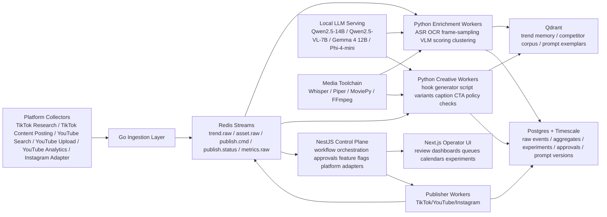
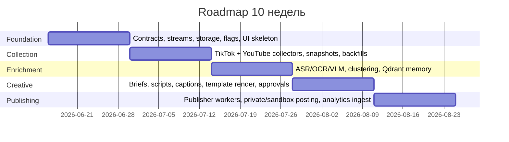

# Production-grade AI-агент для TikTok Instagram YouTube на локальных 14B моделях

## Executive summary

Главный вывод такой: тебе не нужен один «магический» агент, который сам ищет тренды, пишет сценарий, делает видео, публикует и монетизирует. Production-grade система в этой задаче должна быть **control-plane first**: отдельно собирать сигналы, отдельно обогащать их мультимодальными признаками, отдельно ранжировать идеи, отдельно генерировать креативы, отдельно публиковать и отдельно измерять результат. Именно такой разрез лучше всего ложится на твой уже проверенный каркас `Go → Redis Streams → Python → NestJS → Next.js → Postgres/Timescale`, потому что Redis Streams дает append-only event log с consumer groups, а Timescale-подход хорошо подходит для историзации, агрегаций и retention-политик. citeturn29view0turn32view0turn30view0turn33view0

Второй ключевой вывод: **локальные 7–14B модели должны быть мозгом-аналитиком и контроллером, а не попыткой «одной моделью делать всё»**. Из официальных model card и docs следует, что Qwen2.5-14B-Instruct силен как текстовый planner/scorer с длинным контекстом и устойчивым structured output, Qwen2.5-VL-7B силен как компактный vision-language слой для анализа кадров, OCR, layout, long-video understanding и localization, Gemma 4 12B — как компактная мультимодальная альтернатива, а Phi-4-mini — как сверхдешевый batch-классификатор и summary-worker. Это означает, что практичная схема для тебя — не «LLM генерирует видео», а «LLM планирует и оценивает, а специализированные инструменты делают ASR/TTS/montage/render». citeturn24view0turn26view0turn26view2turn26view1turn41view0turn42view0turn42view1turn42view2

Третий вывод: **первый запуск надо строить вокруг TikTok и YouTube, а Instagram ставить в режим controlled integration**, потому что в этой сессии мне удалось надежно получить актуальные официальные docs TikTok и YouTube, но не удалось надежно получить Meta developer docs для Instagram: часть запросов вернула `Error fetching` и `429 Too Many Requests`. Это не делает Instagram невозможным, но делает неразумным писать «окончательный» code-level plan по IG-публикации без отдельной верификации Meta endpoints/permissions. citeturn35view1turn37view0turn48view0turn27view4turn13view1turn13view2

Четвертый вывод: **`scanner_infra` сейчас нельзя считать верифицированным источником для code review**, потому что без owner/repo URL публичный GitHub-поиск не дал одного однозначного репозитория с этим именем: поиск `scanner_infra` показывает 57 результатов, но среди верхних результатов — другие репозитории вроде `scanner-infrastructure-*`, а не один подтвержденный `scanner_infra`, который можно безопасно принять за твой. Поэтому ниже я даю не фиктивный code review этого репозитория, а **реальную карту переноса каркаса**, основанную на тех классах модулей и артефактов, которые типично имеет такой infra-проект и которые нужно искать в `scanner_infra` при получении доступа. citeturn47view0

Наконец, самое важное стратегически: **тренды нельзя читать по одному API и нельзя доверять одному каналу сигналов**. Аудиты TikTok Research API показывают неполноту данных, а аудит YouTube Search API показывает проблемы полноты, временного decay и воспроизводимости. Для TikTok это особенно критично, потому что исследователи отдельно показывают, что платформа быстро усиливает интересы пользователя и меняет diversity ленты уже на ранних этапах, а в мультимодальных TikTok-данных часто не хватает встроенных текстовых признаков, из-за чего transcript/OCR/video-description enrichment становится не «опцией», а базовой практикой. Поэтому мировой best practice для твоей системы — это несколько watcher-personas, мультимодальное обогащение, кросс-платформенная дедупликация тренда и обязательный human-in-loop для коммерческого контента, synthetic media и risky verticals. citeturn43academia8turn8academia3turn14academia3turn8academia6turn19academia16turn14academia2

## Исходные ограничения и что это меняет в архитектуре

Если перевести официальные ограничения платформ на язык архитектуры, то картина получается очень конкретная. TikTok через Content Posting API позволяет инициализировать upload, получить `publish_id` и `upload_url`, затем последовательно отправлять chunks файла; для upload используется scope `video.upload`, а передача больших файлов требует последовательной chunked-загрузки с ограничениями по chunk size и порядку. Это сразу диктует отдельный **publisher worker с idempotency, resume-state и publish-status polling**, а не «простую функцию постинга». citeturn35view1turn35view2turn36view0turn36view1

При этом TikTok в своих Content Sharing Guidelines прямо ограничивает Direct Post для неаудированных клиентов: такой клиент в unverified статусе ограничен private/self-only публикацией, лимитом пользователей и posting caps, а также обязан показывать creator-aware UX, получать явное согласие, позволять disclosure коммерческого контента и опрашивать `publish/status` или принимать webhooks. Это означает, что **полная автопубликация «в прод» на старте — плохая идея**. Ранние фазы надо строить как private/sandbox или human-approved posting, а UI согласования и consent flow — не «доп. функционал», а часть платформенной совместимости. citeturn45view7

TikTok Research API полезен, но не достаточен как единственный датасорс. Официально он требует `research.data.basic`, принимает UTC-окно `start_date/end_date` длиной не более 30 дней, позволяет получать до 100 видео за запрос и поддерживает фильтрацию по полям вроде `region_code`, `hashtag_name`, `keyword`, `view_count`, `comment_count`. Но внешние аудиты показывают, что доступные через platform research interfaces данные могут быть неполными и структурно смещенными. Поэтому в прод-системе TikTok-ingestion должен состоять из трех слоев: **official research pull**, **watcher-persona observation**, **AI-enrichment layer** поверх самих роликов. citeturn37view0turn37view3turn37view4turn43academia8turn8academia3

YouTube, наоборот, дает относительно ясный технический контур. Официальный `videos.insert` позволяет загрузку видео и метаданных, но для новых unverified API projects, созданных после 28 июля 2020 года, upload по умолчанию ограничен private viewing mode до прохождения audit. В том же ресурсе доступны поля `status.containsSyntheticMedia` и `paidProductPlacementDetails`, а YouTube Analytics `reports.query` поддерживает метрики, monetary scopes, dimensions, filters и targeted queries. Отсюда прямой вывод: **для YouTube ты должен проектировать adapter сразу с учетом auditability, synthetic-media disclosure и paid placement metadata**, а аналитический pipeline — не только на просмотры, но и на retention/traffic/monetary breakdown. citeturn10view0turn27view4turn27view0turn27view1turn27view2

У YouTube есть еще одна важная особенность: для discovery можно использовать `search.list` с параметрами `order`, `publishedAfter`, `publishedBefore`, `q`, `regionCode`, `channelId`, но академический аудит показывает, что Search API неидеален с точки зрения полноты и воспроизводимости и имеет выраженный temporal decay. Следовательно, YouTube trend detector не должен опираться только на search; ему нужен гибрид из `search.list`, channel watchlists, topic seeds и собственных historical snapshots. citeturn48view0turn14academia3

Отдельно про Instagram. В этой сессии Meta developer docs для content publishing/reference вызывали ошибки `Error fetching` и `429 Too Many Requests`, поэтому я не буду притворяться, будто проверил актуальные IG publishing endpoints до уровня production code. Практически это означает: **Instagram включается в roadmap как отдельно верифицируемый adapter**, а не как уже доказанная и готовая ветка. Архитектуру надо строить platform-neutral, чтобы IG затем добавлялся без перелома control plane. citeturn13view1turn13view2

## Целевая архитектура и карта переноса каркаса

Самая сильная часть твоего `trade`-мышления — не конкретный финансовый домен, а дисциплина системы: event-driven ingest, replayable pipeline, separate analysis workers, contract-first DTO, operator UI, history в Timescale, observability и controlled rollout. Для social AI проекта это переносится почти напрямую. Redis Streams подходит как event spine, потому что это append-only log с consumer groups и real-time syndication; Timescale подходит как storage plane, потому что hypertables автоматически partition data by time, continuous aggregates обновляются в фоне и позволяют real-time + historical rollups, а retention policies умеют удалять raw-chunks по расписанию и оставлять агрегаты. citeturn29view0turn32view0turn30view0turn33view0

Так как `scanner_infra` не был однозначно найден и прочитан, таблица ниже — это **не выдуманный разбор файлов**, а **карта переноса того, что нужно искать в `scanner_infra` в первую очередь**. Если модуль или артефакт там действительно есть, его можно переносить по предложенному правилу.

| scanner_infra component | proposed mapping in new project | reuse mode | effort | main risks |
|---|---|---:|---:|---|
| ENV schema, config loader, typed settings | единая схема `platform`, `model`, `publishing`, `risk`, `slo` конфигов | 1:1 | S | drift между dev/stage/prod |
| Redis stream helpers, consumer-group wrappers | `trend.raw`, `trend.enriched`, `idea.scored`, `asset.rendered`, `publish.cmd`, `publish.status` | 1:1 | M | duplicate consume, wrong ack semantics |
| Scheduler/backfill framework | nightly trend backfills, rolling refresh, re-score windows | adapt | M | quotas, backpressure |
| DTO/contracts package | platform-neutral DTO: `RawPost`, `TrendSignal`, `CreativeBrief`, `PublishIntent`, `PolicyDecision` | adapt | M | schema churn per platform |
| Replay CLI / dead-letter tooling | deterministic reprocessing of failed enrich/publish flows | 1:1 | S | duplicate posting if idempotency weak |
| Infra-as-code / Helm / Docker Compose | AI serving, Redis, Qdrant, Postgres, GPU workers, observability stack | 1:1 | M | GPU scheduling heterogeneity |
| Secret/bootstrap scripts | OAuth tokens, client secrets, signing keys, vault bootstrapping | 1:1 | S | credential leakage |
| Observability stack, dashboards, alerts | freshness, data quality, publish success, model latency, approval SLA | adapt | M | metric clutter without actionability |
| CI/CD, migrations, release templates | monorepo pipelines, contract tests, migration gates, canaries | 1:1 | S | hidden env assumptions |
| Feature flags / kill switches | `autopost_enabled`, `youtube_enabled`, `tiktok_direct_post`, `synthetic_label_required` | 1:1 | S | unsafe rollouts without fine-grained flags |
| Worker supervisor / job orchestration | render farm, ASR farm, VLM farm, retry windows | adapt | L | resource starvation on media jobs |
| Domain-specific scanner parsers | конкуретно заменить на platform adapters и media enrichers | rewrite | L | accidental reuse of wrong abstractions |
| Runbooks / on-call docs | publish failure, quota exhausted, stale ingestion, bad data quarantine | 1:1 | S | operational blind spots |
| SQL migrations, retention jobs, backfill SQL | content-event hypertables, aggregates, retention/downsampling | adapt | M | storage bloat, wrong chunk interval |

Если доступ к репозиторию появится, то **первыми артефактами для аудита** должны стать: `docker-compose`/Helm/Terraform, shared config package, stream/queue helpers, retry/outbox/replay CLI, secret bootstrapping, DTO/contracts, Grafana dashboards, runbooks, migration folder, release workflow и любые утилиты backfill/snapshot/export. Именно они обычно дают максимальный переносимый каркас, а не доменные parser-части.

## План переноса каркаса и roadmap

Roadmap ниже исходит из твоего текущего уровня как middle developer и из того, что система должна быть не «демкой на неделю», а управляемой production-платформой. Я сознательно не рекомендую в первые недели строить «полную автономность». Сначала нужно сделать control plane, replayability, approval UX, platform adapters и evaluation loop; только потом — controlled automation.

| window | primary deliverables | milestone | tests that must pass |
|---|---|---|---|
| weeks one and two | monorepo skeleton; typed DTO/contracts; Redis Streams topics; Postgres/Timescale schema; prompt registry; feature flags; operator UI shell; idempotency keys; replay CLI skeleton | **control plane exists before any public posting** | contract tests for DTO versioning; event ordering/replay tests; migration smoke tests; secrets scan |
| weeks three and four | TikTok Research collector; TikTok upload sandbox/private publisher; YouTube `search.list`, `videos.insert`, `reports.query` adapters; raw snapshots in hypertables; first aggregates | **official-platform ingestion and posting loop works end-to-end** | API contract tests; publish retry/resume tests; rate-limit handling tests; storage chunk policy tests |
| weeks five and six | multimodal enrichment workers: frame sampler, Whisper ASR, OCR/VLM, trend clustering, hook extraction, product mention extraction; Qdrant corpus for trends/competitors/templates | **trend intelligence no longer text-only** | golden-set relevance tests; ASR/OCR quality checks; dedupe tests; freshness SLA tests |
| weeks seven and eight | creative planner using Qwen2.5-14B; vision audit using Qwen2.5-VL or Gemma 4 12B; caption/CTA/thumbnail prompt packs; template render pipeline via MoviePy/FFmpeg; human approval queue; rights ledger | **AI creates reviewable assets, not autonomous spam** | prompt regression suite; JSON schema conformance; policy red-team tests; deterministic asset manifest tests |
| weeks nine and ten | canary autopublishing for one TikTok account and one YouTube channel; attribution dashboards; experiment service; fail-safe rollback; runbooks; SLO dashboards; operator training | **measured pilot with rollback confidence** | chaos tests on worker restarts; duplicate-post prevention; canary rollback; observability/alert fire drills |

На практике перенос из `scanner_infra` лучше делать не «копированием папок», а четырьмя проходами.

Сначала переносится **operational substrate**: конфиг, secrets, release scripts, dashboards, consumer wrappers, replay tooling, shared errors/reason-codes. Это можно делать почти механически, потому что домен меняется, а надежность-паттерны — нет.

Затем переносится **control-plane skeleton**: NestJS-модули orchestration, DTO packages, feature flags, approval-state machine, audit logs. Это то место, где тебе особенно пригодится твой trade-подход к детерминизму времени, monotonicity и replayability.

Потом переносится **storage and event grammar**: темы Redis Streams, hypertables, aggregates, retention policies, outbox/inbox, quarantine-таблицы для bad data. Хранилище нужно проектировать не «под текущий UI», а под replay, experiments и counterfactual analysis: почему агент выбрал этот hook, этот CTA, этот слот публикации, этот товар.

И только после этого переносится **domain adaptation layer**: collectors, enrichers, creators, publishers, analytics normalizers. Именно здесь большая часть старого scanner-domain кода, скорее всего, окажется либо rewrite, либо adapt, но уже в безопасных рамках каркаса.

## Модели, retrieval, YouTube-ветка и генеративный пайплайн

Рекомендую не выбирать «одну лучшую модель», а построить **небольшой local model portfolio**.

| role | recommended model | why it fits | serving recommendation |
|---|---|---|---|
| planner, script generator, idea scorer, JSON controller | **Qwen2.5-14B-Instruct** | 14.7B params, Apache 2.0, multilingual, strong structured output/JSON, long context up to 131K, practical for text reasoning and control-plane decisions | vLLM as primary server; llama.cpp/GGUF as fallback |
| visual auditor, OCR/layout/meme/frame analyzer | **Qwen2.5-VL-7B-Instruct** | understands charts, graphics, text in images, works as visual agent, handles long videos over 1 hour, supports stable JSON for coordinates/attributes | dedicated multimodal worker behind vLLM or separate inference daemon |
| unified compact multimodal alternative | **Gemma 4 12B** | open weights with responsible commercial use, unified 12B multimodal model, text/image/audio/video support, 128K–256K context depending size | evaluate behind feature flag for multimodal consolidation |
| ultra-cheap batch classifier / summary worker | **Phi-4-mini-instruct** | 3.8B params, MIT license, 128K context, multilingual; cheap for nightly classification, title rewriting, prefiltering | batch inference sidecar |

Эта матрица опирается на официальные model cards и docs: Qwen2.5-14B дает длинный контекст, multilingual support и хорошие свойства для structured outputs; Qwen2.5-VL-7B умеет long-video understanding, visual localization и reading charts/layouts; Gemma 4 12B — компактный multimodal-unified вариант с commercial use; Phi-4-mini — дешевый длинноконтекстный текстовый worker. citeturn24view0turn26view0turn26view2turn26view1

По serving слою рекомендация простая. **vLLM** нужен там, где ты хочешь production server с OpenAI-compatible интерфейсом, metrics, Kubernetes integration, multimodal-serving и нормальной наблюдаемостью. **llama.cpp** нужен там, где важнее low-friction локальный inference, GGUF-квантизация, широкий набор hardware backends и CPU+GPU hybrid inference. Для тебя это означает: `vLLM` — серверный слой в staging/prod; `llama.cpp` — локальный dev box, резервный inference, edge/offline режим и дешевые скоры без сложной серверной инфраструктуры. citeturn26view4turn26view3

Для retrieval лучше не тащить «тяжелый RAG-фреймворк поверх всего», а строить **узкий retrieval fabric** на Qdrant. Важно не просто хранить embeddings, а хранить **payload-rich memory**: platform, locale, account, product_id, trend_cluster_id, risk_tags, rights_status, source_hash, freshness_bucket. Qdrant официально поддерживает payloads, filtering, hybrid queries, multivectors и low-latency search; отдельно Qdrant Edge полезен как легкий embedded retrieval engine для in-process/offline worker-режимов. Это очень хорошо сочетается с твоей идеей локальных моделей: retrieval не должен требовать отдельного тяжеловесного облачного стека. citeturn21view0turn21view2turn26view5

Сам генеративный пайплайн я бы разделил на пять детерминированных стадий.

Первая стадия — **trend capture**: collectors берут TikTok official research windows, YouTube search windows, account analytics, manual watchlists и operator-supplied seeds. На этом уровне данные всегда сохраняются как immutable raw events.

Вторая стадия — **multimodal enrichment**: кадры, ASR, OCR, object/scene tags, hook timing, CTA detection, product mentions, caption style, music/style markers, comment intent. Здесь твой минимальный production stack — Whisper для speech-to-text, Piper для локального TTS, MoviePy для templated montage и FFmpeg как медиаконвертер/транскодер/экстрактор кадров и аудио. Такой стек не «модный», зато надежный и хорошо управляемый. citeturn41view0turn42view0turn42view1turn42view2turn42view3

Третья стадия — **scoring and memory**: Qwen2.5-14B делает ranking/triage поверх enriched features, а Qdrant сохраняет аналогичные исторические кейсы, evergreen-templates, проигравшие гипотезы и победившие hooks. Важно, чтобы score был не одним числом, а вектором: `trend_strength`, `brand_fit`, `product_fit`, `content_cost`, `policy_risk`, `replay_confidence`, `novelty`, `fatigue_risk`.

Четвертая стадия — **creative planning**: модель генерирует не финальное видео, а `CreativeBrief` с полями вроде `hook_pattern`, `narrative_arc`, `visual plan`, `voice style`, `caption variants`, `CTA policy`, `product insertion strategy`, `platform adaptations`, `label requirements`. Именно здесь нужен prompt/versioning registry: каждый prompt, system policy pack, few-shot exemplar, model version и eval set должен быть версионирован и иметь rollout state. Отдельно отмечу, что Microsoft прямо советует grounding через RAG и application-level safeguards из-за рисков misinformation и harmful content — это в точности соответствует твоей цели policy/brand/commercial risk control. citeturn26view1

Пятая стадия — **render and publish**. И здесь критически важна мысль: локальная 14B модель не обязана «рисовать видео». Для первого production-уровня более разумно строить **template-first video factory**: готовые шаблоны кадров, voiceover, subtitle packs, stock/product shots, динамические overlays, product cards, outro variants, A/B caption bundles. Такой пайплайн проще тестировать, дешевле масштабировать и легче держать в рамках brand/policy, чем end-to-end generative video. Это и есть практическая мировая best practice для малой команды: автоматизировать decisioning и composition раньше, чем пытаться автоматизировать pure generation.

Для YouTube нужен отдельный архитектурный слой, а не «чуть-чуть другой publisher». Я рекомендую добавить три YouTube-specific сервиса.

Первый — **YouTube discovery service**, который использует `search.list` с `q`, `order`, `publishedAfter`, `publishedBefore`, `regionCode`, `channelId` и собственные snapshots, чтобы не зависеть от капризов ranking. citeturn48view0turn14academia3

Второй — **YouTube upload/compliance service**, который умеет выставлять upload metadata, synthetic-media disclosure и paid product placement, а также учитывает audit/private-mode behavior новых unverified projects. citeturn10view0

Третий — **YouTube analytics normalizer**, который регистрирует metrics/dimensions/filters queries в виде repeatable jobs и приводит их к общей схеме `platform_metrics_daily`. Это нужно потому, что YouTube дает намного более развитую аналитику по времени, источникам трафика и monetization-маркерам, чем TikTok research surfaces. citeturn27view4turn27view0turn27view1turn27view2

## SRE, security, compliance, backlog и ограничения

Для такого проекта SLO должны описывать не только latency и availability, но и **freshness, data quality, policy safety, publish control**. Я бы рекомендовал минимальный production envelope такой: `trend ingestion freshness p95 < 15 min`, `enrichment completion < 30 min`, `publish command to platform accepted p95 < 5 min`, `duplicate public posts = 0`, `event replay determinism = 100% on golden datasets`, `manual approval SLA < 2 h` для коммерческого контента, `false-safe autopost rate < 0.5%`, `quarantine rate tracked by source and reason-code`. Это не «академические» метрики; это метрики, которые действительно определяют, безопасна ли система. Под них нужны алерты только action-oriented: stale collector, quota exhausted, rising duplicate risk, publish rejection spike, model latency regression, rights-ledger mismatch, brand-risk spike. Чисто технические метрики без action path не должны пейджить.

Rollout тоже должен быть ступенчатым. Сначала `dry-run` без публикации: система лишь строит proposals и сравнивает их с реальными outcome. Потом `shadow mode`: рекомендации видит не только оператор, но и логируется chosen-vs-ignored counterfactual. Потом `private/sandbox posting`: TikTok private/self-only, YouTube unlisted/private. Потом `single-account canary`: один TikTok аккаунт и один YouTube канал, ручное approval. И только потом `guarded autopost`, где автопубликация разрешена узкому классу низкорисковых шаблонов. Rollback должен быть одномоментным: feature flag off, stop publisher consumers, revoke platform tokens if needed, freeze render queue, replay from last safe stream offset.

В части security и compliance чеклист должен быть очень сухим и жестким. Секреты и OAuth-токены хранятся вне кода; TikTok прямо требует держать `client_secret` конфиденциальным и не встраивать его в open-source проекты. Для TikTok Direct Post нужен явный user consent, disclosure коммерческого контента и статус-поллинг; для неаудированного клиента нельзя рассчитывать на полноценный public-posting flow. Для YouTube uploader должен заполнять synthetic-media и paid placement metadata там, где это применимо. Для TikTok monetization features бизнес-верификация является prerequisite. Всё synthetic/commercial content должно проходить policy gate до публикации, а rights ledger должен хранить источник музыки, визуалов, voice model, actor likeness status и disclosure flags. citeturn45view7turn10view0turn45view6

Ниже — backlog, который я бы реально отдал в работу.

| priority | item | effort | dependencies |
|---|---|---:|---|
| P0 | unified content/event DTO package | S | none |
| P0 | Redis Streams topic map + idempotency + replay CLI | M | DTOs |
| P0 | Timescale schema: raw hypertables, aggregates, retention, quarantine | M | DTOs |
| P0 | feature flags + kill switches + approval state machine | M | control plane skeleton |
| P1 | local model gateway with Qwen2.5-14B and one compact fallback | M | infra + secrets |
| P1 | TikTok Research collector | M | OAuth, stream bus |
| P1 | YouTube Search collector | M | API creds, stream bus |
| P1 | YouTube upload + analytics adapters | M | creds, approval flow |
| P1 | multimodal enrichment workers: ASR/OCR/frame sampler/VLM | L | model gateway, media toolchain |
| P1 | Qdrant memory and retrieval APIs | M | enrichment outputs |
| P2 | trend scoring service with explainability fields | M | enrichment + Qdrant |
| P2 | creative planner and caption/hook generator | M | model gateway + trend scoring |
| P2 | template render pipeline with MoviePy/FFmpeg/Piper | L | creative brief schema |
| P2 | rights ledger and disclosure engine | M | publishing flow |
| P2 | operator UI for approvals, calendars, experiments | M | control plane |
| P3 | TikTok private/sandbox publishing flow | M | approval + rights + creds |
| P3 | Instagram adapter verification workstream | M | Meta docs verification |
| P3 | experiment service and prompt registry | M | creative planner |
| P3 | autopost canary and rollback automation | M | approvals, metrics, flags |
| P3 | product attribution and commerce reporting | M | analytics normalization |

Коротко про ограничения и открытые вопросы. `scanner_infra` без owner/repo URL или архива я не могу честно разобрать на уровне конкретных файлов и коммитов; текущий GitHub-поиск не дает однозначной идентификации репозитория. Meta/Instagram developer docs в этой сессии не были надежно получены, поэтому Instagram-публикацию я включил как verification workstream, а не как подтвержденный code-ready adapter. И, наконец, ранние загруженные в беседе текстовые файлы недоступны в этой runtime-сессии, поэтому объединение прошлых исследований я делал на основе устойчивого контекста диалога и свежих web-источников, а не на основе повторного чтения тех вложений. citeturn47view0turn13view1turn13view2

С практической точки зрения твой лучший следующий ход выглядит так: **сначала перенеси из trade/scanner-style мира сам каркас надежности, только потом доменную логику соцсетей; сначала private/human-in-loop, только потом autopost; сначала trend intelligence и template factory, только потом сложную end-to-end генерацию**. Если сделать именно в таком порядке, ты получишь не «очередной AI SaaS для соцсетей», а управляемую, replayable и коммерчески пригодную систему, которая реально может масштабироваться.