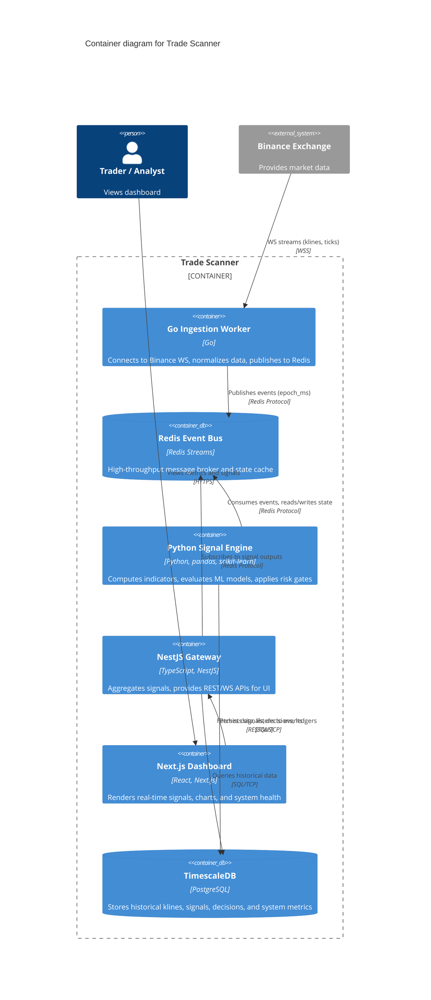

# C4 Container Diagram

## Diagram

## Description
This container diagram breaks down the Trade Scanner into its core deployable units.
1. **Go Ingestion**: Handles high-concurrency, low-latency connection management with the exchange.
2. **Redis Streams**: The backbone event bus, ensuring decoupling and replayability.
3. **Python Engine**: The analytical core, where complex statistical and ML calculations happen.
4. **NestJS / Next.js**: The user-facing presentation layer, delivering sub-second UI updates.
5. **TimescaleDB**: The long-term memory for backtesting and SRE monitoring.
