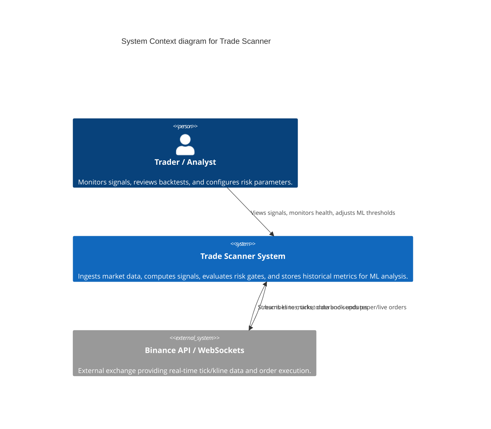

# C4 System Context

## Diagram

## Description
The Trade Scanner is a latency-sensitive, event-driven trading infrastructure. It acts as the core brain for identifying trading opportunities (signals), evaluating execution risk, and storing high-fidelity data for offline ML training. The system is designed to be highly reliable, ensuring deterministic time handling and strict observability across all layers.
